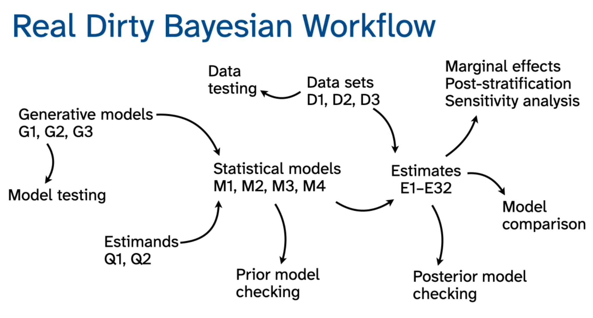

| Step in Diagram             | Package          |
| --------------------------- | ---------------- |
| Model specification         | brms             |
| Prior predictive checks     | brms + bayesplot |
| Posterior predictive checks | bayesplot        |
| Diagnostics (R-hat, ESS)    | posterior        |
| Model comparison (LOO)      | loo              |
| Marginal effects            | brms + tidybayes |
| Pipeline orchestration      | targets          |

Good question.
“Accounting for the search process” means incorporating **model uncertainty and selection uncertainty** into inference instead of pretending the final model was fixed in advance.

Here are the principled ways to do it.

---

# 1️⃣ Pre-specification (Design-Based Control)

**Idea:** Fix the model before looking at outcome patterns.

How:

* Pre-register covariates
* Pre-specify transformations
* Pre-specify priors
* Freeze the model class

What it does:

* Eliminates post-hoc selection bias
* Restores nominal uncertainty guarantees

Limitation:

* Not always feasible in exploratory work

---

# 2️⃣ Use Out-of-Sample Validation (Cross-Validation)

This is the most practical solution.

Instead of selecting the model that fits best *in-sample*, evaluate models using:

* K-fold cross-validation
* PSIS-LOO (leave-one-out)
* A held-out test set

In Bayesian workflow:

* Use **LOO (expected log predictive density)**
* Compare models on predictive performance

Why this works:
Selection is based on **future predictive performance**, not noise-fitting.

It penalizes overfitting automatically.

Important:
You still report uncertainty in predictive performance differences.

---

# 3️⃣ Bayesian Model Averaging (BMA)

Instead of choosing one model, average across them.

[
P(\theta \mid data) = \sum_m P(\theta \mid data, M_m) P(M_m \mid data)
]

You:

* Compute posterior under each candidate model
* Weight models by their posterior model probabilities (or stacking weights)

Result:

* Uncertainty reflects model uncertainty
* No single “winner”

Modern alternative:

* Stacking weights based on predictive performance (often better than BMA)

---

# 4️⃣ Multilevel (Hierarchical) Modeling

Many forks arise from:

* Subgroup analysis
* Interaction exploration
* Variable inclusion choices

Hierarchical models:

* Partially pool effects
* Reduce variance inflation
* Prevent exaggerated subgroup findings

Instead of:

> “Which subgroup shows effect?”

You model all subgroups with partial pooling.

This reduces the need for forking.

---

# 5️⃣ Explicit Sensitivity Analysis

Systematically vary:

* Priors
* Likelihood assumptions
* Covariate sets
* Transformations

Then report:

* How conclusions change
* Effect stability

If results are robust across reasonable forks, confidence is justified.

---

# 6️⃣ Penalization / Regularization

Use priors that shrink:

* Coefficients toward zero
* Complex models toward simpler ones

Examples:

* Weakly informative priors
* Horseshoe prior
* Ridge-type priors

This reduces selection-driven exaggeration.

---

# 7️⃣ Full Workflow Transparency

Document:

* All models tried
* All preprocessing decisions
* All selection criteria

This makes the search process explicit.

Even if you choose a final model, readers can evaluate the search path.

---

# What Is the Most Practical Combination?

In modern Bayesian applied work:

1. Use multilevel modeling
2. Use weakly informative priors
3. Compare via PSIS-LOO
4. Use stacking or model averaging
5. Perform sensitivity checks

That combination meaningfully accounts for search.

---

# Executive Summary Version

To account for the search process, you must either:

* Prevent it (pre-specify), or
* Penalize it (cross-validation / regularization), or
* Integrate over it (model averaging), or
* Make it explicit (sensitivity analysis).

