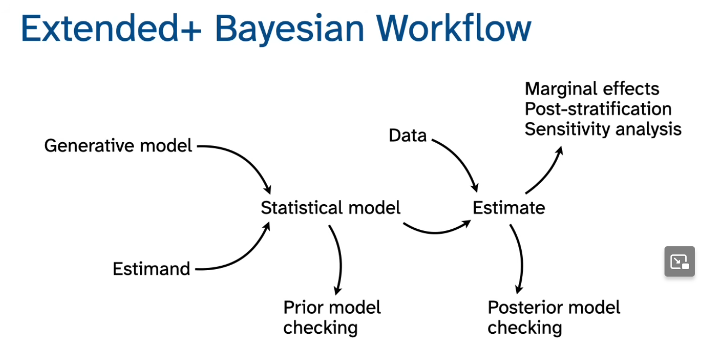
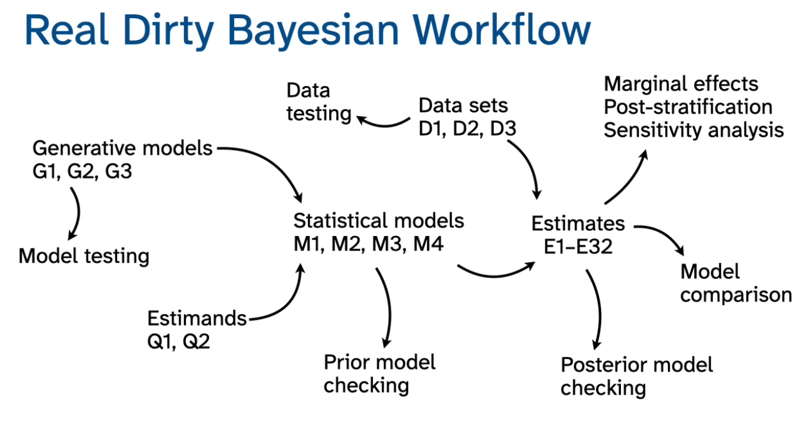
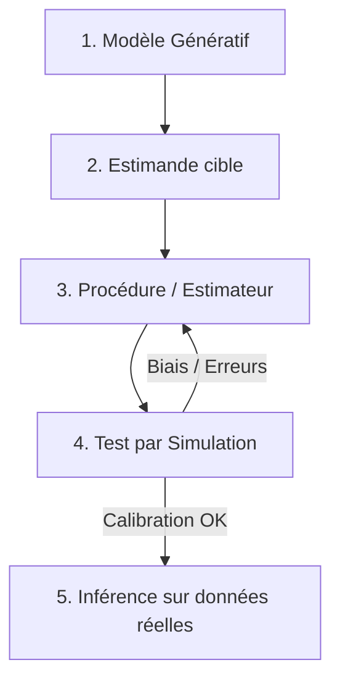

# A01 — Introduction to Bayesian Workflow

**Course:** Statistical Rethinking 2026  
**Section:** A — Beginner  
**Lecture:** A01 — Introduction  
**Official reading:** Chapters 1 and 2 of *Statistical Rethinking*, second edition  
**Central question:** How should a scientific question be transformed into a statistical analysis that can be checked rather than merely trusted?

> **Source note**
>
> This study guide is based on the official 2026 course outline, the uploaded second edition of *Statistical Rethinking*, and the conceptual structure used by Richard McElreath across the course. Where the lecture appears to reorganize book material into a more explicit workflow, that reorganization is identified as such.

---

## 1. Main thesis

The central argument is:

> **A statistical analysis should begin with a scientific question and a model of how the data arise, not with the selection of a statistical test.**

The workflow can be summarized as:

$$ \text{scientific question} \rightarrow \text{generative model} \rightarrow \text{estimand} \rightarrow \text{estimator} \rightarrow \text{error checking} \rightarrow \text{observed-data estimate} $$

Bayesian inference is one component of that workflow. It is not the entire workflow.

A posterior distribution can be calculated correctly while the analysis remains scientifically wrong because:

- the wrong quantity was estimated;
- the causal assumptions were wrong;
- the sampling process was misrepresented;
- important variables were measured incorrectly;
- the estimator fails under realistic conditions;
- or the model omits relevant possibilities.

This is the operational meaning of the distinction between a model that is logically valid in its **small world** and one that is useful in the **large world**.

---

## 2. Science before statistics

Data do not determine by themselves:

- which question to ask;
- which variables should be interpreted causally;
- which variables should be controlled;
- how the sample relates to the population;
- which hypothetical intervention matters;
- or which numerical quantity answers the scientific question.

These elements must come from scientific assumptions outside the observed dataset.

The meaning of a statistical estimate therefore depends on assumptions external to both the data and the fitted statistical model.

### 2.1 No causes in, no causes out

A statistical model usually describes associations such as:

$$ p(Y \mid X,\theta) $$

This distribution does not, by itself, tell us whether changing $X$ would change $Y$.

For a causal interpretation, we need an additional scientific model describing how variables influence one another. This may be represented by:

- a directed acyclic graph;
- structural causal equations;
- a mechanistic simulation;
- a potential-outcome model;
- or a sufficiently precise verbal causal model.

The causal model and the statistical model are connected, but they are not identical.

A statistical model can represent association without representing intervention.

### 2.2 Description also requires assumptions about causes

Suppose the goal is only to estimate the average satisfaction of all customers from a survey. This appears descriptive rather than causal.

However, the observed survey respondents may differ from the target population because:

- highly satisfied customers respond more often;
- dissatisfied customers respond more often;
- recent purchasers are easier to contact;
- inactive customers have outdated contact details;
- campaign exposure affects survey participation.

Moving from the observed respondents to the target population therefore requires assumptions about what caused inclusion in the sample.

Even a descriptive estimand may require a causal model of sampling, missingness, and measurement.

---

## 3. Statistical models as golems

Chapter 1 introduces statistical models through the metaphor of the Golem of Prague.

A golem is:

- powerful;
- obedient;
- capable of difficult work;
- but devoid of judgment or foresight.

A statistical model behaves similarly. It performs precisely the calculations encoded in it, but it cannot decide whether:

- the scientific question is sensible;
- its assumptions are appropriate;
- a variable is a confounder or collider;
- available measurements correspond to the intended constructs;
- or its output will be useful for a decision.

The problem is therefore not merely finding the technically correct test. It is learning to engineer models whose assumptions and purposes are explicit.

### Book counterpart

The closest sections in the second edition are:

- **Section 1.1 — Statistical golems**
- **Section 1.2 — Statistical rethinking**
- **Section 1.3 — Tools for golem engineering**

The book argues against organizing statistics as a catalogue of pre-manufactured tests selected through a decision tree. Instead, it proposes a common model-building strategy.

| Lecture concept | Second-edition counterpart |
|---|---|
| Models are powerful but lack judgment | Section 1.1, *Statistical golems* |
| Tests are specialized models, not universal recipes | Sections 1.1–1.2 |
| Scientific hypotheses are not statistical models | Section 1.2.1 |
| Measurement complicates scientific conclusions | Section 1.2.2 |
| Models can be used to design, estimate, predict, and argue | Section 1.3 |
| Bayesian analysis connects models to data | Section 1.3.1 |
| Causal assumptions remain external to the statistical model | Section 1.3.4 and later causal chapters |

---

.
.

## 4. Core workflow vocabulary

A01 introduces distinctions that remain essential throughout the course.

### 4.1 Scientific question

The scientific question specifies what we are trying to learn.

Examples include:

- What proportion of Earth's surface is covered by water?
- What would customer retention have been had every eligible customer received a €10 discount?
- Does increasing campaign frequency increase purchasing?
- How much does unobserved price sensitivity vary across customers?

A question stated only as “run a regression of $Y$ on $X$” is not yet a scientific question.

Regression is a possible estimator. It does not define the target.

### 4.2 Generative model

A generative model describes how observable and unobservable quantities could produce the data.

For the globe-tossing example:

$$ W \sim \mathrm{Binomial}(N,p) $$

where:

- $p$ is the proportion of the globe covered by water;
- $N$ is the number of tosses;
- $W$ is the number of water observations.

This compact probability model embodies several assumptions:

1. Each toss samples a location from the same surface distribution.
2. The probability of observing water remains $p$.
3. Tosses are conditionally independent given $p$.
4. Observations are classified correctly as water or land.
5. The sampling mechanism is not systematically biased toward particular regions.

A generative model can be run forward:

$$ p \longrightarrow W $$

Given a value of $p$, we can simulate observations. That ability makes the model testable as an analytical machine.

#### Generative does not mean mechanistically complete

The binomial model does not reproduce the geology, geometry, or oceanography of Earth.

It is generative only with respect to the sampling process relevant to the problem.

A useful generative model is therefore not necessarily a complete physical simulation. It is a sufficiently explicit model of the processes that matter for the estimand and the estimator.

### 4.3 Estimand

The **estimand** is the precise quantity we want to learn.

In the globe example:

$$ \tau = p $$

In causal work, an estimand might instead be:

$$ \tau_{\mathrm{ATE}} = \mathbb{E}\left[Y(1)-Y(0)\right] $$

or:

$$ \tau(x) = \mathbb{E}\left[Y(1)-Y(0)\mid X=x\right] $$

The estimand belongs primarily to the scientific problem, not to a particular estimation algorithm.

The same estimand may potentially be estimated using:

- randomized differences in means;
- standardization;
- inverse-probability weighting;
- Bayesian g-computation;
- matching;
- instrumental variables;
- or another identification strategy.

Conversely, the same regression model may be processed to produce several different estimands.

### 4.4 Estimator

An **estimator** is a procedure that maps possible data to an estimate.

Formally:

$$ \widehat{\tau} = g(D) $$

Here, $g$ might involve:

- fitting a likelihood and priors;
- calculating a posterior distribution;
- standardizing predictions over a population;
- computing a contrast;
- or extracting a posterior mean or interval.

The estimator exists before the observed data are inserted. It is a rule for dealing with every dataset that might arise under the generative model.

For the globe example, an elementary estimator could be:

$$ \widehat{p} = \frac{W}{N} $$

A Bayesian estimator instead starts from:

$$ p(p \mid W,N) \propto p(W \mid N,p)p(p) $$

and then produces whichever posterior summary is relevant to the scientific or decision problem:

- posterior mean;
- posterior median;
- posterior interval;
- probability that $p > 0.5$;
- or posterior predictive distribution.

### 4.5 Estimate

The **estimate** is the output obtained after applying the estimator to the observed dataset:

$$ \widehat{\tau}_{\mathrm{observed}} = g(D_{\mathrm{observed}}) $$

The distinction is:

| Term | Meaning |
|---|---|
| Estimand | What we want to know |
| Estimator | The procedure intended to learn it |
| Estimate | The output for the observed sample |

Confusing these creates major conceptual errors.

A regression coefficient, for example, is not automatically the estimand. It may only be an intermediate parameter used to calculate the estimand.

---

## 5. Error checking through simulation

The workflow includes testing the estimator with data generated from the generative model before trusting it on real data.

A useful sequence is:

1. Define a generative model of the sample.
2. Define a specific estimand.
3. Design a statistical procedure that produces an estimate.
4. Test that procedure using simulations from the generative model.
5. Analyze and summarize the observed sample.

This is analogous to testing software.

### 5.1 Simulation procedure

For simulation $s$:

1. Select or generate true parameters:

$$ \theta^{(s)} $$

2. Generate synthetic data:

$$ D^{(s)} \sim p(D \mid \theta^{(s)}) $$

3. Apply the proposed estimator:

$$ \widehat{\tau}^{(s)} = g(D^{(s)}) $$

4. Compare it with the known simulated truth:

$$ e^{(s)} = \widehat{\tau}^{(s)}-\tau^{(s)} $$

Repeating this process allows us to study:

- bias;
- variance;
- interval coverage;
- calibration;
- identifiability;
- sensitivity to sample size;
- sensitivity to weak information;
- failure under confounding;
- and failure under measurement error.

### 5.2 Why this is stronger than checking code syntax

A program may run without errors while estimating the wrong quantity.

Simulation checks three distinct layers.

#### Computational correctness

Did the software implement the intended statistical model?

#### Statistical adequacy

Does the estimator recover the estimand under the assumed generative process?

#### Scientific robustness

Does it continue to behave acceptably when the generative process is made more realistic?

The first two concern the small world. The third begins to probe the large world.

---

## 6. Small worlds and large worlds

Chapter 2 opens with Columbus's incorrect model of Earth's size.

McElreath uses the example to distinguish two levels of reasoning.

### 6.1 Small world

The small world is the closed logical universe described by the model.

Within it:

- all possible events have been nominated;
- the assumptions are treated as true;
- the model's logic can be checked;
- inference can be mathematically optimal conditional on those assumptions.

For example, under a valid binomial sampling model and a specified prior, Bayesian updating makes coherent use of the information contained in the observations.

### 6.2 Large world

The large world is reality.

In it:

- events may occur that the model never anticipated;
- measurements may not represent the intended quantities;
- observations may not be independent;
- the population may change;
- interventions may behave differently from observed exposures;
- and the data-generating mechanism may be only partly understood.

Logical correctness in the small world does not guarantee usefulness in the large world.

### 6.3 Relationship to workflow

| Workflow activity | Main world addressed |
|---|---|
| Deriving the posterior correctly | Small world |
| Recovering simulated parameters | Small world |
| Prior predictive checking | Small world, with substantive input |
| Posterior predictive checking | Small-world adequacy against observed patterns |
| Alternative generative scenarios | Bridge toward the large world |
| External replication | Large world |
| Sensitivity analysis | Bridge toward the large world |
| Scientific criticism and domain review | Large world |
| Monitoring after deployment | Large world |

No finite collection of checks proves that a model is correct.

Checks reveal how and where it fails.

---

## 7. Beginnings of Bayesian updating

A01 begins the probability-theory argument that A02 develops in greater detail.

The central Bayesian relation is:

$$ p(\theta \mid D,M) = \frac{ p(D \mid \theta,M)p(\theta \mid M) }{ p(D \mid M) } $$

Equivalently:

$$ \text{posterior} \propto \text{likelihood} \times \text{prior} $$

### 7.1 Prior

$$ p(\theta \mid M) $$

represents relative plausibility among possible parameter values before conditioning on the new observations, within model $M$.

### 7.2 Likelihood

$$ p(D \mid \theta,M) $$

asks how compatible the observed data are with each possible value of $\theta$.

The likelihood is a function of $\theta$ once the data are observed.

It is not the probability that $\theta$ is true.

### 7.3 Posterior

$$ p(\theta \mid D,M) $$

represents updated relative plausibility after combining the model's prior information with the observations.

The conditioning on $M$ is often omitted typographically, but it is conceptually crucial:

$$ p(\theta \mid D) \quad\text{really means}\quad p(\theta \mid D,M) $$

The posterior is conditional on the entire model, including assumptions about:

- sampling;
- measurement;
- dependence;
- prior information;
- functional form;
- and omitted mechanisms.

### 7.4 Bayesian updating as counting

Chapter 2 motivates probability by counting possible paths through a “garden of forking data.”

The posterior receives more weight where there are more possible paths consistent with:

1. the prior assumptions;
2. and the observed data.

The multiplication

$$ p(D \mid \theta)p(\theta) $$

is compressed counting: prior plausibility is combined with the number or weight of paths compatible with the observations.

This interpretation removes unnecessary mystery from Bayes' theorem.

Bayesian updating is a logical accounting of possibilities within a specified model.

---

## 8. Bayesian inference is not the full workflow

A frequent misunderstanding is:

$$ \text{Bayesian analysis} = \text{choose priors} + \text{run MCMC} + \text{report a posterior} $$

A01 proposes something broader:

$$ \begin{aligned} &\text{Define the scientific target}\\ &\rightarrow \text{model how the data arise}\\ &\rightarrow \text{design an estimator}\\ &\rightarrow \text{test it using simulation}\\ &\rightarrow \text{fit it to observations}\\ &\rightarrow \text{criticize and revise} \end{aligned} $$

MCMC is only one computational method for approximating a posterior.

It appears later in the course because Bayesian reasoning can be understood without beginning with MCMC.

The second-edition preface makes the same pedagogical point: Bayes is not fundamentally about MCMC, and there are multiple legitimate ways to approximate a posterior distribution.

---

## 9. Complete globe-tossing workflow

The globe example can be represented as follows.

### Question

What proportion of Earth's surface is covered by water?

### Scientific and sampling assumptions

A toss selects a surface location without systematically favoring water or land.

### Generative model

$$ W \sim \mathrm{Binomial}(N,p) $$

### Estimand

$$ \tau = p $$

### Statistical model

$$ \begin{aligned} W &\sim \mathrm{Binomial}(N,p)\\ p &\sim \mathrm{Beta}(\alpha,\beta) \end{aligned} $$

### Posterior

$$ p \mid W,N \sim \mathrm{Beta}(\alpha+W,\beta+N-W) $$

For a uniform prior:

$$ p \sim \mathrm{Beta}(1,1) $$

therefore:

$$ p \mid W,N \sim \mathrm{Beta}(W+1,N-W+1) $$

### Estimator

The estimator is the entire mapping from $(W,N)$ to the posterior distribution or to a selected posterior summary.

For example, the posterior mean is:

$$ \widehat{p}_{\mathrm{Bayes}} = \frac{W+\alpha}{N+\alpha+\beta} $$

### Error check

Choose a known value $p^\star$, simulate many datasets:

$$ W^{(s)} \sim \mathrm{Binomial}(N,p^\star) $$

fit the model to each one, and inspect whether:

- posterior estimates are centered appropriately;
- intervals contain $p^\star$ at the expected frequency;
- behavior improves with larger $N$;
- and results change sensibly under different priors.

### Large-world criticism

Ask whether actual globe tossing behaves like independent binomial sampling:

- Is the toss physically unbiased?
- Does the globe's orientation persist?
- Are repeated catches spatially correlated?
- Are coastlines classified consistently?
- Is the target geometric surface area or projected visual area?

The statistical calculation cannot answer these questions.

They concern the connection between the model and reality.

---

## 10. What A01 changes relative to the book

A01 is not merely a compressed reading of Chapters 1 and 2.

### 10.1 More explicit in the lecture-oriented workflow

The 2026 framing makes the following distinctions more operational:

- estimand;
- estimator;
- estimate;
- generative model;
- simulation-based error checking;
- workflow as a sequence of testable analytical decisions.

These ideas are present throughout the second edition, but Chapter 1 does not organize all of them into one formal workflow.

### 10.2 More extensive in the book

Chapter 1 contains longer discussions of:

- the limits of falsification;
- the difference between hypotheses, process models, and statistical models;
- measurement error in scientific disputes;
- Bayesian and frequentist interpretations of probability;
- model comparison;
- multilevel models;
- and graphical causal models.

A01 introduces the architecture.

The book supplies the fuller epistemological argument.

### 10.3 Deferred to A02

Most of the detailed globe-tossing computation belongs to A02 and Chapters 2–3:

- enumerating possible worlds;
- grid approximation;
- posterior normalization;
- posterior intervals;
- sampling from the posterior;
- and posterior predictive simulation.

---

## 11. Common errors exposed by A01

### Error 1: Starting with an algorithm

> “I have a dataset, so I will fit XGBoost, a regression, or a causal forest.”

The algorithm does not define the scientific target.

### Error 2: Treating a coefficient as the estimand

A model parameter may not correspond directly to the desired causal or predictive quantity.

### Error 3: Confusing estimator and estimate

The estimator is the procedure.

The estimate is one realization of its output.

### Error 4: Validating only observed-data fit

A model can reproduce observed associations while failing to recover the intended estimand.

### Error 5: Believing that Bayesian inference validates assumptions

Bayesian inference is coherent conditional on assumptions.

It does not establish that those assumptions describe reality.

### Error 6: Assuming descriptive tasks are causally neutral

Selection, missingness, and measurement determine whether a sample describes the intended population.

### Error 7: Treating simulation as optional decoration

Simulation is how we test whether the full analysis can recover a known target under controlled conditions.

---

## 12. Application to a CRM causal problem

Consider the question:

> What would the 30-day purchase probability be if each eligible customer received a €10 discount rather than no discount?

### Estimand

$$ \tau = \mathbb{E}\left[ Y(10)-Y(0) \right] $$

### Generative model

To simulate synthetic customer behavior and campaign assignments, a generative model specifies explicit probability distributions for baseline covariates, latent individual traits, treatment assignment, and potential outcomes.

#### 1. Parametric Probability Distributions

For customer $i \in \{1, \dots, N\}$:

- **Observed Covariates ($X_i$)**: Background customer features (e.g., past 90-day engagement, spend, RFM scores):
  $$X_i \sim \mathcal{N}(\mu_X, \Sigma_X)$$
- **Latent Price Sensitivity ($S_i$)**: Unobserved responsiveness to promotional offers, which may be partially correlated with observed covariates $X_i$:
  $$S_i \sim \mathcal{N}\left(\mu_S + \theta^T X_i, \sigma_S^2\right)$$
- **Historical Treatment Assignment ($A_i$)**: Binary campaign allocation ($A_i = 1$ for €10 discount, $A_i = 0$ for control), governed by historical policy $\pi$:
  $$A_i \sim \mathrm{Bernoulli}(\pi_i)$$
  $$\pi_i = \mathbb{P}(A_i = 1 \mid X_i, S_i) = \mathrm{logit}^{-1}\left(\alpha_\pi + \beta_\pi^T X_i + \gamma_\pi S_i\right)$$
- **Outcome ($Y_i$)**: 30-day binary purchase indicator ($Y_i = 1$ if purchase occurs, $0$ otherwise):
  $$Y_i \sim \mathrm{Bernoulli}(p_i)$$
  $$p_i = \mathrm{logit}^{-1}\left(\alpha_Y + \beta_Y A_i + \gamma_Y S_i + \delta_Y (A_i \times S_i) + \eta_Y^T X_i\right)$$

where:
- $\beta_Y$ represents the baseline main effect of the discount;
- $\gamma_Y$ controls how latent sensitivity $S_i$ influences conversion;
- $\delta_Y$ captures treatment-effect heterogeneity (interaction between discount $A_i$ and sensitivity $S_i$);
- $\gamma_\pi$ measures preferential targeting bias: if $\gamma_\pi \neq 0$, the campaign policy targets customers based on latent sensitivity $S_i$, introducing unobserved confounding if $S_i$ is omitted during estimation.

#### 2. Determining the Historical Assignment Policy $\pi$

Knowing or estimating the historical campaign policy $\pi$ is central to identifying causal effects. Depending on data infrastructure and campaign setup, $\pi$ is obtained in one of several ways:

1. **Explicit System Design & Propensity Logging (Known Policy)**:
   - In modern MarTech systems, rules-based engines or targeting algorithms compute explicit probabilities $\pi_i = \mathbb{P}(A_i = 1 \mid X_i)$ when assigning offers. If logged at decision time, $\pi_i$ is known exactly without estimation error.
   - Under a randomized trial (A/B test), assignment is independent of $X_i$ and $S_i$, making $\pi_i = p_0$ (e.g., constant $0.5$).
2. **Reverse-Engineering Business Rules**:
   - Historical campaigns often follow deterministic threshold rules (e.g., $A_i = 1$ if $\text{RFM}_i > c$). If business rules are documented, $\pi$ can be constructed deterministically or smoothed as a step function.
3. **Statistical Estimation / Propensity Score Modeling (Observational Data)**:
   - When $\pi$ was not logged, researchers fit a statistical classifier $\widehat{\pi}_i = \mathbb{P}(A_i = 1 \mid X_i)$ using logistic regression, GAMs, or Machine Learning classifiers (e.g., XGBoost, Random Forests) on observed covariates $X_i$.
4. **The Latent Confounding Gap ($\pi(A \mid X)$ vs $\pi(A \mid X, S)$)**:
   - Statistical models can only estimate $\widehat{\pi}(A \mid X) = \mathbb{P}(A_i = 1 \mid X_i)$.
   - If marketers targeted customers using unlogged intuition or signals tied to $S_i$ ($\gamma_\pi \neq 0$), then $\mathbb{P}(A_i = 1 \mid X_i) \neq \pi(A_i = 1 \mid X_i, S_i)$, creating unobserved confounding (violation of conditional exchangeability).
   - Generative simulation allows us to test estimator sensitivity by varying $\gamma_\pi$ and comparing estimated propensity scores $\widehat{\pi}(A \mid X)$ against the true policy $\pi(A \mid X, S)$.

### Candidate estimators

Possible estimators include:

- outcome standardization;
- Bayesian g-computation;
- inverse-probability weighting;
- doubly robust estimation;
- double machine learning;
- or an estimator based on a randomized campaign.

### Error checking

Because the simulator knows every customer's potential outcomes, the true average treatment effect is known.

Each estimator can be compared with that truth under:

- weak and strong targeting bias;
- observed and unobserved price sensitivity;
- poor overlap;
- heterogeneous effects;
- measurement error;
- campaign fatigue;
- and missing conversions.

This is the A01 logic:

$$ \text{theory} \rightarrow \text{generative CRM model} \rightarrow \text{causal estimand} \rightarrow \text{estimator} \rightarrow \text{simulation validation} \rightarrow \text{real CRM analysis} $$

---

## 13. Direct implications for CausalOps

A01 suggests a natural artifact architecture.

| Workflow concept | CausalOps artifact |
|---|---|
| Scientific question | `StudyArtifact.question` |
| Target quantity | `EstimandArtifact` |
| Causal assumptions | `DAGArtifact` or structural equations |
| Sampling and behavior process | `GenerativeModelArtifact` |
| Identification assumptions | `IdentificationArtifact` |
| Statistical procedure | `EstimatorArtifact` or `EstiplanArtifact` |
| Simulated scenarios | `SimulationArtifact` |
| Bias, coverage, and calibration tests | `ValidationArtifact` |
| Observed-data result | `EstimateArtifact` |
| Large-world weaknesses | `SensitivityArtifact` |
| Reproducible execution | `RunArtifact` |

The system should not merely recommend “use DML” or “use IPW.”

It should be able to state:

1. what the estimand is;
2. which causal assumptions identify it;
3. why the proposed estimator corresponds to that estimand;
4. under which simulated scenarios it succeeds or fails;
5. and which assumptions remain unverified in the observed data.

That is a stronger definition of a causal workflow recommender.

---

## 14. Lecture takeaways

1. Statistics begins before the statistical model.
2. Scientific and causal assumptions give estimates their meaning.
3. A generative model explains how hypothetical data could arise.
4. The estimand, estimator, and estimate are different objects.
5. An estimator should be tested on simulated data where the truth is known.
6. Bayesian updating is coherent conditional on the model, not a guarantee that the model is appropriate.
7. Small-world validity and large-world usefulness are distinct.
8. A posterior distribution is an intermediate analytical product, not automatically the scientific answer.
9. Even descriptive inference depends on assumptions about sampling and measurement.
10. Reliable analysis resembles software engineering: specify, implement, test, diagnose, and revise.

---

## 15. Review questions

1. Why is a regression coefficient not necessarily an estimand?
2. What is the difference between a generative model and a fitted statistical model?
3. How can an estimator be tested before applying it to observed data?
4. Why can a Bayesian posterior be internally correct but scientifically misleading?
5. Why may a descriptive population mean require causal assumptions?
6. What distinguishes the small world from the large world?
7. In the globe example, which assumptions justify the binomial likelihood?
8. What additional checks would reveal biased or dependent globe tosses?
9. In a CRM campaign, how would preferential targeting appear in the generative model?
10. Which parts of a causal analysis can be tested with data, and which remain scientific assumptions?

---

## 16. Book reading guide

### Primary reading

- Chapter 1, *The Golem of Prague*
  - Section 1.1, *Statistical golems*
  - Section 1.2, *Statistical rethinking*
  - Section 1.3, *Tools for golem engineering*
- Chapter 2, *Small Worlds and Large Worlds*
  - Section 2.1, *The garden of forking data*
  - Section 2.2, *Building a model*
  - Section 2.3, *Components of the model*
  - Section 2.4, *Making the model go*

### Read before A01

Focus on:

- the golem metaphor;
- the distinction between hypotheses, process models, and statistical models;
- why measurement matters;
- the definitions of small world and large world;
- the initial globe-tossing setup.

### Revisit after A01

Return to:

- the four tools for golem engineering;
- the discussion of Bayesian plausibility;
- the garden of forking data;
- the role of assumptions in constructing a probability model.

### Material mainly developed in A02

Leave the detailed calculations for the next lecture:

- grid approximation;
- posterior normalization;
- posterior summaries;
- posterior sampling;
- posterior predictive simulation.

---

## 17. Sources

- Richard McElreath, *Statistical Rethinking: A Bayesian Course with Examples in R and Stan*, second edition.
- Official `stat_rethinking_2026` course repository and lecture outline.
- Official course scripts and homework materials where they correspond directly to the A01–A02 sequence.

---

## 18. Annex: Answers to review questions

### Q1. Why is a regression coefficient not necessarily an estimand?

An **estimand** is the target scientific or causal quantity we aim to learn (e.g., the average treatment effect $\tau = \mathbb{E}[Y(1) - Y(0)]$). A **regression coefficient** is a structural parameter inside a specific statistical model. 

A regression coefficient equals the target causal estimand only under strict conditions: no unobserved confounding, correct functional form, linear additive effects, and no unmodeled interactions or conditioning on mediators/colliders. In non-linear models (e.g., logistic regression), models with treatment heterogeneity ($A_i \times S_i$), or under confounding, a single coefficient is only an intermediate parameter used to calculate the estimand, not the estimand itself.

---

### Q2. What is the difference between a generative model and a fitted statistical model?

- A **generative model** describes the forward data-generating process ($p(D \mid \theta)$ or structural equations), specifying how observable and latent variables produce synthetic data under theoretical assumptions. It operates forward ($\theta \rightarrow D$) and can simulate datasets where true parameter values are known.
- A **fitted statistical model** operates in reverse ($D_{\mathrm{observed}} \rightarrow p(\theta \mid D_{\mathrm{observed}})$). It processes empirical observations using an estimator (e.g., Bayes' rule, MCMC, Maximum Likelihood) to infer parameter plausible distributions or point estimates conditional on the data and model assumptions.

---

### Q3. How can an estimator be tested before applying it to observed data?

An estimator $\widehat{\tau} = g(D)$ is tested using **simulation-based validation**:

1. Define ground-truth parameters $\theta^\star$ and potential outcomes in the generative model.
2. Simulate synthetic datasets $D^{(s)} \sim p(D \mid \theta^\star)$ across $S$ iterations.
3. Apply the proposed estimator to each synthetic dataset: $\widehat{\tau}^{(s)} = g(D^{(s)})$.
4. Compare estimates $\widehat{\tau}^{(s)}$ against true value $\tau^\star$ to evaluate bias ($\mathbb{E}[\widehat{\tau}] - \tau^\star$), variance, credible interval coverage, calibration, and sensitivity to sample size or confounding.

---

### Q4. Why can a Bayesian posterior be internally correct but scientifically misleading?

Bayesian updating guarantees logical consistency **conditional on the assumed model** (the *small world*). If the likelihood, priors, and conditioning structure are specified, Bayes' theorem correctly derives $p(\theta \mid D, M)$. 

However, if the model $M$ omits key confounders, mis-specifies functional forms, or assumes independent sampling when data are selection-biased, the posterior is logically sound inside the model but scientifically false in reality (the *large world*).

---

### Q5. Why may a descriptive population mean require causal assumptions?

Even descriptive inference (e.g., estimating average customer spend or disease prevalence in a population) requires a sampling model. If data collection suffers from non-random selection, non-response, or missingness dependent on the outcome, the observed sample mean $\mathbb{E}[Y \mid R=1]$ does not equal the target population mean $\mathbb{E}[Y]$. Correcting for selection bias requires causal DAGs and identification assumptions (e.g., missingness conditionally at random given $X$) to justify adjustment methods like inverse probability weighting.

---

### Q6. What distinguishes the small world from the large world?

- **Small world**: The self-contained mathematical universe defined by the model's explicit assumptions. Inside it, all possibilities are enumerated, assumptions are accepted as true, logic can be verified, and Bayesian conditioning is optimal.
- **Large world**: Reality. It contains unmodeled mechanisms, measurement errors, non-stationary populations, selection bias, and unanticipated events. Logical consistency in the small world does not guarantee validity or utility in the large world.

---

### Q7. In the globe example, which assumptions justify the binomial likelihood?

The binomial likelihood $W \sim \mathrm{Binomial}(N, p)$ relies on five key assumptions:
1. **Constant probability**: The proportion of water $p$ is constant across all tosses.
2. **Identical distribution**: Each toss samples from the exact same surface distribution.
3. **Conditional independence**: Toss outcomes are independent given $p$ (no momentum, physical persistence, or finger placement bias between consecutive tosses).
4. **Error-free classification**: Observations are correctly classified as water or land.
5. **Unbiased spatial sampling**: The physical tossing mechanism samples surface area uniformly across the globe.

---

### Q8. What additional checks would reveal biased or dependent globe tosses?

Sequence-sensitive posterior predictive checks can reveal violations that the summary count $W$ ignores:
- **Autocorrelation / Persistence checks**: Calculating $\Pr(W_{t+1} = \text{Water} \mid W_t = \text{Water})$ to detect physical memory between tosses.
- **Run-length diagnostics**: Comparing observed maximum lengths of consecutive water or land tosses against simulated binomial run distributions.
- **Temporal trend / Drift checks**: Computing rolling averages of water proportions to test for time-varying sampling bias.
- **Spatial clustering checks**: Comparing latitudinal/longitudinal distributions against true spherical surface area uniform distributions.

---

### Q9. In a CRM campaign, how would preferential targeting appear in the generative model?

Preferential targeting appears as a dependence of treatment assignment $A_i$ (e.g., discount offer) on customer baseline traits $X_i$ or latent price sensitivity $S_i$:

$$A_i \sim \mathrm{Bernoulli}\left(\pi(A_i = 1 \mid X_i, S_i)\right)$$

If marketers preferentially target receptive or high-intent customers ($\gamma_\pi \neq 0$ in $\pi_i = \mathrm{logit}^{-1}(\alpha_\pi + \beta_\pi^T X_i + \gamma_\pi S_i)$), then $S_i$ influences both treatment assignment $A_i$ and purchase outcome $Y_i$, creating **confounding**. If $S_i$ is unobserved in empirical data, naive comparisons between treated and control customers will be severely biased.

---

### Q10. Which parts of a causal analysis can be tested with data, and which remain scientific assumptions?

- **Testable with data (Empirical checks)**:
  - Code implementation correctness and numerical convergence.
  - Model fit and posterior predictive replication checks ($T(D) \text{ vs } T(D_{\text{rep}})$).
  - Covariate balance and empirical overlap in observed features $X$.
  - Estimator parameter recovery on simulated synthetic data generated by the model.
- **Scientific assumptions (Untestable from data alone)**:
  - Conditional exchangeability / no unobserved confounding ($Y(a) \perp\!\!\perp A \mid X$).
  - DAG structure and causal directionality (ruling out unmeasured common causes or reverse causality).
  - Positivity / overlap for unobserved latent confounders ($S_i$).
  - SUTVA / non-interference (assuming one customer's offer does not affect another's outcome).
  - Measurement validity (assuming observed $X$ and $Y$ accurately reflect true underlying constructs).
