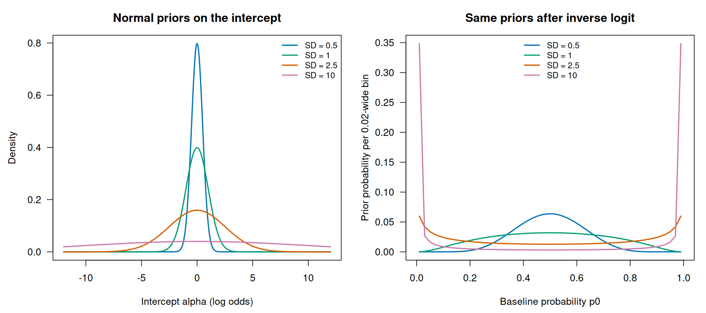
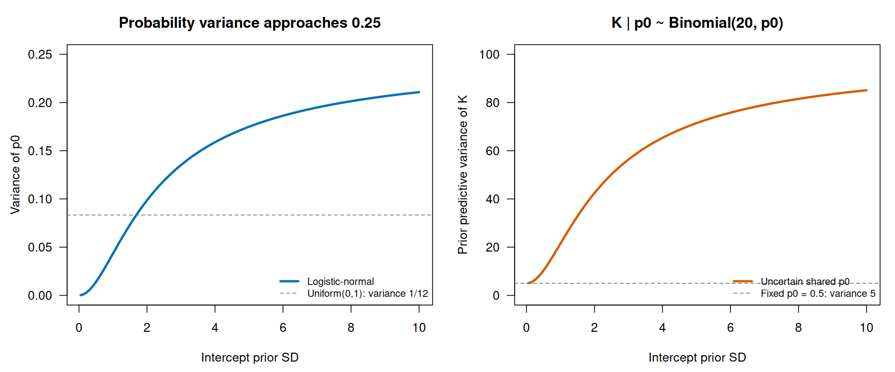
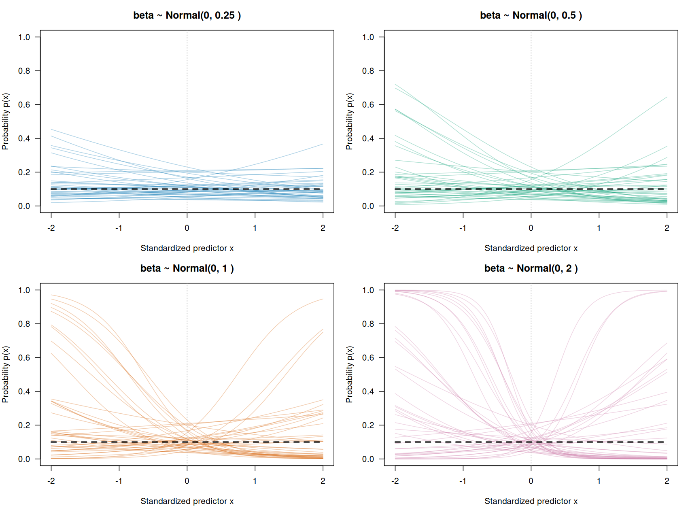
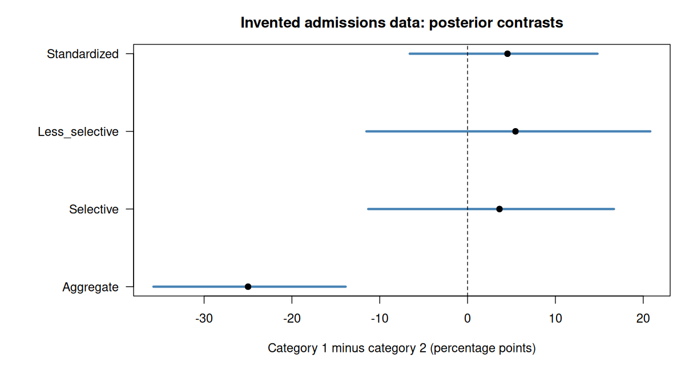
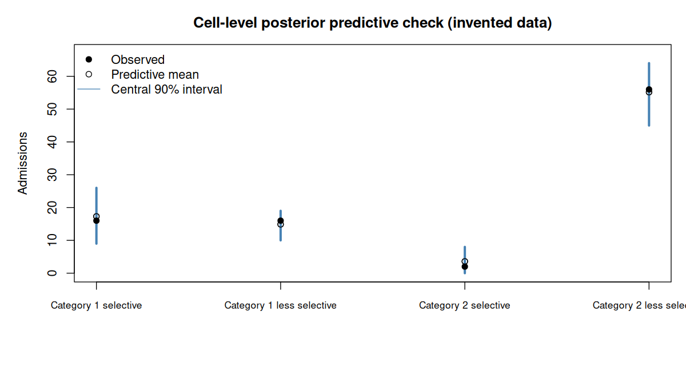

# A09 — Modeling Events

**Course:** Statistical Rethinking 2026  
**Section:** A — Beginner  
**Lecture:** A09 — Modeling Events  
**Meeting date:** 3 March 2026  
**Official reading:** Chapters 10 and 11 of *Statistical Rethinking*, second edition  
**Central question:** How should binary events, grouped successes, and open-ended event counts be modeled when the outcome scale constrains the possible observations?

> **Source note**
>
> This guide is grounded in the official 2026 course outline, the uploaded second edition of *Statistical Rethinking*, and the official scripts `09_binomial_GLMs.r` and `10_confounds_poisson.r`.
>
> The binomial script directly supports the logistic-link prior demonstrations, sequential logistic updating, simulated and real `UCBadmit` analyses, individual Bernoulli versus grouped binomial representations, department-specific contrasts, and standardization across departments.
>
> The Poisson portion is supported by the `Kline` analysis in `10_confounds_poisson.r`: prior predictive checks, an intercept-only count model, population-by-contact interaction, Pareto-smoothed importance sampling (PSIS) diagnostics, predictions on standardized and natural population scales, and an innovation-loss process model.
>
> The first part of `10_confounds_poisson.r` develops latent confounding and sensitivity analysis around the admissions example. That material is treated only as a transition to A10 — Confounds and Sensitivity Analysis, not as the main basis of A09.
>
> The executable homework laboratory added here uses `NWOGrants` and the companion R, Stan, and PyMC programs in `scripts/A09_*`.

---

## 0. Notation and reading conventions

**[Orientation](#a09-problem-map).** Define the symbols, scales, and acronyms used across the problems below.

This chapter uses the following notation. A symbol is restated locally whenever its meaning changes.

### Indices and observed units

- $i$ indexes an individual observation or application;
- $g$ indexes a group or gender category;
- $d$ indexes a department or scientific discipline;
- $k$ indexes an aggregated observational cell, except inside a predictor sum where it indexes predictors;
- $s$ indexes a retained posterior draw;
- $N$ denotes a total number of observations or opportunities, while $N_i$, $N_g$, or $N_k$ denotes the relevant total for one observation, group, or cell.

An uppercase letter such as $Y$ denotes a random variable. A lowercase value such as $y$ denotes one realized or observed value of that variable.

### Model quantities

- $Y_i$: outcome for observation $i$;
- $p_i$: probability of a binary event for observation $i$;
- $\mu_i=\mathbb E[Y_i\mid\text{predictors}]$: conditional expected outcome;
- $\lambda_i>0$: conditional expected count or event intensity in a Poisson model;
- $x_{ik}$: value of predictor $k$ for observation $i$;
- $\alpha$: intercept, meaning the linear predictor when numerical predictors equal zero and reference categories apply;
- $\beta_k$: coefficient multiplying predictor $k$;
- $\eta_i$: linear predictor, an unconstrained additive combination of coefficients and predictors;
- $\Delta$: a contrast, meaning a declared difference between two probabilities, rates, or other model-derived quantities.

### Probability and algebra

- $p(a\mid b)$ or $\Pr(a\mid b)$: probability mass or density of $a$ conditional on $b$;
- $\sim$: “is distributed as”;
- $\mid$: “conditional on”;
- $\in$: “belongs to the set”;
- $\sum$: sum over the indicated index;
- $\prod$: product over the indicated index;
- $\mathbb E[\cdot]$: expectation, or probability-weighted average;
- $\operatorname{Var}(\cdot)$: variance, measuring dispersion around an expectation;
- $\exp(a)=e^a$ and $\log(a)$: exponential and natural logarithm, which are inverse functions;
- $X_i^{\mathsf T}\beta$: vector dot product, equal to the sum of each predictor value times its coefficient;
- a bar, as in $\bar p$, denotes an average;
- the superscript “rep” denotes a replicated outcome simulated from the model;
- the superscript $(s)$ denotes evaluation using posterior draw $s$.

### Distribution conventions

- $\mathrm{Normal}(m,\sigma)$ uses mean $m$ and standard deviation $\sigma$;
- $\mathrm{Exponential}(r)$ uses rate $r$, so its mean is $1/r$;
- $\mathrm{MVNormal}(m,\Sigma)$ is a multivariate normal distribution with mean vector $m$ and covariance matrix $\Sigma$;
- $\mathrm{Bernoulli}(p)$ models one binary trial with event probability $p$;
- $\mathrm{Binomial}(N,p)$ models the number of events among $N$ trials sharing probability $p$;
- $\mathrm{Poisson}(\lambda)$ models a nonnegative event count with conditional mean $\lambda$.

### Recurring acronyms

- **GLM:** generalized linear model;
- **MCMC:** Markov chain Monte Carlo;
- **DAG:** directed acyclic graph, whose arrows encode assumed causal relations;
- **PPC:** posterior predictive check, comparing observed data with replicated data simulated from the fitted model;
- **PSIS-LOO:** Pareto-smoothed importance sampling leave-one-out cross-validation;
- **WAIC:** widely applicable information criterion;
- **SBC:** simulation-based calibration.

Each acronym is explained again when its diagnostic or algorithmic role first becomes important.

---

## 1. Main thesis

The central argument is:

> **Event data require a generative model that respects how events are counted and which opportunities for events were available.**

A Gaussian model permits any real-valued prediction:

$$ -\infty < Y < \infty $$

Event outcomes are constrained.

A binary event satisfies:

$$ Y_i \in \{0,1\} $$

A grouped success count satisfies:

$$ 0 \leq Y_i \leq N_i $$

An open-ended event count satisfies:

$$ Y_i \in \{0,1,2,\ldots\} $$

The generalized linear model workflow is:

$$ \text{event-generating process} \rightarrow \text{outcome distribution} \rightarrow \text{linear predictor} \rightarrow \text{link function} \rightarrow \text{priors} \rightarrow \text{posterior event probabilities or rates} \rightarrow \text{scientific contrasts} $$

The link function connects an unconstrained linear predictor to a constrained event expectation.

The parameters usually live on a transformed scale. Therefore:

$$ \text{coefficient} \neq \text{effect on the observed event scale in general} $$

Posterior predictions and contrasts must usually be computed on the probability or count scale.

### 1.1 Reading map: which problem are we solving? {#a09-problem-map}

Read A09 as a sequence of questions. **Problem 1 concerns success probabilities; Problem 2 concerns event counts and rates.** Both use GLMs, but the outcome and scientific question differ. Problems 3 and 4 address causal interpretation and application.

| Problem or transition | Question to keep in mind | Sections | Example and output |
|---|---|---|---|
| **1A — Estimate an event probability** | How do predictors, priors, and data determine the chance of a binary event? | [3–12](#generalized-linear-models) | Logistic simulation; probabilities and contrasts |
| **1B — Compare groups with different compositions** | Why can an overall admission difference disagree with comparisons within departments? | [13–22](#the-admissions-variables) | Admissions; aggregate, conditional, and standardized contrasts |
| **Bridge — Justify the likelihood** | Which constraints and process assumptions support the outcome distribution? | [23](#maximum-entropy-and-event-likelihoods) | Transition from success probabilities to event counts |
| **2 — Model counts and rates** | How many events occur, and over how much exposure? | [24–39](#poisson-event-counts) | `Kline` tool counts, then exposure and dispersion |
| **3 — Assess causal meaning** | Does a modeled association identify an intervention effect? | [40–41](#omitted-variables-in-glms) | Shared limits of logistic and Poisson models |
| **4 — Apply the workflow to CRM** | Does a campaign increase buyers or purchases, and what data are needed? | [42–46](#crm-application-campaign-conversion) | One retailer, five connected questions |

**The main Poisson block starts at 24 and ends at 39.** Sections 40–41 are shared lessons. The CRM block deliberately reuses both likelihood families. A count of successes out of known trials remains binomial: the word *count* alone does not imply Poisson.

### 1.2 The problems in context

#### Problem 1A — From observations to event probabilities

**Setting.** We observe whether an event occurs for each unit: an applicant is admitted or rejected, or a customer buys or does not buy. We also observe a predictor, such as a score. Even at the same predictor value, outcomes can differ, so the aim is to estimate a probability rather than predict every outcome with certainty.

**Question.** How should that probability vary with the predictor, and how much can we learn from a limited sample? A linear predictor can take any real value, while a probability must stay between zero and one. We need to connect the two scales and understand what assumptions about coefficients imply for actual probabilities.

**Route and result, sections 3–12.** Build the Bernoulli or binomial model and its logistic link, examine priors, then update with observations. The simulations distinguish parameters used to generate artificial data from parameters the analyst must estimate. Finish by reporting predicted probabilities and interpretable contrasts: additional events per 1,000 opportunities, a probability ratio, or an odds ratio. These summaries describe different aspects of the same comparison.

#### Problem 1B — Comparing groups that apply to different departments

**Setting.** Two applicant categories have different overall admission rates. However, they also apply in different proportions to departments with different selectivity. The observed gap therefore mixes differences within departments with differences in where applications are submitted.

**Question.** Are we describing the disparity among the applications actually received, comparing applicants within a department, or comparing the groups at a common department composition? These are distinct questions. Their answers can even have opposite signs without any arithmetic error.

**Route and result, sections 13–22.** Start with the aggregate contrast, examine department-specific probabilities, and average those probabilities using explicitly chosen common weights. A small invented example makes the change of composition visible. The result is a set of clearly labeled contrasts with posterior uncertainty. A standardized comparison is not automatically a causal effect: the role of department in the causal graph still matters.

#### Problem 2 — Explaining counts without a fixed number of trials

**Setting.** In the `Kline` example, each observation is a society, with a recorded tool count, population size, and contact category. The tool count is not a number of successes out of a recorded number of tool-production attempts. The outcome has changed from an event probability to a nonnegative count.

**Question.** How does the expected tool count vary with population and contact, and does that relationship depend on contact category? More generally, when counts come from different observation windows or amounts of exposure, are we comparing event volume or event rates?

**Route and result, sections 24–39.** Introduce a Poisson likelihood and log link, inspect their priors, and develop predictions for `Kline`, including a population-by-contact interaction. Distinguish uncertainty about the expected count from the additional variation in a future observed count. Then examine influence, a process-based alternative, exposure, and dispersion. The output is an expected count or an exposure-adjusted rate with uncertainty and checks of the model assumptions. Exposure is a general extension here; the `Kline` population predictor is not automatically an exposure offset.

Section **23** is the bridge into this problem: it asks which constraints and process assumptions justify a likelihood. Integer-valued data alone do not decide between binomial and Poisson models.

#### Problem 3 — From a fitted association to a causal claim

**Setting.** We now have models that produce valid probabilities or positive expected counts. It is tempting to interpret a predictor coefficient as what would happen if we changed that predictor. Yet the observed groups may differ in other causes of the outcome, and conditional and marginal logistic coefficients need not coincide.

**Question.** Would intervening on the predictor produce the modeled contrast, or does the contrast only describe observed associations? Why might a coefficient change after adding a variable, even when that variable is not a confounder?

**Route and result, sections 40–41.** Revisit omitted structure and non-collapsibility, then separate conditional predictions from intervention predictions using a causal graph and an explicit target population. The result is a statement of which contrast is estimated and what additional assumptions support a causal interpretation. This is a shared lesson for the earlier models; A10 develops the hidden-confounding problem further.

#### Problem 4 — Choosing the outcome for a campaign decision

**Setting.** An online retailer evaluates a campaign over a 30-day follow-up. A customer who buys three times counts as one buyer but contributes three purchases. Customers may also have different observed follow-up times. Thus “the campaign worked” is incomplete until we define the outcome and the comparison.

**Question.** Does the campaign increase the number of buyers, the number of purchases, or the purchase rate per unit of exposure? What data and causal assumptions allow the chosen contrast to inform a business decision?

**Route and result, sections 42–46.** Follow the same retailer through conversion, purchase counts, unequal exposure, aggregation, and analysis records. Use logistic models for whether a customer buys and count models for purchase volume, returning to the earlier problems as needed. Report additional expected buyers or purchases for a declared customer population, with uncertainty. Converting this into profitability also requires margin and cost information; an odds ratio alone cannot answer the business question.

### 1.3 Where the laboratory and annex fit

Sections **47–52** consolidate the main path with errors, takeaways, questions, and reading/code guides. Sections **53–84 return to Problem 1B**, replacing admissions and departments with grant awards and disciplines in `NWOGrants`. An application receives an award or does not; this is not a continuation of the Poisson case study.

Within the laboratory, **55–61** clarify definitions and aggregation; **62–72** specify, fit, and interpret the grant model; **73–82** check computation, predictions, and sensitivity; **83–84** consolidate the answer. Section **85** carries Problem 3 into A10, **86** lists sources, and **87** answers the review questions.

Each numbered section below starts with a short problem label and its role in the argument. It distinguishes a new question from another step in answering the same question.

---

## 2. Relationship to the book

**[Orientation](#a09-problem-map).** Locate the two likelihood families in the book and distinguish the core lecture from its extensions.

A09 combines the **generalized linear model (GLM)** architecture of Chapter 10 with the count models of Chapter 11.

| A09 topic | Second-edition counterpart | Role |
|---|---|---|
| Maximum-entropy outcome distributions | Section 10.1 | Chooses a distribution from known constraints |
| Generalized linear model | Section 10.2 | Separates likelihood, linear predictor, and link |
| Link functions | Section 10.2 | Maps the linear scale to valid means |
| Priors on transformed scales | Sections 10.2–10.3 | Regularizes implied probabilities and rates |
| Binomial regression | Section 11.1 | Models successes with a known number of trials |
| Logistic regression | Section 11.1 | Bernoulli form of binomial regression |
| `UCBadmit` | Section 11.1 | Aggregate and department-specific admission models |
| Poisson regression | Section 11.2 | Models nonnegative counts with no known maximum |
| `Kline` tools data | Section 11.2 | Population, contact, and technological counts |
| Other count models | Later Chapter 11 material | Extensions beyond the main A09 scripts |

### 2.1 The conceptual transition from A08

A08 used a Gaussian likelihood for a standardized numerical score inside an item-response model:

$$ S_i \sim \mathrm{Normal}(\mu_i, \sigma_S) $$

Here $S_i$ is the standardized score for observation $i$, $\mu_i$ is its conditional mean, and $\sigma_S>0$ is the residual standard deviation.

A09 changes the observation model to Bernoulli, binomial, and Poisson event likelihoods.

It asks how predictors and causal structures change:

- event probability;
- grouped success probability;
- expected event count;
- expected event rate.

MCMC remains an important inference tool; the logistic animation also uses a quadratic approximation and the interactive teaching simulators use grid integration. The new material concerns the outcome model and the meaning of transformed parameters.

---

## 3. Generalized linear models

**[Problem 1A — Event probabilities](#a09-problem-map).** Separate likelihood, linear predictor, and link before estimating an event probability.

**Starting question.** For observations with a given predictor value, how likely is the event, and how uncertain is that estimate? Sections 3–9 build the model and its priors; section 10 shows learning from data; sections 11–12 translate the fitted coefficients into understandable comparisons. Keep the event, the observational unit, and the predictor distinct as the equations are introduced.

A **generalized linear model (GLM)** has three components: an outcome distribution, a linear predictor, and a link function.

### 3.1 Outcome distribution

The likelihood respects the support of the outcome:

$$ Y_i \sim p(Y_i \mid \mu_i,\phi) $$

Here $i$ indexes observations, $Y_i$ is the random outcome, $\mu_i$ is its conditional expectation, and $\phi$ collects any additional likelihood parameter such as dispersion or shape. The notation $p(Y_i\mid\mu_i,\phi)$ denotes a probability mass or density, not the event probability $p_i$ used in later binary models.

### 3.2 Linear predictor

The predictors combine on an unconstrained scale:

$$ \eta_i = \alpha + \sum_{k=1}^{K} \beta_k x_{ik} $$

Here $K$ is the number of predictors, $x_{ik}$ is predictor $k$ for observation $i$, $\beta_k$ is its coefficient, $\alpha$ is the intercept, and $\eta_i$ is the resulting unconstrained linear predictor.

### 3.3 Link function

A **link function** $g$ maps conditional mean $\mu_i$ to unconstrained linear predictor $\eta_i$:

$$ g(\mu_i) = \eta_i $$

The inverse function $g^{-1}$ reverses that transformation:

$$ \mu_i = g^{-1}(\eta_i) $$

For binary events, the conditional mean equals event probability:

$$ \mu_i = p_i $$

For Poisson counts, the conditional mean is the positive count intensity:

$$ \mu_i = \lambda_i $$

The inverse link guarantees that the expected value remains inside the permitted range.

---

## 4. How the GLM components work together

**[Problem 1A — Event probabilities](#a09-problem-map).** Assemble those components into one generative model instead of treating them as unrelated definitions.

### 4.1 From predictors to an observed outcome

The three components in section 3 form one generative model. The **linear predictor** combines the inputs; the **inverse link** transforms that result into an allowed mean; the **outcome distribution** describes variation around that mean.

$$
\underbrace{x_i}_{\text{input}}
\quad\longrightarrow\quad
\underbrace{\eta_i=\alpha+\beta x_i}_{\text{linear predictor}}
\quad\xrightarrow{\;g^{-1}\;}\quad
\underbrace{\mu_i=g^{-1}(\eta_i)}_{\text{conditional mean}}
\quad\longrightarrow\quad
\underbrace{Y_i\sim p(\,\cdot\mid\mu_i,\phi)}_{\text{random outcome}}.
$$

The final arrow means **generate an observation from a distribution**, not apply another deterministic transformation. The coefficients and $x_i$ determine the mean, but they do not generally determine the observed value $Y_i$.

The term *linear* describes how the coefficients combine in $\eta_i$. It does not mean that the outcome itself must be continuous or that its mean must be linear in $x_i$ after applying the inverse link.

The **link** and **inverse link** express the same relationship in opposite directions:

$$
\underbrace{g(\mu_i)=\eta_i}_{\text{link: mean to linear predictor}},
\qquad
\underbrace{\mu_i=g^{-1}(\eta_i)}_{\text{inverse link: linear predictor to mean}}.
$$

To generate predictions, follow the inverse-link direction. During fitting, observed outcomes inform the coefficients through this whole model.

### 4.2 A complete logistic model

For a binary event, the conditional mean is the success probability, $\mu_i=p_i$. The three pieces fit together as follows:

$$
\begin{aligned}
\eta_i &= \alpha+\beta x_i
&&\text{(linear predictor)},\\
p_i &= \operatorname{logit}^{-1}(\eta_i)
=\frac{1}{1+e^{-\eta_i}}
&&\text{(inverse link)},\\
Y_i\mid p_i &\sim \mathrm{Bernoulli}(p_i)
&&\text{(outcome distribution)}.
\end{aligned}
$$

Equivalently, substitute the first two lines into the third:

$$
Y_i\mid x_i,\alpha,\beta
\sim\mathrm{Bernoulli}\!\left(
\frac{1}{1+e^{-(\alpha+\beta x_i)}}
\right).
$$

This is a single composed model. The Bernoulli distribution specifies **what can happen** ($Y_i=0$ or $1$), while the predictor and inverse link specify **how likely success is** for each input.

For example, let $\alpha=-2$, $\beta=0.8$, and $x_i=3$:

$$
\eta_i=-2+0.8\times3=0.4,
\qquad p_i=\frac{1}{1+e^{-0.4}}\approx0.599.
$$

The expected outcome is about 0.599, but an individual observed outcome is **0 or 1**, never 0.599. Under these parameter values, the model assigns about 59.9% probability to success and 40.1% to failure.

In Bayesian inference, repeat this calculation for each posterior draw of $\alpha$ and $\beta$. The resulting $p_i^{(s)}$ values describe uncertainty about the probability. Drawing $Y_i^{\mathrm{rep},(s)}\sim\mathrm{Bernoulli}(p_i^{(s)})$ additionally includes event randomness.

### 4.3 The same construction for different outcomes

| Model | Linear predictor | Inverse link | Outcome distribution |
|---|---|---|---|
| Gaussian with identity link | $\eta_i=\alpha+\beta x_i$ | $\mu_i=\eta_i$ | $Y_i\sim\mathrm{Normal}(\mu_i,\sigma)$ |
| Bernoulli with logit link | $\eta_i=\alpha+\beta x_i$ | $p_i=1/(1+e^{-\eta_i})$ | $Y_i\sim\mathrm{Bernoulli}(p_i)$ |
| Grouped binomial with logit link | $\eta_i=\alpha+\beta x_i$ | $p_i=1/(1+e^{-\eta_i})$ | $Y_i\sim\mathrm{Binomial}(N_i,p_i)$ |
| Poisson with log link | $\eta_i=\alpha+\beta x_i$ | $\lambda_i=e^{\eta_i}$ | $Y_i\sim\mathrm{Poisson}(\lambda_i)$ |

For the grouped binomial, the link acts on the **per-trial probability** $p_i$; the expected **success count** is $\mu_i=N_i p_i$. Thus, in terms of the count mean, $g(\mu_i)=\operatorname{logit}(\mu_i/N_i)$ for known $N_i>0$. With 10 independent trials sharing $p_i\approx0.599$, the expected count is about 5.99, while the observed count is an integer between 0 and 10.

The Gaussian model uses an identity link, so its mean equals the linear predictor. Logistic and Poisson models transform the predictor because their means must respect different constraints. Each likelihood also specifies its own conditional variance: $\sigma^2$, $p_i(1-p_i)$, $N_i p_i(1-p_i)$, or $\lambda_i$, respectively.

### 4.4 Why setting probability equal to the linear predictor fails

Suppose we skip the inverse-logit step and write

$$
p_i=\alpha+\beta x_i.
$$

With the same coefficients $\alpha=-2$ and $\beta=0.8$, this gives $p_i=-2$ at $x_i=0$ and $p_i=2$ at $x_i=5$. Neither can be a Bernoulli probability. A linear probability model also imposes a constant probability change for every unit increase in $x$, including near zero and one.

The logistic construction instead gives

$$
\begin{aligned}
x_i=0 &: \quad \eta_i=-2,\quad p_i\approx0.119,\\
x_i=5 &: \quad \eta_i=2,\quad p_i\approx0.881.
\end{aligned}
$$

The linear predictor can range over all real numbers, while its inverse-logit transformation always yields a valid probability. The outcome remains Bernoulli; the link changes how its probability depends on the inputs.

---

## 5. Odds and log odds

**[Problem 1A — Event probabilities](#a09-problem-map).** Define odds so that logistic coefficients can later be interpreted correctly.

For an event with probability $p$, its **odds** compare event probability $p$ with non-event probability $1-p$:

$$ \mathrm{odds}(p) = \frac{p}{1-p} $$

The logit is the logarithm of the odds:

$$ \mathrm{logit}(p) = \log \left( \frac{p}{1-p} \right) $$

The inverse logit is:

$$ \mathrm{logit}^{-1}(\eta) = \frac{\exp(\eta)}{1+\exp(\eta)} $$

Useful reference points are:

$$ \eta=0 \quad\Longrightarrow\quad p=0.5 $$

$$ \eta>0 \quad\Longrightarrow\quad p>0.5 $$

$$ \eta<0 \quad\Longrightarrow\quad p<0.5 $$

The logistic curve compresses extreme linear predictions toward zero and one.

---

## 6. Bernoulli and binomial outcomes

**[Problem 1A — Event probabilities](#a09-problem-map).** Choose between one binary event and a success count with a known trial denominator.

A Bernoulli observation is one binary trial:

$$ Y_i \sim \mathrm{Bernoulli}(p_i) $$

with:

$$ Y_i \in \{0,1\} $$

A binomial observation is a count of successes among $N_i$ trials:

$$ Y_i \sim \mathrm{Binomial}(N_i,p_i) $$

with:

$$ 0 \leq Y_i \leq N_i $$

The binomial probability mass is:

$$ p(Y_i=y_i \mid N_i,p_i) = {N_i \choose y_i} p_i^{y_i} (1-p_i)^{N_i-y_i} $$

The expected value and conditional variance are:

In these expressions, $y_i$ is the realized success count, ${N_i\choose y_i}=N_i!/[y_i!(N_i-y_i)!]$ counts how many binary sequences contain $y_i$ successes, and $n!=1\times2\times\cdots\times n$ is the factorial. The symbols $\mathbb E$ and $\operatorname{Var}$ denote conditional expectation and conditional variance.

$$ \mathbb{E}[Y_i \mid N_i,p_i] = N_i p_i $$

$$ \mathrm{Var}(Y_i \mid N_i,p_i) = N_i p_i(1-p_i) $$

---

## 7. Individual and aggregated data

**[Problem 1A — Event probabilities](#a09-problem-map).** Decide when individual events can be aggregated without losing information needed by the model.

Suppose $g$ indexes a group containing $N_g$ individuals and every individual in that group shares event probability $p_g$.

The individual representation is:

$$ Y_{ig} \sim \mathrm{Bernoulli}(p_g) $$

The aggregated representation is:

$$ S_g = \sum_{i=1}^{N_g} Y_{ig} $$

and:

$$ S_g \sim \mathrm{Binomial}(N_g,p_g) $$

When all relevant predictors are identical within a group, the Bernoulli and binomial forms contain the same likelihood information about $p_g$.

The official admissions script demonstrates this by:

1. simulating individual applications;
2. aggregating successes and totals by gender and department;
3. fitting the equivalent grouped binomial model.

### 7.1 Aggregation loses individual variation

Aggregation is not harmless when individuals within a cell differ in relevant predictors.

A grouped binomial likelihood assumes one common probability within the cell.

If probabilities differ:

$$ p_{ig} \neq p_g $$

then the aggregated model may conceal heterogeneity, interactions, or confounding.

The aggregation scheme is therefore part of the statistical model.

---

## 8. Priors on logistic intercepts

**[Problem 1A — Event probabilities](#a09-problem-map).** Translate plausible baseline probabilities into an intercept prior and inspect its implications.

### 8.1 Start with a meaningful baseline

In $\operatorname{logit}(p_i)=\alpha+\beta x_i$, the intercept describes the event probability **at $x_i=0$**:

$$
p_0=\operatorname{logit}^{-1}(\alpha)=\frac{1}{1+e^{-\alpha}}.
$$

Center a continuous predictor at a meaningful reference value before choosing this prior. With several predictors, the intercept refers to their simultaneous reference values, including reference categories. It is not generally the average event probability across the population.

A prior expresses plausible baseline probabilities **before conditioning on the outcomes used in the likelihood**. Use scientific knowledge, previous studies, and the measurement process. With limited information, use a regularizing range that covers plausible cases, inspect its predictions, and assess sensitivity. “Weakly informative” depends on the application and predictor scale; a broad coefficient prior is not automatically neutral.

Throughout these sections, $\mathrm{Normal}(m,s)$ uses **standard deviation** $s$, so its variance is $s^2$. In R, write `rnorm(n, mean = m, sd = s)`.

### 8.2 Choose location and spread on the probability scale

For $\alpha\sim\mathrm{Normal}(m,s)$, monotonicity of the inverse link gives

$$
\operatorname{median}(p_0)=\operatorname{logit}^{-1}(m),\qquad
q_u(p_0)=\operatorname{logit}^{-1}\!\left(m+s\Phi^{-1}(u)\right),
$$

where $q_u$ is the quantile at probability level $u$ and $\Phi^{-1}$ is the standard-normal quantile function. Thus $m=\operatorname{logit}(0.1)$ sets the **median**, not generally the mean, baseline probability to 10%.

If a plausible central 95% interval is $[L,U]$, match its logit endpoints:

$$
m=\frac{\operatorname{logit}(L)+\operatorname{logit}(U)}{2},\qquad
s=\frac{\operatorname{logit}(U)-\operatorname{logit}(L)}{2\times1.96}.
$$

For example, $[0.05,0.20]$ gives approximately $m=-2.165$ and $s=0.3975$. Values outside this interval remain possible; it is a prior probability statement, not a hard bound.

```{r a09-elicit-intercept-prior}
L <- 0.05
U <- 0.20
m <- (qlogis(L) + qlogis(U)) / 2
s <- (qlogis(U) - qlogis(L)) / (2 * qnorm(0.975))
c(logit_mean = m, logit_sd = s, logit_variance = s^2,
  probability_median = plogis(m))
plogis(qnorm(c(0.025, 0.975), mean = m, sd = s))  # 0.05, 0.20
```

At $m=0$, success and failure are treated symmetrically. `Normal(0, 1)` places approximately 95% probability on baseline probabilities between 0.124 and 0.876. That might be reasonable for some events, but is poorly centered for a conversion rate believed to be near 1%. Shift the center to reflect the context rather than automatically widening a prior around 50%.

### 8.3 Define the moments before comparing priors

For a random quantity $Z$ with finite moments, write $\mu=\mathbb E[Z]$ and $v=\operatorname{Var}(Z)>0$:

$$
\begin{aligned}
M_k&=\mathbb E[Z^k] &&\text{(raw moment of order }k\text{)},\\
v&=M_2-M_1^2 &&\text{(variance)},\\
\operatorname{SD}(Z)&=\sqrt v &&\text{(standard deviation)},\\
\gamma_1&=\frac{\mathbb E[(Z-\mu)^3]}{v^{3/2}} &&\text{(skewness)},\\
\gamma_2&=\frac{\mathbb E[(Z-\mu)^4]}{v^2}-3 &&\text{(excess kurtosis)}.
\end{aligned}
$$

Skewness describes asymmetry. Excess kurtosis compares the standardized fourth moment with the normal distribution's value of 3; a negative value does not mean negative variance. The median and quantiles are useful summaries but are **not moments**.

For $\alpha\sim\mathrm{Normal}(m,s)$,

$$
\mathbb E[\alpha]=m,\quad \mathbb E[\alpha^2]=m^2+s^2,\quad
\operatorname{Var}(\alpha)=s^2,\quad \gamma_1(\alpha)=\gamma_2(\alpha)=0.
$$

These normal moments do not remain unchanged after the inverse link. The induced distribution of $p_0$ is **logistic-normal**. Its moments can be calculated numerically:

$$
\mathbb E[p_0^k]=\int_{-\infty}^{\infty}
\left[\operatorname{logit}^{-1}(m+sz)\right]^k\varphi(z)\,dz,
$$

where $\varphi$ is the standard-normal density. Generally, $\mathbb E[p_0]\ne\operatorname{logit}^{-1}(\mathbb E[\alpha])$. Symmetry is an important exception: when $m=0$, $\mathbb E[p_0]=0.5$ for **every** $s$, even though variance and shape change.

Because probabilities are bounded, their moments exist even when a coefficient prior, such as a Cauchy, lacks finite mean or variance. Finite-sample Cauchy moment estimates are not estimates of finite population moments.

### 8.4 Display: means, variances, and higher moments

The following are prior quantities, not fitted estimates. Logistic-normal moments use numerical integration; beta moments use exact formulas. Full-precision results are in [the generated CSV](figures/A09_priors/intercept_moments.csv).

| Prior specification | $\mathbb E[p_0]$ | Median | $\mathbb E[p_0^2]$ | $\operatorname{Var}(p_0)$ | $\operatorname{SD}(p_0)$ |
| --- | --- | --- | --- | --- | --- |
| $\alpha\sim\mathrm{Normal}(0,0.5)$ | 0.5000 | 0.5000 | 0.2640 | 0.0140 | 0.1181 |
| $\alpha\sim\mathrm{Normal}(0,1)$ | 0.5000 | 0.5000 | 0.2934 | 0.0434 | 0.2083 |
| $\alpha\sim\mathrm{Normal}(0,2.5)$ | 0.5000 | 0.5000 | 0.3689 | 0.1189 | 0.3449 |
| $\alpha\sim\mathrm{Normal}(0,10)$ | 0.5000 | 0.5000 | 0.4607 | 0.2107 | 0.4591 |
| $\alpha\sim\mathrm{Normal}(\operatorname{logit}(0.1),1)$ | 0.1339 | 0.1000 | 0.0306 | 0.0127 | 0.1125 |
| $p_0\sim\mathrm{Beta}(1,1)$ | 0.5000 | 0.5000 | 0.3333 | 0.0833 | 0.2887 |
| $p_0\sim\mathrm{Beta}(2,2)$ | 0.5000 | 0.5000 | 0.3000 | 0.0500 | 0.2236 |
| $p_0\sim\mathrm{Beta}(2,18)$ | 0.1000 | 0.0868 | 0.0143 | 0.0043 | 0.0655 |

Beta priors specify the prior **directly on $p_0$**, inducing $\alpha=\operatorname{logit}(p_0)$. They are alternatives to the normal intercept prior, not additional priors imposed on top of it. For $p_0\sim\mathrm{Beta}(a,b)$,

$$
\mathbb E[p_0]=\frac{a}{a+b},\qquad
\operatorname{Var}(p_0)=\frac{ab}{(a+b)^2(a+b+1)}.
$$

`Beta(1, 1)` is uniform on probability; `Beta(2, 2)` favors the middle; `Beta(2, 18)` has mean 10%. Writing concentration $\kappa=a+b$ gives $a=\mu\kappa$, $b=(1-\mu)\kappa$, and variance $\mu(1-\mu)/(\kappa+1)$. Larger concentration means less uncertainty at the same mean.

`Normal(logit(0.1), 1)` instead gives mean probability about **0.134**, despite median 0.1. It is not interchangeable with `Beta(2, 18)`. A uniform probability prior is also not neutral under every transformation: its induced logit prior is logistic, not normal.

| Prior specification | Skewness | Excess kurtosis | $\Pr(p_0<0.01\;\mathrm{or}\;p_0>0.99)$ |
| --- | --- | --- | --- |
| $\alpha\sim\mathrm{Normal}(0,0.5)$ | 0 | -0.369 | 3.92e-20 |
| $\alpha\sim\mathrm{Normal}(0,1)$ | 0 | -0.861 | 4.33e-06 |
| $\alpha\sim\mathrm{Normal}(0,2.5)$ | 0 | -1.499 | 0.0661 |
| $\alpha\sim\mathrm{Normal}(0,10)$ | 0 | -1.886 | 0.646 |
| $\alpha\sim\mathrm{Normal}(\operatorname{logit}(0.1),1)$ | 1.714 | 3.625 | 0.00824 |
| $p_0\sim\mathrm{Beta}(1,1)$ | 0 | -1.200 | 0.02 |
| $p_0\sim\mathrm{Beta}(2,2)$ | 0 | -0.857 | 0.000596 |
| $p_0\sim\mathrm{Beta}(2,18)$ | 1.111 | 1.510 | 0.0153 |

Mean and skewness alone cannot distinguish the four symmetric normal priors. `Normal(0, 10)` assigns about **64.6%** probability to $p_0<0.01$ or $p_0>0.99$, compared with about **0.00043%** for `Normal(0, 1)`. Its large variance places mass near the boundaries rather than spreading it uniformly over $(0,1)$.



### 8.5 R example: calculate the moments by simulation

This simulation approximates the displayed population moments. More draws reduce Monte Carlo error, not the underlying prior variance.

```{r a09-intercept-moment-simulation}
set.seed(809)
B <- 200000L
summarize_moments <- function(z) {
  center <- mean(z)
  v <- mean((z - center)^2)  # empirical central moment, denominator B
  c(mean = center, median = median(z), second_raw_moment = mean(z^2),
    variance = v, sd = sqrt(v),
    skewness = mean((z - center)^3) / v^(3/2),
    excess_kurtosis = mean((z - center)^4) / v^2 - 3)
}
prior_p <- list(
  normal_0_0.5 = plogis(rnorm(B, 0, 0.5)),
  normal_0_1 = plogis(rnorm(B, 0, 1)),
  normal_0_2.5 = plogis(rnorm(B, 0, 2.5)),
  normal_0_10 = plogis(rnorm(B, 0, 10)),
  normal_logit10pct_1 = plogis(rnorm(B, qlogis(0.1), 1)),
  beta_1_1 = rbeta(B, 1, 1),
  beta_2_2 = rbeta(B, 2, 2),
  beta_2_18 = rbeta(B, 2, 18)
)
round(t(vapply(prior_p, summarize_moments, numeric(7))), 4)
vapply(prior_p, function(p) mean(p < 0.01 | p > 0.99), numeric(1))
```

R's `var(z)` divides by $B-1$, while the empirical central moment above divides by $B$. Both approach the same prior variance as the simulation size grows.

### 8.6 Probability variance versus predictive count variance

Distinguish uncertainty about a probability, $\operatorname{Var}(p_0)$, from conditional event variance, $\operatorname{Var}(Y\mid p_0)=p_0(1-p_0)$. After integrating over $p_0$, **one** binary outcome has variance $\mu(1-\mu)$, where $\mu=\mathbb E[p_0]$. All symmetric priors above therefore give the same marginal distribution for one Bernoulli outcome.

Their predictions differ for multiple trials sharing the same unknown probability. If $K\mid p_0\sim\mathrm{Binomial}(N,p_0)$, the law of total variance gives

$$
\begin{aligned}
\mathbb E[K]&=N\mu,\\
\operatorname{Var}(K)&=N\mathbb E[p_0(1-p_0)]+N^2\operatorname{Var}(p_0)\\
&=N\mu(1-\mu)+N(N-1)\operatorname{Var}(p_0).
\end{aligned}
$$

The same $p_0$ is shared across all $N$ conditionally independent trials. Drawing a separate independent probability for every trial would define a different model. For $N=20$ and normal intercept priors centered at zero:

| Intercept prior SD | $\mathbb E[K]$ | $\operatorname{Var}(K)$ |
| --- | --- | --- |
| 0.5 | 10 | 10.303 |
| 1 | 10 | 21.484 |
| 2.5 | 10 | 50.191 |
| 10 | 10 | 85.081 |

A fixed $p_0=0.5$ instead gives variance 5. All models above predict 10 successes on average, but their predictive spreads differ substantially.



```{r a09-prior-predictive-count-variance}
set.seed(810)
p <- plogis(rnorm(200000, 0, 1))
K <- rbinom(length(p), size = 20, prob = p)
mu <- mean(p)
v <- mean((p - mu)^2)
c(simulated_mean = mean(K), expected_mean = 20 * mu,
  simulated_variance = var(K),
  total_variance_formula = 20 * mu * (1 - mu) + 20 * 19 * v)
# Expected mean about 10; predictive variance about 21.484.
```

### 8.7 Interactive simulator: prior, data, and posterior

Change the normal prior mean and standard deviation for $\alpha$, keeping the binomial observations fixed. Compare the distributions of $\alpha$ and $p=\operatorname{logit}^{-1}(\alpha)$ before and after observing the data. The controls are labelled in French.

<div class="a09-simulator" data-mode="intercept">
<p>Open <a href="A09.html#interactive-simulator-prior-data-and-posterior">the local Quarto HTML</a> to use the simulator. Markdown previews may not execute JavaScript.</p>
</div>

Try three experiments: set $N=0$ to recover the prior; compare a narrow and a wide prior with five successes in twenty trials; then increase the trial count while preserving the observed proportion. The sliders change the **distribution assigned to the unknown coefficient**, not a fixed coefficient substituted for the posterior.

---

## 9. Priors on logistic slopes

**[Problem 1A — Event probabilities](#a09-problem-map).** Choose slope priors on a declared predictor scale and examine the probability curves they imply.

### 9.1 A slope prior needs a reference distance

For $\operatorname{logit}(p(x))=\alpha+\beta x$, a change $\Delta x$ multiplies odds by $e^{\beta\Delta x}$. A prior on $\beta$ therefore depends on the units of $x$.

For a predictor standardized to mean zero and standard deviation one, a unit is one standard deviation. For a 0/1 predictor, it is the category contrast. Changing units while retaining the same numerical slope prior changes the scientific model.

If $x_{\mathrm{raw}}=c+s_x x_{\mathrm{std}}$, then

$$
\alpha_{\mathrm{std}}=\alpha_{\mathrm{raw}}+c\beta_{\mathrm{raw}},\qquad
\beta_{\mathrm{std}}=s_x\beta_{\mathrm{raw}}.
$$

The intercept's meaning and potentially its dependence on the slope change too. Declare the reference point, units, and intended prediction range before choosing priors.

### 9.2 Calibrate a scale using plausible odds ratios

Let $\beta\sim\mathrm{Normal}(0,s_\beta)$. This assigns equal probability to positive and negative log-odds effects. A central 95% interval for the one-unit odds ratio is

$$
\left[e^{-1.96s_\beta},e^{1.96s_\beta}\right].
$$

If odds ratios between $1/2$ and 2 cover approximately 95% of plausible effects over one unit, choose $s_\beta=\log(2)/1.96\approx0.354$. For the same bounds over distance $|\Delta x|$, divide by $1.96|\Delta x|$. Prior knowledge of direction can justify a nonzero coefficient mean; the symmetric examples are comparisons, not requirements.

### 9.3 Display: coefficient moments and odds-ratio moments

For $\beta\sim\mathrm{Normal}(m_\beta,s_\beta)$, mean is $m_\beta$, variance is $s_\beta^2$, and skewness and excess kurtosis are zero. The odds ratio $R=e^\beta$ is lognormal:

$$
\begin{aligned}
\operatorname{median}(R)&=e^{m_\beta},\\
\mathbb E[R]&=e^{m_\beta+s_\beta^2/2},\\
\operatorname{Var}(R)&=(e^{s_\beta^2}-1)e^{2m_\beta+s_\beta^2}.
\end{aligned}
$$

These are moments after transformation, not simply exponentiated coefficient moments; see the [R documentation for the lognormal distribution](https://stat.ethz.ch/R-manual/R-devel/library/stats/html/Lognormal.html).

| $s_\beta$ | $\operatorname{Var}(\beta)$ | $\operatorname{median}(e^\beta)$ | $\mathbb E[e^\beta]$ | $\operatorname{Var}(e^\beta)$ | Central 95% odds-ratio interval |
| --- | --- | --- | --- | --- | --- |
| 0.25 | 0.0625 | 1 | 1.032 | 0.069 | [0.613, 1.632] |
| 0.50 | 0.2500 | 1 | 1.133 | 0.365 | [0.375, 2.664] |
| 1.00 | 1.0000 | 1 | 1.649 | 4.671 | [0.141, 7.099] |
| 2.00 | 4.0000 | 1 | 7.389 | 2926.360 | [0.020, 50.397] |

Although the mean odds ratio exceeds one, these zero-centered slope priors do **not** prefer positive effects: $\Pr(R>1)=\Pr(R<1)=0.5$. Large positive ratios dominate the arithmetic mean. Interpret it alongside the median, interval, and probability-scale implications.

```{r a09-slope-odds-moments}
s_beta <- c(0.25, 0.5, 1, 2)
data.frame(
  sd_beta = s_beta, variance_beta = s_beta^2,
  median_odds_ratio = 1,
  mean_odds_ratio = exp(s_beta^2 / 2),
  variance_odds_ratio = exp(s_beta^2) * expm1(s_beta^2),
  lower95 = exp(qnorm(0.025) * s_beta),
  upper95 = exp(qnorm(0.975) * s_beta)
)
```

### 9.4 Combine the intercept and slope before inspecting probabilities

Consider independent priors

$$
\alpha\sim\mathrm{Normal}(\operatorname{logit}(0.1),0.5),\qquad
\beta\sim\mathrm{Normal}(0,s_\beta).
$$

At fixed $x$, their linear combination has distribution

$$
\eta(x)=\alpha+\beta x\sim\mathrm{Normal}\!\left(
\operatorname{logit}(0.1),\sqrt{0.5^2+x^2s_\beta^2}\right).
$$

Its variance is $0.5^2+x^2s_\beta^2$, not $0.5+xs_\beta$. For correlated coefficients, add $2x\operatorname{Cov}(\alpha,\beta)$ to the variance. Combine the terms before applying the inverse link.

The probability moments below follow from the integral in section 8.3. Every row has median probability 0.1, yet their means, variances, and skewness differ.

| $s_\beta$ | $x$ | $\mathbb E[p(x)]$ | $\operatorname{Var}(p(x))$ | Skewness | Central 95% interval |
| --- | --- | --- | --- | --- | --- |
| 0.25 | 1 | 0.1111 | 0.0031 | 1.255 | [0.0358, 0.2494] |
| 0.25 | 2 | 0.1176 | 0.0054 | 1.485 | [0.0270, 0.3076] |
| 0.50 | 1 | 0.1176 | 0.0054 | 1.485 | [0.0270, 0.3076] |
| 0.50 | 2 | 0.1414 | 0.0166 | 1.735 | [0.0123, 0.4985] |
| 1.00 | 1 | 0.1414 | 0.0166 | 1.735 | [0.0123, 0.4985] |
| 1.00 | 2 | 0.2075 | 0.0592 | 1.408 | [0.0020, 0.8633] |
| 2.00 | 1 | 0.2075 | 0.0592 | 1.408 | [0.0020, 0.8633] |
| 2.00 | 2 | 0.3090 | 0.1336 | 0.826 | [0.0000, 0.9967] |

At $x=0$, the slope drops out and all four choices give the same baseline distribution. Farther away, a wider slope prior produces more extreme probability predictions. Thus a prior can look reasonable at the reference point and still be unsuitable over the full covariate range.



### 9.5 R example: moments of a probability change

Use the same parameter draw for both scenarios. Independently resampling the baseline for each scenario would add unrelated differences.

```{r a09-slope-probability-contrasts}
set.seed(909)
B <- 200000L
alpha <- rnorm(B, qlogis(0.1), 0.5)
z_beta <- rnorm(B)
contrast_summary <- do.call(rbind, lapply(c(0.25, 0.5, 1, 2), function(s) {
  beta <- s * z_beta
  p0 <- plogis(alpha)
  p1 <- plogis(alpha + beta)
  delta <- p1 - p0
  data.frame(sd_beta = s, mean_p1 = mean(p1), variance_p1 = var(p1),
             mean_change = mean(delta), sd_change = sd(delta),
             lower95_change = unname(quantile(delta, 0.025)),
             upper95_change = unname(quantile(delta, 0.975)),
             probability_positive = mean(delta > 0))
}))
contrast_summary
```

The sign of this one-unit probability change equals the sign of $\beta$, so its probability of being positive is 0.5. The distribution of changes need not be symmetric: a baseline near 10% has much more room to increase than decrease. Multiply a probability difference by 100 to express percentage points.

### 9.6 A practical workflow and reproducible displays

1. Define the outcome, its opportunities, and the reference predictor values.
2. Choose plausible baseline probabilities and translate them into an intercept prior.
3. Calibrate slopes using plausible changes over meaningful predictor distances.
4. Draw full probability curves; inspect extreme probabilities and interactions over the intended range.
5. Simulate outcomes with the actual trial counts and inspect their implications.
6. Fit the model and assess sensitivity to other plausible priors, particularly with sparse outcomes or separation.

Prior predictive checks assess the joint model, not one coefficient alone; see [Stan's guide to prior predictive checking](https://mc-stan.org/docs/2_28/stan-users-guide/prior-predictive-checks.html). Avoid selecting priors solely to reproduce the observed outcome histogram.

Reproduce all displayed tables and figures from the repository root with:

```bash
Rscript --vanilla scripts/A09_prior_moments.R
```

The [base-R script](../scripts/A09_prior_moments.R) writes three figures and three full-precision CSV tables to `courses/figures/A09_priors/`. Figures and numerical tables are embedded here so they remain visible in Markdown and Quarto with `eval: false`. The R examples are available for experimentation; rendering does not rerun them.

### 9.7 Interactive simulator: logistic regression

Adjust the independent normal priors on $\alpha$ and $\beta$. The observed binomial data remain fixed while the posterior updates. Blue bands show pointwise 90% prior intervals for $p(x)$; red bands show approximate pointwise 90% posterior intervals. The blue line is the prior median and the red line the posterior mean. Neither band is a prediction interval for individual binary outcomes.

<div class="a09-simulator" data-mode="regression">
<p>Open <a href="A09.html#interactive-simulator-logistic-regression">the local Quarto HTML</a> to use the simulator.</p>
</div>

Under **Changer le jeu de données simulé**, set the generating coefficients, trial count, and seed, then click **Générer les données**. These controls change the experiment; changing only the priors changes the analysis of the same observations. Start with a narrow prior on $\beta$ around zero, then widen it and observe the fitted slope, its uncertainty, and the correlation between coefficients.

The simulators normalize likelihood times prior by numerical grid integration (with refinement for concentrated posteriors); probability bands use 2,400 deterministic weighted grid points. They are teaching approximations, not MCMC fits. The normal priors on $\alpha$ and $\beta$ are independent, but their posterior need not be.

Render locally from the repository root:

```bash
quarto render courses/A09.qmd --to html --no-execute
```

The resulting `courses/A09.html` embeds the simulator code, styles, and figures. Open it directly in a browser; no R session, server, or internet connection is required. Mathematical notation uses the browser's native MathML rendering. The source code is in [a09-priors.js](simulators/a09-priors.js).

---

## 10. Sequential logistic updating

**[Problem 1A — Event probabilities](#a09-problem-map).** Hold the prior fixed and watch successive outcomes update the distribution of plausible curves.

### 10.1 Purpose: watch the prior become a posterior

Sections 8 and 9 asked what probability curves are plausible **before seeing outcomes**. This section asks the next question: **how does observing successive successes and failures change those beliefs?** The aim is to connect Bayesian updating of the coefficients to visible changes in the probability curve and its uncertainty.

The official script `09_binomial_GLMs.r` demonstrates this with a simulated experiment. Simulation lets us know the generating curve and compare it with what an analyst can learn from a small sample. In an actual dataset, that generating curve would be unknown.

### 10.2 First generate data using known parameter values

Imagine two roles: the person who generates the artificial data and the analyst who receives them. The generator chooses fixed coefficients

$$
\alpha_{\mathrm{true}}=-1,\qquad \beta_{\mathrm{true}}=1.
$$

The subscript **true** labels these known simulation settings. It does not denote a prior mean, a fitted estimate, or an additional model parameter. The analyst will estimate the unknown coefficients $\alpha$ and $\beta$ without being given these settings.

The script generates 20 predictor values $x_i$ uniformly between $-2$ and $2$, then generates binary outcomes:

$$
p_i^{\mathrm{true}}
=\operatorname{logit}^{-1}(\alpha_{\mathrm{true}}+\beta_{\mathrm{true}}x_i)
=\operatorname{logit}^{-1}(-1+x_i),
\qquad Y_i\sim\mathrm{Bernoulli}(p_i^{\mathrm{true}}).
$$

For example, at $x=0$ the success probability is about 0.269; at $x=1$ it is 0.5. The recorded outcome is still either 0 or 1. A failure where success was probable is possible and does not by itself invalidate the generating curve.

### 10.3 Then reveal the observations one at a time

The analyst starts with independent priors $\alpha\sim\mathrm{Normal}(0,1)$ and $\beta\sim\mathrm{Normal}(0,1)$, as in this part of the official script. Notice that these prior means are not the generating coefficients: the exercise is about learning from observations, not supplying the answer through the prior.

At step $t$, only the first $t$ pairs $(x_i,y_i)$ are available. Let $\pi_t(\alpha,\beta)$ denote the posterior density after those observations. Bayesian updating gives

$$
\pi_t(\alpha,\beta)
\propto
\pi_{t-1}(\alpha,\beta)
\left[p_t(\alpha,\beta)\right]^{y_t}
\left[1-p_t(\alpha,\beta)\right]^{1-y_t},
\qquad
p_t(\alpha,\beta)=\operatorname{logit}^{-1}(\alpha+\beta x_t).
$$

Here $\pi_0$ is the joint prior, and $y_t\in\{0,1\}$ is the newly observed outcome. A success increases the relative weight of parameter combinations that predict a higher probability at $x_t$; a failure increases the relative weight of combinations that predict a lower probability there.

The script implements this demonstration by refitting to the first $t$ observations with the **original priors**, for $t=1,\ldots,20$. It uses `quap`, a quadratic approximation to the posterior, rather than an exact posterior calculation. In exact Bayesian inference, updating one observation at a time and fitting all observations together give the same posterior, provided each observation is counted once.

### 10.4 Read the two views of the animation together

| View | What changes as data arrive? | What to look for |
|---|---|---|
| Coefficient space $(\alpha,\beta)$ | The joint posterior shifts and changes shape | Which combinations remain plausible, how uncertain they are, and whether the coefficients are correlated |
| Probability space $p(x)$ | Posterior coefficient draws become a family of logistic curves | Which probabilities are supported by observations and where curves still disagree |

For every posterior draw $s$, the second view uses

$$
p^{(s)}(x)=\operatorname{logit}^{-1}\!\left(\alpha^{(s)}+\beta^{(s)}x\right).
$$

More informative observations generally constrain the curves, especially over the sampled predictor range. This is not a promise that every interval becomes narrower after every observation: a surprising outcome can shift or reshape the posterior. Predictions away from observed predictor values remain more dependent on the model and priors.

The known generating coefficients provide a reference for this artificial experiment; a sample of 20 outcomes need not recover them exactly. The lesson is how a **distribution over plausible curves** evolves as evidence arrives, rather than how to obtain one coefficient pair with no uncertainty.

In the section 9.7 simulator, changing a prior while retaining the data explores prior sensitivity. This sequential example instead holds the prior fixed and reveals more data. These are two different ways to understand the balance between prior information and the likelihood.

### 10.5 Interactive experiment: generate, reveal, and learn

Choose the generating coefficients $\alpha_{\mathrm{true}}$ and $\beta_{\mathrm{true}}$, the total number of points (1–200), and a random seed. Click **Générer les données**: the simulator draws $x_i\sim\mathrm{Uniform}(-2,2)$ and $Y_i\sim\mathrm{Bernoulli}(\operatorname{logit}^{-1}(\alpha_{\mathrm{true}}+\beta_{\mathrm{true}}x_i))$. At first, none of these outcomes is revealed to the fitted model.

Then choose the means and standard deviations of the independent normal priors on $\alpha$ and $\beta$. Use **Lancer l’animation**, **+1 point**, or the number-of-revealed-points slider to watch the posterior evolve. **Tout révéler** fits the complete sample; **Revenir au prior** hides all observations without generating a new sample.

<div class="a09-simulator" data-mode="sequential">
<p>Open <a href="A09.html#interactive-experiment-generate-reveal-and-learn">the local Quarto HTML</a> to run this experiment.</p>
</div>

The green curve and green coefficient markers show the **generating truth**; the analyst is not given these values. Blue shows prior uncertainty, red shows posterior uncertainty, and black points are only the revealed binary outcomes. Pointwise probability bands are not prediction intervals for individual outcomes.

Try these comparisons:

1. Keep the generated data fixed and change a prior mean away from the generating coefficient. Compare a narrow prior with a wider one at the same number of revealed observations.
2. Return to zero observations, then reveal the sample progressively with fixed priors. Notice that uncertainty need not decrease at every single step.
3. Increase the total sample size and generate again with the **same seed and true coefficients**. The smaller sample is preserved as the beginning of the larger sample, making the extra information easier to isolate.
4. Change the seed to see sampling variation across repeated experiments with the same generating coefficients.

Changing a prior recalculates the current posterior without regenerating data. Changes to generating coefficients, total sample size, or seed take effect only after **Générer les données**; a message identifies unapplied settings. The step-$t$ calculation uses the original prior and the first $t$ likelihood contributions, so observations are counted once. It uses the numerical grid engine from sections 8–9, rather than the official animation's `quap` approximation.

---

## 11. Interpreting Coefficients on the log-odds scale {#coefficients-on-the-log-odds-scale}

**[Problem 1A — Event probabilities](#a09-problem-map).** Translate learned coefficients from log odds into odds ratios and probability changes.

### 11.1 Purpose: interpret the coefficients we have just learned

Section 10 showed how observations update the posterior for $\alpha$ and $\beta$. The next question is: **what does a plausible value of $\beta$ imply about the event?** A logistic coefficient is measured on the log-odds scale, so it cannot be read directly as a change in probability.

Start with the model

$$
\operatorname{logit}(p(x))=\alpha+\beta x,
\qquad p(x)=\Pr(Y=1\mid x).
$$

Here $\alpha$ determines the baseline at $x=0$, while $\beta$ describes a one-unit change in $x$ on the transformed scale. One unit must be defined: it could mean one year, one standard deviation of a standardized predictor, or a 0-to-1 category change.

### 11.2 Follow the change through the three scales

Compare two otherwise identical predictor settings, $x_0$ and $x_1=x_0+1$. Write $p_0=p(x_0)$ and $p_1=p(x_1)$ for their event probabilities. In this section, $p_0$ denotes the starting scenario; it need not be the intercept probability at $x=0$.

First subtract the linear predictors:

$$
\operatorname{logit}(p_1)-\operatorname{logit}(p_0)
=[\alpha+\beta(x_0+1)]-[\alpha+\beta x_0]=\beta.
$$

Since $\operatorname{logit}(p)=\log[p/(1-p)]$, exponentiation gives

$$
\underbrace{\frac{p_1/(1-p_1)}{p_0/(1-p_0)}}_{\text{odds ratio}}
=e^\beta.
$$

Thus $\beta$ is an **additive change in log odds**, and $e^\beta$ is a **multiplicative change in odds**. Neither is the additive change in probability. To obtain that change, transform both scenarios and subtract:

$$
\Delta p=p_1-p_0
=\operatorname{logit}^{-1}(\alpha+\beta x_1)
-\operatorname{logit}^{-1}(\alpha+\beta x_0).
$$

The intercept cancels in the log-odds difference, but generally does not cancel after the nonlinear inverse link. This explains why the baseline matters for a probability difference.

### 11.3 A concrete example: doubling the odds

For this new illustration, choose $\beta=\log 2\approx0.693$, so a one-unit increase in $x$ doubles the odds. This is an illustrative coefficient, not a fitted result or the generating coefficient from section 10.

Suppose the starting probability is $p_0=0.10$. Its odds are $0.10/0.90=1/9$. Doubling gives odds $2/9$, which translate back to

$$
p_1=\frac{2/9}{1+2/9}=\frac{2}{11}\approx0.1818.
$$

The probability increases from 10% to about 18.18%: an increase of **8.18 percentage points**, not 69.3 percentage points and not a doubling to 20%.

More generally, if the odds ratio is $R=e^\beta$, then

$$
p_1=\frac{R p_0}{1-p_0+R p_0}.
$$

This formula makes the baseline dependence explicit. The same $R$ produces different probability changes for different $p_0$ values, as section 12 illustrates.

### 11.4 Apply the interpretation to posterior draws

A fitted Bayesian model gives a distribution of coefficients, not one known $\beta$. For each joint posterior draw $(\alpha^{(s)},\beta^{(s)})$, compute $e^{\beta^{(s)}}$, $p_0^{(s)}$, and $p_1^{(s)}$. Summarize these derived distributions with a mean or median and an uncertainty interval.

Use the intercept and slope from the **same posterior draw**, preserving their dependence. In general, $e^{\mathbb E[\beta\mid\mathcal D]}\ne\mathbb E[e^\beta\mid\mathcal D]$, so exponentiating a posterior mean does not give the posterior mean odds ratio.

For a change of $\Delta x$ rather than one unit, the odds ratio is $e^{\beta\Delta x}$. With additional predictors, hold their values fixed for this conditional comparison. If the predictor participates in an interaction, include that interaction: the relevant log-odds change is no longer necessarily $\beta\Delta x$ alone.

### 11.5 Interactive interpretation: one coefficient, three scales

Choose illustrative values of $\alpha$ and $\beta$, a starting predictor $x_0$, and a change $\Delta x$. The simulator compares $x_0$ with $x_1=x_0+\Delta x$ and displays the complete chain:

$$
\Delta\operatorname{logit}(p)=\beta\Delta x,\qquad
OR=e^{\beta\Delta x},\qquad
\Delta p=\operatorname{logit}^{-1}(\alpha+\beta x_1)
-\operatorname{logit}^{-1}(\alpha+\beta x_0).
$$

<div class="a09-simulator" data-mode="interpretation">
<p>Open <a href="A09.html#interactive-interpretation-one-coefficient-three-scales">the local Quarto HTML</a> to use the coefficient interpreter.</p>
</div>

Start with **Exemple : odds ×2, départ à 10 %**: the probability changes from 10% to about 18.18%, not 20%. Keep $\beta$ and $\Delta x$ fixed while changing $\alpha$ or $x_0$: the odds ratio stays the same, while the probability difference changes. The second graph shows this baseline dependence over all starting probabilities. Set $\beta=0$ or $\Delta x=0$ to obtain no change, then reverse the coefficient sign to see the contrast reverse direction.

Unlike section 10.5, this is a deterministic interpretation tool: it does not simulate observations or fit a posterior. With posterior draws, the same transformations would be applied draw by draw, as explained in section 11.4. Section 12 compares which derived contrast is most useful for reporting.

---

## 12. Absolute and relative effects

**[Problem 1A — Event probabilities](#a09-problem-map).** Choose an absolute or relative contrast that answers the intended scientific question.

### 12.1 Concrete examples: what do the three quantities mean?

**A counting example.** Suppose an invented campaign comparison takes the purchase probability from $p_0=0.10$ (the starting scenario) to $p_1=0.20$ (the comparison scenario). We can describe this change with a probability difference, a probability ratio, or an odds ratio. What does each tell us? Imagine 1,000 comparable customers under each scenario:

| Expected outcome | Starting scenario | Comparison scenario |
|---|---|---|
| Buyers | 100 | 200 |
| Non-buyers | 900 | 800 |
| Total customers | 1,000 | 1,000 |

These are expected counts used to interpret the probabilities; a realized sample would fluctuate around them.

**Probability difference: how many additional buyers should we plan for?**

$$
\Delta=0.20-0.10=0.10=10\text{ percentage points}.
$$

For 1,000 comparable customers, this means $1000\times0.10=100$ additional expected buyers. This scale helps with practical questions such as planning order-processing capacity. A 10-percentage-point increase is not a 10% relative increase.

**Probability ratio: how much more likely is a customer to buy?**

$$
RR=\frac{0.20}{0.10}=2.
$$

The purchase probability doubles: it increases by $100(RR-1)=100\%$ relative to its starting value. Here the denominator is the **starting probability**. This describes relative magnitude, but does not by itself tell us how many additional buyers to expect.

**Odds ratio: how does the balance of buyers to non-buyers change?**

$$
\text{odds}_0=\frac{100}{900}=\frac{1}{9},\qquad
\text{odds}_1=\frac{200}{800}=\frac{1}{4},\qquad
OR=\frac{1/4}{1/9}=2.25.
$$

Odds compare **events with non-events** within each scenario; probabilities compare events with all opportunities. There is initially one expected buyer for every nine non-buyers, compared with one for every four non-buyers. The odds are multiplied by 2.25, while the probability is multiplied by 2. For a logistic model with a binary scenario indicator and no other covariates, the corresponding coefficient is $\beta=\log(2.25)\approx0.811$. This is the scale directly connected to the model coefficient in section 11.

**Why the baseline and the event definition matter.** The following invented examples show why reporting only one relative quantity can hide the practical magnitude:

| Event being modeled | $p_0\to p_1$ | Probability difference | Probability ratio | Odds ratio | Expected event-count change per 1,000 |
|---|---|---|---|---|---|
| Purchase, starting at 10% | 10% → 20% | +10 percentage points | 2 | 2.250 | +100 buyers |
| Purchase, starting at 1% | 1% → 2% | +1 percentage point | 2 | 2.020 | +10 buyers |
| Subscription cancellation | 10% → 8% | −2 percentage points | 0.8 | 0.783 | −20 cancellations |

The two purchase examples both double the probability, but imply very different additional workloads. For cancellations, $RR=0.8$ means a **20% lower cancellation probability**, whereas $OR\approx0.783$ means about **21.7% lower cancellation odds**. The absolute reduction is 2 percentage points. Whether an increase is desirable depends on the event: more purchases and more cancellations have different practical meanings.

The calculations can be reproduced in R:

```{r a09-concrete-contrasts}
examples <- data.frame(
  event = c("Purchase (10% baseline)", "Purchase (1% baseline)",
            "Subscription cancellation"),
  p0 = c(0.10, 0.01, 0.10),
  p1 = c(0.20, 0.02, 0.08)
)
with(examples, data.frame(
  event,
  difference_percentage_points = 100 * (p1 - p0),
  probability_ratio = p1 / p0,
  odds_ratio = (p1 / (1 - p1)) / (p0 / (1 - p0)),
  expected_count_change_per_1000 = 1000 * (p1 - p0)
))
```

A useful report states the event, both scenario probabilities, the contrast that answers the question, and its posterior uncertainty. For heterogeneous customers, compute their individual probability contrasts and average over a declared target population rather than assuming everyone shares the same baseline.

The term *effect* here describes a model-based contrast. Interpreting it as the causal effect of a campaign additionally requires an appropriate assignment or identification argument; a logistic link does not provide that argument.

### 12.2 Purpose: choose the scale that answers the scientific question

Section 11 translated a logistic coefficient into an odds ratio and a probability change. This section asks **which of those summaries should we report?** A statement such as “the effect doubles” is incomplete unless it specifies what doubles and from which baseline.

The examples above use $p_0$ for the starting probability and $p_1$ for the comparison probability. The three summaries answer different questions:

| Quantity | Definition | Question answered |
|---|---|---|
| Probability difference, also called risk difference | $p_1-p_0$ | How many additional events per opportunity are expected? |
| Probability ratio, also called risk ratio | $p_1/p_0$ | How many times as probable is the event? |
| Odds ratio | $[p_1/(1-p_1)]/[p_0/(1-p_0)]$ | By what factor do the odds change? |

These are different summaries of the same pair of probabilities. A probability difference multiplied by 100 is measured in **percentage points**. A relative percentage change is $100(p_1/p_0-1)$ and uses a different denominator. The probability ratio requires a nonzero starting probability.

### 12.3 The same odds ratio at four baselines

Return to the section 11 illustration $\beta=\log 2$, so every row has odds ratio 2:

| Starting probability $p_0$ | Comparison probability $p_1$ | Absolute change, percentage points | Probability ratio | Odds ratio |
|---|---|---|---|---|
| 1% | 1.98% | +0.98 | 1.980 | 2 |
| 10% | 18.18% | +8.18 | 1.818 | 2 |
| 50% | 66.67% | +16.67 | 1.333 | 2 |
| 90% | 94.74% | +4.74 | 1.053 | 2 |

The odds ratio is constant, but neither the absolute probability change nor the probability ratio is constant. Near a boundary, a substantial log-odds change can correspond to a small absolute probability change. When both probabilities are small, odds ratios and probability ratios are close; that approximation becomes poor for common events.

```{r a09-absolute-relative-example}
p0 <- c(0.01, 0.10, 0.50, 0.90)
beta <- log(2)
p1 <- plogis(qlogis(p0) + beta)
data.frame(
  baseline_percent = 100 * p0,
  comparison_percent = 100 * p1,
  change_percentage_points = 100 * (p1 - p0),
  probability_ratio = p1 / p0,
  odds_ratio = (p1 / (1 - p1)) / (p0 / (1 - p0))
)
```

For the campaign in the second row above, going from 10% to 18.18% means about **82 additional expected conversions per 1,000 comparable opportunities**, an 81.8% relative increase in conversion probability, and a doubling of the odds. These three statements describe the same comparison, using different denominators.

### 12.4 Carry uncertainty through the contrast

For each joint posterior draw $s$, compute the scenario probabilities and then their contrasts:

$$
\Delta^{(s)}=p_1^{(s)}-p_0^{(s)},\qquad
RR^{(s)}=\frac{p_1^{(s)}}{p_0^{(s)}},\qquad
OR^{(s)}=\frac{p_1^{(s)}/(1-p_1^{(s)})}{p_0^{(s)}/(1-p_0^{(s)})}.
$$

Summarize the resulting draw distributions, rather than subtracting interval endpoints or dividing posterior means. For example, a central 90% interval for $\Delta$ uses the 5th and 95th percentiles of the $\Delta^{(s)}$ draws. Multiplying those draws by a fixed number of comparable opportunities gives uncertainty about an expected-count difference; simulating future counts additionally includes observation noise.

The choice of contrast and target population defines the **estimand**, the quantity the analysis is intended to estimate. This prepares the admissions example that follows: a global admission difference and a department-standardized admission difference need not answer the same question, even when both are expressed in percentage points.

---

## 13. The admissions variables

**[Problem 1B — Comparable groups](#a09-problem-map).** Introduce the applications, categories, and departments needed to distinguish the possible comparisons.

**What would count as an answer?** Report the overall gap, the within-department gaps, and a contrast using the same department weights for both groups. Explain why each answers a different question. The worked example below is deliberately small so that the role of application composition can be checked by hand.

We now use the logistic machinery to investigate a concrete question: **if admission rates differ between two groups, what exactly are we comparing?** The groups may apply to different departments, with different levels of selectivity. Estimating probabilities is only the first part of this problem; deciding which comparison to make is the second.

The official script develops a simulated admissions example alongside the `UCBadmit` material. Use the following notation throughout sections 13–22:

| Symbol | Meaning |
|---|---|
| $A_i$ | Admission outcome, 0 or 1, for application $i$ |
| $G_i$ | Perceived gender category, indexed by 1 or 2 |
| $D_i$ | Department receiving the application |
| $N_{gd}$ | Number of applications in category $g$, department $d$ |
| $A_{gd}$ | Admissions in that cell: a count rather than an individual binary outcome |
| $p_{gd}$ | Conditional admission probability for that cell |

Keep the contrast direction **category 1 minus category 2** fixed. These category numbers are labels, not an ordered predictor scale.

The observation model remains Bernoulli for individual applications or binomial for suitably aggregated cells:

$$
A_i\sim\mathrm{Bernoulli}(p_i),\qquad
A_{gd}\sim\mathrm{Binomial}(N_{gd},p_{gd}).
$$

Section 14 compares the groups as observed; section 15 compares them within departments; section 16 explains why the results can differ; sections 17–18 distinguish the causal questions and construct a comparison at a common department composition. No switch to Poisson occurs here.

---

## 14. Total admission contrast

**[Problem 1B — Comparable groups](#a09-problem-map).** Start with the overall disparity while retaining each category's observed application composition.

### 14.1 First question: what is the overall admission disparity?

Begin with each group's admissions and applications, without distinguishing departments. Let $A_g$ be admissions among $N_g$ applications in group $g$. A first model is

$$
A_g\sim\mathrm{Binomial}(N_g,p_g),\qquad
\operatorname{logit}(p_g)=\alpha_g,\qquad
\alpha_g\sim\mathrm{Normal}(0,1).
$$

The individual-data version uses $A_i\sim\mathrm{Bernoulli}(p_i)$ and $\operatorname{logit}(p_i)=\alpha_{G_i}$. These models estimate one probability per group. The simple grouped likelihood treats applications within each group as sharing a modeled probability; the next model explicitly represents department heterogeneity.

For each posterior draw, calculate

$$
\Delta_{\mathrm{aggregate}}^{(s)}
=\operatorname{logit}^{-1}(\alpha_1^{(s)})
-\operatorname{logit}^{-1}(\alpha_2^{(s)}).
$$

This comparison retains each group's **own observed application composition**. The exercise often calls it the “total contrast.” Directly, it is a model-based marginal disparity; interpreting it as a total causal effect requires the assumptions discussed in section 17.

### 14.2 A small example to follow through the next sections

These numbers are invented for explanation: they are **not the UCB data or fitted posterior estimates**. Each category submits 100 applications.

| Department | Category 1: admitted / applied | Category 1 rate | Category 2: admitted / applied | Category 2 rate |
|---|---|---|---|---|
| More selective | 16 / 80 | 20% | 2 / 20 | 10% |
| Less selective | 16 / 20 | 80% | 56 / 80 | 70% |
| All departments | 32 / 100 | 32% | 58 / 100 | 58% |

The raw overall difference is $0.32-0.58=-0.26$: category 1 has a 26-percentage-point lower admission rate. But category 1 sends most applications to the more selective department, whereas category 2 does the opposite. The global difference alone cannot separate composition from within-department differences. That motivates section 15.

### 14.3 Reproduce the aggregate comparison

Run these blocks in section order, or run the complete [base-R script](../scripts/A09_problem1b.R) from the repository root with `Rscript scripts/A09_problem1b.R`. The displayed outputs and figures were generated by that script. These first results are descriptive rates; posterior estimates follow in section 15.

```{r a09-problem1b-14}
# Invented data, not UCBadmit. Run the blocks in section order.
cells <- data.frame(category = c(1,1,2,2),
  department = c("Selective","Less selective","Selective","Less selective"),
  admitted = c(16,16,2,56), applied = c(80,20,20,80))
cells$rate <- with(cells, admitted/applied)
print(cells, row.names=FALSE)
totals <- aggregate(cbind(admitted,applied) ~ category, cells, sum)
totals$rate <- with(totals, admitted/applied)
print(totals, row.names=FALSE)
cat("Raw aggregate contrast (percentage points):",100*(totals$rate[1]-totals$rate[2]),"\n")
```

**Result from the supplied script:**

```text
category     department admitted applied rate
        1      Selective       16      80  0.2
        1 Less selective       16      20  0.8
        2      Selective        2      20  0.1
        2 Less selective       56      80  0.7
 category admitted applied rate
        1       32     100 0.32
        2       58     100 0.58
Raw aggregate contrast (percentage points): -26
```

---

## 15. Department-specific model

**[Problem 1B — Comparable groups](#a09-problem-map).** Compare categories within the same department rather than mixing different application contexts.

### 15.1 Second question: what happens within the same department?

Keep the same applications and binary outcome, but allow admission probability to depend on both category and department:

$$
A_{gd}\sim\mathrm{Binomial}(N_{gd},p_{gd}),\qquad
\operatorname{logit}(p_{gd})=\alpha_{gd},\qquad
\alpha_{gd}\sim\mathrm{Normal}(0,1).
$$

For individual data, use $\operatorname{logit}(p_i)=\alpha_{G_i,D_i}$. The indexed parameter $\alpha_{gd}$ gives every cell its own logit. It does not impose the same category difference across all departments.

Within department $d$, calculate

$$
\Delta_d^{(s)}=\operatorname{logit}^{-1}(\alpha_{1d}^{(s)})
-\operatorname{logit}^{-1}(\alpha_{2d}^{(s)}).
$$

In the illustrative table, the raw differences are $0.20-0.10=+0.10$ in the more selective department and $0.80-0.70=+0.10$ in the less selective one. Category 1 has a higher rate **within both departments**, despite its lower overall rate.

A Bayesian fit would regularize cell probabilities and quantify uncertainty around these comparisons. With real data the department contrasts need not be equal, and a conditional comparison is not automatically causal. First, section 16 explains the arithmetic behind the apparent reversal.

### 15.2 Fit the stated logistic-normal models

This fits the independent Normal(0, 1) logit priors specified above using numerical integration and draws from the normalized grids. It does not use a Beta prior or fit real UCB data. The finite grid range and resolution are checked. Results are in percentage points; `lo90` and `hi90` denote the 5th and 95th posterior percentiles. Regularization shifts the raw contrasts, and sampling uncertainty remains even though both raw department contrasts are positive.

```{r a09-problem1b-15}
# Fit independent alpha ~ Normal(0,1) priors on logits, as in the text.
# Each parameter has a one-dimensional posterior, evaluated on a grid.
fit_grid <- function(y,n,step=.0025) {
  alpha <- seq(-12,12,by=step)
  log_mass <- dbinom(y,n,plogis(alpha),log=TRUE)+dnorm(alpha,0,1,log=TRUE)
  mass <- exp(log_mass-max(log_mass)); mass <- mass/sum(mass)
  stopifnot(sum(mass[abs(alpha)>11]) < 1e-8)
  list(p=plogis(alpha),mass=mass)
}
summarize <- function(x) c(mean=mean(x),lo90=unname(quantile(x,.05)),
                           hi90=unname(quantile(x,.95)))
set.seed(9015)
S <- 100000
cell_fits <- Map(fit_grid,cells$admitted,cells$applied)
p_draw <- vapply(cell_fits,function(f)
  sample(f$p,S,replace=TRUE,prob=f$mass),numeric(S))
# Columns retain the order of the four rows of cells.
within_draw <- cbind(Selective=p_draw[,1]-p_draw[,3],
                    Less_selective=p_draw[,2]-p_draw[,4])
cat("Within-department posterior contrasts, percentage points:\n")
print(round(100*t(apply(within_draw,2,summarize)),2))
aggregate_fits <- Map(fit_grid,totals$admitted,totals$applied)
p_aggregate <- vapply(aggregate_fits,function(f)
  sample(f$p,S,replace=TRUE,prob=f$mass),numeric(S))
aggregate_draw <- p_aggregate[,1]-p_aggregate[,2]
cat("Separate aggregate-model posterior contrast, percentage points:\n")
print(round(100*summarize(aggregate_draw),2))
# Verify posterior means against a grid twice as fine.
finer <- Map(function(y,n) fit_grid(y,n,.00125),cells$admitted,cells$applied)
mean_p <- function(f) sum(f$p*f$mass)
stopifnot(max(abs(vapply(cell_fits,mean_p,numeric(1))-
                 vapply(finer,mean_p,numeric(1)))) < 1e-6)
```

**Result from the supplied script:**

```text
Within-department posterior contrasts, percentage points:
               mean   lo90  hi90
Selective      3.64 -11.31 16.67
Less_selective 5.46 -11.52 20.80
Separate aggregate-model posterior contrast, percentage points:
  mean   lo90   hi90 
-24.99 -35.77 -13.88
```

---

## 16. Simpson-type aggregation reversal

**[Problem 1B — Comparable groups](#a09-problem-map).** Explain how different compositions can reverse the sign of an aggregate comparison.

### 16.1 The overall rate mixes probabilities with application weights

No probability has changed between sections 14 and 15. The summary has changed. Let $w_{d\mid g}=\Pr(D=d\mid G=g)$ be the share of category $g$'s applications sent to department $d$. Then

$$
p_g=\Pr(A=1\mid G=g)=\sum_d p_{gd}w_{d\mid g}.
$$

For the illustrative example:

$$
p_1=0.20(0.80)+0.80(0.20)=0.32,\qquad
p_2=0.10(0.20)+0.70(0.80)=0.58.
$$

The category-specific weights differ. Category 1's within-department advantage is outweighed in the aggregate by its concentration in the more selective department.

### 16.2 What the reversal establishes

This is a **Simpson-type reversal**: an aggregate comparison has a different sign from the within-department comparisons. Both calculations are arithmetically correct; they describe different mixtures.

The reversal does not tell us which comparison answers the policy or scientific question. Should department composition remain part of the comparison, or should both groups be placed in a common composition? That question comes next.

### 16.3 Reconstruct the mixture in R

Each contribution is a department rate multiplied by that category’s application share. Adding contributions reproduces the aggregate rates.

```{r a09-problem1b-16}
cells$own_weight <- cells$applied/ave(cells$applied,cells$category,FUN=sum)
cells$contribution <- cells$rate*cells$own_weight
print(cells[c("category","department","rate","own_weight","contribution")],
      row.names=FALSE)
print(aggregate(contribution ~ category,cells,sum),row.names=FALSE)
stopifnot(isTRUE(all.equal(cells$rate[1:2]-cells$rate[3:4],c(.1,.1))))
```

**Result from the supplied script:**

```text
category     department rate own_weight contribution
        1      Selective  0.2        0.8         0.16
        1 Less selective  0.8        0.2         0.16
        2      Selective  0.1        0.2         0.02
        2 Less selective  0.7        0.8         0.56
 category contribution
        1         0.32
        2         0.58
```

---

## 17. Total versus direct effect

**[Problem 1B — Comparable groups](#a09-problem-map).** Decide which pathways belong in the question before assigning a causal meaning to adjustment.

### 17.1 Decide whether the pathway through department belongs in the question

Suppose the scientific story is

$$
G\longrightarrow D\longrightarrow A,\qquad G\longrightarrow A.
$$

Here department is a **mediator**, a variable on a pathway from perceived gender to admission. Under this assumed graph and appropriate identification conditions, a total effect includes the pathway through department. A controlled direct comparison holds department fixed and excludes that pathway.

| Question | Treatment of department | Relevant comparison |
|---|---|---|
| What disparity accompanies each category's own application composition? | Retain category-specific weights | Aggregate/composition-preserving contrast |
| How do categories compare within department $d$? | Fix the department to $d$ | Department-specific contrast |
| How do categories compare across a common composition? | Use the same declared weights for both | Standardized controlled contrast |

These are well-defined statistical comparisons. None becomes a causal effect merely because a logistic model was fitted.

### 17.2 Why adjustment does not automatically identify a direct causal effect

Suppose unmeasured applicant strength $U$ affects department choice and admission. Under $G\rightarrow D\leftarrow U\rightarrow A$, department is also a **collider**: conditioning on it can open a noncausal association through $U$.

Causal interpretation requires a defensible intervention or interpretation for perceived gender, consistency, overlap, and appropriate assumptions about unmeasured causes and selection. The relevant conditions differ for total and direct effects. Standardization alone does not establish them, nor does it automatically identify a natural direct effect.

Section 18 therefore first defines a **standardized contrast**. Sections 40–41 and laboratory section 63 return to the additional causal assumptions.

---

## 18. Standardized direct contrast

**[Problem 1B — Comparable groups](#a09-problem-map).** Construct one comparison using the same department weights for both categories.

### 18.1 Third question: what if both groups had the same department composition?

Choose weights $w_d\ge0$ with $\sum_d w_d=1$ describing a target department distribution. Use these **same weights** for both categories. For each posterior draw:

$$
\overline p_1^{(s)}=\sum_d w_d p_{1d}^{(s)},\qquad
\overline p_2^{(s)}=\sum_d w_d p_{2d}^{(s)},
$$

$$
\Delta_{\mathrm{std}}^{(s)}=\overline p_1^{(s)}-\overline p_2^{(s)}
=\sum_d w_d[p_{1d}^{(s)}-p_{2d}^{(s)}].
$$

The exercise calls this a “direct” contrast. More precisely, it is a standardized controlled comparison; a causal label requires the conditions discussed in section 17.

### 18.2 Complete the numerical example

Across both categories in the illustrative table, each department receives 100 of 200 applications. Pooled application weights are therefore 0.5 and 0.5:

$$
\overline p_1=0.5(0.20)+0.5(0.80)=0.50,\qquad
\overline p_2=0.5(0.10)+0.5(0.70)=0.40.
$$

The standardized difference is **+10 percentage points**, compared with the aggregate **−26 percentage points**. The first arithmetic has not been corrected away; the target composition has changed. These calculations use illustrative rates, whereas fitted contrasts have posterior uncertainty.

### 18.3 Implement the calculation on individual application rows

For the observed pooled composition, predict every application once as category 1 and once as category 2, retaining its department $D_i$:

$$
p_i^{(s)}(G=g)=\operatorname{logit}^{-1}(\alpha_{g,D_i}^{(s)}),\qquad
\overline p_g^{(s)}=\frac1N\sum_{i=1}^N p_i^{(s)}(G=g).
$$

This equals the weighted cell calculation with $w_d=N_d/N$. Transform predictors to probabilities before averaging, pair scenarios from the same posterior draw, and align weights with department IDs. Then summarize the distribution of $\Delta_{\mathrm{std}}$.

Section 19 explains why other weights define other targets; section 20 checks the scale on which these operations are performed.

### 18.4 Standardize the same posterior draws

Pair scenarios within each posterior draw and align department weights explicitly. The aggregate result uses the separate model from section 14; department and standardized results use the cell model. Their difference reflects both the estimand and the model. The raw +10-point standardized contrast need not equal its regularized posterior mean.

```{r a09-problem1b-18}
departments <- cells$department[1:2]
pooled_n <- tapply(cells$applied,cells$department,sum)
w <- pooled_n[departments]/sum(pooled_n)
print(w)
cat("Raw standardized probabilities:",sum(w*cells$rate[1:2]),
    sum(w*cells$rate[3:4]),"\n")
standardized_draw <- drop(within_draw %*% as.numeric(w))
contrasts <- cbind(Aggregate=aggregate_draw,within_draw,Standardized=standardized_draw)
cat("Posterior contrasts, percentage points; central 90% intervals:\n")
print(round(100*t(apply(contrasts,2,summarize)),2))
cat("Pr(standardized contrast > 0):",round(mean(standardized_draw>0),3),"\n")
# Expanding labels verifies weighting; it adds no individual information.
d_id <- match(rep(cells$department,cells$applied),departments)
stopifnot(max(abs(rowMeans(within_draw[1:1000,d_id,drop=FALSE])-
                 standardized_draw[1:1000])) < 1e-12)
dir.create("courses/figures/A09_problem1b",recursive=TRUE,showWarnings=FALSE)
png("courses/figures/A09_problem1b/contrasts.png",width=1200,height=650,res=130)
z <- 100*t(apply(contrasts,2,summarize))
par(mar=c(5,9,3,1))
plot(z[,"mean"],1:4,xlim=range(z[,c("lo90","hi90")]),yaxt="n",ylab="",
     xlab="Category 1 minus category 2 (percentage points)",pch=19,
     main="Invented admissions data: posterior contrasts")
axis(2,at=1:4,labels=rownames(z),las=1)
segments(z[,"lo90"],1:4,z[,"hi90"],1:4,lwd=3,col="steelblue")
points(z[,"mean"],1:4,pch=19); abline(v=0,lty=2)
invisible(dev.off())
```

**Result from the supplied script:**

```text
Selective Less selective 
           0.5            0.5 
Raw standardized probabilities: 0.5 0.4 
Posterior contrasts, percentage points; central 90% intervals:
                 mean   lo90   hi90
Aggregate      -24.99 -35.77 -13.88
Selective        3.64 -11.31  16.67
Less_selective   5.46 -11.52  20.80
Standardized     4.55  -6.59  14.80
Pr(standardized contrast > 0): 0.763
```



**Reading the fitted result.** The standardized posterior mean is about **+4.55 percentage points**, with a central 90% interval from **−6.59 to +14.80 points**. The posterior probability of a positive contrast is about **0.763**. Thus the raw +10-point difference illustrates the composition reversal, but does not establish a precisely known positive population contrast. The Normal(0, 1) logit prior pulls the small, extreme cells toward probability 0.5, and uncertainty in those cells remains substantial. The separate aggregate model still gives a clearly negative descriptive contrast. Neither result establishes a causal effect.

---

## 19. Why weighting matters

**[Problem 1B — Comparable groups](#a09-problem-map).** Declare the target population instead of treating department weights as an arbitrary averaging choice.

The two-department table in sections 14–18 was a teaching example. For the six departments in `UCBadmit`, a simple average of department contrasts would give each department equal weight:

$$ \frac{1}{6} \sum_{d=1}^{6} \Delta_d $$

The official script instead weights departments by application frequency.

Let $N_d$ denote the number of applications to department $d$. Define its target-population weight by:

$$ w_d = \frac{N_d}{\sum_{k=1}^{6}N_k} $$

Then:

$$ \Delta_{\mathrm{weighted}} = \sum_{d=1}^{6} w_d \Delta_d $$

The weighting distribution defines the target population.

Equal department weighting, observed-application weighting, and a future-policy weighting answer different questions.

The target distribution is part of the estimand.

### 19.1 Change the target weights explicitly

Both raw department differences happen to be +10 points in this example, so common target weights do not change the raw contrast. Posterior summaries can still differ because sample sizes and regularization differ between cells. When department contrasts are unequal, the raw standardized contrast also depends on the target weights.

```{r a09-problem1b-19}
targets <- rbind(Pooled=c(.5,.5),Mostly_selective=c(.8,.2),
                 Mostly_less_selective=c(.2,.8))
weighted_draw <- within_draw %*% t(targets)
print(round(100*t(apply(weighted_draw,2,summarize)),2))
```

**Result from the supplied script:**

```text
mean  lo90  hi90
Pooled                4.55 -6.59 14.80
Mostly_selective      4.00 -8.38 14.90
Mostly_less_selective 5.09 -8.77 17.73
```

---

## 20. Contrasts must be computed on the desired scale

**[Problem 1B — Comparable groups](#a09-problem-map).** Transform each scenario to probabilities before calculating the admission contrast.

A log-odds contrast is:

$$ \alpha_{1d}-\alpha_{2d} $$

An odds ratio is:

$$ \exp \left( \alpha_{1d}-\alpha_{2d} \right) $$

A probability difference is:

$$ \mathrm{logit}^{-1}(\alpha_{1d}) - \mathrm{logit}^{-1}(\alpha_{2d}) $$

These are different summaries.

In particular:

$$ \mathrm{logit}^{-1} \left( \alpha_{1d}-\alpha_{2d} \right) $$

is not the probability difference.

The inverse link must be applied to each complete linear predictor before subtraction.

### 20.1 Check the calculation scale

For the selective department, the correct raw probability difference is 0.10. Applying the inverse logit to the log-odds difference gives a different quantity.

```{r a09-problem1b-20}
a1 <- qlogis(.20); a2 <- qlogis(.10)
print(round(c(log_odds_difference=a1-a2,odds_ratio=exp(a1-a2),
  probability_difference=plogis(a1)-plogis(a2),
  incorrect_difference=plogis(a1-a2)),4))
```

**Result from the supplied script:**

```text
log_odds_difference             odds_ratio probability_difference 
                0.8109                 2.2500                 0.1000 
  incorrect_difference 
                0.6923
```

---

## 21. Posterior prediction for event models

**[Problem 1B — Comparable groups](#a09-problem-map).** Distinguish uncertainty about admission probabilities from variation in future admission counts.

For a posterior draw $s$, the expected event probability is:

$$ p_i^{(s)} = \mathrm{logit}^{-1} \left( \eta_i^{(s)} \right) $$

A replicated binary event is:

$$ Y_i^{\mathrm{rep},(s)} \sim \mathrm{Bernoulli} \left( p_i^{(s)} \right) $$

For grouped trials:

$$ Y_i^{\mathrm{rep},(s)} \sim \mathrm{Binomial} \left( N_i, p_i^{(s)} \right) $$

The distribution of $p_i^{(s)}$ represents uncertainty about the expected event probability.

The replicated $Y_i^{\mathrm{rep},(s)}$ also contains event-level sampling variation.

### 21.1 Simulate future admission counts

The expected count varies because the probability is uncertain. The future observed count additionally includes binomial sampling variation. Both rows concern the same new cohort of 80 applicants.

```{r a09-problem1b-21}
# New cohort: 80 category-1 applicants in the selective department.
set.seed(9021)
expected_admissions <- 80*p_draw[,1]
future_admissions <- rbinom(S,size=80,prob=p_draw[,1])
print(round(rbind(Expected_count=summarize(expected_admissions),
                  Future_observed_count=summarize(future_admissions)),2))
```

**Result from the supplied script:**

```text
mean  lo90  hi90
Expected_count        17.30 11.79 23.41
Future_observed_count 17.32  9.00 26.00
```

---

## 22. Posterior predictive checks for binomial models

**[Problem 1B — Comparable groups](#a09-problem-map).** Check whether the fitted binary-event model reproduces the patterns relevant to the admissions question.

Useful checks include:

- admissions by department and category;
- total success counts;
- extreme cell rates;
- residual patterns by predictor;
- calibration across predicted-probability bins;
- overdispersion relative to the binomial model;
- subgroup contrasts.

A grouped binomial model may reproduce total successes while failing to reproduce heterogeneity inside cells.

The diagnostic should target the scientific pattern that the model claims to explain.

This completes the main binary-event path: model probabilities, define the comparison, and check predictions. Section 23 revisits the likelihood assumptions before section 24 changes the outcome to event counts.

### 22.1 Check replicated admissions in each cell

The check targets cell counts, the level observed in this example. With a separate parameter per cell, agreement is a limited check: it cannot establish within-cell calibration, independence of applications, or causal identification. These are posterior replicates, not held-out validation.

```{r a09-problem1b-22}
set.seed(9022)
y_rep <- vapply(seq_len(nrow(cells)),function(j)
  rbinom(S,size=cells$applied[j],prob=p_draw[,j]),numeric(S))
predictive <- t(apply(y_rep,2,summarize))
print(cbind(cells[c("category","department","admitted")],
            round(predictive,2)),row.names=FALSE)
png("courses/figures/A09_problem1b/predictive_check.png",width=1200,height=650,res=130)
par(mar=c(6,5,3,1))
plot(1:4,predictive[,"mean"],ylim=c(0,max(predictive[,"hi90"])+3),
     xaxt="n",xlab="",ylab="Admissions",pch=1,
     main="Cell-level posterior predictive check (invented data)")
axis(1,at=1:4,labels=paste("Category",cells$category,
  ifelse(cells$department=="Selective","selective","less selective")),cex.axis=.8)
segments(1:4,predictive[,"lo90"],1:4,predictive[,"hi90"],col="steelblue",lwd=3)
points(1:4,predictive[,"mean"],pch=1); points(1:4,cells$admitted,pch=19)
legend("topleft",c("Observed","Predictive mean","Central 90% interval"),
  pch=c(19,1,NA),lty=c(NA,NA,1),col=c("black","black","steelblue"),bty="n")
invisible(dev.off())
```

**Result from the supplied script:**

```text
category     department admitted  mean lo90 hi90
        1      Selective       16 17.30    9   26
        1 Less selective       16 14.88   10   19
        2      Selective        2  3.59    0    8
        2 Less selective       56 55.17   45   64
```



---

## 23. Maximum entropy and event likelihoods

**[Bridge — Choosing a likelihood](#a09-problem-map).** Before changing outcomes, examine why a likelihood follows from assumptions rather than from its name.

Chapter 10 motivates common likelihoods through constraints.

For a discrete probability distribution $q$ over possible outcomes $y$, Shannon entropy is:

$$
H(q)=-\sum_y q(y)\log q(y).
$$

Here $H(q)$ measures uncertainty in distribution $q$. A maximum-entropy distribution is the distribution with the largest $H(q)$ among all distributions satisfying the declared constraints. The result therefore depends on the support, constraints, and reference measure—not on the outcome label alone.

For a binary trial, the outcome can only be zero or one, and the expected value is fixed.

The maximum-entropy distribution under these constraints is Bernoulli.

For a known number of conditionally independent binary trials sharing a common probability, the success count is binomial. Exchangeability alone is not sufficient.

For nonnegative counts generated from many rare opportunities, the Poisson distribution emerges as a natural event-count model.

A nonnegative count with only a fixed mean has a geometric maximum-entropy distribution under ordinary counting measure, not Poisson. A Poisson justification needs additional process or reference-measure assumptions; see section 56.

Maximum entropy does not prove that a specific scientific process follows the distribution.

It identifies a minimally committed distribution conditional on the stated constraints.

---

## 24. Poisson event counts

**[Problem 2 — Counts and rates](#a09-problem-map).** Switch from admission success probabilities to event counts without a fixed trial maximum.

**What would count as an answer?** For specified population and contact values, give an expected tool count and uncertainty about that expectation, then show how a future observed count could vary. Sections 24–28 establish the model; 29–36 develop the `Kline` analysis; 37–39 broaden the discussion to rare events, exposure, and dispersion.

We now change the outcome: instead of asking whether an application succeeds, ask how many events occur in a unit or window. In the upcoming `Kline` example, the outcome is a society's tool count, not successes out of a recorded total of tool-production trials. Sections 24–39 build and assess that count model.

The distinction concerns the process and opportunities, not simply integer-valued observations. Admissions counts already had a binomial model with a known trial total. Poisson counts can still require an exposure measure, introduced in section 38.

For observation $i$, a Poisson outcome uses a positive conditional mean $\lambda_i$ and satisfies:

$$ Y_i \sim \mathrm{Poisson}(\lambda_i) $$

with:

$$ Y_i \in \{0,1,2,\ldots\} $$

For an observed count $y_i$, its probability mass is:

$$ p(Y_i=y_i \mid \lambda_i) = \frac{ \lambda_i^{y_i} \exp(-\lambda_i) }{ y_i! } $$

The conditional expectation and variance are:

$$ \mathbb{E}[Y_i \mid \lambda_i] = \lambda_i $$

$$ \mathrm{Var}(Y_i \mid \lambda_i) = \lambda_i $$

The equality concerns the conditional model after predictors and latent structure are included.

A marginal histogram with variance greater than the mean does not by itself disprove a Poisson regression.

---

## 25. The log link

**[Problem 2 — Counts and rates](#a09-problem-map).** Connect an unconstrained predictor to a positive expected count using the log link.

The expected Poisson count must be positive:

$$ \lambda_i>0 $$

The log link uses:

$$ \log(\lambda_i) = \eta_i $$

so:

$$ \lambda_i = \exp(\eta_i) $$

For a linear predictor:

$$ \log(\lambda_i) = \alpha+\beta x_i $$

the expected count is:

$$ \lambda_i = \exp(\alpha+\beta x_i) $$

A one-unit increase in $x$ multiplies the expected count by:

$$ \exp(\beta) $$

Thus $\beta$ is a log rate ratio or log expected-count ratio under the model.

---

## 26. Probability link versus count link

**[Problem 2 — Counts and rates](#a09-problem-map).** Compare the new log link with the logit link without confusing counts with probabilities.

Logistic regression uses:

$$ p_i = \mathrm{logit}^{-1}(\eta_i) $$

which maps to:

$$ 0<p_i<1 $$

Poisson regression uses:

$$ \lambda_i = \exp(\eta_i) $$

which maps to:

$$ 0<\lambda_i<\infty $$

Both models use an unconstrained linear predictor.

The inverse link determines how additive differences on the parameter scale become nonlinear differences on the observation scale.

---

## 27. Priors for Poisson intercepts

**[Problem 2 — Counts and rates](#a09-problem-map).** Choose a prior that produces plausible baseline counts after exponentiation.

If:

$$ \log(\lambda_i) = \alpha $$

then:

$$ \lambda_i = \exp(\alpha) $$

A prior on $\alpha$ induces a log-normal prior on the expected count.

The official script contrasts broad and regularized priors.

A prior such as:

$$ \alpha \sim \mathrm{Normal}(0,10) $$

permits astronomically large expected counts after exponentiation.

A more grounded prior for the tool-count example is:

$$ \alpha \sim \mathrm{Normal}(3,0.5) $$

This places the implied baseline count around:

$$ \exp(3) \approx 20 $$

while still allowing meaningful uncertainty.

The prior should be judged on the count scale.

---

## 28. Priors for Poisson slopes

**[Problem 2 — Counts and rates](#a09-problem-map).** Inspect multiplicative count changes across the predictor range before fitting.

For:

$$ \log(\lambda_i) = \alpha+\beta x_i $$

the count ratio for a one-unit change is:

$$ \frac{ \lambda(x+1) }{ \lambda(x) } = \exp(\beta) $$

A broad slope prior such as:

$$ \beta \sim \mathrm{Normal}(0,10) $$

can imply explosive count curves over even a modest predictor range.

The official script uses a narrower prior:

$$ \beta \sim \mathrm{Normal}(0,0.2) $$

for standardized log population.

The implied multiplicative change per standard deviation is concentrated around:

$$ \exp(\beta) $$

rather than around an unbounded additive count change.

---

## 29. The `Kline` data

**[Problem 2 — Counts and rates](#a09-problem-map).** Introduce tool counts, population, and contact as the concrete count-model case study.

The official Poisson script uses island societies with:

- $T$: total number of tools;
- $P$: standardized log population;
- $C$: low- or high-contact category.

The outcome is a nonnegative count:

$$ T_i \sim \mathrm{Poisson}(\lambda_i) $$

The central scientific question is how expected technological complexity varies with population and contact.

The data contain few societies, making:

- prior regularization;
- influence diagnostics;
- process-based interpretation

especially important.

---

## 30. Intercept-only Poisson model

**[Problem 2 — Counts and rates](#a09-problem-map).** Establish a common-count baseline against which predictor models can be assessed.

The baseline model is:

$$ T_i \sim \mathrm{Poisson}(\lambda_i) $$

$$ \log(\lambda_i) = \alpha $$

with:

$$ \alpha \sim \mathrm{Normal}(3,0.5) $$

This model assumes every society has the same expected tool count.

It provides:

- a prior predictive baseline;
- a comparison model;
- a measure of unexplained heterogeneity.

It does not represent population or contact effects.

---

## 31. Population-by-contact interaction

**[Problem 2 — Counts and rates](#a09-problem-map).** Allow the population–tool association to differ by contact category.

The official interaction model is:

$$ T_i \sim \mathrm{Poisson}(\lambda_i) $$

$$ \log(\lambda_i) = \alpha_{C_i} + \beta_{C_i}P_i $$

with:

$$ \alpha_c \sim \mathrm{Normal}(3,0.5) $$

$$ \beta_c \sim \mathrm{Normal}(0,0.2) $$

Each contact category receives:

- its own intercept;
- its own population slope.

On the expected-count scale:

$$ \lambda_i = \exp \left( \alpha_{C_i} + \beta_{C_i}P_i \right) $$

The relationship is nonlinear in the original count scale even though it is linear on the log scale.

---

## 32. Interpreting the interaction

**[Problem 2 — Counts and rates](#a09-problem-map).** Translate the interaction into count ratios and differences that have a scientific interpretation.

For contact category $c$, a one-unit increase in standardized log population multiplies expected tool count by:

$$ \exp(\beta_c) $$

Let $p_0$ and $p_1$ denote two chosen values of the standardized log-population predictor. The ratio of their expected counts is:

$$ \frac{ \lambda_c(p_1) }{ \lambda_c(p_0) } = \exp \left[ \beta_c(p_1-p_0) \right] $$

The absolute difference is:

$$ \lambda_c(p_1) - \lambda_c(p_0) $$

This absolute difference depends on both:

$$ \alpha_c $$

and:

$$ \beta_c $$

A slope coefficient alone does not summarize the change in expected tools on the observed scale.

---

## 33. Prediction on standardized and natural scales

**[Problem 2 — Counts and rates](#a09-problem-map).** Return predictions to natural population units while retaining the fitted model.

The script defines standardized log population as:

$$
P_i=
\frac{\log(\mathrm{population}_i)-m_{\log\mathrm{pop}}}
{s_{\log\mathrm{pop}}},
$$

where $m_{\log\mathrm{pop}}$ is the sample mean of log population and $s_{\log\mathrm{pop}}>0$ is its sample standard deviation. Thus $P_i=0$ represents a society at the mean log population, and one unit of $P_i$ represents one standard deviation.

For posterior draw $s$ and contact category $c$, the expected count at standardized value $P$ is:

$$
\lambda_c^{(s)}(P)
=
\exp\left[\alpha_c^{(s)}+\beta_c^{(s)}P\right].
$$

Predictions can be mapped back to natural population units. If:

$$
P=
\frac{\log(\mathrm{population})-m_{\log\mathrm{pop}}}
{s_{\log\mathrm{pop}}},
$$

then algebraic inversion gives:

$$
\mathrm{population}
=
\exp\left(s_{\log\mathrm{pop}}P+m_{\log\mathrm{pop}}\right).
$$

This changes only the horizontal-axis units, not the fitted model or its predictions.

---

## 34. Expected counts versus replicated counts

**[Problem 2 — Counts and rates](#a09-problem-map).** Separate uncertainty about an expected tool count from variation in a future observed count.

The posterior distribution of:

$$ \lambda_i $$

describes uncertainty about the expected tool count.

A replicated count is:

$$ T_i^{\mathrm{rep}} \sim \mathrm{Poisson}(\lambda_i) $$

An interval for $\lambda_i$ is narrower than a predictive interval for a new $T_i$ because the latter includes event-count randomness.

The distinction mirrors:

- expected probabilities versus binary outcomes;
- regression means versus individual observations.

---

## 35. PSIS comparison and influence

**[Problem 2 — Counts and rates](#a09-problem-map).** Assess predictive performance and influential societies without mistaking predictive success for causality.

The official script fits:

- an intercept-only model;
- a population-by-contact interaction model.

It compares them with PSIS.

The predictive criteria used here are:

- **leave-one-out cross-validation (LOO):** repeatedly evaluates prediction of one held-out unit using a model fitted to the remaining units;
- **Pareto-smoothed importance sampling (PSIS):** approximates LOO from one posterior fit by stabilizing importance weights;
- **Pareto shape diagnostic $k$:** summarizes the heaviness of an importance-weight tail; large values warn that the PSIS approximation is unreliable or that an observation is highly influential;
- **WAIC:** a pointwise approximation to expected out-of-sample predictive accuracy based on the log likelihood and an effective-complexity correction.

The pointwise Pareto-$k$ diagnostic identifies observations for which importance-sampling approximation is unstable or which have high influence on predictive comparison.

In the plot, point size and line width are linked to normalized $k$ values.

This is especially important with the small `Kline` dataset, where one society can strongly affect the fitted curve.

PSIS addresses predictive stability. It does not establish the causal effect of population or contact.

---

## 36. Process model for innovation and loss

**[Problem 2 — Counts and rates](#a09-problem-map).** Ask whether a process of innovation and loss provides a useful scientific model for the count pattern.

The official script also fits a process-motivated model:

$$ T_i \sim \mathrm{Poisson}(\lambda_i) $$

$$ \lambda_i = \frac{ \exp(\alpha_{C_i}) P_i^{\beta_{C_i}} }{ \gamma } $$

In this process model, $P_i>0$ is population on its natural positive scale—not the standardized log-population variable used in the preceding GLM. For contact category $C_i$, $\exp(\alpha_{C_i})$ controls innovation intensity, $\beta_{C_i}>0$ controls population scaling, and $\gamma>0$ is a common loss-rate parameter appearing in the denominator.

The model uses priors such as:

$$ \alpha_c \sim \mathrm{Normal}(1,1) $$

$$ \beta_c \sim \mathrm{Exponential}(1) $$

$$ \gamma \sim \mathrm{Exponential}(1) $$

This parameterization expresses expected tool count through:

- contact-specific innovation intensity;
- population scaling;
- a loss process.

It illustrates an important distinction:

$$ \text{GLM-shaped curve} \neq \text{mechanistic process model automatically} $$

A process-motivated equation can give parameters more scientific structure, but it still requires validation and causal criticism.

---

## 37. Poisson as a rare-event approximation

**[Problem 2 — Counts and rates](#a09-problem-map).** Explain the rare-event limit connecting binomial probabilities with Poisson counts.

Suppose:

$$ Y \sim \mathrm{Binomial}(N,p) $$

with many opportunities and a small event probability.

If:

$$ N \rightarrow \infty $$

$$ p \rightarrow 0 $$

while:

$$ Np=\lambda $$

remains fixed, then:

$$ Y \Rightarrow \mathrm{Poisson}(\lambda) $$

The arrow $\Rightarrow$ means **convergence in distribution**: as the number of opportunities grows and the event probability shrinks under the stated constraint, the binomial probabilities approach the probabilities of a Poisson distribution with mean $\lambda$.

This connects binomial and Poisson event models.

The distinction is practical:

- binomial modeling uses a known opportunity total $N$;
- Poisson modeling uses an expected event count or rate without a fixed observed maximum.

---

## 38. Exposure and offsets

**[Problem 2 — Counts and rates](#a09-problem-map).** Separate event intensity from the time or opportunities over which events can accumulate.

A count often depends on observation exposure.

Let:

- $E_i$ be time at risk, customers contacted, distance surveyed, or another exposure;
- $r_i$ be the event rate per exposure unit.

Then:

$$ Y_i \sim \mathrm{Poisson}(E_i r_i) $$

Taking logs:

$$ \log \mathbb{E}[Y_i] = \log(E_i) + \log(r_i) $$

A regression can be written:

$$ \log(\lambda_i) = \log(E_i) + \alpha + X_i^{\mathsf T}\beta $$

The term:

$$ \log(E_i) $$

is an offset with coefficient fixed to one.

An **offset** is a known additive term whose coefficient is fixed rather than estimated. Here it forces expected counts to scale proportionally with exposure $E_i$.

This is a Chapter 11 extension of the event-model logic. It is not the principal structure in the official `Kline` script.

---

## 39. Conditional variance and overdispersion

**[Problem 2 — Counts and rates](#a09-problem-map).** Check the conditional count variation and decide whether the Poisson model needs an extension.

**Overdispersion** means that conditional variation exceeds the variance implied by the chosen likelihood. “Conditional” refers to variation among units with the same modeled predictors; “marginal” refers to variation after mixing units with different predictors or latent rates.

A basic Poisson model states:

$$ \mathrm{Var}(Y_i \mid X_i) = \mathbb{E}[Y_i \mid X_i] $$

Marginal variance can exceed the marginal mean because:

- predictor values differ;
- latent rates differ;
- observations are clustered;
- events are dependent.

Therefore, comparing the aggregate sample mean and variance is not a sufficient model check.

A posterior predictive check should compare conditional patterns.

Persistent extra-Poisson variation may motivate:

- varying effects;
- latent-rate mixtures;
- negative-binomial models;
- zero-inflated or hurdle processes;
- explicit dependence.

These extensions are beyond the main A09 scripts but follow from Chapter 11's count-model framework.

This closes Problem 2's count-model block. The next two sections concern interpretation of both logistic and Poisson models, not a further Poisson-specific construction.

---

## 40. Omitted variables in GLMs

**[Problem 3 — Causal interpretation](#a09-problem-map).** Examine omitted structure and coefficient changes across both likelihood families.

**Keep two questions separate.** First, does the model describe the observed outcomes adequately? Second, would its predicted contrast persist under a specified intervention? For example, a higher purchase probability among campaign recipients does not by itself show that sending the campaign increased purchases: recipients may already have been more likely to buy. Sections 40–41 explain what must be added to the outcome model before making that claim.

The main Poisson block is complete. Return to a question shared by Problems 1 and 2: what happens when the fitted predictor omits relevant structure? A suitable outcome distribution does not ensure that a coefficient answers the intended question.

Chapter 10 warns that omitted causes can be especially difficult under nonlinear links.

Suppose independent causes $X$ and $Z$ both increase a binary event.

If $Z$ is omitted, some observations with small $X$ still have $Y=1$ because $Z$ was sufficient.

The fitted model may understate the influence of $X$.

In a nonlinear model, an omitted predictor need not be a classical confounder to alter other coefficients because probabilities are compressed by floors and ceilings.

Thus:

**Non-collapsibility** means that a conditional odds ratio and a marginal odds ratio can differ even without confounding. **Omitted structure** means predictors, interactions, or latent heterogeneity absent from the fitted linear predictor. Both make transformed-scale coefficient comparisons delicate.


The final scientific estimand should be computed through full predictions, not isolated coefficients.

---

## 41. Causal interpretation of event models

**[Problem 3 — Causal interpretation](#a09-problem-map).** Distinguish a conditional event model from an identified intervention contrast.

A GLM specifies:

$$ p(Y \mid X,Z,\theta) $$

It does not automatically identify:

$$ p(Y \mid \mathrm{do}(X=x)) $$

The expression $\mathrm{do}(X=x)$ denotes an intervention that sets $X$ to $x$, rather than merely observing units for which $X=x$. A **directed acyclic graph (DAG)** encodes the assumed causal ordering and determines which conditional distributions can identify such an intervention.

The causal workflow remains:

$$ \text{DAG} \rightarrow \text{identification} \rightarrow \text{conditional event model} \rightarrow \text{intervention prediction} \rightarrow \text{standardization} \rightarrow \text{contrast} $$

The binomial or Poisson likelihood respects the outcome.

A causal graph, its identification assumptions, and an appropriate analysis can justify an interventional interpretation. The likelihood alone cannot.

The next five sections apply these distinctions to one campaign decision, switching outcome definitions explicitly.

---

## 42. CRM application: campaign conversion

**[Problem 4 — One campaign decision](#a09-problem-map).** Begin the campaign case with the probability that an eligible customer buys at least once.

### 42.1 One scenario for the next five sections

An online retailer wants to know whether a campaign generates enough additional purchases to justify its cost. **Customer relationship management (CRM)** is the application context, not another statistical model.

Follow this campaign through five questions: did a customer buy at least once (42), how many purchases occurred (43), was follow-up comparable (44), what does aggregation retain (45), and what must the analysis system record (46)?

Start with one row per eligible customer and a common 30-day follow-up window. Let $A_i=1$ mean assignment to the campaign and $A_i=0$ assignment to control. Here $A_i$ means campaign assignment, replacing the earlier admission notation. Let $Y_i=1$ if the customer buys at least once and 0 otherwise, and let $X_i$ contain pre-assignment covariates.

### 42.2 Model conversion and define uplift

This is Problem 1's binary-event question:

$$
Y_i\sim\mathrm{Bernoulli}(p_i),\qquad
\operatorname{logit}(p_i)=\alpha+\beta_A A_i+X_i^{\mathsf T}\beta_X.
$$

For each posterior draw, predict the **same eligible customers** under both assignments:

$$
p_i^{(s)}(a)=\operatorname{logit}^{-1}
[\alpha^{(s)}+\beta_A^{(s)}a+X_i^{\mathsf T}\beta_X^{(s)}],\quad a\in\{0,1\}.
$$

Average their differences over the target population of $N$ customers:

$$
\tau_{\mathrm{conversion}}^{(s)}=\frac1N\sum_i[p_i^{(s)}(1)-p_i^{(s)}(0)].
$$

This repeats section 18's standardization logic. Illustrative probabilities of 10% and 12% imply 2 percentage points of uplift, or 20 additional expected buyers per 1,000 comparable customers. These are not fitted campaign results.

Report the contrast and its uncertainty, not only the odds ratio. Randomized assignment can support a causal assignment-effect analysis under the relevant assumptions; observational targeting requires an identification strategy and overlap. Do not automatically condition on message opening, a post-assignment event.

Conversion counts each customer at most once. Repeat purchases require a different outcome next.

---

## 43. CRM application: number of purchases

**[Problem 4 — One campaign decision](#a09-problem-map).** Change the campaign outcome to purchase volume, so repeat purchases contribute to the result.

### 43.1 The same campaign, a different outcome

A customer buying three times and one buying once both have $Y_i=1$ in section 42. Instead let $C_i$ count **all purchases** during the same 30 days, including zero for non-buyers. This changes the outcome to Problem 2's event-count question.

A starting model is

$$
C_i\sim\mathrm{Poisson}(\lambda_i),\qquad
\log\lambda_i=\alpha+\beta_A A_i+X_i^{\mathsf T}\beta_X.
$$

These coefficients belong to the count model; they are not the numerical estimates from the conversion model. At fixed covariates and equal exposure, $e^{\beta_A}$ is a conditional expected-count ratio when there are no campaign interactions.

### 43.2 Report additional purchases, not additional buyers

Compute both scenario means for each posterior draw and average their differences:

$$
\tau_{\mathrm{count}}^{(s)}=\frac1N\sum_i[\lambda_i^{(s)}(1)-\lambda_i^{(s)}(0)].
$$

For illustration, 0.30 versus 0.36 purchases per customer implies 60 additional expected purchases per 1,000 customers. This is not necessarily 60 additional buyers: repeat purchases contribute too. Convert the contrast into expected margin and campaign cost using separately stated business assumptions.

Check zeros, dispersion, and dependence. A Poisson model is a candidate, not a guarantee that repeated purchases meet its assumptions. Separate logistic and Poisson fits need not agree on the zero probability; a coherent joint or hurdle model may be needed if that relationship matters.

The comparison assumes equal observation windows. Section 44 relaxes that assumption.

---

## 44. CRM application: event exposure

**[Problem 4 — One campaign decision](#a09-problem-map).** Make purchase comparisons meaningful when customers have unequal observation windows.

### 44.1 Separate observation time from purchasing intensity

Suppose some customers have only 10 observed days and others have 30. Two purchases in 10 days is a higher observed rate than four in 30 days, despite being a smaller count. Raw purchase differences now mix intensity and time at risk.

Let $E_i>0$ be observed days and $r_i$ expected purchases per day:

$$
C_i\sim\mathrm{Poisson}(E_i r_i),\qquad
\log r_i=\alpha+\beta_A A_i+X_i^{\mathsf T}\beta_X.
$$

Equivalently,

$$
\log\lambda_i=\underbrace{\log E_i}_{\text{offset, coefficient fixed at one}}
+\alpha+\beta_A A_i+X_i^{\mathsf T}\beta_X.
$$

Expected counts scale proportionally with exposure at a fixed modeled rate. Record the unit: days and months imply different rate intercepts.

### 44.2 Predict over a common window

If a constant rate is plausible, use $\lambda_i^{(s)}(a;30)=30r_i^{(s)}(a)$ to compare 30-day expected purchases in the same eligible population. Time-varying rates require a suitable time model rather than automatic proportional scaling.

An offset does not repair informative loss to follow-up. If assignment changes exposure itself—for example website visits or subscription duration—conditioning on exposure can change a total-purchase question into a rate question. Define the estimand before treating active days or sessions as routine offsets.

Distinguish zero purchases during observed follow-up, no opportunity to purchase, and missing follow-up. Section 45 asks what remains identifiable from aggregated reports.

---

## 45. CRM application: aggregated campaign cells

**[Problem 4 — One campaign decision](#a09-problem-map).** Determine whether aggregated campaign cells preserve the binary or count question being asked.

### 45.1 Return to conversion when the report counts buyers

Suppose the reporting system supplies the number of customers who bought at least once, not purchase counts. We return to **Problem 1's grouped binary outcome**, even though the preceding sections used Poisson models.

For each campaign-assignment-by-segment cell $g$, let $B_g$ be buyers and $N_g$ eligible assigned customers with the defined follow-up:

$$
B_g\sim\mathrm{Binomial}(N_g,p_g).
$$

Twenty buyers among 40 customers and twenty among 400 imply very different probabilities. Keep the denominator and separate assignment groups. A table containing only contacted customers cannot by itself estimate the assignment contrast.

### 45.2 Check what aggregation removes

The binomial form preserves the individual likelihood when trials are conditionally independent and share a modeled probability within each cell. If adjustment needs age, prior purchases, or follow-up history, aggregating unlike customers can discard necessary information.

Different segment mixes in treatment and control recreate the admissions problem: global conversion rates mix cell probabilities and composition. For a common-population comparison, retain individual records or sufficiently detailed cells and declared target weights. Segment adjustment also needs causal justification, especially if segment membership is defined after assignment.

If the report instead counts **total purchases**, its numerator can exceed the customer count. Use the count/exposure model from sections 43–44, not this binomial buyers model. Section 46 records these distinctions in the analysis workflow.

---

## 46. Implications for CausalOps

**[Problem 4 — One campaign decision](#a09-problem-map).** Record the preceding choices so the campaign comparison can be reproduced and interpreted.

The retailer needs an analysis that another person can reproduce and interpret. **CausalOps** here means the operational record of the causal question, data definitions, model, diagnostics, and target contrast. An artifact name is not a statistical guarantee.

Retain assignment and control definitions, pre-assignment eligibility and covariates, follow-up windows, buyers versus purchase counts, and the target population. The schemas below describe different parts of the same workflow, not interchangeable outcomes.

| A09 concept | CausalOps implication |
|---|---|
| Event support | `OutcomeDefinitionArtifact` with binary, grouped, or count type |
| Opportunity total | Store denominator for binomial events |
| Exposure | Store time or opportunity offset for rates |
| Link function | Record parameter-to-outcome transformation |
| Prior predictive curves | Validate probability and count implications |
| Bernoulli versus binomial | Validate aggregation equivalence assumptions |
| Probability contrast | First-class posterior estimand |
| Log-odds coefficient | Label as transformed-scale parameter |
| Poisson rate ratio | Distinguish from absolute event difference |
| Standardization | Average event predictions over target population |
| Mediator categories | Prevent total/direct estimand confusion |
| PSIS influence | Flag event groups dominating predictive results |
| Overdispersion | Trigger richer event-process models |
| Process model | Separate mechanistic parameters from generic GLM coefficients |

### 46.1 Event outcome schema

Section 42 needs a binary indicator of at least one purchase within the defined window, alongside assignment and eligibility metadata.

```yaml
outcome_id: campaign_purchase_30d
type: binary_event
value_column: purchased
event_values:
  success: 1
  failure: 0
observation_window: 30_days
unit: customer
```

### 46.2 Grouped-binomial schema

Section 45 requires buyers and eligible customers in every assignment–segment cell, including the control arm.

```yaml
outcome_id: purchases_by_campaign_cell
type: grouped_binomial
success_column: purchasers
trials_column: eligible_assigned_customers
cell_keys:
  - campaign_id
  - assignment
  - segment_id
aggregation_assumption: common_probability_within_cell
```

### 46.3 Poisson-rate schema

Sections 43–44 require purchase counts and exposure in declared units. Record censoring and the reasons for unequal follow-up.

```yaml
outcome_id: campaign_purchase_count
type: count_event
count_column: purchase_count
exposure_column: observed_days
exposure_unit: day
link: log
offset: log_observed_days
unit: customer_followup
```

### 46.4 Contrast artifact

This artifact records section 42's conversion question. Purchase volume needs a count-difference artifact and reference window; rate contrasts need an exposure unit. Preserve posterior uncertainty and causal assumptions alongside these definitions.

```yaml
estimand_id: average_conversion_uplift
left_intervention: assigned_campaign
right_intervention: assigned_control
scale: probability_difference
observation_window: 30_days
population: eligible_customers
aggregation: customer_standardization
```

---

## 47. Common errors exposed by A09

**[Consolidation — The problem map](#a09-problem-map).** Diagnose mistakes by returning to the outcome, comparison, or causal question they change.

### Error 1: Using Gaussian regression for binary events

It can predict invalid probabilities and misrepresent event variance.

### Error 2: Treating a broad logit prior as neutral

It can imply near-certain events before seeing data.

### Error 3: Reading a logistic coefficient as a probability difference

It is a log-odds change.

### Error 4: Applying the inverse logit to a coefficient difference

Probability differences require inverse-transforming complete linear predictors first.

### Error 5: Treating odds ratios as absolute effects

The probability effect depends on baseline risk.

### Error 6: Aggregating heterogeneous trials

A grouped binomial model assumes a common modeled probability within each cell.

### Error 7: Conditioning on department while claiming the aggregate total contrast

Department adjustment changes the estimand under the mediator graph.

### Error 8: Averaging department effects without defining weights

The weighting distribution defines the target population.

### Error 9: Interpreting a Poisson coefficient as an additive count change

It is a log multiplicative change.

### Error 10: Ignoring exposure time or opportunities

Counts cannot be compared as rates without a denominator.

### Error 11: Rejecting Poisson from the marginal histogram

The equality of mean and variance is conditional on the model.

### Error 12: Using PSIS to establish causality

PSIS evaluates predictive approximation and influence, not identification.

### Error 13: Comparing information criteria across incompatible likelihood constants without care

Predictive criteria are safest for models using the same outcome distribution and data representation.

### Error 14: Assuming the link function solves omitted-variable bias

The link enforces outcome constraints; it does not repair the causal graph.

---

## 48. Lecture takeaways

**[Consolidation — The problem map](#a09-problem-map).** Consolidate the main distinctions before attempting the review questions.

1. Event likelihoods should match the support and opportunity structure of the outcome.
2. A GLM combines an outcome distribution, linear predictor, and link function.
3. Bernoulli models one binary trial.
4. Binomial models successes among a known number of trials.
5. Poisson models nonnegative event counts with no fixed observed maximum.
6. The logit link maps an unconstrained predictor to a probability.
7. The log link maps an unconstrained predictor to a positive expected count.
8. Logistic coefficients are changes in log odds.
9. Exponentiated logistic coefficients are odds ratios.
10. Poisson coefficients are changes in log expected counts.
11. Exponentiated Poisson coefficients are multiplicative count or rate ratios.
12. Absolute event effects require posterior predictions on the outcome scale.
13. Priors must be checked after inverse transformation.
14. Individual Bernoulli and grouped binomial models are equivalent only under valid aggregation.
15. The admissions example distinguishes aggregate and department-held-fixed contrasts.
16. Department weighting defines the standardized target population.
17. A link function makes parameters interact when translated to the outcome scale.
18. The `Kline` model allows contact-specific population relationships.
19. PSIS can expose influential event observations.
20. Mechanistic event models remain models requiring validation.
21. Exposure offsets distinguish event counts from event rates.
22. Event GLMs do not create causal identification by themselves.
23. CausalOps should store denominators, exposures, links, and contrast scales explicitly.

---

## 49. Review questions

**[Consolidation — The problem map](#a09-problem-map).** Check understanding of both likelihood families and the contrasts they support.

1. What are the three components of a generalized linear model?
2. Why is an ordinary linear model unsuitable for event probability?
3. What is the difference between probability, odds, and log odds?
4. How does a Bernoulli model differ from a binomial model?
5. When are individual Bernoulli and grouped binomial representations equivalent?
6. Why can aggregation destroy relevant information?
7. What does a logistic intercept prior imply on the probability scale?
8. Why can $\mathrm{Normal}(0,10)$ be extreme on the probability scale?
9. What does $\exp(\beta)$ mean in logistic regression?
10. Why is the corresponding probability difference not constant?
11. What are the aggregate and department-specific estimands in `UCBadmit`?
12. Why can their signs differ?
13. Under which graph is department a mediator?
14. How is a standardized department-held-fixed contrast calculated?
15. Why must department weights be stated?
16. What is the support of a Poisson outcome?
17. Why is the log link used for Poisson regression?
18. What does $\exp(\beta)$ mean in a Poisson model?
19. Why must Poisson priors be checked on the count scale?
20. What is the interaction structure in the `Kline` model?
21. How do expected-count and predictive-count intervals differ?
22. What does a high PSIS Pareto-$k$ value indicate?
23. How does the innovation-loss model differ from a generic log-linear model?
24. How is Poisson related to rare binomial events?
25. What is an exposure offset?
26. Why does marginal overdispersion not automatically invalidate Poisson regression?
27. How would you compute CRM conversion uplift on the probability scale?
28. How would you model purchase counts with unequal observation windows?
29. Why does a correct event likelihood not guarantee a causal estimate?
30. Which event metadata should CausalOps require?

---

## 50. Book reading guide

**[Consolidation — The problem map](#a09-problem-map).** Use the problem map to choose the relevant book material rather than reading the chapter as one model.

### Primary reading

- Chapter 10, *Big Entropy and the Generalized Linear Model*
  - Section 10.1, *Maximum entropy*
  - Section 10.2, *Generalized linear models*
  - link functions;
  - absolute versus relative differences;
  - omitted variables in GLMs;
  - prior implications on transformed scales.
- Chapter 11, *God Spiked the Integers*
  - Section 11.1, *Binomial regression*
  - Section 11.2, *Poisson regression*
  - grouped versus individual event data;
  - `UCBadmit`;
  - `Kline`;
  - count-model extensions.

### Read before A09

Focus on:

- the Gaussian item-response model and MCMC diagnostics from A08;
- posterior sampling and diagnostics;
- categorical index models;
- estimands and standardization;
- total versus direct effects.

### Revisit after A09

Return to:

- maximum-entropy and generative justifications for Bernoulli, binomial, and Poisson models;
- the distinction between linear predictor and expected outcome;
- prior predictive checks under logit and log links;
- admissions aggregation and department conditioning;
- probability-scale contrasts;
- the `Kline` interaction and process model.

### Material mainly developed in A10

The early part of `10_confounds_poisson.r` introduces:

- an unobserved applicant characteristic;
- latent confounding of department-conditioned admission contrasts;
- a joint model for department and admission;
- proxy measurements of the latent factor;
- sensitivity analysis.

These topics are reserved for **A10 — Confounds and Sensitivity Analysis**.

---

## 51. Official code guide

**[Consolidation — The problem map](#a09-problem-map).** Match the scientific examples to their original implementations and stated scope.

### `09_binomial_GLMs.r`

The script includes:

- inverse-logit visualization;
- priors on logistic intercepts;
- prior predictive logistic curves;
- sequential logistic updating;
- a simulated gender-department-admission process;
- total and department-specific models;
- log-odds and probability contrasts;
- aggregation from Bernoulli to binomial cells;
- the real `UCBadmit` data;
- MCMC trace and rank diagnostics;
- standardized predictions under changed gender perception;
- department-frequency weighting.

Core models:

$$ A \sim \mathrm{Bernoulli}(p) $$

or:

$$ A \sim \mathrm{Binomial}(N,p) $$

with:

$$ \mathrm{logit}(p) = \eta $$

### `10_confounds_poisson.r`

The A09-relevant Poisson section includes:

- priors on expected counts;
- prior predictive log-linear curves;
- the `Kline` tool-count data;
- an intercept-only Poisson model;
- a population-by-contact interaction;
- PSIS comparison and pointwise Pareto-$k$ diagnostics;
- posterior predictions on standardized and natural population scales;
- an innovation-loss process model.

Core interaction model:

$$ T_i \sim \mathrm{Poisson}(\lambda_i) $$

$$ \log(\lambda_i) = \alpha_{C_i} + \beta_{C_i}P_i $$

### Scope limitation

The script's latent-confound, proxy, and sensitivity sections are not developed here because they form the principal transition into A10.

---

## 52. Sources

**[Consolidation — The problem map](#a09-problem-map).** Identify the source material supporting the main teaching sequence.

- Richard McElreath, *Statistical Rethinking: A Bayesian Course with Examples in R and Stan*, second edition, Chapters 10–11.
- Official `stat_rethinking_2026` repository and A09 lecture listing.
- Official script `09_binomial_GLMs.r`.
- Official script `10_confounds_poisson.r`, especially its Poisson and `Kline` sections.

---

## 53. Reproducible A09 laboratory

**[Laboratory — Return to Problem 1B](#a09-problem-map).** Return to the admissions-style comparison using grant applications as the worked laboratory.

**The laboratory question.** If observed grant-award rates differ between the recorded gender categories, how much does the reported comparison depend on their discipline composition? Produce both the aggregate award-probability contrast and a comparison at common discipline weights, with posterior uncertainty. Then check the data representation, computation, and causal assumptions supporting those results. The deliverable is an auditable answer to Problem 1B using a new dataset.

We now return to the binary comparison problem from sections 13–22. Replace admission with grant award and department with scientific discipline. Each application is still a success or failure; the likelihood is binomial, not Poisson.

The preceding sections explain the event-modeling vocabulary and the main admissions and Kline examples.

This second part turns those ideas into an auditable workflow for the official homework.

It adds:

- an explicit data contract;
- formal total and standardized direct estimands;
- a proof of when Bernoulli aggregation is safe;
- cross-language R/Stan/PyMC parity;
- prior and posterior predictive checks;
- computational diagnostics inherited from A08;
- parameter recovery and weight-alignment tests;
- sensitivity and influence analysis;
- a complete `NWOGrants` answer.

The central rule is:

> A correct likelihood is not enough. The estimand, aggregation rule, target weights, and causal assumptions must also be correct.

In this laboratory:

- $f$ denotes the aggregated female category and $m$ the aggregated male category;
- $p_{gd}$ is the modeled award probability for gender category $g$ in discipline $d$;
- $w_{d\mid g}$ is the proportion of category-$g$ applications submitted to discipline $d$;
- $w_d$ is one common target discipline distribution used for standardization;
- $\mathcal D$ denotes the complete observed dataset when it appears after a conditioning bar in a posterior probability.

---

## 54. Scope of the official A09 lecture

**[Reading guide — Scope of the problems](#a09-problem-map).** Separate the core binary-event lecture from the count-model extension and A10 material.

The official A09 lecture concentrates primarily on:

- events and opportunity counts;
- maximum entropy;
- Bernoulli and binomial likelihoods;
- the logit link;
- `UCBadmit`;
- total versus department-conditioned contrasts;
- standardization over departments.

The Poisson material in this chapter is supported by the later part of `10_confounds_poisson.r` and Chapter 11. It is valuable preparation, but it should not obscure the principal A09 exercise: defining probability-scale contrasts for grouped binary events.

The latent-confounding portion of `10_confounds_poisson.r` remains assigned to A10.

---

## 55. Event data require opportunities

**[Laboratory — Return to Problem 1B](#a09-problem-map).** Define grant awards relative to the application opportunities that generated them.

An event count is meaningful only relative to its opportunity structure.

For `NWOGrants`:

- `awards` is the number of successful applications;
- `applications` is the number of opportunities;
- the observational cell is gender by discipline.

Two cells with 20 awards do not have the same modeled probability when one contains 40 applications and the other contains 400.

The contract is:

$$
0\le A_k\le N_k,
$$

where $A_k$ is awards and $N_k$ applications in cell $k$.

The parameter $p_k$ is the modeled probability that one application in cell $k$ receives an award.

The binomial likelihood is:

$$
A_k\sim\mathrm{Binomial}(N_k,p_k).
$$

Never model the proportion $A_k/N_k$ as if every cell had equal precision unless the variance model explicitly incorporates $N_k$.

---

## 56. Maximum entropy: what the argument establishes

**[Laboratory — Likelihood bridge](#a09-problem-map).** Make the distributional assumptions behind the likelihood explicit.

Maximum entropy selects a distribution with the least additional structure subject to stated constraints.

A **reference measure** specifies the baseline weighting relative to which a probability density and its entropy are defined. Changing that baseline can change a maximum-entropy result even when the numerical mean constraint is unchanged.

For one binary event $Y\in\{0,1\}$ with known expectation $p$:

$$
\Pr(Y=1)=p,
\qquad
\Pr(Y=0)=1-p.
$$

This is the Bernoulli distribution.

For $N$ exchangeable binary opportunities with common probability $p$, their sum is binomial:

Here **exchangeable** means that reordering the $N$ binary trials does not change their joint probability under the model. Together with a common probability and conditional independence, this justifies the binomial count representation.

$$
A=\sum_{i=1}^{N}Y_i
\sim
\mathrm{Binomial}(N,p).
$$

For a nonnegative count with only its expected value constrained, the maximum-entropy argument on the nonnegative integers leads to a geometric distribution, not Poisson. The Poisson distribution instead follows naturally from independent event arrivals, rare-event limits, or constraints that include the relevant combinatorial measure.

Therefore “maximum entropy” never means “choose a distribution from the outcome support alone.” The constraints and reference measure are part of the claim.

---

## 57. Bernoulli–binomial aggregation equivalence

**[Laboratory — Return to Problem 1B](#a09-problem-map).** Establish when grouping the applications preserves the parameter likelihood.

Suppose a cell contains binary observations $y_1,\ldots,y_N$ with one common probability $p$.

The symbol $L_B(p)$ denotes the Bernoulli likelihood viewed as a function of unknown probability $p$. The product multiplies the contribution from each of the $N$ observed binary outcomes. The symbol $L_{\mathrm{Bin}}(p)$ denotes the corresponding grouped-binomial likelihood.

The Bernoulli likelihood is:

$$
L_B(p)=\prod_{i=1}^{N}p^{y_i}(1-p)^{1-y_i}
=p^A(1-p)^{N-A},
$$

where $A=\sum_i y_i$.

The binomial likelihood is:

$$
L_{\mathrm{Bin}}(p)
=
{N\choose A}p^A(1-p)^{N-A}.
$$

The combinatorial factor does not depend on $p$. With the same prior, both representations produce the same posterior for $p$.

Aggregation is safe only when all modeled predictors and the event probability are common within the cell.

It is unsafe when aggregation erases:

- applicant-level confounders;
- different exposures;
- repeated-measure identities;
- varying probabilities within a cell;
- information required by the target estimand.

---

## 58. Likelihood constants and predictive comparison

**[Laboratory — Return to Problem 1B](#a09-problem-map).** Keep the observation unit and likelihood constants consistent when comparing predictions.

Bernoulli and aggregated binomial likelihoods differ by:

$$
\log {N\choose A}.
$$

This constant does not change posterior parameter inference.

It does change the numerical log likelihood and therefore can change WAIC or PSIS values if models use different data units or omit different constants.

Do not compare predictive criteria from:

- one row per application;
- one row per gender–discipline cell;

as if their pointwise predictive tasks were identical.

For LOO, “one point” must correspond to the held-out unit relevant to the prediction question.

---

## 59. Logistic coefficients and non-collapsibility

**[Laboratory — Return to Problem 1B](#a09-problem-map).** Distinguish odds-ratio non-collapsibility from changes in the probability contrast of interest.

An odds ratio can change after adjustment even when the adjustment variable is not a confounder.

This is **non-collapsibility** of the odds ratio.

Consequently, differences between a marginal log-odds coefficient and a discipline-adjusted log-odds coefficient do not by themselves prove confounding or mediation.

Probability-scale standardized contrasts are usually easier to align with the scientific question:

Here $\mathbb E_w$ means an average over disciplines using declared weights $w_d$, and $p(g,D)$ is the modeled award probability after setting gender category to $g$ while retaining discipline $D$.

$$
\Delta_p
=
\mathbb E_w[p(1,D)-p(0,D)].
$$

This is one more reason not to compare raw logistic coefficients across models as if they were the same estimand.

---

## 60. Three different gender comparisons

**[Laboratory — Return to Problem 1B](#a09-problem-map).** Specify marginal, composition-preserving, and common-composition comparisons separately.

Let $G$ denote perceived applicant gender, $D$ discipline, and $A$ award.

### 60.1 Observed marginal disparity

$$
\Delta_{\mathrm{marginal}}
=
\Pr(A=1\mid G=f)-\Pr(A=1\mid G=m).
$$

This is descriptive and directly estimable from aggregate totals.

### 60.2 G-formula total contrast

The **g-formula** expresses an intervention or standardized contrast by combining conditional outcome predictions with a declared covariate distribution. Here it averages discipline-specific award probabilities using the observed discipline distribution within each gender category.

Under the relevant causal assumptions:

$$
\Delta_{\mathrm{total}}
=
\sum_d \Pr(A=1\mid G=f,D=d)\Pr(D=d\mid G=f)
-
\sum_d \Pr(A=1\mid G=m,D=d)\Pr(D=d\mid G=m).
$$

Each gender retains its observed discipline distribution. This includes pathways through discipline.

### 60.3 Standardized controlled contrast

For a declared target distribution $w_d$:

$$
\Delta_{\mathrm{controlled}}(w)
=
\sum_d w_d
\left[
\Pr(A=1\mid G=f,D=d)
-
\Pr(A=1\mid G=m,D=d)
\right].
$$

Both gender predictions use the same discipline weights.

The third quantity is often called a “direct effect” in the lecture exercise. More precisely, it is a standardized controlled contrast. Calling it a causal direct effect requires assumptions stated in Section 63.

---

## 61. Why the weights are part of the estimand

**[Laboratory — Return to Problem 1B](#a09-problem-map).** Treat discipline weights as part of the grant estimand, not just an implementation detail.

No unique “average department-controlled effect” exists until a target distribution is chosen.

Possible weights include:

- pooled application frequencies;
- female application frequencies;
- male application frequencies;
- equal weights across disciplines;
- the discipline distribution of a policy target population.

This reconstruction uses pooled application frequencies:

$$
w_d=\frac{N_d}{\sum_jN_j}.
$$

Changing $w$ changes the estimand, not merely a computational detail.

Weights must be aligned by discipline identifier. A converged sampler cannot detect a permutation that attaches Physics weights to Medical Sciences predictions.

---

## 62. The `NWOGrants` data contract

**[Laboratory — Return to Problem 1B](#a09-problem-map).** Validate the grant data and category–discipline identifiers before fitting.

The data contain:

- 2,823 applications;
- 467 awards;
- 9 scientific disciplines;
- 2 aggregated gender categories;
- 18 gender–discipline cells.

Required invariants are:

| Field | Contract |
|---|---|
| `discipline_id` | contiguous integers 1–9 |
| `gender_id` | 1 = female, 2 = male |
| `applications` | positive integer opportunity count |
| `awards` | integer between 0 and applications |
| cell key | unique gender–discipline pair |
| discipline coverage | exactly two gender cells per discipline |
| totals | 2,823 applications and 467 awards |

Build the canonical cross-language table with:

```sh
Rscript scripts/A09_prepare_grants.R artifacts/A09/nwo_grants.csv
```

The published table contains aggregated gender categories. It cannot represent within-category gender diversity or applicant-level covariates that were not retained.

---

## 63. Causal interpretation and its limits

**[Laboratory — Problems 1B and 3](#a09-problem-map).** Examine the causal assumptions needed to interpret a discipline-adjusted grant comparison.

A possible graph is:

$$
G\rightarrow D\rightarrow A,
$$

with a possible direct arrow:

$$
G\rightarrow A.
$$

Under this simple graph, leaving the gender-specific distribution of $D$ intact targets a total pathway, while holding $D$ to a common distribution removes the pathway through discipline.

But suppose latent applicant strength $U$ affects both discipline and award:

$$
G\rightarrow D\leftarrow U\rightarrow A.
$$


Here $U$ denotes unobserved applicant strength. A **collider** is a variable receiving arrows from two causes; in $G\rightarrow D\leftarrow U$, discipline $D$ is a collider. Conditioning on a collider can create a statistical association between its causes even when none existed before conditioning.
Conditioning on $D$ opens a collider path. The standardized controlled contrast can then be biased for a direct causal effect.

Additional problems include:

- gender is not a simple manipulable treatment;
- perceived gender may differ across stages;
- aggregate data omit applicant histories;
- selection into application is unmodeled;
- discipline choice may have unmeasured common causes with awards.

Therefore the code estimates well-defined posterior **contrasts**. A causal label requires the additional identification assumptions developed in A10.

---

## 64. Saturated discipline-specific outcome model

**[Laboratory — Return to Problem 1B](#a09-problem-map).** Give each category–discipline cell its own modeled award probability.

For cell $k$ with gender $G_k$ and discipline $D_k$:

$$
A_k\sim\mathrm{Binomial}(N_k,p_k),
$$

$$
\operatorname{logit}(p_k)=\alpha_{G_k,D_k},
$$

$$
\alpha_{g,d}\sim\mathrm{Normal}(0,1).
$$

There are 18 cell logits.

A model is **saturated with respect to these cells** because it assigns a separate parameter to every observed gender–discipline combination. It can represent every cell mean, although it still imposes binomial sampling variation and the stated priors.


The prior implies substantial probability across much of $(0,1)$:

$$
\operatorname{logit}^{-1}(-1.64)\approx0.16,
\qquad
\operatorname{logit}^{-1}(1.64)\approx0.84.
$$

Because every cell has data, the posterior is stable. A sensitivity model centered closer to the overall award rate is still worth checking.

---

## 65. `rethinking::ulam()` implementation

**[Laboratory — Return to Problem 1B](#a09-problem-map).** Implement the grant model with ulam while retaining the same estimands.

The tested implementation is `scripts/A09_grants_ulam.R`.

```r
m_grants <- ulam(
  alist(
    A ~ dbinom(N, p),
    logit(p) <- a[G, D],
    matrix[2, 9]:a ~ dnorm(0, 1)
  ),
  data = dat,
  chains = 4,
  cores = 4,
  iter = 2000,
  warmup = 1000,
  control = list(adapt_delta = 0.95),
  log_lik = TRUE,
  cmdstan = TRUE
)
```

Posterior cell probabilities are:

```r
post <- extract.samples(m_grants)
p <- inv_logit(post$a)
```

The contrasts are calculated by matrix multiplication with explicitly ordered weight vectors.

Run:

```sh
Rscript scripts/A09_grants_ulam.R artifacts/A09/nwo_grants.csv
```

---

## 66. Native Stan implementation

**[Laboratory — Return to Problem 1B](#a09-problem-map).** Express the same grant model directly in Stan.

The native model is `scripts/A09_grants.stan`.

Its generated quantities compute both estimands within every posterior draw:

```stan
total_female = dot_product(weight_female, to_vector(p_award[1]));
total_male = dot_product(weight_male, to_vector(p_award[2]));
total_risk_difference = total_female - total_male;

standardized_female = dot_product(weight_pooled, to_vector(p_award[1]));
standardized_male = dot_product(weight_pooled, to_vector(p_award[2]));
standardized_direct_risk_difference =
  standardized_female - standardized_male;
```

It also generates:

- replicated award counts;
- pointwise binomial log likelihood;
- discipline-specific risk differences.

Run:

```sh
Rscript scripts/A09_grants_cmdstanr.R \
  artifacts/A09/nwo_grants.csv \
  scripts/A09_grants.stan \
  artifacts/A09
```

The wrapper fails when the final run has R-hat at or above 1.01, divergences, or maximum-treedepth events.

---

## 67. PyMC implementation

**[Laboratory — Return to Problem 1B](#a09-problem-map).** Check a Python implementation against the same data, priors, and model definitions.

`scripts/A09_grants_pymc.py` uses the same:

- cell data;
- $2\times9$ logit matrix;
- $\mathrm{Normal}(0,1)$ priors;
- weight vectors;
- posterior contrasts.

```python
logit_award = pm.Normal(
    "logit_award", 0.0, 1.0,
    dims=("gender", "discipline")
)
p_award = pm.Deterministic(
    "p_award", pm.math.sigmoid(logit_award),
    dims=("gender", "discipline")
)
pm.Binomial(
    "awards",
    n=applications,
    p=p_award[gender, discipline],
    observed=awards,
    dims="cell",
)
```

Run:

```sh
conda run -n causal1 python scripts/A09_grants_pymc.py \
  --data artifacts/A09/nwo_grants.csv \
  --output artifacts/A09
```

Cross-language agreement is assessed on probability-scale estimands, not merely logit coefficients.

---

## 68. Computational validation

**[Laboratory — Return to Problem 1B](#a09-problem-map).** Assess the reliability of computation before interpreting grant contrasts.

The full native Stan validation used:

- four chains;
- 1,000 warmup iterations per chain;
- 1,000 retained iterations per chain;
- `adapt_delta = 0.95`;
- seed 202609.

The computational diagnostics mean:

A **chain** is one dependent sequence of MCMC draws. **Warmup** is its initial discarded phase, during which sampler settings are adapted. **Hamiltonian Monte Carlo (HMC)** uses gradients and artificial momentum to propose distant continuous states. The **No-U-Turn Sampler (NUTS)** is an HMC algorithm that adapts trajectory length. **Monte Carlo standard error (MCSE)** measures numerical uncertainty in an estimated posterior summary due to retaining only finitely many correlated draws.

- **R-hat:** a comparison of within-chain and between-chain variation; values materially above one indicate lack of agreement among chains;
- **effective sample size (ESS):** the number of independent draws that would contain approximately the same information as the autocorrelated MCMC output;
- **bulk ESS:** ESS for central summaries such as posterior means and medians;
- **divergence:** an HMC warning that the numerical trajectory did not accurately follow the target geometry;
- **treedepth:** the number of binary trajectory doublings used by NUTS; saturation means the configured maximum was reached;
- **E-BFMI:** energy Bayesian fraction of missing information, a diagnostic of how well HMC explores its energy distribution.

These diagnostics assess numerical sampling, not causal identification or model adequacy.

Results:

- headline R-hat values approximately 1.00;
- zero post-warmup divergences;
- zero maximum-treedepth events;
- bulk ESS around 4,500–4,900 for the headline contrasts;
- E-BFMI around 0.99–1.07.

The `ulam()` full fit and PyMC smoke test returned compatible summaries.

Computational convergence establishes that the posterior of the specified model was sampled successfully. It does not establish causal identification.

---

## 69. Homework A09 results

**[Laboratory — Return to Problem 1B](#a09-problem-map).** Read the fitted aggregate and standardized grant contrasts on the probability scale.

Using female minus male orientation:

| Estimand | Posterior mean | 90% interval | $\Pr(\Delta>0\mid\mathcal D)$ |
|---|---:|---:|---:|
| Total risk difference | -0.0256 | [-0.0482, -0.0021] | 0.034 |
| Pooled-discipline standardized contrast | -0.0101 | [-0.0344, 0.0147] | 0.249 |

Posterior mean award probabilities were approximately:

| Quantity | Female | Male |
|---|---:|---:|
| Own observed discipline distribution | 0.160 | 0.185 |
| Common pooled discipline distribution | 0.173 | 0.183 |

The marginal/total disparity favors male applicants by about 2.6 percentage points.

After placing both gender categories into the same pooled discipline distribution, the contrast shrinks to about 1 percentage point and its posterior assigns substantial probability to either sign.

The difference between these results is consistent with different application distributions across disciplines with different award rates.

---

## 70. What the homework result does and does not say

**[Laboratory — Return to Problem 1B](#a09-problem-map).** State the limits of what those estimated grant contrasts establish.

The result supports these statements:

- observed award probability is lower for female applicants in aggregate;
- discipline composition explains an important portion of that disparity under the model;
- within-discipline evidence for a common average disadvantage is weak and uncertain.

It does not establish:

- absence of discrimination;
- that discipline should always be controlled;
- a natural direct causal effect;
- that unmeasured applicant characteristics are irrelevant;
- that every discipline has the same contrast;
- that gender categories are measured without error.

“No clear standardized contrast” is not equivalent to “the categories are equal.”

---

## 71. Why the total and direct signs can differ

**[Laboratory — Return to Problem 1B](#a09-problem-map).** Reconnect the grant results to the mixture arithmetic introduced in section 16.

Write:

Here $\bar p_g$ is the marginal award probability for gender category $g$, obtained by mixing discipline-specific probabilities $p_{gd}$ with category-specific weights $w_{d\mid g}$. The weights are nonnegative and sum to one over disciplines.

$$
\bar p_g=\sum_d p_{gd}w_{d\mid g}.
$$

The marginal contrast depends on both:

- within-discipline award probabilities $p_{gd}$;
- gender-specific discipline distributions $w_{d\mid g}$.

The standardized contrast replaces both $w_{d\mid g}$ with one common $w_d$.

This is the anatomy of Simpson-type reversal. Nothing paradoxical occurs: the estimands use different mixtures.

The data do not “change their story.” The question changes.

---

## 72. A critical implementation failure: permuted weights

**[Laboratory — Return to Problem 1B](#a09-problem-map).** Prevent a weight-indexing error from silently changing the target comparison.

During validation, a deliberately exposed implementation error attached gender-specific application weights in raw row order to probabilities in factor-level discipline order.

The chains showed:

- R-hat near one;
- no divergences;
- excellent ESS;

yet the computed total contrast was wrong.

The correction was to aggregate and sort weights by `discipline_id` in every language:

```r
w_f <- tapply(
  d$applications[d$gender_id == 1],
  d$discipline_id[d$gender_id == 1],
  sum
)
w_f <- as.numeric(w_f / sum(w_f))
```

This is why an analysis needs data and estimand tests in addition to sampler diagnostics.

---

## 73. Prior predictive checks for grants

**[Laboratory — Return to Problem 1B](#a09-problem-map).** Check whether the priors generate plausible award data before conditioning on outcomes.

For each prior draw:

1. draw the 18 cell logits;
2. transform them to probabilities;
3. compute total and standardized contrasts;
4. simulate award counts with the observed application totals.

Inspect:

- probability mass near zero and one;
- prior total award rate;
- discipline-specific risk differences;
- the largest implied gender contrast;
- replicated cells with almost all or almost no awards.

The $\mathrm{Normal}(0,1)$ cell-logit prior is broad relative to an overall award rate near 0.17. A sensitivity prior such as

$$
\alpha_{g,d}\sim
\mathrm{Normal}(\operatorname{logit}(0.17),0.75)
$$

places more prior mass on plausible grant rates while still allowing strong discipline variation.

Prior choice should be judged through simulated probabilities and counts.

---

## 74. Posterior predictive checks for grouped awards

**[Laboratory — Return to Problem 1B](#a09-problem-map).** Compare observed grant summaries with replicated outcomes from the fitted model.

For posterior draw $s$:

$$
A_k^{mathrm{rep},(s)} \sim
\mathrm{Binomial}(N_k,p_k^{(s)}).
$$

Check:

- total awards;
- total awards by gender;
- total awards by discipline;
- maximum absolute cell-rate residual;
- dispersion of cell rates;
- **Pearson discrepancy**, a sum of squared residuals scaled by their model-implied variances;
- whether the same cells are repeatedly extreme.

The saturated model has one probability for every observed cell, so it can fit cell means closely. Posterior prediction still checks binomial variability, but it has limited ability to detect structure that was already saturated.

For scientific generalization to new disciplines, fit a hierarchical discipline model and evaluate leave-one-discipline-out prediction.

---

## 75. Posterior predictive code

**[Laboratory — Return to Problem 1B](#a09-problem-map).** Implement the predictive checks while preserving cell order and trial denominators.

Native Stan generates `awards_rep`.

```r
y_rep <- fit$draws("awards_rep", format = "draws_matrix")

total_rep <- rowSums(y_rep)
mean(total_rep >= sum(d$awards))

female_rows <- d$gender_id == 1
female_rep <- rowSums(y_rep[, female_rows, drop = FALSE])
mean(female_rep >= sum(d$awards[female_rows]))
```

Cell-rate discrepancies must divide every replicated count by its matching opportunity count:

```r
rate_rep <- sweep(y_rep, 2, d$applications, "/")
rate_obs <- d$awards / d$applications
max_abs_rep <- apply(abs(sweep(rate_rep, 2, rate_obs, "-")), 1, max)
```

Again, observation and opportunity columns must share exactly the same cell order.

---

## 76. Parameter and estimand recovery

**[Laboratory — Return to Problem 1B](#a09-problem-map).** Test parameter and contrast recovery against known simulated grant settings.

A recovery test should simulate:

1. discipline-specific baseline logits;
2. discipline-specific female–male differences;
3. gender-specific discipline application distributions;
4. binomial award counts at the observed cell sizes.

Then fit the same model and recover:

- all cell probabilities;
- total contrast;
- standardized controlled contrast;
- discipline-specific contrasts.

The most important recovery test is for the estimands, because correct recovery of individual logits does not guarantee correct weighting code.

Test scenarios should include:

- no within-discipline contrast but strong composition imbalance;
- constant within-discipline disadvantage;
- heterogeneous effects with average near zero;
- sparse cells;
- one influential discipline.

---

## 77. Simulation-based calibration

**[Laboratory — Return to Problem 1B](#a09-problem-map).** Check computational calibration across repeated prior-generated datasets.

**Simulation-based calibration (SBC)** checks an inference algorithm over repeated simulations from the complete prior predictive process. If the implementation is calibrated, the rank of each simulated true value among its posterior draws is discrete-uniform across repetitions. One successful recovery fit is not SBC; repeated rank behavior is the defining check.

For SBC:

1. draw the 18 logits from the prior;
2. simulate 18 binomial cell counts;
3. refit the model;
4. rank true logits and true derived contrasts among posterior draws;
5. repeat many times.

Uniform rank histograms are expected for calibrated computation.

Include derived quantities in SBC:

- `total_risk_difference`;
- `standardized_direct_risk_difference`.

Derived-estimand calibration tests both posterior sampling and the weighting implementation.

---

## 78. Sensitivity analysis

**[Laboratory — Return to Problem 1B](#a09-problem-map).** Determine how plausible modeling choices change the grant conclusion.

Vary one defensible assumption at a time:

- $\mathrm{Normal}(0,1)$ versus award-rate-centered logit priors;
- saturated versus hierarchical discipline effects;
- pooled versus equal discipline weights;
- pooled versus policy-population weights;
- binomial versus beta-binomial cell variation;
- inclusion of discipline-specific gender interactions;
- leave-one-discipline-out refits.

Report the same total and standardized contrasts in every scenario.

If the scientific conclusion changes when one discipline is removed or when target weights change modestly, that dependence is part of the result.

---

## 79. Binomial overdispersion

**[Laboratory — Return to Problem 1B](#a09-problem-map).** Check residual variation beyond the binomial assumption; this remains a binary-event problem.

A **beta-binomial model** first lets the cell probability vary according to a beta distribution and then models the count conditionally as binomial. This adds more conditional variance than a binomial model with one fixed cell probability.

The binomial model assumes:

$$
\operatorname{Var}(A_k\mid p_k,N_k)=N_kp_k(1-p_k).
$$

Unmodeled within-cell heterogeneity can create extra-binomial variation.

A beta-binomial model allows cell probabilities to vary around a mean and introduces overdispersion.

But with only one aggregated count per gender–discipline cell, overdispersion is difficult to diagnose separately from cell effects. Applicant-level or repeated cohort data would be more informative.

Do not add a beta-binomial solely because observed cell rates vary; the saturated predictor already allows their expectations to differ.

---

## 80. Hierarchical extension across disciplines

**[Laboratory — Return to Problem 1B](#a09-problem-map).** Consider sharing information across disciplines rather than estimating unrelated cell effects.

A generalizable model can use:

$$
\operatorname{logit}(p_{gd})
=
\alpha_d+\beta_d x_g,
$$

with:

$$
\begin{pmatrix}\alpha_d\\\beta_d\end{pmatrix}
\sim
\mathrm{MVNormal}
\left(
\begin{pmatrix}\bar\alpha\\\bar\beta\end{pmatrix},
\Sigma
\right).
$$

This partially pools:

- discipline baselines;
- discipline-specific gender contrasts;
- their correlation.

In this equation, $x_g$ is a declared numerical code for gender category $g$; $\alpha_d$ is the baseline log odds in discipline $d$; and $\beta_d$ is its discipline-specific gender contrast. The vector $(\bar\alpha,\bar\beta)^{\mathsf T}$ contains population-average coefficients. The covariance matrix $\Sigma$ contains their variances and correlation.

**Partial pooling** means that discipline estimates are informed by both their own observations and the common population distribution. **Exchangeability** means that, before observing discipline-specific data, discipline labels do not change the assumed population distribution of their effects.

It supports prediction for a new discipline under exchangeability.

The saturated model is the transparent primary homework solution. The hierarchical model is a scientifically useful extension, not an automatic replacement.

---

## 81. Fitness-style acceptance suite

**[Laboratory — Return to Problem 1B](#a09-problem-map).** Collect the data, computational, and scientific checks required before reporting the grant comparison.

| Stage | Test | Pass condition |
|---|---|---|
| Data | awards within opportunities | all $0\le A_k\le N_k$ |
| Keys | complete gender–discipline grid | 18 unique cells |
| Totals | source-data checksum | 2,823 applications; 467 awards |
| Weights | ID alignment | names/order match discipline IDs |
| Weights | normalization | every weight vector sums to one |
| Aggregation | Bernoulli/binomial equivalence | compatible posterior under common $p$ |
| Prior predictive | event rates/counts plausible | declared discrepancy bounds pass |
| Recovery | known estimands recovered | bias/coverage tolerance passes |
| Chains | R-hat | below 1.01 for final run |
| Geometry | divergences | zero post-warmup |
| Geometry | treedepth | zero saturation |
| Precision | MCSE/ESS | adequate for reported decimals |
| PPC | grouped outcomes | no material systematic discrepancy |
| Cross-language | estimand parity | differences compatible with MCSE |
| Sensitivity | alternative weights/priors | scenario table produced |
| Report | Quarto | render exits successfully |

The weight-alignment test is mandatory because MCMC diagnostics cannot detect semantic index permutations.

---

## 82. Reproducible execution

**[Laboratory — Return to Problem 1B](#a09-problem-map).** Run the laboratory with documented inputs, software, and generated outputs.

```sh
Rscript scripts/A09_prepare_grants.R artifacts/A09/nwo_grants.csv

Rscript scripts/A09_grants_ulam.R artifacts/A09/nwo_grants.csv

Rscript scripts/A09_grants_cmdstanr.R \
  artifacts/A09/nwo_grants.csv \
  scripts/A09_grants.stan \
  artifacts/A09

conda run -n causal1 python scripts/A09_grants_pymc.py \
  --data artifacts/A09/nwo_grants.csv \
  --output artifacts/A09
```

Short smoke tests check syntax and dimensions but are not final inference:

```sh
A09_QUICK=true Rscript scripts/A09_grants_ulam.R /tmp/a09_grants.csv

A09_QUICK=true Rscript scripts/A09_grants_cmdstanr.R \
  /tmp/a09_grants.csv scripts/A09_grants.stan /tmp/a09_stan

conda run -n causal1 python scripts/A09_grants_pymc.py \
  --data /tmp/a09_grants.csv \
  --output /tmp/a09_pymc \
  --quick
```

---

## 83. Additional common errors

**[Laboratory — Return to Problem 1B](#a09-problem-map).** Recognize additional failures specific to aggregation, standardization, and causal interpretation.

### Error 15: Treating a proportion as equally precise in every cell

The denominator controls binomial information.

### Error 16: Calling any department adjustment a direct causal effect

Identification requires assumptions about mediator–outcome confounding and collider paths.

### Error 17: Using gender-specific weights for a controlled contrast

Different weights reintroduce the composition pathway.

### Error 18: Permuting weights and predictions

Excellent MCMC diagnostics cannot detect semantic index misalignment.

### Error 19: Comparing marginal and conditional odds ratios as the same quantity

Logistic odds ratios are non-collapsible.

### Error 20: Comparing LOO across different data units

Individual Bernoulli and grouped binomial rows define different pointwise prediction tasks.

### Error 21: Interpreting aggregate gender categories as randomized treatment

The estimated disparities require careful causal language.

### Error 22: Using a saturated model to claim generalization to new disciplines

New-group prediction needs an exchangeable hierarchical model.

---

## 84. Homework A09 — complete answer

**[Laboratory — Return to Problem 1B](#a09-problem-map).** Assemble the official grant-homework answer from its estimands, results, and assumptions.

### Question

> The data in `data(NWOGrants)` are decisions for 2,823 grant applications in 9 scientific disciplines. These data are organized just like the Berkeley application data from lecture and the book. Estimate both the total and direct effect of applicant gender on probability of award.

### Operational estimands

The reported orientation is female minus male.

Total composition-preserving contrast:

$$
\Delta_T
=
\sum_d p_{fd}w_{d\mid f}
-
\sum_d p_{md}w_{d\mid m}.
$$

Pooled-discipline standardized contrast:

$$
\Delta_C
=
\sum_d w_d(p_{fd}-p_{md}).
$$

### Answer

The posterior mean total contrast is approximately -0.026, with a 90% posterior interval of about [-0.048, -0.002] and only about 3.4% posterior probability above zero.

The pooled-discipline standardized contrast is approximately -0.010, with a 90% interval of about [-0.034, 0.015] and about 24.9% posterior probability above zero.

Thus the aggregate award disparity is more negative than the comparison obtained after placing both categories into the same discipline distribution. Discipline composition explains an important part of the marginal disparity. The remaining standardized contrast is uncertain and compatible with small differences in either direction.

### Causal qualification

For a causal interpretation, **positivity** requires every intervention level being compared to have positive probability within relevant covariate strata. **Consistency** requires the observed outcome under the treatment actually received to equal the corresponding potential outcome under that treatment. **No unmeasured confounding** requires the adjustment set to block relevant noncausal common-cause paths.

These are model-based probability contrasts. Interpreting the second as a direct causal effect requires no unmeasured discipline–award confounding, adequate positivity, consistency, and a defensible intervention/interpretation for perceived gender. Those assumptions cannot be established from the 18 aggregated cells alone.

### Reporting sentence

> Female applicants had an estimated aggregate award probability about 2.6 percentage points lower than male applicants. Standardizing both categories to the same pooled discipline distribution reduced the estimated difference to about 1.0 percentage point, with substantial posterior uncertainty across zero. The contrast attenuation is consistent with different application patterns across disciplines, but the aggregate data alone do not identify a direct causal effect without additional assumptions.

---

## 85. Revised transition to A10

**[Problem 3 — Causal interpretation](#a09-problem-map).** Carry the unresolved identification questions into the latent-confounding analysis of A10.

A09 establishes how to compute conditional and standardized event contrasts.

A10 asks what happens when the controlled variable is also a collider or when an unobserved applicant characteristic affects both discipline and award.

The transition is:

$$
\text{identified contrast under a simple DAG}
\longrightarrow
\text{latent alternative DAGs}
\longrightarrow
\text{sensitivity parameters}
\longrightarrow
\text{robustness analysis}.
$$

This distinction prevents a correct logistic regression from being mistaken for a complete causal identification argument.

---

## 86. Additional sources

**[Consolidation — The problem map](#a09-problem-map).** Locate the additional sources for the grant laboratory.

- Official homework A09, `homework/homework_A09.pdf`.
- Official lecture A09, *Modeling Events*, 3 March 2026.
- `rethinking::NWOGrants` data and documentation.
- New executable scripts `A09_prepare_grants.R`, `A09_grants_ulam.R`, `A09_grants.stan`, `A09_grants_cmdstanr.R`, and `A09_grants_pymc.py`.

---

## 87. Annex: Complete Solutions to Review Questions

**[Consolidation — The problem map](#a09-problem-map).** Revisit the review questions with the problem distinctions and modeling assumptions made explicit.

These answers follow the 30 questions in section 49. The Poisson material extends the core binomial lecture, as explained in section 54.

#### 1. What are the three components of a generalized linear model?

A **generalized linear model (GLM)** combines:

1. An **outcome distribution** appropriate to the observations, such as Bernoulli, binomial, or Poisson.
2. A **linear predictor**, such as $\eta_i=\alpha+X_i^{\mathsf T}\beta$.
3. A **link function** connecting the expected outcome to that predictor: for example, $\operatorname{logit}(p_i)=\eta_i$ or $\log(\lambda_i)=\eta_i$.

A Bayesian GLM additionally specifies priors for its unknown parameters.

#### 2. Why is an ordinary linear model unsuitable for event probability?

An unconstrained linear predictor can produce values below zero or above one, which cannot be event probabilities. Gaussian errors also fail to represent the binary outcome support and its probability-dependent variance $p_i(1-p_i)$. A Bernoulli model with a logit link respects these constraints. A linear probability model can sometimes provide a useful approximation, but it is not a coherent binary generative model over an unrestricted predictor range.

#### 3. What is the difference between probability, odds, and log odds?

For an event probability $0<p<1$:

$$
\text{probability}=p,\qquad
\text{odds}=\frac{p}{1-p},\qquad
\text{log odds}=\log\frac{p}{1-p}.
$$

Probability compares successes with all opportunities; odds compare successes with failures. For example, $p=0.8$ gives odds of $4$ and log odds of $\log 4$. Probability lies between zero and one, odds are positive, and log odds can be any real number.

#### 4. How does a Bernoulli model differ from a binomial model?

A Bernoulli model describes one trial, $Y_i\sim\mathrm{Bernoulli}(p_i)$ with $Y_i\in\{0,1\}$. A binomial model describes the total successes in $N$ conditionally independent trials sharing probability $p$: $Y\sim\mathrm{Binomial}(N,p)$ with $Y\in\{0,\ldots,N\}$. Bernoulli is the special case $N=1$. The binomial denominator is part of the data and determines the precision of the observed proportion.

#### 5. When are individual Bernoulli and grouped binomial representations equivalent?

They yield the same parameter posterior, with the same priors, when trials within each group are conditionally independent and share the same modeled success probability. If $y=\sum_i y_i$, their likelihoods differ only by the parameter-independent binomial coefficient:

$$
\prod_{i=1}^N p^{y_i}(1-p)^{1-y_i}
=p^y(1-p)^{N-y},\qquad
p(y\mid N,p)=\binom Ny p^y(1-p)^{N-y}.
$$

Equivalence for parameter inference does not make their predictive scoring units interchangeable: leaving out one person and leaving out an entire cell are different prediction tasks.

#### 6. Why can aggregation destroy relevant information?

Aggregation can discard individual covariates, treatment assignments, exposure histories, and dependencies needed for prediction or causal adjustment. If individual probabilities differ, their independent sum is generally not binomial with a single common probability. Aggregation is lossless for the specified common-probability model, but not necessarily for a richer model or a different estimand.

#### 7. What does a logistic intercept prior imply on the probability scale?

For an intercept-only logistic model, $p=\operatorname{logit}^{-1}(\alpha)$. A prior on $\alpha$ therefore induces a prior on baseline probability. For example, $\alpha\sim\mathrm{Normal}(0,1)$ places approximately 95% of its probability between baseline probabilities 0.12 and 0.88. With predictors, the intercept describes their reference values; full prior predictive checks must also include slopes and the actual predictor range.

#### 8. Why can $\mathrm{Normal}(0,10)$ be extreme on the probability scale?

The standard deviation 10 is enormous on the log-odds scale. Values $\alpha=10$ and $\alpha=-10$ imply probabilities approximately 0.99995 and 0.000045. Thus $\alpha\sim\mathrm{Normal}(0,10)$ assigns substantial mass to nearly deterministic outcomes. It is not a neutral prior over probabilities merely because it is broad over coefficients.

#### 9. What does $\exp(\beta)$ mean in logistic regression?

In a logistic model with coefficient $\beta$ for predictor $x$, $\exp(\beta)$ is the **conditional odds ratio** for a one-unit increase in $x$, holding other predictors fixed. It is not a probability ratio or a probability difference. If $x$ participates in an interaction, its odds ratio also depends on the interacting predictor through the relevant combined coefficient.

#### 10. Why is the corresponding probability difference not constant?

The probability-scale change depends on the baseline linear predictor $\eta$:

$$
\Delta p=\operatorname{logit}^{-1}(\eta+\beta)
-\operatorname{logit}^{-1}(\eta).
$$

Because the inverse logit is nonlinear, the same $\beta$ gives different changes at different baseline probabilities. For an infinitesimal change in a continuous predictor without interactions, $\partial p/\partial x=\beta p(1-p)$. Transform both predictions before subtracting; applying the inverse logit to $\beta$ does not give a risk difference.

#### 11. What are the aggregate and department-specific estimands in `UCBadmit`?

Writing $A$ for admission, $G$ for gender category, and $D$ for department, the aggregate estimand is

$$
\Delta_{\mathrm{aggregate}}=\Pr(A=1\mid G=1)-\Pr(A=1\mid G=2).
$$

Each group retains its own department composition. The department-specific estimands are

$$
\Delta_d=\Pr(A=1\mid G=1,D=d)-\Pr(A=1\mid G=2,D=d).
$$

These compare categories within the same department. An average of $\Delta_d$ additionally requires declared department weights. Calling either contrast causal requires identification assumptions beyond the fitted probabilities.

#### 12. Why can their signs differ?

Each aggregate probability is a mixture:

$$
\Pr(A=1\mid G=g)=\sum_d p_{gd}\Pr(D=d\mid G=g).
$$

If the groups apply to different departments and departments differ in selectivity, the mixture contrast can have the opposite sign from the within-department contrasts. This is a Simpson-type reversal: the comparisons use different compositions and answer different questions.

#### 13. Under which graph is department a mediator?

Department is a mediator under the directed path $G\rightarrow D\rightarrow A$, potentially alongside a direct arrow $G\rightarrow A$. Conditioning on $D$ blocks the pathway through department. This graph is an assumption, not something established by regression. For example, under $G\rightarrow D\leftarrow U\rightarrow A$, where $U$ is unobserved applicant strength, conditioning on department opens a collider path and can bias a causal interpretation.

#### 14. How is a standardized department-held-fixed contrast calculated?

For every posterior draw $s$, transform the cell predictors into probabilities $p_{gd}^{(s)}$, then compute

$$
\Delta_{\mathrm{std}}^{(s)}=\sum_d w_d
\left[p_{1d}^{(s)}-p_{2d}^{(s)}\right],
\qquad w_d\ge0,\quad\sum_d w_d=1.
$$

Both categories use the same department weights. Pooled application weights are $w_d=N_d/\sum_kN_k$. Summarize the resulting posterior contrasts with a mean or median and an uncertainty interval. Align weights and predictions by department identifier.

#### 15. Why must department weights be stated?

The weights specify the population for which the average contrast is defined. Equal department weights, pooled application frequencies, and a future policy population can yield different averages when department contrasts vary. Changing these weights changes the estimand. Using separate gender-specific weights instead produces a composition-preserving comparison rather than a department-held-fixed standardized contrast.

#### 16. What is the support of a Poisson outcome?

A Poisson outcome takes nonnegative integer values:

$$
Y\in\{0,1,2,\ldots\},\qquad
\Pr(Y=y\mid\lambda)=\frac{e^{-\lambda}\lambda^y}{y!}.
$$

There is no fixed upper limit given by a known number of trials. For $\lambda>0$, its conditional mean and variance both equal $\lambda$.

#### 17. Why is the log link used for Poisson regression?

The log link writes $\log\lambda_i=\eta_i$, hence $\lambda_i=\exp(\eta_i)>0$ for any real linear predictor. It also expresses additive predictor changes as multiplicative changes in the expected count. It is the canonical Poisson link, but positivity alone does not validate the assumed count-generating process.

#### 18. What does $\exp(\beta)$ mean in a Poisson model?

With $\log\lambda_i=\alpha+\beta x_i+\cdots$, a one-unit increase in $x_i$ multiplies the conditional expected count by $e^\beta$, holding other predictors and exposure fixed. With an exposure offset, it is also the corresponding conditional rate ratio. The absolute expected-count change is $\lambda_i(e^\beta-1)$, so it depends on baseline intensity. Interactions can make the ratio depend on other covariates.

#### 19. Why must Poisson priors be checked on the count scale?

Exponentiation can turn seemingly moderate log-scale priors into implausibly large counts or rates. For example, an intercept of 10 implies an expected count of about 22,026 at the reference predictor values and unit exposure. Simulate parameters and counts across realistic predictors and exposures to assess zeros, typical magnitudes, and extreme outcomes before fitting.

#### 20. What is the interaction structure in the `Kline` model?

The `Kline` interaction model gives each contact category $c$ its own intercept and population slope:

$$
T_i\sim\mathrm{Poisson}(\lambda_i),\qquad
\log\lambda_i=\alpha_{C_i}+\beta_{C_i}P_i.
$$

Here $P_i$ is **standardized log population**, not raw population. Thus population can have a different association with expected tool count in low- and high-contact societies. Within category $c$, a one-unit increase in $P$ multiplies the expected count by $e^{\beta_c}$.

#### 21. How do expected-count and predictive-count intervals differ?

An expected-count interval summarizes posterior uncertainty about $\lambda_i$. A predictive-count interval summarizes replicated outcomes generated as

$$
\widetilde Y_i^{(s)}\sim\mathrm{Poisson}(\lambda_i^{(s)}).
$$

Prediction includes both uncertainty in $\lambda_i$ and variation in future counts. In particular,

$$
\operatorname{Var}(\widetilde Y_i\mid y)
=\mathbb E[\lambda_i\mid y]+\operatorname{Var}(\lambda_i\mid y).
$$

Predictive intervals are therefore generally wider and describe discrete observations rather than their underlying mean.

#### 22. What does a high PSIS Pareto-$k$ value indicate?

**Pareto-smoothed importance sampling (PSIS)** approximates leave-one-out predictive evaluation using importance weights from the fitted posterior. A high Pareto-$k$ diagnostic indicates a heavy weight tail and potentially unreliable approximation, often because leaving out that observation changes the posterior substantially. Inspect the influential unit and use a more reliable calculation, such as an explicit leave-one-out refit, when needed. High $k$ is neither proof of an erroneous observation nor evidence of causality.

#### 23. How does the innovation-loss model differ from a generic log-linear model?

The process-motivated model writes expected tool count as

$$
\lambda_i=\frac{e^{\alpha_{C_i}}P_i^{\beta_{C_i}}}{\gamma},
$$

where $P_i$ is **natural positive population**, $e^{\alpha_c}$ represents innovation intensity, $\beta_c$ controls population scaling, and $\gamma$ is a loss-rate parameter. This proposes a scientific process interpretation rather than only a fitted association.

Taking logs still gives a log-linear expression in log population. Moreover, the count likelihood identifies $\alpha_c-\log\gamma$, not innovation and loss separately without additional information or constraints. A mechanistic interpretation therefore requires validation and identification, not merely a suggestive equation.

#### 24. How is Poisson related to rare binomial events?

If $Y\sim\mathrm{Binomial}(N,p)$, then as $N\to\infty$ and $p\to0$ with $Np=\lambda$ fixed, the distribution approaches $\mathrm{Poisson}(\lambda)$. This describes many independent opportunities with rare success. The approximation can be useful in finite samples, but the binomial remains appropriate when its known denominator and upper bound matter.

#### 25. What is an exposure offset?

An exposure offset accounts for known opportunity or time at risk $E_i>0$:

$$
Y_i\sim\mathrm{Poisson}(E_i r_i),\qquad
\log\mathbb E[Y_i]=\underbrace{\log E_i}_{\text{offset}}
+\alpha+X_i^{\mathsf T}\beta.
$$

The offset coefficient is fixed at one, so doubling exposure doubles expected count at the same rate. Specify its units. Zero exposure requires separate handling because $\log0$ is undefined; under this process, it permits no events.

#### 26. Why does marginal overdispersion not automatically invalidate Poisson regression?

Poisson equidispersion holds **conditional on predictors**. If $Y\mid X\sim\mathrm{Poisson}(\lambda(X))$, then

$$
\operatorname{Var}(Y)=\mathbb E[\lambda(X)]+\operatorname{Var}(\lambda(X)).
$$

Variation in expected counts across observations can therefore make the marginal variance exceed the marginal mean even when the conditional Poisson model is correct. Check conditional fit using **posterior predictive checks (PPCs)**, comparisons of observed summaries with those from replicated data. Remaining unexplained overdispersion may motivate a richer model, such as a negative-binomial likelihood or latent heterogeneity.

#### 27. How would you compute CRM conversion uplift on the probability scale?

For each posterior draw, predict the same eligible customers under campaign assignment $A=1$ and $A=0$, holding valid pre-treatment covariates fixed. Then compute

$$
\tau^{(s)}=\frac1N\sum_{i=1}^N
\left[p_i^{(s)}(1)-p_i^{(s)}(0)\right].
$$

Report this posterior probability difference, optionally multiplied by 100 for percentage points, with its uncertainty. Target-population weights can replace equal weights. Calling it causal uplift requires a defensible assignment or adjustment strategy, adequate overlap, and a well-defined intervention.

#### 28. How would you model purchase counts with unequal observation windows?

Use each customer's observed time at risk $E_i$ as exposure:

$$
Y_i\sim\mathrm{Poisson}(E_i r_i),\qquad
\log r_i=\alpha+\beta_A A_i+X_i^{\mathsf T}\beta_X.
$$

Compare rates or predict counts over a common window rather than comparing raw totals across unequal windows. The offset assumes expected count scales proportionally with exposure; time-varying rates may require splitting follow-up into intervals. Check residual dispersion and whether censoring or treatment-dependent exposure changes the intended estimand.

#### 29. Why does a correct event likelihood not guarantee a causal estimate?

A suitable likelihood respects outcome support and models conditional variation; it does not determine which variables should be adjusted for or identify an intervention effect. Confounding, collider conditioning, selection, measurement error, and inadequate overlap can remain. Causal claims require an explicit graph or identification argument, consistency, positivity, and the relevant no-unmeasured-confounding assumptions. Predictive accuracy and computational convergence cannot establish those assumptions.

#### 30. Which event metadata should CausalOps require?

CausalOps should retain enough metadata to reconstruct both the event process and the requested comparison:

- **Outcome definition:** event meaning, coding, support, observational unit, and observation window.
- **Opportunities:** trial denominator for binomial outcomes, or exposure amount and units for rates.
- **Data structure:** individual or cell identifiers, grouping keys, aggregation assumptions, and censoring information.
- **Causal context:** treatment definition and timing, eligibility, and timing of adjustment variables.
- **Model specification:** likelihood, link, offset, priors, and predictive-check results.
- **Estimand definition:** contrast direction, reporting scale, target population, and standardization weights aligned with group identifiers.

This prevents confusing a count with a rate, a log-odds coefficient with a probability difference, or a standardized association with an identified causal effect.
