# A09 — Modeling Events

**Course:** Statistical Rethinking 2026  
**Section:** A — Beginner  
**Lecture:** A09 — Modeling Events  
**Meeting date:** 3 March 2026  
**Official reading:** Chapters 10 and 11 of *Statistical Rethinking*, second edition  
**Central question:** How should binary events, grouped successes, and open-ended event counts be modeled when the outcome scale constrains the possible observations?

> **Source note**
>
> This guide is grounded in the official 2026 course outline, the uploaded second edition of *Statistical Rethinking*, and the official scripts `09_binomial_GLMs.r` and `10_confounds_poisson.r`.
>
> The binomial script directly supports the logistic-link prior demonstrations, sequential logistic updating, simulated and real `UCBadmit` analyses, individual Bernoulli versus grouped binomial representations, department-specific contrasts, and standardization across departments.
>
> The Poisson portion is supported by the `Kline` analysis in `10_confounds_poisson.r`: prior predictive checks, an intercept-only count model, population-by-contact interaction, Pareto-smoothed importance sampling (PSIS) diagnostics, predictions on standardized and natural population scales, and an innovation-loss process model.
>
> The first part of `10_confounds_poisson.r` develops latent confounding and sensitivity analysis around the admissions example. That material is treated only as a transition to A10 — Confounds and Sensitivity Analysis, not as the main basis of A09.
>
> The executable homework laboratory added here uses `NWOGrants` and the companion R, Stan, and PyMC programs in `scripts/A09_*`.

---

## 0. Notation and reading conventions

**[Orientation](#a09-problem-map).** Define the symbols, scales, and acronyms used across the problems below.

This chapter uses the following notation. A symbol is restated locally whenever its meaning changes.

### Indices and observed units

- $i$ indexes an individual observation or application;
- $g$ indexes a group or gender category;
- $d$ indexes a department or scientific discipline;
- $k$ indexes an aggregated observational cell, except inside a predictor sum where it indexes predictors;
- $s$ indexes a retained posterior draw;
- $N$ denotes a total number of observations or opportunities, while $N_i$, $N_g$, or $N_k$ denotes the relevant total for one observation, group, or cell.

An uppercase letter such as $Y$ denotes a random variable. A lowercase value such as $y$ denotes one realized or observed value of that variable.

### Model quantities

- $Y_i$: outcome for observation $i$;
- $p_i$: probability of a binary event for observation $i$;
- $\mu_i=\mathbb E[Y_i\mid\text{predictors}]$: conditional expected outcome;
- $\lambda_i>0$: conditional expected count or event intensity in a Poisson model;
- $x_{ik}$: value of predictor $k$ for observation $i$;
- $\alpha$: intercept, meaning the linear predictor when numerical predictors equal zero and reference categories apply;
- $\beta_k$: coefficient multiplying predictor $k$;
- $\eta_i$: linear predictor, an unconstrained additive combination of coefficients and predictors;
- $\Delta$: a contrast, meaning a declared difference between two probabilities, rates, or other model-derived quantities.

### Probability and algebra

- $p(a\mid b)$ or $\Pr(a\mid b)$: probability mass or density of $a$ conditional on $b$;
- $\sim$: “is distributed as”;
- $\mid$: “conditional on”;
- $\in$: “belongs to the set”;
- $\sum$: sum over the indicated index;
- $\prod$: product over the indicated index;
- $\mathbb E[\cdot]$: expectation, or probability-weighted average;
- $\operatorname{Var}(\cdot)$: variance, measuring dispersion around an expectation;
- $\exp(a)=e^a$ and $\log(a)$: exponential and natural logarithm, which are inverse functions;
- $X_i^{\mathsf T}\beta$: vector dot product, equal to the sum of each predictor value times its coefficient;
- a bar, as in $\bar p$, denotes an average;
- the superscript “rep” denotes a replicated outcome simulated from the model;
- the superscript $(s)$ denotes evaluation using posterior draw $s$.

### Distribution conventions

- $\mathrm{Normal}(m,\sigma)$ uses mean $m$ and standard deviation $\sigma$;
- $\mathrm{Exponential}(r)$ uses rate $r$, so its mean is $1/r$;
- $\mathrm{MVNormal}(m,\Sigma)$ is a multivariate normal distribution with mean vector $m$ and covariance matrix $\Sigma$;
- $\mathrm{Bernoulli}(p)$ models one binary trial with event probability $p$;
- $\mathrm{Binomial}(N,p)$ models the number of events among $N$ trials sharing probability $p$;
- $\mathrm{Poisson}(\lambda)$ models a nonnegative event count with conditional mean $\lambda$.

### Recurring acronyms

- **GLM:** generalized linear model;
- **MCMC:** Markov chain Monte Carlo;
- **DAG:** directed acyclic graph, whose arrows encode assumed causal relations;
- **PPC:** posterior predictive check, comparing observed data with replicated data simulated from the fitted model;
- **PSIS-LOO:** Pareto-smoothed importance sampling leave-one-out cross-validation;
- **WAIC:** widely applicable information criterion;
- **SBC:** simulation-based calibration.

Each acronym is explained again when its diagnostic or algorithmic role first becomes important.

---

## 1. Main thesis

The central argument is:

> **Event data require a generative model that respects how events are counted and which opportunities for events were available.**

A Gaussian model permits any real-valued prediction:

$$ -\infty < Y < \infty $$

Event outcomes are constrained.

A binary event satisfies:

$$ Y_i \in \{0,1\} $$

A grouped success count satisfies:

$$ 0 \leq Y_i \leq N_i $$

An open-ended event count satisfies:

$$ Y_i \in \{0,1,2,\ldots\} $$

The generalized linear model workflow is:

$$ \text{event-generating process} \rightarrow \text{outcome distribution} \rightarrow \text{linear predictor} \rightarrow \text{link function} \rightarrow \text{priors} \rightarrow \text{posterior event probabilities or rates} \rightarrow \text{scientific contrasts} $$

The link function connects an unconstrained linear predictor to a constrained event expectation.

The parameters usually live on a transformed scale. Therefore:

$$ \text{coefficient} \neq \text{effect on the observed event scale in general} $$

Posterior predictions and contrasts must usually be computed on the probability or count scale.

### 1.1 Reading map: which problem are we solving? {#a09-problem-map}

Read A09 as a sequence of questions. **Problem 1 concerns success probabilities; Problem 2 concerns event counts and rates.** Both use GLMs, but the outcome and scientific question differ. Problems 3 and 4 address causal interpretation and application.

| Problem or transition | Question to keep in mind | Sections | Example and output |
|---|---|---|---|
| **1A — Estimate an event probability** | How do predictors, priors, and data determine the chance of a binary event? | [3–12](#generalized-linear-models) | Logistic simulation; probabilities and contrasts |
| **1B — Compare groups with different compositions** | Why can an overall admission difference disagree with comparisons within departments? | [13–22](#the-admissions-variables) | Admissions; aggregate, conditional, and standardized contrasts |
| **Bridge — Justify the likelihood** | Which constraints and process assumptions support the outcome distribution? | [23](#maximum-entropy-and-event-likelihoods) | Transition from success probabilities to event counts |
| **2 — Model counts and rates** | How many events occur, and over how much exposure? | [24–39](#poisson-event-counts) | `Kline` tool counts, then exposure and dispersion |
| **3 — Assess causal meaning** | Does a modeled association identify an intervention effect? | [40–41](#omitted-variables-in-glms) | Shared limits of logistic and Poisson models |
| **4 — Apply the workflow to CRM** | Does a campaign increase buyers or purchases, and what data are needed? | [42–46](#crm-application-campaign-conversion) | One retailer, five connected questions |

**The main Poisson block starts at 24 and ends at 39.** Sections 40–41 are shared lessons. The CRM block deliberately reuses both likelihood families. A count of successes out of known trials remains binomial: the word *count* alone does not imply Poisson.

### 1.2 The problems in context

#### Problem 1A — From observations to event probabilities

**Setting.** We observe whether an event occurs for each unit: an applicant is admitted or rejected, or a customer buys or does not buy. We also observe a predictor, such as a score. Even at the same predictor value, outcomes can differ, so the aim is to estimate a probability rather than predict every outcome with certainty.

**Question.** How should that probability vary with the predictor, and how much can we learn from a limited sample? A linear predictor can take any real value, while a probability must stay between zero and one. We need to connect the two scales and understand what assumptions about coefficients imply for actual probabilities.

**Route and result, sections 3–12.** Build the Bernoulli or binomial model and its logistic link, examine priors, then update with observations. The simulations distinguish parameters used to generate artificial data from parameters the analyst must estimate. Finish by reporting predicted probabilities and interpretable contrasts: additional events per 1,000 opportunities, a probability ratio, or an odds ratio. These summaries describe different aspects of the same comparison.

#### Problem 1B — Comparing groups that apply to different departments

**Setting.** Two applicant categories have different overall admission rates. However, they also apply in different proportions to departments with different selectivity. The observed gap therefore mixes differences within departments with differences in where applications are submitted.

**Question.** Are we describing the disparity among the applications actually received, comparing applicants within a department, or comparing the groups at a common department composition? These are distinct questions. Their answers can even have opposite signs without any arithmetic error.

**Route and result, sections 13–22.** Start with the aggregate contrast, examine department-specific probabilities, and average those probabilities using explicitly chosen common weights. A small invented example makes the change of composition visible. The result is a set of clearly labeled contrasts with posterior uncertainty. A standardized comparison is not automatically a causal effect: the role of department in the causal graph still matters.

#### Problem 2 — Explaining counts without a fixed number of trials

**Setting.** In the `Kline` example, each observation is a society, with a recorded tool count, population size, and contact category. The tool count is not a number of successes out of a recorded number of tool-production attempts. The outcome has changed from an event probability to a nonnegative count.

**Question.** How does the expected tool count vary with population and contact, and does that relationship depend on contact category? More generally, when counts come from different observation windows or amounts of exposure, are we comparing event volume or event rates?

**Route and result, sections 24–39.** Introduce a Poisson likelihood and log link, inspect their priors, and develop predictions for `Kline`, including a population-by-contact interaction. Distinguish uncertainty about the expected count from the additional variation in a future observed count. Then examine influence, a process-based alternative, exposure, and dispersion. The output is an expected count or an exposure-adjusted rate with uncertainty and checks of the model assumptions. Exposure is a general extension here; the `Kline` population predictor is not automatically an exposure offset.

Section **23** is the bridge into this problem: it asks which constraints and process assumptions justify a likelihood. Integer-valued data alone do not decide between binomial and Poisson models.

#### Problem 3 — From a fitted association to a causal claim

**Setting.** We now have models that produce valid probabilities or positive expected counts. It is tempting to interpret a predictor coefficient as what would happen if we changed that predictor. Yet the observed groups may differ in other causes of the outcome, and conditional and marginal logistic coefficients need not coincide.

**Question.** Would intervening on the predictor produce the modeled contrast, or does the contrast only describe observed associations? Why might a coefficient change after adding a variable, even when that variable is not a confounder?

**Route and result, sections 40–41.** Revisit omitted structure and non-collapsibility, then separate conditional predictions from intervention predictions using a causal graph and an explicit target population. The result is a statement of which contrast is estimated and what additional assumptions support a causal interpretation. This is a shared lesson for the earlier models; A10 develops the hidden-confounding problem further.

#### Problem 4 — Choosing the outcome for a campaign decision

**Setting.** An online retailer evaluates a campaign over a 30-day follow-up. A customer who buys three times counts as one buyer but contributes three purchases. Customers may also have different observed follow-up times. Thus “the campaign worked” is incomplete until we define the outcome and the comparison.

**Question.** Does the campaign increase the number of buyers, the number of purchases, or the purchase rate per unit of exposure? What data and causal assumptions allow the chosen contrast to inform a business decision?

**Route and result, sections 42–46.** Follow the same retailer through conversion, purchase counts, unequal exposure, aggregation, and analysis records. Use logistic models for whether a customer buys and count models for purchase volume, returning to the earlier problems as needed. Report additional expected buyers or purchases for a declared customer population, with uncertainty. Converting this into profitability also requires margin and cost information; an odds ratio alone cannot answer the business question.

### 1.3 Where the laboratory and annex fit

Sections **47–52** consolidate the main path with errors, takeaways, questions, and reading/code guides. Sections **53–81 return to Problem 1B**, replacing admissions and departments with grant awards and disciplines in `NWOGrants`. An application receives an award or does not; this is not a continuation of the Poisson case study.

Within the laboratory, **55–61** clarify definitions, aggregation, and estimands; **62–72** specify, fit, interpret, and check the grant model; **73–79** introduce recovery, calibration, sensitivity, and reproducible execution. Sections **80–81** consolidate errors and the homework answer; **82** transitions to A10; **83** lists additional sources; **84** answers the review questions.

Each numbered section below starts with a short problem label and its role in the argument. It distinguishes a new question from another step in answering the same question.

### 1.4 Five executable problem walkthroughs {#a09-walkthroughs}

Each problem now has a complete R script and a named sequence of steps inside the relevant lesson sections. Each step states **the particular question → code → executed result → interpretation**. Run a problem in a fresh R session, following only its named walkthrough steps in order; the earlier standalone R/Python examples are alternative demonstrations and should not be interleaved into its variables.

| Problem | Complete executable source | Lesson entry and outputs |
|---|---|---|
| 1A — Estimate event probabilities | [A09_problem1a_walkthrough.R](../scripts/A09_problem1a_walkthrough.R) | [Start in section 3](#a09-problem1a-walkthrough); steps in 4–12; sequential posteriors and probability curves |
| 1B — Compare group compositions | [A09_problem1b_walkthrough.R](../scripts/A09_problem1b_walkthrough.R) | [Start in section 13](#a09-problem1b-walkthrough); steps in 14–22; real UCB posteriors, weights, and predictive checks |
| 2 — Model counts and rates | [A09_problem2_walkthrough.R](../scripts/A09_problem2_walkthrough.R) | [Start in section 24](#a09-problem2-walkthrough); steps in 25–39; Kline models, LOO predictions and exposure examples |
| 3 — Assess causal meaning | [A09_problem3_walkthrough.R](../scripts/A09_problem3_walkthrough.R) | [Start in section 40](#a09-problem3-walkthrough); steps in 40–41; exact constructed-population comparisons |
| 4 — Evaluate a campaign | [A09_problem4_walkthrough.R](../scripts/A09_problem4_walkthrough.R) | [Start in section 42](#a09-problem4-walkthrough); steps in 42–46; one synthetic campaign, several defined outcomes |

From the repository root, for example:

```sh
Rscript scripts/A09_problem1a_walkthrough.R
```

Replace the filename with the chosen problem's script. All scripts source [A09_walkthrough_helpers.R](../scripts/A09_walkthrough_helpers.R). Computations use base R; Problem 2 additionally requires `rethinking` to load `Kline`. Problem 1B uses the real `UCBAdmissions` table included with R, and reports **male minus female** to match its lesson code. The later [grant laboratory](#a09-lab-route) reports **female minus male**. Never compare their signs without checking those labels.

The executed tables below are stored in the MD/QMD, and figures are embedded in the local HTML. Reading the results needs no R installation. The scripts regenerate CSV summaries and figures under `courses/figures/A09_problem*/`. The older [A09_problem1b.R](../scripts/A09_problem1b.R) remains the separate invented two-department illustration; the new 1B walkthrough continues to real UCB data.

**What was computed:** grid-based posterior approximations for the explicitly stated models, numerical LOO for Kline, exact arithmetic for the known causal examples, and synthetic-data campaign fits. These are not new Stan/PyMC runs, causal validations of observational data, or a claim that the optional nonlinear Kline and overdispersion models were fitted.

### 1.5 Shared numerical tools: inspect on a second reading

The cells helper fits independent binomial logits or Poisson log rates with Normal priors. For a Poisson cell, its argument `n` is total exposure, not a binomial trial count. The regression helper fits an intercept and slope by grid integration. Posterior draw summaries report the mean and central 90% interval; the boundary and resolution checks assess numerical approximation, not model adequacy.

The LOO helper removes each observation's log likelihood from the grid calculation, renormalizes the remaining posterior, and integrates the held-out likelihood. It does not calculate PSIS weights or Pareto-k diagnostics. Pointwise LOO comparisons share the same society-level prediction unit. The helper code is available here so that `source(...)` does not hide the calculation.

```{r a09-walkthrough-helper-source}
#| eval: false
#| code-fold: true
#| code-summary: "Inspect the shared base-R numerical helpers"
# Shared numerical helpers for A09 problem walkthroughs. Base R only.
# Grid quadrature approximates a posterior; it is not MCMC or an exact symbolic fit.
a09_normalize <- function(z) {w<-exp(z-max(z));w/sum(w)}
a09_logsum <- function(z) {m<-max(z);m+log(sum(exp(z-m)))}
a09_summary <- function(x) c(mean=mean(x),lo90=unname(quantile(x,.05)),
  hi90=unname(quantile(x,.95)))
a09_draw <- function(f,S=20000) {
  i<-sample.int(nrow(f$parameters),S,replace=TRUE,prob=f$mass)
  f$parameters[i,,drop=FALSE]
}
a09_regression <- function(x,y,family="binomial",size=rep(1,length(y)),
  offset=rep(0,length(y)),prior_mean=c(0,0),prior_sd=c(1,1),
  agrid=seq(-7,7,length.out=201),bgrid=seq(-6,6,length.out=201)) {
  stopifnot(length(x)==length(y),length(size)==length(y),length(offset)==length(y))
  pars<-expand.grid(alpha=agrid,beta=bgrid)
  logprior<-dnorm(pars$alpha,prior_mean[1],prior_sd[1],log=TRUE)+
    dnorm(pars$beta,prior_mean[2],prior_sd[2],log=TRUE)
  ll<-matrix(0,nrow(pars),length(y))
  for(i in seq_along(y)) {
    eta<-pars$alpha+pars$beta*x[i]+offset[i]
    ll[,i]<-if(family=="binomial") dbinom(y[i],size[i],plogis(eta),log=TRUE)
      else dpois(y[i],exp(eta),log=TRUE)
  }
  logmass<-logprior+rowSums(ll);mass<-a09_normalize(logmass)
  edge<-pars$alpha %in% range(agrid)
  if(length(bgrid)>1) edge<-edge | pars$beta %in% range(bgrid)
  stopifnot(sum(mass[edge])<1e-5)
  list(parameters=pars,mass=mass,logmass=logmass,loglik=ll,edge=edge)
}
a09_cells <- function(y,n,family="binomial",prior_mean=0,prior_sd=1,
                      S=20000,step=.01) {
  a<-seq(-12,8,by=step)
  likelihood_mean<-if(family=="binomial") plogis(a) else exp(a)
  draws<-matrix(NA_real_,S,length(y));means<-numeric(length(y))
  for(k in seq_along(y)) {
    ll<-if(family=="binomial") dbinom(y[k],n[k],likelihood_mean,log=TRUE)
      else dpois(y[k],n[k]*likelihood_mean,log=TRUE)
    w<-a09_normalize(ll+dnorm(a,prior_mean,prior_sd,log=TRUE))
    stopifnot(sum(w[a < -11 | a > 7])<1e-6)
    means[k]<-sum(w*likelihood_mean)
    draws[,k]<-sample(likelihood_mean,S,replace=TRUE,prob=w)
  }
  list(draws=draws,mean=means)
}
a09_loo <- function(f) {
  # Recompute the grid posterior without each observation, then integrate its likelihood.
  # This is numerical leave-one-out integration, not PSIS on posterior samples.
  sapply(seq_len(ncol(f$loglik)),function(i) {
    train<-f$logmass-f$loglik[,i]
    stopifnot(sum(a09_normalize(train)[f$edge])<1e-4)
    a09_logsum(train+f$loglik[,i])-a09_logsum(train)
  })
}
a09_output <- function(problem) {
  path<-file.path("courses","figures",paste0("A09_problem",problem))
  dir.create(path,recursive=TRUE,showWarnings=FALSE);path
}
```


---

## 2. Relationship to the book

**[Orientation](#a09-problem-map).** Locate the two likelihood families in the book and distinguish the core lecture from its extensions.

A09 combines the **generalized linear model (GLM)** architecture of Chapter 10 with the count models of Chapter 11.

| A09 topic | Second-edition counterpart | Role |
|---|---|---|
| Maximum-entropy outcome distributions | Section 10.1 | Chooses a distribution from known constraints |
| Generalized linear model | Section 10.2 | Separates likelihood, linear predictor, and link |
| Link functions | Section 10.2 | Maps the linear scale to valid means |
| Priors on transformed scales | Sections 10.2–10.3 | Regularizes implied probabilities and rates |
| Binomial regression | Section 11.1 | Models successes with a known number of trials |
| Logistic regression | Section 11.1 | Bernoulli form of binomial regression |
| `UCBadmit` | Section 11.1 | Aggregate and department-specific admission models |
| Poisson regression | Section 11.2 | Models nonnegative counts with no known maximum |
| `Kline` tools data | Section 11.2 | Population, contact, and technological counts |
| Other count models | Later Chapter 11 material | Extensions beyond the main A09 scripts |

### 2.1 The conceptual transition from A08

A08 used a Gaussian likelihood for a standardized numerical score inside an item-response model:

$$ S_i \sim \mathrm{Normal}(\mu_i, \sigma_S) $$

Here $S_i$ is the standardized score for observation $i$, $\mu_i$ is its conditional mean, and $\sigma_S>0$ is the residual standard deviation.

A09 changes the observation model to Bernoulli, binomial, and Poisson event likelihoods.

It asks how predictors and causal structures change:

- event probability;
- grouped success probability;
- expected event count;
- expected event rate.

MCMC remains an important inference tool; the logistic animation also uses a quadratic approximation and the interactive teaching simulators use grid integration. The new material concerns the outcome model and the meaning of transformed parameters.

---

## 3. Generalized linear models

**[Problem 1A — Event probabilities](#a09-problem-map).** Separate likelihood, linear predictor, and link before estimating an event probability.

**Starting question.** For observations with a given predictor value, how likely is the event, and how uncertain is that estimate? Sections 3–9 build the model and its priors; section 10 shows learning from data; sections 11–12 translate the fitted coefficients into understandable comparisons. Keep the event, the observational unit, and the predictor distinct as the equations are introduced.

A **generalized linear model (GLM)** has three components: an outcome distribution, a linear predictor, and a link function.

### 3.1 Outcome distribution

The likelihood respects the support of the outcome:

$$ Y_i \sim p(Y_i \mid \mu_i,\phi) $$

Here $i$ indexes observations, $Y_i$ is the random outcome, $\mu_i$ is its conditional expectation, and $\phi$ collects any additional likelihood parameter such as dispersion or shape. The notation $p(Y_i\mid\mu_i,\phi)$ denotes a probability mass or density, not the event probability $p_i$ used in later binary models.

### 3.2 Linear predictor

The predictors combine on an unconstrained scale:

$$ \eta_i = \alpha + \sum_{k=1}^{K} \beta_k x_{ik} $$

Here $K$ is the number of predictors, $x_{ik}$ is predictor $k$ for observation $i$, $\beta_k$ is its coefficient, $\alpha$ is the intercept, and $\eta_i$ is the resulting unconstrained linear predictor.

### 3.3 Link function

A **link function** $g$ maps conditional mean $\mu_i$ to unconstrained linear predictor $\eta_i$:

$$ g(\mu_i) = \eta_i $$

The inverse function $g^{-1}$ reverses that transformation:

$$ \mu_i = g^{-1}(\eta_i) $$

For binary events, the conditional mean equals event probability:

$$ \mu_i = p_i $$

For Poisson counts, the conditional mean is the positive count intensity:

$$ \mu_i = \lambda_i $$

The inverse link guarantees that the expected value remains inside the permitted range.

### Walkthrough 1A: the executable path {#a09-problem1a-walkthrough}

Use [A09_problem1a_walkthrough.R](../scripts/A09_problem1a_walkthrough.R) in a fresh R session from the repository root. Follow the steps below in order. Their variables belong to this walkthrough; the other examples in the lesson are separate.

| Step | Particular task | Code and result in the lesson |
|---|---|---|
| 1 | Generate probabilities and binary observations | [Section 4](#a09-walkthrough-1a-4) |
| 2 | Check individual versus grouped binary likelihoods | [Section 7](#a09-walkthrough-1a-7) |
| 3 | Simulate the probability implications of intercept priors | [Section 8](#a09-walkthrough-1a-8) |
| 4 | Combine intercept and slope priors before reading an effect | [Section 9](#a09-walkthrough-1a-9) |
| 5 | Update the same sample sequentially | [Section 10](#a09-walkthrough-1a-10) |
| 6 | Read posterior probability contrasts and predictions | [Section 12](#a09-walkthrough-1a-12) |


---

## 4. How the GLM components work together

**[Problem 1A — Event probabilities](#a09-problem-map).** Assemble those components into one generative model instead of treating them as unrelated definitions.

### 4.1 From predictors to an observed outcome

The three components in section 3 form one generative model. The **linear predictor** combines the inputs; the **inverse link** transforms that result into an allowed mean; the **outcome distribution** describes variation around that mean.

$$
\underbrace{x_i}_{\text{input}}
\quad\longrightarrow\quad
\underbrace{\eta_i=\alpha+\beta x_i}_{\text{linear predictor}}
\quad\xrightarrow{\;g^{-1}\;}\quad
\underbrace{\mu_i=g^{-1}(\eta_i)}_{\text{conditional mean}}
\quad\longrightarrow\quad
\underbrace{Y_i\sim p(\,\cdot\mid\mu_i,\phi)}_{\text{random outcome}}.
$$

The final arrow means **generate an observation from a distribution**, not apply another deterministic transformation. The coefficients and $x_i$ determine the mean, but they do not generally determine the observed value $Y_i$.

The term *linear* describes how the coefficients combine in $\eta_i$. It does not mean that the outcome itself must be continuous or that its mean must be linear in $x_i$ after applying the inverse link.

The **link** and **inverse link** express the same relationship in opposite directions:

$$
\underbrace{g(\mu_i)=\eta_i}_{\text{link: mean to linear predictor}},
\qquad
\underbrace{\mu_i=g^{-1}(\eta_i)}_{\text{inverse link: linear predictor to mean}}.
$$

To generate predictions, follow the inverse-link direction. During fitting, observed outcomes inform the coefficients through this whole model.

### 4.2 A complete logistic model

For a binary event, the conditional mean is the success probability, $\mu_i=p_i$. The three pieces fit together as follows:

$$
\begin{aligned}
\eta_i &= \alpha+\beta x_i
&&\text{(linear predictor)},\\
p_i &= \operatorname{logit}^{-1}(\eta_i)
=\frac{1}{1+e^{-\eta_i}}
&&\text{(inverse link)},\\
Y_i\mid p_i &\sim \mathrm{Bernoulli}(p_i)
&&\text{(outcome distribution)}.
\end{aligned}
$$

Equivalently, substitute the first two lines into the third:

$$
Y_i\mid x_i,\alpha,\beta
\sim\mathrm{Bernoulli}\!\left(
\frac{1}{1+e^{-(\alpha+\beta x_i)}}
\right).
$$

This is a single composed model. The Bernoulli distribution specifies **what can happen** ($Y_i=0$ or $1$), while the predictor and inverse link specify **how likely success is** for each input.

For example, let $\alpha=-2$, $\beta=0.8$, and $x_i=3$:

$$
\eta_i=-2+0.8\times3=0.4,
\qquad p_i=\frac{1}{1+e^{-0.4}}\approx0.599.
$$

The expected outcome is about 0.599, but an individual observed outcome is **0 or 1**, never 0.599. Under these parameter values, the model assigns about 59.9% probability to success and 40.1% to failure.

In Bayesian inference, repeat this calculation for each posterior draw of $\alpha$ and $\beta$. The resulting $p_i^{(s)}$ values describe uncertainty about the probability. Drawing $Y_i^{\mathrm{rep},(s)}\sim\mathrm{Bernoulli}(p_i^{(s)})$ additionally includes event randomness.

### 4.3 The same construction for different outcomes

| Model | Linear predictor | Inverse link | Outcome distribution |
|---|---|---|---|
| Gaussian with identity link | $\eta_i=\alpha+\beta x_i$ | $\mu_i=\eta_i$ | $Y_i\sim\mathrm{Normal}(\mu_i,\sigma)$ |
| Bernoulli with logit link | $\eta_i=\alpha+\beta x_i$ | $p_i=1/(1+e^{-\eta_i})$ | $Y_i\sim\mathrm{Bernoulli}(p_i)$ |
| Grouped binomial with logit link | $\eta_i=\alpha+\beta x_i$ | $p_i=1/(1+e^{-\eta_i})$ | $Y_i\sim\mathrm{Binomial}(N_i,p_i)$ |
| Poisson with log link | $\eta_i=\alpha+\beta x_i$ | $\lambda_i=e^{\eta_i}$ | $Y_i\sim\mathrm{Poisson}(\lambda_i)$ |

For the grouped binomial, the link acts on the **per-trial probability** $p_i$; the expected **success count** is $\mu_i=N_i p_i$. Thus, in terms of the count mean, $g(\mu_i)=\operatorname{logit}(\mu_i/N_i)$ for known $N_i>0$. With 10 independent trials sharing $p_i\approx0.599$, the expected count is about 5.99, while the observed count is an integer between 0 and 10.

The Gaussian model uses an identity link, so its mean equals the linear predictor. Logistic and Poisson models transform the predictor because their means must respect different constraints. Each likelihood also specifies its own conditional variance: $\sigma^2$, $p_i(1-p_i)$, $N_i p_i(1-p_i)$, or $\lambda_i$, respectively.

### 4.4 Why setting probability equal to the linear predictor fails

Suppose we skip the inverse-logit step and write

$$
p_i=\alpha+\beta x_i.
$$

With the same coefficients $\alpha=-2$ and $\beta=0.8$, this gives $p_i=-2$ at $x_i=0$ and $p_i=2$ at $x_i=5$. Neither can be a Bernoulli probability. A linear probability model also imposes a constant probability change for every unit increase in $x$, including near zero and one.

The logistic construction instead gives

$$
\begin{aligned}
x_i=0 &: \quad \eta_i=-2,\quad p_i\approx0.119,\\
x_i=5 &: \quad \eta_i=2,\quad p_i\approx0.881.
\end{aligned}
$$

The linear predictor can range over all real numbers, while its inverse-logit transformation always yields a valid probability. The outcome remains Bernoulli; the link changes how its probability depends on the inputs.

### Walkthrough 1A — Step 1: Generate probabilities and binary observations {#a09-walkthrough-1a-4}

**Question in Problem 1A:** How does a real-valued predictor become an event probability and then a binary observation?

This new teaching sample has 120 observations, alpha_true = −1 and beta_true = 1. It follows the same logistic mechanism as section 10, but is not the identical 20-observation sample used in the earlier animation.

```{r a09-walkthrough-1a-4}
#| eval: false
source("scripts/A09_walkthrough_helpers.R")
set.seed(9104)
x<-runif(120,-2,2)
alpha_true<- -1;beta_true<-1
p_true<-plogis(alpha_true+beta_true*x)
y<-rbinom(length(x),1,p_true)
print(round(data.frame(x=x[1:6],eta=alpha_true+beta_true*x[1:6],
  probability=p_true[1:6],outcome=y[1:6]),3),row.names=FALSE)
cat("Events:",sum(y),"out of",length(y),"\n")
```

**Executed result:**

```text
x    eta probability outcome
  1.437  0.437       0.607       1
 -1.677 -2.677       0.064       0
  0.737 -0.263       0.435       1
  0.342 -0.658       0.341       1
  1.620  0.620       0.650       0
  0.539 -0.461       0.387       0
Events: 42 out of 120
```

**Read the result.** The predictor x, linear predictor eta, probability, and observed outcome are different objects. The sample contains 42 events out of 120. A probability around 0.65 can still generate a zero; the generating coefficients are known to us because this is a simulation, not because an analyst observes them.

[Return to the Problem 1A walkthrough](#a09-problem1a-walkthrough).


---

## 5. Odds and log odds

**[Problem 1A — Event probabilities](#a09-problem-map).** Define odds so that logistic coefficients can later be interpreted correctly.

For an event with probability $p$, its **odds** compare event probability $p$ with non-event probability $1-p$:

$$ \mathrm{odds}(p) = \frac{p}{1-p} $$

The logit is the logarithm of the odds:

$$ \mathrm{logit}(p) = \log \left( \frac{p}{1-p} \right) $$

The inverse logit is:

$$ \mathrm{logit}^{-1}(\eta) = \frac{\exp(\eta)}{1+\exp(\eta)} $$

> [!NOTE]
> **Compression des valeurs extrêmes**
> The logistic curve compresses extreme linear predictions toward zero and one. This non-linear mapping means a constant change in log-odds ($\eta$) has a much smaller effect on probability ($p$) near the boundaries (0 and 1) than it does near the center (0.5).

Useful reference points are:

$$ \eta=0 \quad\Longrightarrow\quad p=0.5 $$
$$ \eta>0 \quad\Longrightarrow\quad p>0.5 $$
$$ \eta<0 \quad\Longrightarrow\quad p<0.5 $$

::: {.panel-tabset}
### R
```{r}
# Bijection probability, odds, and log-odds
p <- seq(0.01, 0.99, length.out = 100)
odds <- p / (1 - p)
log_odds <- log(odds) # equivalently: qlogis(p)

plot(log_odds, p, type = "l", lwd = 2, col = "blue",
     main = "Logistic Sigmoid", xlab = expression(eta~" (log-odds)"), ylab = "p (probability)")
abline(h = c(0, 0.5, 1), v = 0, lty = 2, col = "gray")
```

### Python
```python
import numpy as np
import matplotlib.pyplot as plt

p = np.linspace(0.01, 0.99, 100)
odds = p / (1 - p)
log_odds = np.log(odds) # equivalently: scipy.special.logit(p)

plt.plot(log_odds, p, lw=2, color="blue")
plt.axhline(0.5, ls="--", color="gray"); plt.axvline(0, ls="--", color="gray")
plt.title("Logistic Sigmoid"); plt.xlabel(r"$\eta$ (log-odds)"); plt.ylabel("p (probability)")
plt.show()
```
:::

---

## 6. Bernoulli and binomial outcomes

**[Problem 1A — Event probabilities](#a09-problem-map).** Choose between one binary event and a success count with a known trial denominator.

A Bernoulli observation is one binary trial:

$$ Y_i \sim \mathrm{Bernoulli}(p_i) $$
with $Y_i \in \{0,1\}$.

A binomial observation is a count of successes among $N_i$ trials:

$$ Y_i \sim \mathrm{Binomial}(N_i,p_i) $$
with $0 \leq Y_i \leq N_i$.

The binomial probability mass is:

$$ p(Y_i=y_i \mid N_i,p_i) = {N_i \choose y_i} p_i^{y_i} (1-p_i)^{N_i-y_i} $$

The expected value and conditional variance are:

$$ \mathbb{E}[Y_i \mid N_i,p_i] = N_i p_i $$
$$ \mathrm{Var}(Y_i \mid N_i,p_i) = N_i p_i(1-p_i) $$

> [!TIP]
> In these expressions, $y_i$ is the realized success count, ${N_i\choose y_i}=N_i!/[y_i!(N_i-y_i)!]$ counts how many binary sequences contain $y_i$ successes, and $n!=1\times2\times\cdots\times n$ is the factorial. The symbols $\mathbb E$ and $\operatorname{Var}$ denote conditional expectation and conditional variance.

::: {.panel-tabset}
### R
```{r}
# Binomial PMF for N=10 and p=0.7
N <- 10; p <- 0.7; y <- 0:N
pmf <- dbinom(y, size = N, prob = p)
barplot(pmf, names.arg = y, col = "skyblue",
        main = paste("Binomial PMF (N =", N, ", p =", p, ")"),
        xlab = "Successes (y)", ylab = "Probability")
cat("Mean:", N * p, "| Variance:", N * p * (1 - p), "\n")
```

### Python
```python
import numpy as np
import matplotlib.pyplot as plt
from scipy.stats import binom

N, p = 10, 0.7
y = np.arange(0, N+1)
pmf = binom.pmf(y, N, p)

plt.bar(y, pmf, color="skyblue")
plt.title(f"Binomial PMF (N = {N}, p = {p})")
plt.xlabel("Successes (y)"); plt.ylabel("Probability")
plt.show()
print(f"Mean: {N*p} | Variance: {N*p*(1-p)}")
```
:::

---

## 7. Individual and aggregated data

**[Problem 1A — Event probabilities](#a09-problem-map).** Decide when individual events can be aggregated without losing information needed by the model.

Suppose $g$ indexes a group containing $N_g$ individuals and every individual in that group shares event probability $p_g$.

The individual representation is:

$$ Y_{ig} \sim \mathrm{Bernoulli}(p_g) $$

The aggregated representation is:

$$ S_g = \sum_{i=1}^{N_g} Y_{ig} \sim \mathrm{Binomial}(N_g,p_g) $$

When all relevant predictors are identical within a group, the Bernoulli and binomial forms contain the same likelihood information about $p_g$. The official admissions script demonstrates this equivalence.

::: {.panel-tabset}
### R (rethinking)
```{r}
library(rethinking)
# Individual (Bernoulli)
d_indiv <- data.frame(admit = c(1, 0, 1, 1, 0), group = c(1, 1, 1, 1, 1))
m_indiv <- ulam(
  alist(
    admit ~ dbern(p),
    logit(p) <- a,
    a ~ dnorm(0, 1.5)
  ), data = d_indiv, chains = 1)

# Aggregated (Binomial)
d_agg <- data.frame(successes = sum(d_indiv$admit), N = nrow(d_indiv))
m_agg <- ulam(
  alist(
    successes ~ dbinom(N, p),
    logit(p) <- a,
    a ~ dnorm(0, 1.5)
  ), data = d_agg, chains = 1)
# Both yield mathematically equivalent posteriors for 'a'
```

### Python (PyMC)
```python
import pymc as pm
import pandas as pd

d_indiv = pd.DataFrame({'admit': [1, 0, 1, 1, 0]})
with pm.Model() as m_indiv:
    a = pm.Normal('a', mu=0, sigma=1.5)
    p = pm.math.invlogit(a)
    pm.Bernoulli('obs', p=p, observed=d_indiv['admit'])
    # PMF is equivalent to Binomial(n=5, p=p, observed=3)
```
:::

> [!WARNING]
> **Aggregation loses individual variation**
> Aggregation is not harmless when individuals within a cell differ in relevant predictors (e.g. $p_{ig} \neq p_g$). A grouped binomial likelihood assumes one common probability within the cell. If probabilities differ, the aggregated model may conceal heterogeneity, interactions, or confounding. The aggregation scheme is therefore a core part of the statistical model.

### Walkthrough 1A — Step 2: Check individual versus grouped binary likelihoods {#a09-walkthrough-1a-7}

**Question in Problem 1A:** When does grouping binary observations preserve their likelihood information?

Use a separate five-trial example with one common probability. Do not group the section 4 observations into one binomial count while ignoring their different predictor values.

```{r a09-walkthrough-1a-7}
#| eval: false
# Aggregation is exact here only within a common probability, not across x values.
z<-c(1,0,0,1,0);p<-.3
print(c(log_individual=sum(dbinom(z,1,p,log=TRUE)),
        log_grouped=dbinom(sum(z),length(z),p,log=TRUE),
        difference=lchoose(length(z),sum(z))))
stopifnot(abs(dbinom(sum(z),length(z),p,log=TRUE)-
  sum(dbinom(z,1,p,log=TRUE))-lchoose(length(z),sum(z)))<1e-12)
```

**Executed result:**

```text
log_individual    log_grouped     difference 
     -3.477970      -1.175385       2.302585
```

**Read the result.** The log-likelihood gap is the constant log choose(5,2), about 2.3026. With the same prior it cancels when normalizing the posterior. The result depends on the shared probability and conditional-independence assumptions.

[Return to the Problem 1A walkthrough](#a09-problem1a-walkthrough).


---

## 8. Priors on logistic intercepts

**[Problem 1A — Event probabilities](#a09-problem-map).** Translate plausible baseline probabilities into an intercept prior and inspect its implications.

### 8.1 Start with a meaningful baseline

In $\operatorname{logit}(p_i)=\alpha+\beta x_i$, the intercept describes the event probability **at $x_i=0$**:

$$
p_0=\operatorname{logit}^{-1}(\alpha)=\frac{1}{1+e^{-\alpha}}.
$$

Center a continuous predictor at a meaningful reference value before choosing this prior. With several predictors, the intercept refers to their simultaneous reference values. A broad coefficient prior is not automatically neutral.

### 8.2 Choose location and spread on the probability scale

For $\alpha\sim\mathrm{Normal}(m,s)$, monotonicity of the inverse link gives:

$$
\operatorname{median}(p_0)=\operatorname{logit}^{-1}(m),\qquad
q_u(p_0)=\operatorname{logit}^{-1}\!\left(m+s\Phi^{-1}(u)\right),
$$

where $q_u$ is the quantile at probability level $u$ and $\Phi^{-1}$ is the standard-normal quantile function. Thus $m=\operatorname{logit}(0.1)$ sets the **median**, not generally the mean, baseline probability to 10%.

If a plausible central 95% interval is $[L,U]$, match its logit endpoints:

$$
m=\frac{\operatorname{logit}(L)+\operatorname{logit}(U)}{2},\qquad
s=\frac{\operatorname{logit}(U)-\operatorname{logit}(L)}{2\times1.96}.
$$

```{r}
L <- 0.05
U <- 0.20
m <- (qlogis(L) + qlogis(U)) / 2
s <- (qlogis(U) - qlogis(L)) / (2 * qnorm(0.975))
c(logit_mean = m, logit_sd = s, probability_median = plogis(m))
```

### 8.3 Define the moments before comparing priors

For a random quantity $Z$ with finite moments, write $\mu=\mathbb E[Z]$ and $v=\operatorname{Var}(Z)>0$:

$$
\begin{aligned}
M_k&=\mathbb E[Z^k] &&\text{(raw moment of order }k\text{)},\\
v&=M_2-M_1^2 &&\text{(variance)},\\
\operatorname{SD}(Z)&=\sqrt v &&\text{(standard deviation)},\\
\gamma_1&=\frac{\mathbb E[(Z-\mu)^3]}{v^{3/2}} &&\text{(skewness)},\\
\gamma_2&=\frac{\mathbb E[(Z-\mu)^4]}{v^2}-3 &&\text{(excess kurtosis)}.
\end{aligned}
$$

Because probabilities are bounded, their moments exist even when a coefficient prior, such as a Cauchy, lacks finite mean or variance.

### 8.4 Display: means, variances, and higher moments

The following are prior quantities, not fitted estimates. 

| Prior specification | $\mathbb E[p_0]$ | Median | $\operatorname{Var}(p_0)$ | $\operatorname{SD}(p_0)$ | $\Pr(p_0<0.01\text{ or }>0.99)$ |
| --- | --- | --- | --- | --- | --- |
| $\alpha\sim\mathrm{Normal}(0,0.5)$ | 0.5000 | 0.5000 | 0.0140 | 0.1181 | 3.92e-20 |
| $\alpha\sim\mathrm{Normal}(0,1)$ | 0.5000 | 0.5000 | 0.0434 | 0.2083 | 4.33e-06 |
| $\alpha\sim\mathrm{Normal}(0,10)$ | 0.5000 | 0.5000 | 0.2107 | 0.4591 | 0.646 |
| $p_0\sim\mathrm{Beta}(1,1)$ | 0.5000 | 0.5000 | 0.0833 | 0.2887 | 0.02 |
| $p_0\sim\mathrm{Beta}(2,18)$ | 0.1000 | 0.0868 | 0.0043 | 0.0655 | 0.0153 |

`Normal(0, 10)` assigns about **64.6%** probability to $p_0<0.01$ or $p_0>0.99$. Its large variance places mass near the boundaries rather than spreading it uniformly.

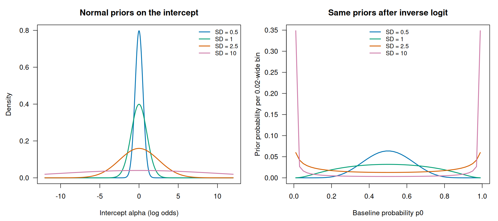

### 8.5 R / Python example: calculate the moments by simulation

::: {.panel-tabset}
### R
```{r}
set.seed(809)
B <- 200000L
prior_p <- plogis(rnorm(B, 0, 1))
c(mean = mean(prior_p), median = median(prior_p), 
  sd = sd(prior_p), extreme = mean(prior_p < 0.01 | prior_p > 0.99))
```

### Python
```python
import numpy as np
from scipy.special import expit

np.random.seed(809)
B = 200000
prior_p = expit(np.random.normal(0, 1, B))
print(f"Mean: {np.mean(prior_p):.4f}, Median: {np.median(prior_p):.4f}")
print(f"SD: {np.std(prior_p):.4f}, Extreme: {np.mean((prior_p < 0.01) | (prior_p > 0.99)):.6f}")
```
:::

### 8.6 Probability variance versus predictive count variance

Distinguish uncertainty about a probability, $\operatorname{Var}(p_0)$, from conditional event variance, $\operatorname{Var}(Y\mid p_0)=p_0(1-p_0)$. If $K\mid p_0\sim\mathrm{Binomial}(N,p_0)$, the law of total variance gives:

$$
\operatorname{Var}(K) = N\mu(1-\mu)+N(N-1)\operatorname{Var}(p_0).
$$

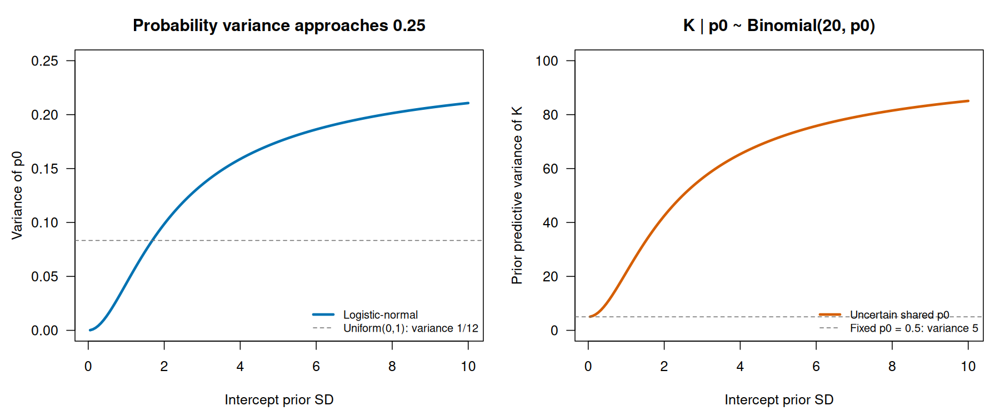

### 8.7 Interactive simulator: prior, data, and posterior

<div class="a09-simulator" data-mode="intercept">
<p>Open <a href="A09.html#interactive-simulator-prior-data-and-posterior">the local Quarto HTML</a> to use the simulator. Markdown previews may not execute JavaScript.</p>
</div>

### Walkthrough 1A — Step 3: Simulate the probability implications of intercept priors {#a09-walkthrough-1a-8}

**Question in Problem 1A:** What does a wider intercept prior imply for probabilities before data are observed?

Draw intercepts with mean zero and three different standard deviations, then transform each draw with the inverse logit.

```{r a09-walkthrough-1a-8}
#| eval: false
set.seed(9108)
prior_moments<-t(sapply(c(.5,1,2),function(sd) {
  probability<-plogis(rnorm(50000,0,sd))
  c(mean=mean(probability),variance=var(probability),
    lo90=unname(quantile(probability,.05)),hi90=unname(quantile(probability,.95)))
}))
rownames(prior_moments)<-c("alpha_SD_0.5","alpha_SD_1","alpha_SD_2")
print(round(prior_moments,4))
```

**Executed result:**

```text
mean variance   lo90   hi90
alpha_SD_0.5 0.4992   0.0142 0.3044 0.6950
alpha_SD_1   0.5000   0.0432 0.1622 0.8360
alpha_SD_2   0.5007   0.0986 0.0360 0.9643
```

**Read the result.** All three induced probability means are close to 0.5, but the probability variance rises from about 0.014 to 0.099. The widest prior's central 90% range extends from roughly 0.036 to 0.964. A wide prior on the logit scale is a strong statement about possible event probabilities.

[Return to the Problem 1A walkthrough](#a09-problem1a-walkthrough).


---

## 9. Priors on logistic slopes

**[Problem 1A — Event probabilities](#a09-problem-map).** Choose slope priors on a declared predictor scale and examine the probability curves they imply.

### 9.1 A slope prior needs a reference distance

For $\operatorname{logit}(p(x))=\alpha+\beta x$, a change $\Delta x$ multiplies odds by $e^{\beta\Delta x}$. A prior on $\beta$ therefore depends on the units of $x$ (e.g. standard deviations vs. natural units).

### 9.2 Calibrate a scale using plausible odds ratios

Let $\beta\sim\mathrm{Normal}(0,s_\beta)$. A central 95% interval for the one-unit odds ratio is $[e^{-1.96s_\beta},e^{1.96s_\beta}]$. If odds ratios between $1/2$ and 2 cover 95% of plausible effects, choose $s_\beta=\log(2)/1.96\approx0.354$.

### 9.3 Display: coefficient moments and odds-ratio moments

| $s_\beta$ | $\operatorname{Var}(\beta)$ | $\operatorname{median}(e^\beta)$ | $\mathbb E[e^\beta]$ | Central 95% odds-ratio interval |
| --- | --- | --- | --- | --- |
| 0.25 | 0.0625 | 1 | 1.032 | [0.613, 1.632] |
| 0.50 | 0.2500 | 1 | 1.133 | [0.375, 2.664] |
| 1.00 | 1.0000 | 1 | 1.649 | [0.141, 7.099] |
| 2.00 | 4.0000 | 1 | 7.389 | [0.020, 50.397] |

### 9.4 Combine the intercept and slope before inspecting probabilities

Consider independent priors $\alpha\sim\mathrm{Normal}(\operatorname{logit}(0.1),0.5)$ and $\beta\sim\mathrm{Normal}(0,s_\beta)$. At fixed $x$, their linear combination has variance $0.5^2+x^2s_\beta^2$. Farther away from $x=0$, a wider slope prior produces more extreme probability predictions.

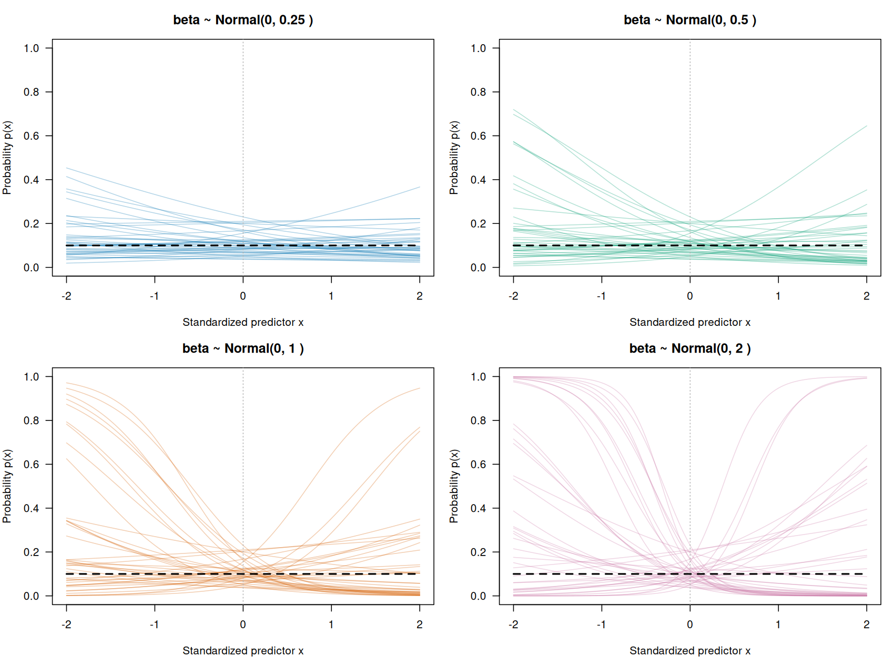

### 9.5 R example: moments of a probability change

```{r}
set.seed(909)
B <- 200000L
alpha <- rnorm(B, qlogis(0.1), 0.5)
beta <- 0.5 * rnorm(B)
p0 <- plogis(alpha)
p1 <- plogis(alpha + beta)
delta <- p1 - p0
c(mean_change = mean(delta), sd_change = sd(delta))
```

### 9.6 A practical workflow and reproducible displays

1. Define the outcome, opportunities, and reference values.
2. Choose plausible baseline probabilities (intercept prior).
3. Calibrate slopes using plausible odds ratios.
4. Draw full probability curves (Prior Predictive Checks).
5. Assess sensitivity.

Reproduce all displayed tables and figures from the repository root with:
```bash
Rscript --vanilla scripts/A09_prior_moments.R
```

### 9.7 Interactive simulator: logistic regression

<div class="a09-simulator" data-mode="regression">
<p>Open <a href="A09.html#interactive-simulator-logistic-regression">the local Quarto HTML</a> to use the simulator.</p>
</div>

### Walkthrough 1A — Step 4: Combine intercept and slope priors before reading an effect {#a09-walkthrough-1a-9}

**Question in Problem 1A:** How do intercept and slope uncertainty jointly affect a comparison between x = 0 and x = 1?

Use the same joint prior draw in both predictions. Summarizing exp(beta) alone describes odds multipliers, not probability changes.

```{r a09-walkthrough-1a-9}
#| eval: false
set.seed(9109)
a<-rnorm(50000,0,1);b<-rnorm(50000,0,1)
prior_difference<-plogis(a+b)-plogis(a)
print(round(rbind(Probability_change_0_to_1=a09_summary(prior_difference),
                  Odds_multiplier=a09_summary(exp(b))),3))
```

**Executed result:**

```text
mean   lo90  hi90
Probability_change_0_to_1 0.000 -0.315 0.314
Odds_multiplier           1.659  0.193 5.214
```

**Read the result.** The prior probability change is centered near zero with a broad interval of about −0.315 to +0.314. The mean odds multiplier is about 1.66 even though the slope prior is centered at zero, because exponentiation is nonlinear. These are prior implications, not evidence of a positive effect.

[Return to the Problem 1A walkthrough](#a09-problem1a-walkthrough).


---

## 10. Sequential logistic updating

**[Problem 1A — Event probabilities](#a09-problem-map).** Hold the prior fixed and watch successive outcomes update the distribution of plausible curves.

### 10.1 Purpose: watch the prior become a posterior

How does observing successive successes and failures change beliefs? The script `09_binomial_GLMs.r` demonstrates this with a simulated experiment.

### 10.2 First generate data using known parameter values

The generator chooses fixed coefficients $\alpha_{\mathrm{true}}=-1$ and $\beta_{\mathrm{true}}=1$.
The script generates $x_i \sim \mathrm{Uniform}(-2,2)$ and outcomes $Y_i\sim\mathrm{Bernoulli}(\operatorname{logit}^{-1}(-1+x_i))$.

::: {.panel-tabset}
### R (Simulation)
```{r}
set.seed(42)
N <- 20
x <- runif(N, -2, 2)
alpha_true <- -1; beta_true <- 1
p_true <- plogis(alpha_true + beta_true * x)
y <- rbinom(N, 1, p_true)
```

### Python (Simulation)
```python
import numpy as np
from scipy.special import expit

np.random.seed(42)
N = 20
x = np.random.uniform(-2, 2, N)
alpha_true, beta_true = -1, 1
p_true = expit(alpha_true + beta_true * x)
y = np.random.binomial(1, p_true)
```
:::

### 10.3 Then reveal the observations one at a time

At step $t$, Bayesian updating gives:

$$
\pi_t(\alpha,\beta) \propto \pi_{t-1}(\alpha,\beta) \left[p_t(\alpha,\beta)\right]^{y_t} \left[1-p_t(\alpha,\beta)\right]^{1-y_t}
$$

### 10.4 Read the two views of the animation together

| View | What changes as data arrive? | What to look for |
|---|---|---|
| Coefficient space $(\alpha,\beta)$ | The joint posterior shifts and changes shape | Which combinations remain plausible and coefficient correlation |
| Probability space $p(x)$ | Posterior draws become a family of logistic curves | Which probabilities are supported by observations |

### 10.5 Interactive experiment: generate, reveal, and learn

<div class="a09-simulator" data-mode="sequential">
<p>Open <a href="A09.html#interactive-experiment-generate-reveal-and-learn">the local Quarto HTML</a> to run this experiment.</p>
</div>

### Walkthrough 1A — Step 5: Update the same sample sequentially {#a09-walkthrough-1a-10}

**Question in Problem 1A:** How do more observations update the same prior about the same generating coefficients?

Reveal prefixes of the one dataset from step 1: zero, 10, 40, then 120 observations. Each fit uses independent Normal(0,1) priors on alpha and beta. The helper evaluates their two-dimensional posterior on a grid.

```{r a09-walkthrough-1a-10}
#| eval: false
set.seed(9110)
seen<-c(0,10,40,120)
fits<-lapply(seen,function(n) a09_regression(x[seq_len(n)],y[seq_len(n)]))
posterior<-lapply(fits,a09_draw)
learning<-do.call(rbind,lapply(seq_along(seen),function(j)
  data.frame(observed=seen[j],parameter=c("alpha","beta"),
    t(vapply(posterior[[j]],a09_summary,numeric(3))))))
print(round_table<-transform(learning,mean=round(mean,3),lo90=round(lo90,3),hi90=round(hi90,3)),
      row.names=FALSE)
post<-posterior[[length(seen)]]
fine<-a09_regression(x,y,agrid=seq(-7,7,length.out=401),bgrid=seq(-6,6,length.out=401))
mean_coef<-function(f) colSums(f$parameters*f$mass)
stopifnot(max(abs(mean_coef(fits[[4]])-mean_coef(fine)))<.001)
cat("PASS: posterior means stable within 0.001 after doubling grid resolution.\n")
```

**Executed result:**

```text
observed parameter   mean  lo90  hi90
        0     alpha -0.002 -1.68  1.68
        0      beta  0.006 -1.62  1.68
       10     alpha -0.360 -1.33  0.56
       10      beta  0.353 -0.54  1.26
       40     alpha -0.855 -1.47 -0.28
       40      beta  0.792  0.24  1.38
      120     alpha -0.824 -1.19 -0.49
      120      beta  0.866  0.54  1.20
PASS: posterior means stable within 0.001 after doubling grid resolution.
```

**Read the result.** With no data the summaries reproduce the priors. At 120 observations the posterior means are about −0.82 for alpha and 0.87 for beta, compared with generating values −1 and 1. In this run uncertainty narrows as observations accumulate; monotonic narrowing or exact recovery is not guaranteed in every sample. Doubling grid resolution checks the numerical mean estimates.

[Return to the Problem 1A walkthrough](#a09-problem1a-walkthrough).


---

## 11. Interpreting Coefficients on the log-odds scale {#coefficients-on-the-log-odds-scale}

**[Problem 1A — Event probabilities](#a09-problem-map).** Translate learned coefficients from log odds into odds ratios and probability changes.

### 11.1 Purpose: interpret the coefficients we have just learned

A logistic coefficient is measured on the log-odds scale, so it cannot be read directly as a change in probability.

$$
\operatorname{logit}(p(x))=\alpha+\beta x
$$

### 11.2 Follow the change through the three scales

Compare $x_0$ and $x_1=x_0+1$.

1. Additive change in log odds: $\operatorname{logit}(p_1)-\operatorname{logit}(p_0) = \beta$
2. Multiplicative change in odds (Odds Ratio): $\frac{p_1/(1-p_1)}{p_0/(1-p_0)} = e^\beta$
3. Additive change in probability: $\Delta p = \operatorname{logit}^{-1}(\alpha+\beta x_1) - \operatorname{logit}^{-1}(\alpha+\beta x_0)$

### 11.3 A concrete example: doubling the odds

If $\beta=\log 2\approx0.693$, a one-unit increase in $x$ doubles the odds.
If starting probability is $p_0=0.10$, odds are $1/9$. Doubling gives odds $2/9$, translating to $p_1=2/11\approx0.1818$.
The probability increases by **8.18 percentage points**, not a doubling to 20%.

$$
p_1=\frac{R p_0}{1-p_0+R p_0} \quad \text{(where } R=e^\beta \text{)}
$$

### 11.4 Apply the interpretation to posterior draws

For each joint posterior draw $(\alpha^{(s)},\beta^{(s)})$, compute $e^{\beta^{(s)}}$, $p_0^{(s)}$, and $p_1^{(s)}$. Summarize these derived distributions. Exponentiating a posterior mean does *not* give the posterior mean odds ratio.

### 11.5 Interactive interpretation: one coefficient, three scales

<div class="a09-simulator" data-mode="interpretation">
<p>Open <a href="A09.html#interactive-interpretation-one-coefficient-three-scales">the local Quarto HTML</a> to use the coefficient interpreter.</p>
</div>

---

## 12. Absolute and relative effects

**[Problem 1A — Event probabilities](#a09-problem-map).** Choose an absolute or relative contrast that answers the intended scientific question.

### 12.1 Concrete examples: what do the three quantities mean?

Suppose a campaign takes purchase probability from $p_0=0.10$ to $p_1=0.20$. For 1,000 customers:

- **Probability difference (Risk Difference, $\Delta p = 0.10$)**: +100 expected buyers. (Actionable for capacity planning).
- **Probability ratio (Risk Ratio, $RR = 2$)**: Probability doubles. (Relative magnitude).
- **Odds ratio ($OR = 2.25$)**: Odds of buying versus not buying multiply by 2.25. (Coefficient scale).

> [!IMPORTANT]
> **Why the baseline matters**
> Moving from 1% to 2% is a Risk Ratio of 2 (just like 10% to 20%), but yields only +10 buyers per 1000 instead of +100. Reporting only relative ratios hides the practical magnitude of the effect.

### 12.2 Purpose: choose the scale that answers the scientific question

| Quantity | Definition | Question answered |
|---|---|---|
| Probability difference | $p_1-p_0$ | How many additional events per opportunity are expected? |
| Probability ratio | $p_1/p_0$ | How many times as probable is the event? |
| Odds ratio | $[p_1/(1-p_1)]/[p_0/(1-p_0)]$ | By what factor do the odds change? |

### 12.3 The same odds ratio at four baselines

For $\beta=\log 2$ ($OR=2$):

| $p_0$ | $p_1$ | Absolute change | Probability ratio | Odds ratio |
|---|---|---|---|---|
| 1% | 1.98% | +0.98 pp | 1.980 | 2 |
| 10% | 18.18% | +8.18 pp | 1.818 | 2 |
| 50% | 66.67% | +16.67 pp | 1.333 | 2 |
| 90% | 94.74% | +4.74 pp | 1.053 | 2 |

### 12.4 Carry uncertainty through the contrast

For each joint posterior draw $s$, compute the scenario probabilities and then their contrasts:

$$
\Delta^{(s)}=p_1^{(s)}-p_0^{(s)},\qquad
RR^{(s)}=\frac{p_1^{(s)}}{p_0^{(s)}},\qquad
OR^{(s)}=\frac{p_1^{(s)}/(1-p_1^{(s)})}{p_0^{(s)}/(1-p_0^{(s)})}.
$$

::: {.panel-tabset}
### R (Posterior contrasts)
```{r}
# Assuming 'post' is a data frame of posterior draws for a and b
post$p0 <- plogis(post$a)
post$p1 <- plogis(post$a + post$b)

post$RD <- post$p1 - post$p0
post$RR <- post$p1 / post$p0
post$OR <- exp(post$b)

# Summarize with HPDI
PI(post$RD, prob = 0.89)
```

### Python (PyMC)
```python
import pymc as pm
import numpy as np

# Assuming trace from a PyMC model
a_draws = trace.posterior['a'].values.flatten()
b_draws = trace.posterior['b'].values.flatten()

p0 = expit(a_draws)
p1 = expit(a_draws + b_draws)

RD = p1 - p0
RR = p1 / p0
OR = np.exp(b_draws)

# Summarize
print("RD 89% HPDI:", pm.stats.hdi(RD, hdi_prob=0.89))
```
:::

Summarize the resulting draw distributions rather than subtracting interval endpoints or dividing posterior means. The choice of contrast and target population defines the **estimand**.

### Walkthrough 1A — Step 6: Read posterior probability contrasts and predictions {#a09-walkthrough-1a-12}

**Question in Problem 1A:** What does the fitted change from x = 0 to x = 1 mean on three different scales?

Transform each joint posterior draw into both scenario probabilities before computing differences or ratios. The additional prediction concerns 100 new opportunities at x = 1.

```{r a09-walkthrough-1a-12}
#| eval: false
p0<-plogis(post$alpha);p1<-plogis(post$alpha+post$beta)
contrasts<-cbind(Probability_difference=p1-p0,Probability_ratio=p1/p0,
                 Odds_ratio=exp(post$beta))
print(round(t(apply(contrasts,2,a09_summary)),3))
set.seed(9112)
future<-rbinom(nrow(post),100,p1)
print(round(rbind(Expected_events=a09_summary(100*p1),
                  Future_events=a09_summary(future)),2))
out<-a09_output("1a")
write.csv(learning,file.path(out,"learning.csv"),row.names=FALSE)
png(file.path(out,"learning.png"),width=1200,height=600,res=130)
par(mfrow=c(1,2),mar=c(5,4,3,1))
xx<-seq(-2,2,length.out=81)
curve<-sapply(xx,function(v) plogis(post$alpha+post$beta*v))
band<-apply(curve,2,quantile,c(.05,.95))
plot(xx,colMeans(curve),type="l",ylim=c(0,1),xlab="Predictor x",ylab="Event probability",
 main="Posterior curve and simulation truth",lwd=2)
polygon(c(xx,rev(xx)),c(band[1,],rev(band[2,])),col=adjustcolor("steelblue",.2),border=NA)
lines(xx,colMeans(curve),lwd=2);lines(xx,plogis(alpha_true+beta_true*xx),col="firebrick",lty=2)
legend("topleft",c("Posterior mean","Generating probability"),lty=c(1,2),
 col=c("black","firebrick"),bty="n")
hist(100*(p1-p0),breaks=30,col="lightblue",border="white",
 main="Change from x = 0 to x = 1",xlab="Probability difference (percentage points)")
abline(v=0,lty=2);invisible(dev.off())
```

**Executed result:**

```text
mean  lo90  hi90
Probability_difference 0.203 0.126 0.284
Probability_ratio      1.684 1.374 2.073
Odds_ratio             2.428 1.716 3.320
                 mean  lo90  hi90
Expected_events 51.04 41.34 60.59
Future_events   51.03 38.00 64.00
```

**Read the result.** The mean probability increase is about 20.3 percentage points, the mean probability ratio about 1.68, and the mean odds ratio about 2.43. They summarize the same modeled comparison differently. The interval for a future event count is wider than that for its expected count because it adds observation noise. The curve's 90% band is pointwise, not a simultaneous band.

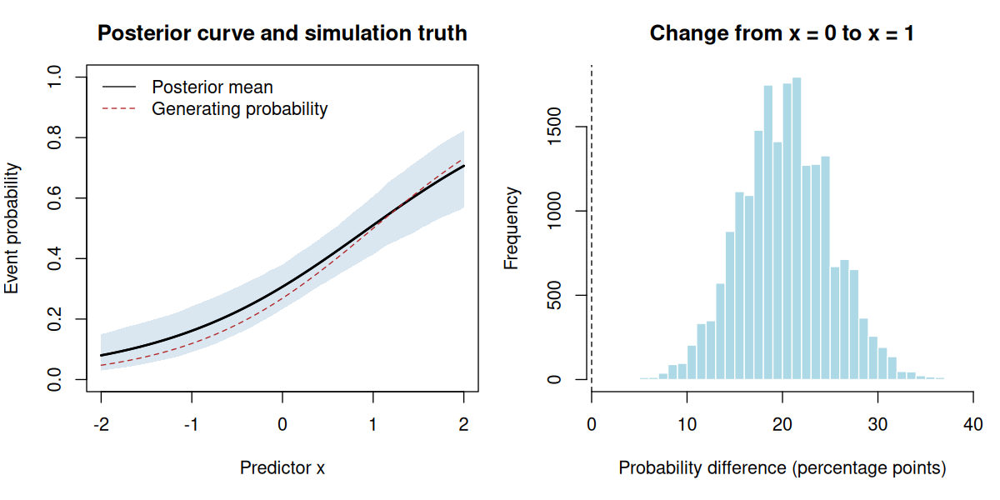

[Return to the Problem 1A walkthrough](#a09-problem1a-walkthrough).


---


## 13. The admissions variables

**[Problem 1B — Comparable groups](#a09-problem-map).** Introduce the applications, categories, and departments needed to distinguish the possible comparisons.

We now use the logistic machinery to investigate a concrete question: **if admission rates differ between two groups, what exactly are we comparing?** The groups may apply to different departments, with different levels of selectivity. Estimating probabilities is only the first part of this problem; deciding which comparison to make is the second.

Use the following notation throughout sections 13–22:

| Symbol | Meaning |
|---|---|
| $A_i$ | Admission outcome, 0 or 1, for application $i$ |
| $G_i$ | Perceived gender category, indexed by 1 or 2 |
| $D_i$ | Department receiving the application |
| $N_{gd}$ | Number of applications in category $g$, department $d$ |
| $A_{gd}$ | Admissions in that cell: a count |
| $p_{gd}$ | Conditional admission probability for that cell |

The observation model remains Bernoulli for individual applications or binomial for suitably aggregated cells:

$$ A_i\sim\mathrm{Bernoulli}(p_i),\qquad A_{gd}\sim\mathrm{Binomial}(N_{gd},p_{gd}). $$

### Walkthrough 1B: the executable path {#a09-problem1b-walkthrough}

Use [A09_problem1b_walkthrough.R](../scripts/A09_problem1b_walkthrough.R) in a fresh R session from the repository root. Follow the steps below in order. Their variables belong to this walkthrough; the other examples in the lesson are separate.

| Step | Particular task | Code and result in the lesson |
|---|---|---|
| 1 | Distinguish the small teaching example from real admissions | [Section 14](#a09-walkthrough-1b-14) |
| 2 | Fit the twelve observed gender-department cells | [Section 15](#a09-walkthrough-1b-15) |
| 3 | Standardize both categories to the same department population | [Section 18](#a09-walkthrough-1b-18) |
| 4 | Check predictions while preserving cell labels and denominators | [Section 22](#a09-walkthrough-1b-22) |


---

## 14. Total admission contrast

**[Problem 1B — Comparable groups](#a09-problem-map).** Start with the overall disparity while retaining each category's observed application composition.

### 14.1 First question: what is the overall admission disparity?

Begin with each group's admissions and applications, without distinguishing departments. Let $A_g$ be admissions among $N_g$ applications in group $g$. A first model is:

$$ A_g\sim\mathrm{Binomial}(N_g,p_g),\qquad \operatorname{logit}(p_g)=\alpha_g,\qquad \alpha_g\sim\mathrm{Normal}(0,1.5). $$

For each posterior draw, calculate:

$$ \Delta_{\mathrm{aggregate}}^{(s)} = \operatorname{logit}^{-1}(\alpha_1^{(s)}) - \operatorname{logit}^{-1}(\alpha_2^{(s)}). $$

This comparison retains each group's **own observed application composition**.

### 14.2 A small example to follow through the next sections

These numbers are invented for explanation:

| Department | Category 1: admit / apply | Rate | Category 2: admit / apply | Rate |
|---|---|---|---|---|
| More selective | 16 / 80 | 20% | 2 / 20 | 10% |
| Less selective | 16 / 20 | 80% | 56 / 80 | 70% |
| All departments | 32 / 100 | 32% | 58 / 100 | 58% |

The raw overall difference is $0.32-0.58=-0.26$: category 1 has a 26-percentage-point lower admission rate. But category 1 sends most applications to the more selective department.

### 14.3 Reproduce the aggregate comparison with `UCBadmit`

::: {.panel-tabset}
### R (rethinking)
```{r}
library(rethinking)
data(UCBadmit)
d <- UCBadmit
d$gid <- ifelse(d$applicant.gender == "male", 1, 2)

# Aggregate model (m11.7 in the book)
m11.7 <- ulam(
    alist(
        admit ~ dbinom(applications, p),
        logit(p) <- a[gid],
        a[gid] ~ dnorm(0, 1.5)
    ), data = d, chains = 4, cores = 4)

post1 <- extract.samples(m11.7)
diff_a <- plogis(post1$a[,1]) - plogis(post1$a[,2])
PI(diff_a) # Shows males have ~14% higher admission rate globally
```

### Python (PyMC)
```python
import pymc as pm
import pandas as pd
from scipy.special import expit
import numpy as np

# Load UCBadmit equivalently
d = pd.read_csv('data/UCBadmit.csv')
d['gid'] = np.where(d['applicant.gender'] == 'male', 0, 1)

with pm.Model() as m11_7:
    a = pm.Normal('a', 0, 1.5, shape=2)
    p = pm.math.invlogit(a[d['gid']])
    pm.Binomial('admit', n=d['applications'], p=p, observed=d['admit'])
    trace_7 = pm.sample(1000)

a_post = trace_7.posterior['a'].values.reshape(-1, 2)
diff_a = expit(a_post[:,0]) - expit(a_post[:,1])
print(f"Mean Difference: {np.mean(diff_a):.3f}")
```
:::

### Walkthrough 1B — Step 1: Distinguish the small teaching example from real admissions {#a09-walkthrough-1b-14}

**Question in Problem 1B:** How does the simple composition example lead into the real admissions data?

First reproduce the invented category-1-minus-category-2 example. Then explicitly change to the real UCB table: category 1 = male, category 2 = female. This follows the preceding UCB code. It is the opposite reporting orientation from the later female-minus-male grant laboratory.

```{r a09-walkthrough-1b-14}
#| eval: false
source("scripts/A09_walkthrough_helpers.R")
# Invented two-department example, retaining category 1 minus category 2.
print(data.frame(comparison=c("Overall","Within either department","Common 50:50 mix"),
  difference=c(.32-.58,.20-.10,.5*(.20+.80)-.5*(.10+.70))),row.names=FALSE)
# Real UCB counts in base R; now category 1 = male, category 2 = female.
tab<-as.data.frame(UCBAdmissions)
cells<-aggregate(Freq~Gender+Dept,tab,sum);names(cells)[3]<-"applications"
admitted<-tab[tab$Admit=="Admitted",]
cells$admitted<-admitted$Freq[match(paste(cells$Gender,cells$Dept),paste(admitted$Gender,admitted$Dept))]
cells$gid<-ifelse(cells$Gender=="Male",1,2)
cells<-cells[order(cells$Dept,cells$gid),]
keys<-paste(cells$gid,cells$Dept,sep="_")
ids<-levels(cells$Dept)
i1<-match(paste(1,ids,sep="_"),keys);i2<-match(paste(2,ids,sep="_"),keys)
totals<-aggregate(cbind(admitted,applications)~gid,cells,sum)
totals$rate<-totals$admitted/totals$applications
print(totals,digits=4,row.names=FALSE)
set.seed(9214)
aggregate_fit<-a09_cells(totals$admitted,totals$applications,prior_sd=1.5)
aggregate_difference<-aggregate_fit$draws[,1]-aggregate_fit$draws[,2]
cat("Aggregate posterior (male minus female), percentage points:\n")
print(round(100*a09_summary(aggregate_difference),2))
```

**Executed result:**

```text
comparison difference
                  Overall      -0.26
 Within either department       0.10
         Common 50:50 mix       0.10
 gid admitted applications   rate
   1     1198         2691 0.4452
   2      557         1835 0.3035
Aggregate posterior (male minus female), percentage points:
 mean  lo90  hi90 
14.17 11.80 16.52
```

**Read the result.** The invented example gives −26 points overall but +10 within either department. For real UCB admissions, male and female observed rates are about 44.5% and 30.4%; the aggregate Normal(0,1.5)-logit model estimates a male-minus-female gap near +14.17 points. These are different datasets, not conflicting calculations on one table.

[Return to the Problem 1B walkthrough](#a09-problem1b-walkthrough).


---

## 15. Department-specific model

**[Problem 1B — Comparable groups](#a09-problem-map).** Compare categories within the same department.

### 15.1 Second question: what happens within the same department?

Allow admission probability to depend on both category and department:

$$ A_{gd}\sim\mathrm{Binomial}(N_{gd},p_{gd}),\qquad \operatorname{logit}(p_{gd})=\alpha_{gd},\qquad \alpha_{gd}\sim\mathrm{Normal}(0,1.5). $$

Within department $d$, calculate:

$$ \Delta_d^{(s)}=\operatorname{logit}^{-1}(\alpha_{1d}^{(s)}) - \operatorname{logit}^{-1}(\alpha_{2d}^{(s)}). $$

In the illustrative table, the raw differences are $+0.10$ in the more selective department and $+0.10$ in the less selective one. Category 1 has a higher rate **within both departments**.

### 15.2 Fit the department model on `UCBadmit`

::: {.panel-tabset}
### R (rethinking)
```{r}
d$dept_id <- as.integer(as.factor(d$dept))

# Department model (m11.8 in the book)
m11.8 <- ulam(
    alist(
        admit ~ dbinom(applications, p),
        logit(p) <- a[gid, dept_id],
        matrix[gid, dept_id]:a ~ dnorm(0, 1.5)
    ), data = d, chains = 4, cores = 4)

post2 <- extract.samples(m11.8)
# Compute within-department differences (Male - Female)
diff_dept <- sapply(1:6, function(i) plogis(post2$a[,1,i]) - plogis(post2$a[,2,i]))
apply(diff_dept, 2, mean) # Mostly near 0, except dept A (favors females)
```

### Python (PyMC)
```python
d['dept_id'] = pd.factorize(d['dept'])[0]

with pm.Model() as m11_8:
    a = pm.Normal('a', 0, 1.5, shape=(2, 6))
    p = pm.math.invlogit(a[d['gid'], d['dept_id']])
    pm.Binomial('admit', n=d['applications'], p=p, observed=d['admit'])
    trace_8 = pm.sample(1000)

a_post2 = trace_8.posterior['a'].values.reshape(-1, 2, 6)
diff_dept = expit(a_post2[:,0,:]) - expit(a_post2[:,1,:])
print("Mean Diff per Dept:", np.mean(diff_dept, axis=0))
```
:::

### Walkthrough 1B — Step 2: Fit the twelve observed gender-department cells {#a09-walkthrough-1b-15}

**Question in Problem 1B:** How do the real categories compare within each of the six departments?

Fit one independent cell logit with a Normal(0,1.5) prior for each gender–department pair. The grid helper returns probabilities in the declared cell order.

```{r a09-walkthrough-1b-15}
#| eval: false
set.seed(9215)
f<-a09_cells(cells$admitted,cells$applications,prior_sd=1.5)
p_draw<-f$draws
within<-p_draw[,i1]-p_draw[,i2];colnames(within)<-ids
print(round(100*t(apply(within,2,a09_summary)),2))
finer<-a09_cells(cells$admitted,cells$applications,prior_sd=1.5,step=.005,S=10)
stopifnot(max(abs(f$mean-finer$mean))<1e-6)
```

**Executed result:**

```text
mean   lo90   hi90
A -19.72 -26.07 -12.75
B  -3.68 -18.05  12.04
C   2.87  -2.55   8.39
D  -1.88  -7.37   3.67
E   3.92  -2.39  10.34
F  -1.16  -4.26   1.91
```

**Read the result.** Department A has a substantial negative male-minus-female contrast (about −19.7 points). The other department intervals span zero in this fit. The group with the higher aggregate rate need not have the higher rate within every department. An adjusted association is not automatically a causal effect.

[Return to the Problem 1B walkthrough](#a09-problem1b-walkthrough).


---

## 16. Simpson-type aggregation reversal

**[Problem 1B — Comparable groups](#a09-problem-map).** Explain how different compositions can reverse the sign of an aggregate comparison.

### 16.1 The overall rate mixes probabilities with application weights

Let $w_{d\mid g}=\Pr(D=d\mid G=g)$ be the share of category $g$'s applications sent to department $d$. Then:

$$ p_g=\Pr(A=1\mid G=g)=\sum_d p_{gd}w_{d\mid g}. $$

Category 1's within-department advantage is outweighed in the aggregate by its concentration in the more selective department.

### 16.2 What the reversal establishes

> [!WARNING]
> **Simpson's Paradox**
> This is a Simpson-type reversal: an aggregate comparison has a different sign from the within-department comparisons. Both calculations are arithmetically correct; they simply describe different mixtures. The paradox disappears once we formally declare our causal assumptions and target estimand.

---

## 17. Total versus direct effect

**[Problem 1B — Comparable groups](#a09-problem-map).** Decide which pathways belong in the question.

### 17.1 Decide whether the pathway through department belongs in the question

Suppose the scientific story is:

$$ G\longrightarrow D\longrightarrow A,\qquad G\longrightarrow A. $$

Department is a **mediator**. A total effect includes the pathway through department. A controlled direct comparison holds department fixed.

> [!IMPORTANT]
> **Causal Interpretation & DAGs**
> Suppose unmeasured applicant strength $U$ affects department choice and admission ($G\rightarrow D\leftarrow U\rightarrow A$). Here department is a **collider**. Conditioning on it can open a noncausal association through $U$. Adjusting for a variable does not automatically identify a causal effect without a DAG justification.

---

## 18. Standardized direct contrast

**[Problem 1B — Comparable groups](#a09-problem-map).** Construct one comparison using the same department weights for both categories.

### 18.1 Third question: what if both groups had the same department composition?

Choose weights $w_d\ge0$ with $\sum_d w_d=1$. Use these **same weights** for both categories. For each posterior draw:

$$ \overline p_1^{(s)}=\sum_d w_d p_{1d}^{(s)},\qquad \overline p_2^{(s)}=\sum_d w_d p_{2d}^{(s)}, $$
$$ \Delta_{\mathrm{std}}^{(s)}=\overline p_1^{(s)}-\overline p_2^{(s)}. $$

### 18.2 Calculate the standardized contrast (Marginalization)

::: {.panel-tabset}
### R (Standardized Direct Effect)
```{r}
# Marginalize using the global department application weights
w_dept <- tapply(d$applications, d$dept_id, sum) / sum(d$applications)

# Calculate expected probability for each gender, fixing dept composition
p_male_std <- sapply(1:6, function(i) plogis(post2$a[,1,i]) * w_dept[i])
p_female_std <- sapply(1:6, function(i) plogis(post2$a[,2,i]) * w_dept[i])

diff_std <- rowSums(p_male_std) - rowSums(p_female_std)
mean(diff_std) # The standardized effect
```

### Python (Standardized Direct Effect)
```python
w_dept = d.groupby('dept_id')['applications'].sum().values / d['applications'].sum()

p_male_std = expit(a_post2[:,0,:]) * w_dept
p_female_std = expit(a_post2[:,1,:]) * w_dept

diff_std = np.sum(p_male_std, axis=1) - np.sum(p_female_std, axis=1)
print(f"Standardized Diff: {np.mean(diff_std):.3f}")
```
:::

### Walkthrough 1B — Step 3: Standardize both categories to the same department population {#a09-walkthrough-1b-18}

**Question in Problem 1B:** What changes when both categories are placed in a common department distribution?

Retain each category's observed department mix for one contrast; use the same pooled mix for another. The separate aggregate model from step 1 is shown alongside the cell-model comparisons, so the model change is also visible.

```{r a09-walkthrough-1b-18}
#| eval: false
n1<-cells$applications[i1];n2<-cells$applications[i2]
w1<-n1/sum(n1);w2<-n2/sum(n2);w<-(n1+n2)/sum(n1+n2)
print(data.frame(department=ids,male=round(w1,3),female=round(w2,3),pooled=round(w,3)),
      row.names=FALSE)
comparisons<-cbind(Aggregate_model=aggregate_difference,
  Cell_model_own_mix=drop(p_draw[,i1]%*%w1-p_draw[,i2]%*%w2),
  Cell_model_pooled_mix=drop(within%*%w),Equal_departments=rowMeans(within))
print(round(100*t(apply(comparisons,2,a09_summary)),2))
# Raw own-mixture arithmetic must reproduce the observed aggregate rates.
stopifnot(abs(sum(w1*cells$admitted[i1]/n1)-totals$rate[1])<1e-12)
out<-a09_output("1b")
write.csv(t(apply(comparisons,2,a09_summary)),file.path(out,"ucb_contrasts.csv"))
z<-100*t(apply(comparisons,2,a09_summary))
png(file.path(out,"ucb_contrasts.png"),width=1150,height=600,res=130)
par(mar=c(5,11,3,1))
plot(z[,1],1:4,xlim=range(z[,2:3]),yaxt="n",ylab="",pch=19,
 main="Real admissions: different target comparisons",xlab="Male minus female (percentage points)")
axis(2,at=1:4,labels=rownames(z),las=1,cex.axis=.8)
segments(z[,2],1:4,z[,3],1:4,col="steelblue",lwd=3);points(z[,1],1:4,pch=19)
abline(v=0,lty=2);invisible(dev.off())
```

**Executed result:**

```text
department  male female pooled
          A 0.307  0.059  0.206
          B 0.208  0.014  0.129
          C 0.121  0.323  0.203
          D 0.155  0.204  0.175
          E 0.071  0.214  0.129
          F 0.139  0.186  0.158
                       mean  lo90  hi90
Aggregate_model       14.17 11.80 16.52
Cell_model_own_mix    14.15 11.99 16.31
Cell_model_pooled_mix -3.96 -6.86 -1.00
Equal_departments     -3.27 -6.45  0.04
```

**Read the result.** The cell-model own-composition contrast is about +14.15 points, while its pooled-composition contrast is about −3.96 points. Both use the same fitted cell probabilities: their weights differ. Equal department weighting produces another estimand, about −3.27 points with an interval reaching zero. The causal qualifications in section 17 still apply.

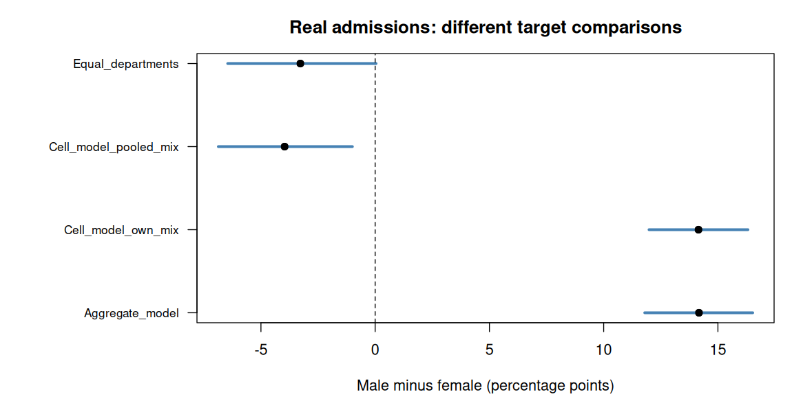

[Return to the Problem 1B walkthrough](#a09-problem1b-walkthrough).


---

## 19. Why weighting matters

**[Problem 1B — Comparable groups](#a09-problem-map).** Declare the target population instead of treating department weights as an arbitrary averaging choice.

Let $N_d$ denote the number of applications to department $d$. Define its target-population weight by $w_d = N_d / \sum_{k=1}^{6}N_k$.

The weighting distribution defines the target population. Equal department weighting, observed-application weighting, and a future-policy weighting answer different questions. The target distribution is part of the estimand.

---

## 20. Contrasts must be computed on the desired scale

**[Problem 1B — Comparable groups](#a09-problem-map).** Transform each scenario to probabilities before calculating the admission contrast.

A log-odds contrast is $\alpha_{1d}-\alpha_{2d}$. An odds ratio is $\exp(\alpha_{1d}-\alpha_{2d})$. A probability difference is $\mathrm{logit}^{-1}(\alpha_{1d}) - \mathrm{logit}^{-1}(\alpha_{2d})$.

> [!NOTE]
> **Scale of operation**
> $\mathrm{logit}^{-1} \left( \alpha_{1d}-\alpha_{2d} \right)$ is **NOT** the probability difference. The inverse link must be applied to each complete linear predictor *before* subtraction.

---

## 21. Posterior prediction for event models

**[Problem 1B — Comparable groups](#a09-problem-map).** Distinguish uncertainty about admission probabilities from variation in future admission counts.

For a posterior draw $s$, the expected event probability is $p_i^{(s)} = \mathrm{logit}^{-1} \left( \eta_i^{(s)} \right)$. A replicated binary event incorporates binomial sampling variation:

$$ Y_i^{\mathrm{rep},(s)} \sim \mathrm{Binomial} \left( N_i, p_i^{(s)} \right) $$

---

## 22. Posterior predictive checks for binomial models

**[Problem 1B — Comparable groups](#a09-problem-map).** Check whether the fitted binary-event model reproduces the patterns relevant to the admissions question.

### 22.1 Check replicated admissions in each cell

::: {.panel-tabset}
### R (Posterior Predictive Check)
```{r}
# Simulating posterior predictions using rethinking::sim
postcheck(m11.8)

# Manually replicating counts to get HPDI
p_draws <- link(m11.8)
y_rep <- sim(m11.8)
y_mean <- apply(y_rep, 2, mean)
y_pi <- apply(y_rep, 2, PI)

plot(d$admit, col="blue", pch=16, ylab="Admissions", xlab="Case (Dept x Gender)")
points(y_mean)
for(i in 1:length(y_mean)) lines(c(i,i), y_pi[,i])
```

### Python (Posterior Predictive Check)
```python
with m11_8:
    pm.sample_posterior_predictive(trace_8, extend_inferencedata=True)

y_rep = trace_8.posterior_predictive['admit'].values.reshape(-1, 12)
y_mean = np.mean(y_rep, axis=0)
y_hdi = pm.stats.hdi(y_rep, hdi_prob=0.89)

import matplotlib.pyplot as plt
plt.plot(d['admit'].values, 'bo', label='Observed')
plt.plot(y_mean, 'ko', label='Predicted Mean')
for i in range(len(y_mean)):
    plt.plot([i, i], y_hdi[i], 'k-')
plt.legend(); plt.show()
```
:::

This completes the main binary-event path. Section 23 revisits the likelihood assumptions before section 24 changes the outcome to event counts.

### Walkthrough 1B — Step 4: Check predictions while preserving cell labels and denominators {#a09-walkthrough-1b-22}

**Question in Problem 1B:** Does the cell model reproduce the admissions patterns that it was designed to describe?

Generate replicated counts at the observed application totals, preserving every gender–department identifier. Compare totals and individual cells.

```{r a09-walkthrough-1b-22}
#| eval: false
set.seed(9222)
y_rep<-vapply(seq_len(nrow(cells)),function(k)
 rbinom(nrow(p_draw),cells$applications[k],p_draw[,k]),numeric(nrow(p_draw)))
summary<-cbind(All=rowSums(y_rep),Male=rowSums(y_rep[,i1]),Female=rowSums(y_rep[,i2]))
observed<-c(sum(cells$admitted),sum(cells$admitted[i1]),sum(cells$admitted[i2]))
print(round(data.frame(observed,t(apply(summary,2,a09_summary))),1))
print(data.frame(department=cells$Dept,gender=cells$Gender,observed=cells$admitted,
  round(t(apply(y_rep,2,a09_summary)),1)),row.names=FALSE)
cat("No causal effect or within-cell calibration is established by this predictive check.\n")
```

**Executed result:**

```text
observed   mean lo90 hi90
All        1755 1757.7 1689 1827
Male       1198 1199.4 1145 1254
Female      557  558.2  516  601
 department gender observed  mean lo90 hi90
          A   Male      512 511.7  479  544
          A Female       89  88.3   79   97
          B   Male      353 352.7  326  379
          B Female       17  16.7   11   22
          C   Male      120 120.2  100  141
          C Female      202 202.4  176  230
          D   Male      138 138.2  116  160
          D Female      131 131.3  110  153
          E   Male       53  53.4   40   68
          E Female       94  94.5   75  115
          F   Male       22  23.1   13   35
          F Female       24  25.1   15   37
No causal effect or within-cell calibration is established by this predictive check.
```

**Read the result.** Observed totals are within the displayed predictive intervals, and fitted cell predictions remain close to their observed counts. With a separate parameter for every cell, this is a limited check: it does not establish independence within cells, applicant-level calibration, or causal identification.

[Return to the Problem 1B walkthrough](#a09-problem1b-walkthrough).


---


## 23. Maximum entropy and event likelihoods

**[Bridge — Choosing a likelihood](#a09-problem-map).** Before changing outcomes, examine why a likelihood follows from assumptions rather than from its name.

Chapter 10 motivates common likelihoods through constraints. For a discrete probability distribution $q$ over possible outcomes $y$, Shannon entropy is:

$$ H(q)=-\sum_y q(y)\log q(y). $$

For a binary trial, the expected value is fixed. The maximum-entropy distribution under these constraints is Bernoulli. For nonnegative counts generated from many rare opportunities, the Poisson distribution emerges as a natural event-count model.

::: {.panel-tabset}
### R (Maximum Entropy Simulation)
```{r}
# Simulating how Poisson emerges from max entropy for fixed mean = 5
p <- dpois(0:20, lambda = 5)
entropy <- -sum(p * log(p), na.rm = TRUE)
plot(0:20, p, type = "h", lwd = 5, col = "blue", 
     main = paste("Poisson PMF (mean=5)\nEntropy =", round(entropy, 3)),
     xlab = "Count", ylab = "Probability")
```
:::

---

## 24. Poisson event counts

**[Problem 2 — Counts and rates](#a09-problem-map).** Switch from admission success probabilities to event counts without a fixed trial maximum.

For observation $i$, a Poisson outcome uses a positive conditional mean $\lambda_i$ and satisfies $Y_i \sim \mathrm{Poisson}(\lambda_i)$ with $Y_i \in \{0,1,2,\ldots\}$.

$$ p(Y_i=y_i \mid \lambda_i) = \frac{ \lambda_i^{y_i} \exp(-\lambda_i) }{ y_i! } $$

$$ \mathbb{E}[Y_i \mid \lambda_i] = \mathrm{Var}(Y_i \mid \lambda_i) = \lambda_i $$

### Walkthrough 2: the executable path {#a09-problem2-walkthrough}

Use [A09_problem2_walkthrough.R](../scripts/A09_problem2_walkthrough.R) in a fresh R session from the repository root. Follow the steps below in order. Their variables belong to this walkthrough; the other examples in the lesson are separate.

| Step | Particular task | Code and result in the lesson |
|---|---|---|
| 1 | Translate a log link and simulate prior expected counts | [Section 25](#a09-walkthrough-2-25) |
| 2 | Inspect the actual Kline observation unit | [Section 29](#a09-walkthrough-2-29) |
| 3 | Fit four count models and compare numerical leave-one-out predictions | [Section 30–35](#a09-walkthrough-2-30) |
| 4 | Distinguish expected tool counts from replicated tool counts | [Section 30–35](#a09-walkthrough-2-34) |
| 5 | Read the innovation–loss model without claiming a new fit | [Section 36](#a09-walkthrough-2-36) |
| 6 | Quantify the rare-event approximation | [Section 37](#a09-walkthrough-2-37) |
| 7 | Compare counts with unequal exposures | [Section 38](#a09-walkthrough-2-38) |
| 8 | Make extra variation explicit | [Section 39](#a09-walkthrough-2-39) |


---

## 25. The log link

**[Problem 2 — Counts and rates](#a09-problem-map).** Connect an unconstrained predictor to a positive expected count using the log link.

The expected Poisson count must be positive ($\lambda_i>0$). The log link uses $\log(\lambda_i) = \eta_i$ so $\lambda_i = \exp(\eta_i)$.

For a linear predictor $\log(\lambda_i) = \alpha+\beta x_i$, the expected count is $\lambda_i = \exp(\alpha+\beta x_i)$. A one-unit increase in $x$ multiplies the expected count by $\exp(\beta)$.

### Walkthrough 2 — Step 1: Translate a log link and simulate prior expected counts {#a09-walkthrough-2-25}

**Question in Problem 2:** What range of expected counts is implied by the Poisson regression priors?

Draw alpha from Normal(3,0.5) and beta from Normal(0,0.2), the priors used in the Kline walkthrough. The predictor values −1, 0 and +1 are on the standardized log-population scale.

```{r a09-walkthrough-2-25}
#| eval: false
source("scripts/A09_walkthrough_helpers.R")
set.seed(9325)
a<-rnorm(30000,3,.5);b<-rnorm(30000,0,.2)
prior_table<-t(sapply(c(-1,0,1),function(x) a09_summary(exp(a+b*x))))
rownames(prior_table)<-c("x_minus_1","x_zero","x_plus_1")
print(round(prior_table,2))
cat("A slope log(1.2) multiplies the expected count by",exp(log(1.2)),"per predictor unit.\n")
```

**Executed result:**

```text
mean lo90  hi90
x_minus_1 23.14 8.33 48.22
x_zero    22.74 8.89 45.53
x_plus_1  23.25 8.26 48.88
A slope log(1.2) multiplies the expected count by 1.2 per predictor unit.
```

**Read the result.** The prior mean expected count is around 23 at these predictor values, with wide ranges. A slope log(1.2) multiplies the expected count by 1.2 per predictor unit; it does not add 1.2 tools. These are distributions of expected counts, before simulating count noise.

[Return to the Problem 2 walkthrough](#a09-problem2-walkthrough).


---

## 26. Probability link versus count link

**[Problem 2 — Counts and rates](#a09-problem-map).** Compare the new log link with the logit link.

Logistic regression maps an unconstrained predictor to $(0, 1)$. Poisson regression maps an unconstrained predictor to $(0, \infty)$. Both models use an unconstrained linear predictor but drastically different non-linear transformations.

---

## 27. Priors for Poisson intercepts

**[Problem 2 — Counts and rates](#a09-problem-map).** Choose a prior that produces plausible baseline counts.

A prior such as $\alpha \sim \mathrm{Normal}(0,10)$ permits astronomically large expected counts after exponentiation ($\exp(10) > 22000$).
A more grounded prior for the tool-count example is $\alpha \sim \mathrm{Normal}(3,0.5)$. This places the implied baseline count around $\exp(3) \approx 20$.

::: {.panel-tabset}
### R (Poisson Prior Simulation)
```{r}
set.seed(10)
a_bad <- rnorm(1000, 0, 10)
a_good <- rnorm(1000, 3, 0.5)

cat("Mean count (bad prior):", mean(exp(a_bad)), "\n")
cat("Mean count (good prior):", mean(exp(a_good)), "\n")
```

### Python (Poisson Prior Simulation)
```python
import numpy as np
np.random.seed(10)
a_bad = np.random.normal(0, 10, 1000)
a_good = np.random.normal(3, 0.5, 1000)

print(f"Mean count (bad prior): {np.mean(np.exp(a_bad)):.2f}")
print(f"Mean count (good prior): {np.mean(np.exp(a_good)):.2f}")
```
:::

---

## 28. Priors for Poisson slopes

**[Problem 2 — Counts and rates](#a09-problem-map).** Inspect multiplicative count changes across the predictor range.

A broad slope prior such as $\beta \sim \mathrm{Normal}(0,10)$ can imply explosive count curves. The official script uses a narrower prior $\beta \sim \mathrm{Normal}(0,0.2)$ for standardized log population.

---

## 29. The `Kline` data

**[Problem 2 — Counts and rates](#a09-problem-map).** Introduce tool counts, population, and contact.

The `Kline` dataset describes island societies:
- $T$: total number of tools
- $P$: standardized log population
- $C$: low- or high-contact category

The central scientific question is how expected technological complexity varies with population and contact.

### Walkthrough 2 — Step 2: Inspect the actual Kline observation unit {#a09-walkthrough-2-29}

**Question in Problem 2:** What does one row of the Kline analysis represent?

Load the dataset from rethinking and calculate the standardized log-population predictor explicitly. No posterior model has yet been fitted in this step.

```{r a09-walkthrough-2-29}
#| eval: false
data("Kline",package="rethinking")
d<-Kline
d$x<-as.numeric(scale(log(d$population)))
print(d[c("culture","population","contact","total_tools","x")],digits=3,row.names=FALSE)
cat("Observations:",nrow(d),"societies; tools:",sum(d$total_tools),"\n")
```

**Executed result:**

```text
culture population contact total_tools        x
   Malekula       1100     low          13 -1.29147
    Tikopia       1500     low          22 -1.08855
 Santa Cruz       3600     low          24 -0.51576
        Yap       4791    high          43 -0.32877
   Lau Fiji       7400    high          33 -0.04434
  Trobriand       8000    high          19  0.00667
      Chuuk       9200    high          40  0.09811
      Manus      13000     low          28  0.32432
      Tonga      17500    high          55  0.51880
     Hawaii     275000     low          71  2.32101
Observations: 10 societies; tools: 348
```

**Read the result.** There are only ten societies, with 348 tools counted across the rows. Population is a predictor, not a number of tool-production trials or an automatically justified exposure offset. Hawaii is far from most other observations on the population scale; this matters when evaluating prediction and influence.

[Return to the Problem 2 walkthrough](#a09-problem2-walkthrough).


---

## 30-35. Modeling the `Kline` data (Intercept to Interaction)

We fit four models to the `Kline` data to evaluate the impact of population and contact on tool counts.

1. **Intercept-only**
2. **Population-only**
3. **Contact-only**
4. **Interaction (Population $\times$ Contact)**

::: {.panel-tabset}
### R (rethinking)
```{r}
library(rethinking)
data(Kline)
d <- Kline
d$P <- scale(log(d$population))
d$cid <- ifelse(d$contact == "high", 1, 2)

# Model 11.10 (Interaction)
m11.10 <- ulam(
    alist(
        total_tools ~ dpois(lambda),
        log(lambda) <- a[cid] + b[cid]*P,
        a[cid] ~ dnorm(3, 0.5),
        b[cid] ~ dnorm(0, 0.2)
    ), data = d, chains = 4, log_lik = TRUE)

# The complete walkthrough below fits all four models and reports numerical LOO.
# A PSIS comparison additionally requires pointwise importance-sampling diagnostics.
```

### Python (PyMC)
```python
import pymc as pm
import pandas as pd
import numpy as np

d = pd.read_csv("data/Kline.csv")
d['P'] = (np.log(d['population']) - np.log(d['population']).mean()) / np.log(d['population']).std()
d['cid'] = np.where(d['contact'] == 'high', 0, 1)

with pm.Model() as m11_10:
    a = pm.Normal('a', 3, 0.5, shape=2)
    b = pm.Normal('b', 0, 0.2, shape=2)
    lambda_ = pm.math.exp(a[d['cid']] + b[d['cid']] * d['P'])
    pm.Poisson('tools', mu=lambda_, observed=d['total_tools'])
    
    trace_10 = pm.sample(1000, compute_convergence_checks=False)
```
:::

> [!NOTE]
> **PSIS and Outliers**
> The pointwise Pareto-$k$ diagnostic identifies observations (like Hawaii in the Kline dataset) for which importance-sampling is unstable. PSIS addresses predictive stability, it does not establish causality.

### Walkthrough 2 — Step 3: Fit four count models and compare numerical leave-one-out predictions {#a09-walkthrough-2-30}

**Question in Problem 2:** Do population, contact, and their interaction improve predictions for a held-out society?

Fit all four named models with the stated priors. Contact-specific intercepts and slopes are independent across contact groups. The shared helper recomputes the posterior grid with each society omitted, then integrates its predictive probability: this is numerical leave-one-out (LOO) integration, not PSIS.

```{r a09-walkthrough-2-30}
#| eval: false
#| code-fold: true
#| code-summary: "Fit the four models and compute numerical LOO"
# All models use alpha ~ Normal(3,.5), slopes ~ Normal(0,.2).
fit_poisson<-function(rows,slope=TRUE) a09_regression(d$x[rows],d$total_tools[rows],
 family="poisson",prior_mean=c(3,0),prior_sd=c(.5,.2),
 agrid=seq(0,6,length.out=241),bgrid=if(slope) seq(-1.5,1.5,length.out=241) else 0)
all<-seq_len(nrow(d));groups<-split(all,d$contact)
models<-list(Intercept=list(rows=list(all),fits=list(fit_poisson(all,FALSE))),
 Population=list(rows=list(all),fits=list(fit_poisson(all))),
 Contact=list(rows=groups,fits=lapply(groups,fit_poisson,slope=FALSE)),
 Interaction=list(rows=groups,fits=lapply(groups,fit_poisson)))
loo<-sapply(models,function(m) {
 z<-numeric(nrow(d));for(j in seq_along(m$fits)) z[m$rows[[j]]]<-a09_loo(m$fits[[j]])
 z
})
difference<-sweep(loo,1,loo[,"Population"],"-")
print(data.frame(model=colnames(loo),elpd_loo=round(colSums(loo),2),
  difference_from_population=round(colSums(difference),2),
  paired_SE=round(sqrt(nrow(d)*apply(difference,2,var)),2)),row.names=FALSE)
print(data.frame(culture=d$culture,population_loo=round(loo[,"Population"],2),
  interaction_loo=round(loo[,"Interaction"],2)),row.names=FALSE)
cat("Higher elpd is better for leaving out one society; these are quadrature LOO scores, not PSIS.\n")
set.seed(9330)
post<-lapply(models$Interaction$fits,a09_draw)
coef_table<-do.call(rbind,lapply(names(post),function(g)
 data.frame(contact=g,parameter=c("alpha","beta"),
  round(t(vapply(post[[g]],a09_summary,numeric(3))),3))))
print(coef_table,row.names=FALSE)
# Resolution check on both interaction groups.
for(g in names(groups)) {
 fine<-a09_regression(d$x[groups[[g]]],d$total_tools[groups[[g]]],family="poisson",
  prior_mean=c(3,0),prior_sd=c(.5,.2),agrid=seq(0,6,length.out=481),
  bgrid=seq(-1.5,1.5,length.out=481))
 coarse<-models$Interaction$fits[[g]]
 stopifnot(max(abs(colSums(fine$parameters*fine$mass)-
                   colSums(coarse$parameters*coarse$mass)))<.001)
}
out<-a09_output("2")
write.csv(data.frame(culture=d$culture,loo),file.path(out,"loo_by_society.csv"),row.names=FALSE)
```

**Executed result:**

```text
model elpd_loo difference_from_population paired_SE
   Intercept   -70.87                     -28.43     16.77
  Population   -42.44                       0.00      0.00
     Contact   -76.34                     -33.90     24.79
 Interaction   -43.82                      -1.38      4.35
    culture population_loo interaction_loo
   Malekula          -4.30           -3.08
    Tikopia          -2.56           -3.11
 Santa Cruz          -2.79           -2.69
        Yap          -6.26           -4.37
   Lau Fiji          -2.74           -3.02
  Trobriand          -6.08           -8.88
      Chuuk          -3.46           -2.96
      Manus          -3.79           -2.92
      Tonga          -6.38           -7.24
     Hawaii          -4.06           -5.54
Higher elpd is better for leaving out one society; these are quadrature LOO scores, not PSIS.
 contact parameter  mean   lo90  hi90
    high     alpha 3.610  3.475 3.725
    high      beta 0.191 -0.075 0.450
     low     alpha 3.320  3.175 3.450
     low      beta 0.378  0.288 0.463
```

**Read the result.** Expected log predictive density (elpd) sums log predictive probabilities for the held-out societies; larger is better for this particular task. The population-only model scores about −42.44, versus −43.82 for the interaction. Their difference is only 1.38, with approximate paired standard error 4.35, so this is not decisive evidence that one is better. The pointwise table shows where predictions differ. Ten observations and strong prior influence limit the ranking; no causal conclusion or Pareto-k diagnostic follows from these scores.

[Return to the Problem 2 walkthrough](#a09-problem2-walkthrough).


### Walkthrough 2 — Step 4: Distinguish expected tool counts from replicated tool counts {#a09-walkthrough-2-34}

**Question in Problem 2:** How uncertain is a society's expected tool count, and how variable could a new observed count be?

Predict a population of 10,000 under each contact category using the fitted interaction model. Then generate posterior replicated tool counts for the observed societies. These operations cover the prediction and checking questions inside the combined sections 30–35.

```{r a09-walkthrough-2-34}
#| eval: false
# Section 34 is inside the current combined 30–35 lesson block.
set.seed(9334)
population<-10000
xx<-(log(population)-mean(log(d$population)))/sd(log(d$population))
forecast<-do.call(rbind,lapply(names(post),function(g) {
 lambda<-exp(post[[g]]$alpha+post[[g]]$beta*xx)
 data.frame(contact=g,quantity=c("Expected tools","Replicated tools"),
  round(rbind(a09_summary(lambda),a09_summary(rpois(length(lambda),lambda))),2))
}))
print(forecast,row.names=FALSE)
# Posterior predictive replication for all observed societies.
y_rep<-sapply(seq_len(nrow(d)),function(i) {
 pp<-post[[as.character(d$contact[i])]]
 rpois(nrow(pp),exp(pp$alpha+pp$beta*d$x[i]))
})
print(data.frame(culture=d$culture,observed=d$total_tools,
 round(t(apply(y_rep,2,a09_summary)),1)),row.names=FALSE)
png(file.path(out,"predictions.png"),width=1200,height=650,res=130)
par(mfrow=c(1,2),mar=c(5,4,3,1))
for(g in names(groups)) {
 r<-groups[[g]];xx<-seq(min(d$x[r]),max(d$x[r]),length.out=80)
 curves<-sapply(xx,function(z) exp(post[[g]]$alpha+post[[g]]$beta*z))
 band<-apply(curves,2,quantile,c(.05,.95))
 raw_pop<-exp(xx*sd(log(d$population))+mean(log(d$population)))
 plot(raw_pop,colMeans(curves),type="n",log="x",ylim=range(c(band,d$total_tools[r])),
  xlab="Population (log axis)",ylab="Expected tool count",main=paste(g,"contact"))
 polygon(c(raw_pop,rev(raw_pop)),c(band[1,],rev(band[2,])),col=adjustcolor("steelblue",.2),border=NA)
 lines(raw_pop,colMeans(curves),lwd=2);points(d$population[r],d$total_tools[r],pch=19)
}
invisible(dev.off())
```

**Executed result:**

```text
contact         quantity  mean  lo90  hi90
    high   Expected tools 38.16 33.62 42.92
    high Replicated tools 38.14 27.00 50.00
     low   Expected tools 29.41 25.48 33.61
     low Replicated tools 29.40 20.00 40.00
    culture observed mean lo90 hi90
   Malekula       13 17.2   10   25
    Tikopia       22 18.6   11   27
 Santa Cruz       24 22.9   15   32
        Yap       43 34.9   24   46
   Lau Fiji       33 36.8   26   48
  Trobriand       19 37.1   27   48
      Chuuk       40 37.7   27   49
      Manus       28 31.4   22   42
      Tonga       55 41.0   29   54
     Hawaii       71 67.0   50   86
```

**Read the result.** For high contact, the expected count averages about 38.2 with a 90% interval of 33.6–42.9; the replicated count interval is wider, about 27–50. Trobriand's observed count of 19 falls below its displayed predictive interval, indicating a pattern worth investigating rather than declaring the model universally adequate. The figure shows pointwise intervals for expected counts only, within each contact group's observed population range.

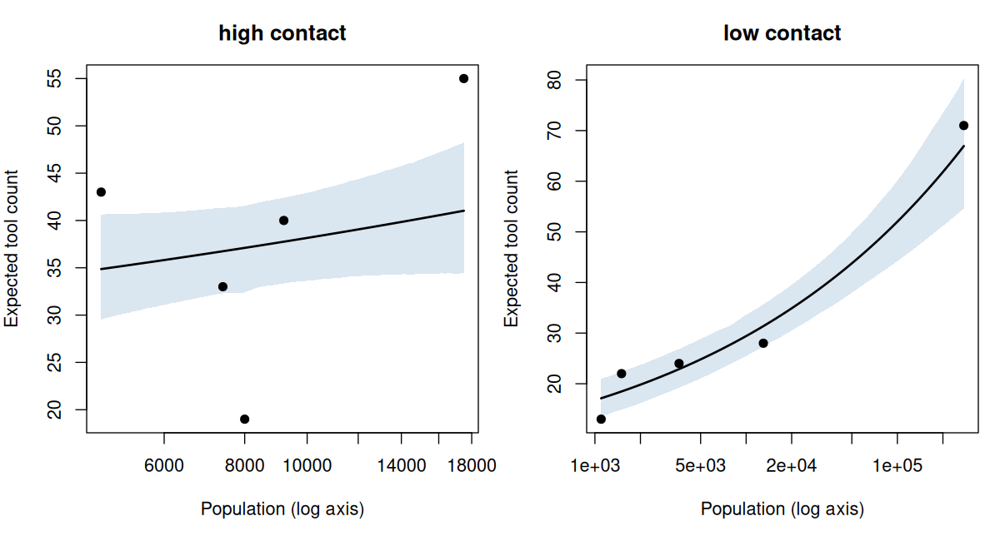

[Return to the Problem 2 walkthrough](#a09-problem2-walkthrough).


---

## 36. Process model for innovation and loss

**[Problem 2 — Counts and rates](#a09-problem-map).** Ask whether a process of innovation and loss provides a useful scientific model.

A GLM is a purely statistical curve. A process-motivated model instead starts from first principles:

$$ \lambda_i = \frac{ \alpha P_i^\gamma }{ \beta } $$

Where $\alpha$ is innovation intensity, $P_i$ is raw population, $\gamma$ is population scaling, and $\beta$ is the loss rate.

::: {.panel-tabset}
### R (Non-linear ulam model)
```{r}
d$P_raw <- d$population
m11.11 <- ulam(
    alist(
        total_tools ~ dpois(lambda),
        lambda <- exp(a[cid]) * P_raw^b[cid] / g,
        a[cid] ~ dnorm(1, 1),
        b[cid] ~ dexp(1),
        g ~ dexp(1)
    ), data = d, chains = 4)
```
:::

A process-motivated equation can give parameters more scientific structure, but it still requires validation.

### Walkthrough 2 — Step 5: Read the innovation–loss model without claiming a new fit {#a09-walkthrough-2-36}

**Question in Problem 2:** What would innovation and loss parameters mean in a process-based count model?

Use explicitly hypothetical process parameters to evaluate the equilibrium mean formula. This calculation interprets that formula; it does not fit the nonlinear model to Kline.

```{r a09-walkthrough-2-36}
#| eval: false
# Hypothetical process parameters: expected equilibrium tools = alpha * P^gamma / loss.
P<-c(1000,10000,100000);innovation<-.5;gamma<-.5;loss<-1
print(data.frame(population=P,expected_tools=innovation*P^gamma/loss,
 doubled_innovation=2*innovation*P^gamma/loss,
 doubled_loss=innovation*P^gamma/(2*loss)),digits=3,row.names=FALSE)
cat("Only the innovation/loss ratio is identified from this mean curve without more assumptions.\n")
```

**Executed result:**

```text
population expected_tools doubled_innovation doubled_loss
      1e+03           15.8               31.6         7.91
      1e+04           50.0              100.0        25.00
      1e+05          158.1              316.2        79.06
Only the innovation/loss ratio is identified from this mean curve without more assumptions.
```

**Read the result.** Doubling innovation doubles the expected stock of tools, while doubling the loss rate halves it. The curve contains the innovation/loss ratio, so these two parameters cannot be separately learned from this mean relationship without additional information or assumptions.

[Return to the Problem 2 walkthrough](#a09-problem2-walkthrough).


---

## 37. Poisson as a rare-event approximation

**[Problem 2 — Counts and rates](#a09-problem-map).** Explain the rare-event limit connecting binomial probabilities with Poisson counts.

If $Y \sim \mathrm{Binomial}(N,p)$ with $N \rightarrow \infty$, $p \rightarrow 0$, and $Np=\lambda$ fixed, then $Y \Rightarrow \mathrm{Poisson}(\lambda)$. The arrow $\Rightarrow$ means **convergence in distribution**.

### Walkthrough 2 — Step 6: Quantify the rare-event approximation {#a09-walkthrough-2-37}

**Question in Problem 2:** When is a binomial count well approximated by a Poisson count?

Hold the mean at four events while increasing the number of trials and reducing each trial's event probability.

```{r a09-walkthrough-2-37}
#| eval: false
lambda<-4
print(data.frame(trials=c(20,100,1000),probability=lambda/c(20,100,1000),
 binomial_zero=dbinom(0,c(20,100,1000),lambda/c(20,100,1000)),
 poisson_zero=dpois(0,lambda)),digits=5,row.names=FALSE)
```

**Executed result:**

```text
trials probability binomial_zero poisson_zero
     20       0.200      0.011529     0.018316
    100       0.040      0.016870     0.018316
   1000       0.004      0.018169     0.018316
```

**Read the result.** The binomial zero probability approaches the Poisson value as trials become more numerous and events rarer. At 20 trials the difference is visible; at 1,000 it is small. This limit does not turn every count with a known trial denominator into a Poisson observation by default.

[Return to the Problem 2 walkthrough](#a09-problem2-walkthrough).


---

## 38. Exposure and offsets

**[Problem 2 — Counts and rates](#a09-problem-map).** Separate event intensity from the time or opportunities over which events can accumulate.

Let $E_i$ be time at risk (exposure) and $r_i$ the event rate per unit of exposure.

$$ Y_i \sim \mathrm{Poisson}(E_i r_i) \implies \log(\lambda_i) = \log(E_i) + \log(r_i) $$

The term $\log(E_i)$ is an **offset** with its coefficient strictly fixed to 1.

::: {.panel-tabset}
### R (Offset in ulam)
```{r}
# Example syntax for offset in ulam
# log_days is the log of the exposure
m_offset <- ulam(
    alist(
        y ~ dpois(lambda),
        log(lambda) <- log_days + a + b*x,
        a ~ dnorm(0, 1),
        b ~ dnorm(0, 0.5)
    ), data = d_offset, chains=1)
```
:::

### Walkthrough 2 — Step 7: Compare counts with unequal exposures {#a09-walkthrough-2-38}

**Question in Problem 2:** Could a lower observed count conceal a higher event rate?

Compare two illustrative observation windows rather than the Kline tool data. Put both groups on the same 30-day exposure scale.

```{r a09-walkthrough-2-38}
#| eval: false
events<-c(6,3);days<-c(30,10)
print(data.frame(group=c("A","B"),events,days,rate=events/days,
 expected_at_30_days=30*events/days),row.names=FALSE)
cat("Offset: log(days) has coefficient one; it is not an estimated slope.\n")
```

**Executed result:**

```text
group events days rate expected_at_30_days
     A      6   30  0.2                   6
     B      3   10  0.3                   9
Offset: log(days) has coefficient one; it is not an estimated slope.
```

**Read the result.** Group B has only three events versus six in A, but its rate is higher: 0.3 versus 0.2 per day. At a common 30-day exposure those observed rates imply nine versus six expected events. Exposure has a fixed coefficient of one on the log scale.

[Return to the Problem 2 walkthrough](#a09-problem2-walkthrough).


---

## 39. Conditional variance and overdispersion

**[Problem 2 — Counts and rates](#a09-problem-map).** Explain extra count variation before choosing a richer likelihood.

### 39.1 Start with the missing source of variation

For customers with the same modeled predictors and exposure, a Poisson model with mean 4 also has variance 4. **Overdispersion** means more variation than that conditional likelihood predicts. Variation between predictor values is already represented by regression; a large variance in the pooled histogram is not sufficient evidence of residual overdispersion.

One explanation is unobserved heterogeneity: even after adjusting for measured predictors, some customers have higher event intensities than others. Another is a separate process that makes some customers unable to generate an event at all. These motivate different models.

### 39.2 Gamma–Poisson, also called negative binomial

Let $\Lambda_i$ be an unobserved, positive intensity and $\mu_i$ its mean. With Gamma **shape** $\phi>0$ and **rate** $\phi/\mu_i$:

$$
\Lambda_i\mid X_i\sim\mathrm{Gamma}(\phi,\phi/\mu_i),\qquad
Y_i\mid\Lambda_i\sim\mathrm{Poisson}(\Lambda_i),\qquad
\log\mu_i=\alpha+\beta x_i.
$$

A Gamma(shape, rate) variable has mean $\mathrm{shape}/\mathrm{rate}$ and variance $\mathrm{shape}/\mathrm{rate}^2$. Here $\mathbb E[\Lambda_i]=\mu_i$ and $\operatorname{Var}(\Lambda_i)=\mu_i^2/\phi$. Averaging over that latent intensity gives a **negative-binomial** count distribution:

$$
\mathbb E[Y_i\mid X_i]=\mu_i,\qquad
\operatorname{Var}(Y_i\mid X_i)=\mu_i+\frac{\mu_i^2}{\phi}.
$$

The variance is the usual Poisson contribution plus the variation in latent intensity. At mean 4 and $\phi=2$, it is $4+16/2=12$. Larger $\phi$ means less extra variation; the Poisson is approached as $\phi$ grows. This is the count analogue of mixing binomial probabilities with a Beta distribution in section 76.

In base R, use `dnbinom(y, size = phi, mu = mu)` or `rnbinom(n, size = phi, mu = mu)`. The `rethinking::dgampois(y, mu, scale)` helper instead sets Gamma shape to `mu/scale`: **`scale = mu/phi`** reproduces the parameterization above. With a fixed `scale`, its variance is `mu * (1 + scale)`. Therefore a constant `scale` and a constant `phi` imply different mean–variance relationships in a regression. The earlier schematic `dgampois` model should not be read as interchangeable with an arbitrary negative-binomial parameterization. See the [R negative-binomial reference](https://stat.ethz.ch/R-manual/R-devel/library/stats/html/NegBinomial.html).

### 39.3 Zero inflation: two ways to observe zero

A **zero-inflated Poisson** model adds a latent inactive state. With probability $\pi_i$ the observation is forced to zero; with probability $1-\pi_i$ it comes from a Poisson distribution with mean $\lambda_i$. That Poisson component can itself produce zero:

$$
\Pr(Y_i=0)=\pi_i+(1-\pi_i)e^{-\lambda_i},\qquad
\Pr(Y_i=y>0)=(1-\pi_i)\frac{e^{-\lambda_i}\lambda_i^y}{y!}.
$$

Its mean and variance are

$$
\mathbb E[Y_i]=(1-\pi_i)\lambda_i,\qquad
\operatorname{Var}(Y_i)=(1-\pi_i)\lambda_i+\pi_i(1-\pi_i)\lambda_i^2.
$$

For example, suppose 30% of accounts are inactive throughout follow-up, while active accounts average four events. Then the population mean is 2.8, not 4, and the zero probability is about 0.313. A zero alone does not identify an account as inactive. Many zeros can also result from a low mean or heterogeneous intensities: the mixture needs a plausible process interpretation and predictive checks, not just a zero-heavy histogram.

### 39.4 Calculate and simulate the difference

The first two rows below share mean 4. The third deliberately keeps the active-component mean at 4, so adding inactive accounts lowers its overall mean.

```{r a09-lab-counts}
#| eval: false
mu <- 4; phi <- 2; zi <- .30; lambda <- 4
moments <- data.frame(model=c("Poisson", "Gamma-Poisson", "Zero-inflated Poisson"),
  mean=c(mu,mu,(1-zi)*lambda),
  variance=c(mu,mu+mu^2/phi,(1-zi)*lambda+zi*(1-zi)*lambda^2),
  prob_zero=c(dpois(0,mu),dnbinom(0,size=phi,mu=mu),zi+(1-zi)*dpois(0,lambda)))
print(moments,digits=4,row.names=FALSE)
# Independent latent intensities yield extra-Poisson variation.
set.seed(9039)
latent_rate <- rgamma(100000,shape=phi,rate=phi/mu)
y <- rpois(length(latent_rate),latent_rate)
cat("Simulated Gamma-Poisson mean and variance:",round(mean(y),3),round(var(y),3),"\n")
stopifnot(abs(mean(y)-mu)<.1,abs(var(y)-(mu+mu^2/phi))<.5)
# The installed rethinking helper uses scale = mu / phi.
if (requireNamespace("rethinking",quietly=TRUE))
  stopifnot(max(abs(rethinking::dgampois(0:30,mu,scale=mu/phi)-
                    dnbinom(0:30,size=phi,mu=mu)))<1e-12)
```

**Executed result:**

```text
model mean variance prob_zero
               Poisson  4.0     4.00   0.01832
         Gamma-Poisson  4.0    12.00   0.11111
 Zero-inflated Poisson  2.8     6.16   0.31282
Simulated Gamma-Poisson mean and variance: 3.995 11.963
```

This closes the count-model block. The next sections ask what causal conclusions any of these likelihoods can support.

### Walkthrough 2 — Step 8: Make extra variation explicit {#a09-walkthrough-2-39}

**Question in Problem 2:** What does a Gamma–Poisson extension change at the same expected count?

Keep the mean at four and give the Gamma–Poisson mixture shape phi = 2. The full mixture definitions and zero-inflation example are explained earlier in this section.

```{r a09-walkthrough-2-39}
#| eval: false
mu<-4;phi<-2
print(data.frame(model=c("Poisson","Gamma-Poisson"),mean=mu,
 variance=c(mu,mu+mu^2/phi),zero_probability=c(dpois(0,mu),dnbinom(0,size=phi,mu=mu))),
 digits=4,row.names=FALSE)
cat("A variance larger than the pooled mean is not alone a conditional model failure.\n")
```

**Executed result:**

```text
model mean variance zero_probability
       Poisson    4        4          0.01832
 Gamma-Poisson    4       12          0.11111
A variance larger than the pooled mean is not alone a conditional model failure.
```

**Read the result.** The two models share mean four but have variances four and twelve, and different zero probabilities. Extra variation is a statement about the conditional process. The variance of all observations pooled across different predictor values is not itself a test of the Poisson regression assumption.

[Return to the Problem 2 walkthrough](#a09-problem2-walkthrough).


---

## 40. Omitted variables in GLMs

**[Problem 3 — Causal interpretation](#a09-problem-map).** Examine omitted structure and coefficient changes across both likelihood families.

**Keep two questions separate.** First, does the model describe the observed outcomes adequately? Second, would its predicted contrast persist under a specified intervention?

Chapter 10 warns that omitted causes can be especially difficult under nonlinear links. Suppose independent causes $X$ and $Z$ both increase a binary event. If $Z$ is omitted, some observations with small $X$ still have $Y=1$ because $Z$ was sufficient. The fitted model may understate the influence of $X$.

**Non-collapsibility** means that a conditional odds ratio and a marginal odds ratio can differ even without confounding. 

::: {.panel-tabset}
### R (Non-collapsibility simulation)
```{r}
set.seed(40)
N <- 10000
# X and Z are independent! No confounding.
X <- rnorm(N)
Z <- rnorm(N)
# Logit model with both X and Z
p_true <- plogis(1.0 * X + 1.0 * Z)
Y <- rbinom(N, 1, p_true)

# Fit omitting Z (the unobserved variable)
m_omitted <- glm(Y ~ X, family = binomial)
# Fit including Z
m_full <- glm(Y ~ X + Z, family = binomial)

cat("Coefficient of X (True = 1.0):\n")
cat("Omitted Z (Marginal):", coef(m_omitted)["X"], "\n")
cat("Included Z (Conditional):", coef(m_full)["X"], "\n")
# The marginal coefficient is attenuated towards 0!
```
:::

The final scientific estimand should be computed through full predictions, not isolated coefficients.

### Walkthrough 3: the executable path {#a09-problem3-walkthrough}

Use [A09_problem3_walkthrough.R](../scripts/A09_problem3_walkthrough.R) in a fresh R session from the repository root. Follow the steps below in order. Their variables belong to this walkthrough; the other examples in the lesson are separate.

| Step | Particular task | Code and result in the lesson |
|---|---|---|
| 1 | Separate non-collapsibility from confounding | [Section 40](#a09-walkthrough-3-40) |
| 2 | Compare observed association with a known intervention effect | [Section 41](#a09-walkthrough-3-41a) |
| 3 | Check why conditioning on a collider is different | [Section 41](#a09-walkthrough-3-41b) |


### Walkthrough 3 — Step 1: Separate non-collapsibility from confounding {#a09-walkthrough-3-40}

**Question in Problem 3:** Can marginal and conditional odds ratios differ when there is no confounding?

Use an exact constructed population with independent binary X and U and an identical 50:50 U mix in both X groups. No model fitting or sampling error is involved.

```{r a09-walkthrough-3-40}
#| eval: false
source("scripts/A09_walkthrough_helpers.R")
# Exact population calculation: X and U independent, Pr(U=1)=0.5 in both X groups.
p<-outer(0:1,0:1,function(x,u) plogis(-2+log(2)*x+2*u))
marginal<-rowMeans(p)
print(round(data.frame(X=0:1,U0=p[,1],U1=p[,2],marginal=marginal),4),row.names=FALSE)
cat("Conditional OR:",2,"; marginal OR:",round(exp(diff(qlogis(marginal))),3),"\n")
cat("No unequal latent composition is present in this example.\n")
```

**Executed result:**

```text
X     U0     U1 marginal
 0 0.1192 0.5000   0.3096
 1 0.2130 0.6667   0.4398
Conditional OR: 2 ; marginal OR: 1.751 
No unequal latent composition is present in this example.
```

**Read the result.** The conditional odds ratio is two, but the marginal odds ratio is about 1.751. This is non-collapsibility, not bias due to unequal U composition. The next step deliberately introduces a common cause to show the separate confounding problem.

[Return to the Problem 3 walkthrough](#a09-problem3-walkthrough).


---

## 41. Causal interpretation of event models

**[Problem 3 — Causal interpretation](#a09-problem-map).** Distinguish a conditional event model from an identified intervention contrast.

A GLM specifies $p(Y \mid X,Z,\theta)$. It does not automatically identify $p(Y \mid \mathrm{do}(X=x))$.

The causal workflow remains:

$$ \text{DAG} \rightarrow \text{identification} \rightarrow \text{conditional event model} \rightarrow \text{intervention prediction} \rightarrow \text{standardization} \rightarrow \text{contrast} $$

A causal graph, its identification assumptions, and an appropriate analysis can justify an interventional interpretation. The likelihood alone cannot.

### Walkthrough 3 — Step 2: Compare observed association with a known intervention effect {#a09-walkthrough-3-41a}

**Question in Problem 3:** How can a correct observed association overstate the effect of an intervention?

Specify a toy causal process in which U influences both treatment assignment and the outcome. The observed treated and control groups have different U mixtures; intervention predictions instead average both treatments over the original 50:50 population.

```{r a09-walkthrough-3-41a}
#| eval: false
# Declared toy causal process: U -> treatment and U -> outcome, plus treatment -> outcome.
# Pr(U=1)=.5; Pr(T=1|U=0)=.2; Pr(T=1|U=1)=.8.
# Pr(Y=1|T,U)=.10+.10*T+.40*U, valid for all four combinations.
selected_u<-c(Control=.2,Treated=.8)
observed<-c(Control=.10+.40*selected_u[1],Treated=.20+.40*selected_u[2])
intervened<-c(Control=.10+.40*.5,Treated=.20+.40*.5)
print(data.frame(scenario=c("Control","Treated"),observed=as.numeric(observed),
 intervened=as.numeric(intervened)),row.names=FALSE)
association<-unname(diff(observed));effect<-unname(diff(intervened))
cat("Observed difference:",association,"; true intervention difference:",effect,"\n")
stopifnot(abs(association-.34)<1e-12,abs(effect-.10)<1e-12)
```

**Executed result:**

```text
scenario observed intervened
  Control     0.18        0.3
  Treated     0.52        0.4
Observed difference: 0.34 ; true intervention difference: 0.1
```

**Read the result.** Observed outcome probabilities are 0.18 and 0.52, giving a difference of 0.34. Under the known intervention mechanism they are 0.30 and 0.40, giving a difference of 0.10. The correct causal answer is available here because the generating process is specified; it is not identified from an observed regression without those assumptions.

[Return to the Problem 3 walkthrough](#a09-problem3-walkthrough).


### Walkthrough 3 — Step 3: Check why conditioning on a collider is different {#a09-walkthrough-3-41b}

**Question in Problem 3:** Can adjustment itself select groups with different hidden characteristics?

Use the admissions mechanism developed in A10: category 1 chooses department 2 only in the high latent state, while category 2's department selection is independent of that state. Both started with 10% high-state applicants.

```{r a09-walkthrough-3-41b}
#| eval: false
# Admissions mechanism used in A10: category 1 selects D2 only when U=1;
# category 2 selects D2 independently of U; original Pr(U=1)=.1 in both.
observed_d2<-c(G1=.30,G2=.9*.30+.1*.50)
controlled_d2<-c(G1=.9*.10+.1*.30,G2=.9*.30+.1*.50)
print(data.frame(comparison=c("Observed within D2","Intervene on D2, common U mix"),
 difference=c(observed_d2[1]-observed_d2[2],controlled_d2[1]-controlled_d2[2])),row.names=FALSE)
out<-a09_output("3")
comparisons<-data.frame(case=c("Confounded treatment","Selected admissions"),
 observed=c(association,unname(observed_d2[1]-observed_d2[2])),
 intervention=c(effect,unname(controlled_d2[1]-controlled_d2[2])))
write.csv(comparisons,file.path(out,"known_population_contrasts.csv"),row.names=FALSE)
png(file.path(out,"causal_contrasts.png"),width=1000,height=550,res=130)
par(mar=c(5,10,3,1))
plot(100*comparisons$observed,1:2,xlim=c(-25,40),ylim=c(.6,2.4),yaxt="n",ylab="",pch=1,
 xlab="Difference (percentage points)",main="Observed and interventional comparisons")
axis(2,at=1:2,labels=comparisons$case,las=1)
segments(100*comparisons$observed,1:2,100*comparisons$intervention,1:2,col="grey")
points(100*comparisons$intervention,1:2,pch=19,col="steelblue");abline(v=0,lty=2)
legend("topright",c("Observed","Intervention under known toy process"),pch=c(1,19),
 col=c("black","steelblue"),bty="n",cex=.8)
invisible(dev.off())
```

**Executed result:**

```text
comparison difference
            Observed within D2      -0.02
 Intervene on D2, common U mix      -0.20
```

**Read the result.** The observed within-department-2 difference is −2 points, but the common-population controlled difference is −20 points. Conditioning on the department is not the same as intervening to assign it. The graph identifies the question; numerical standardization cannot establish an unverified causal story. Both contrasts in the figure are exact values under explicitly constructed processes, not posterior estimates.

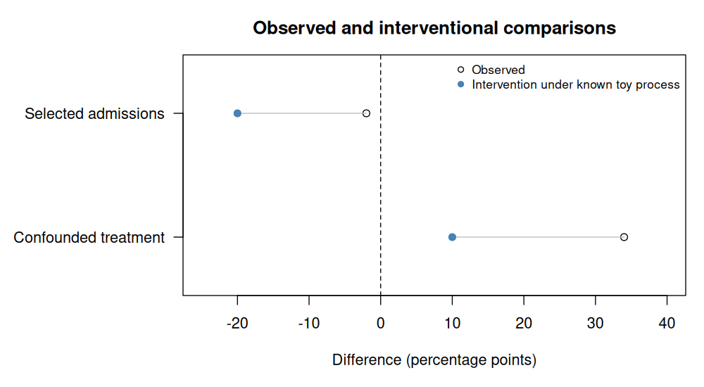

[Return to the Problem 3 walkthrough](#a09-problem3-walkthrough).


---

## 42. CRM application: campaign conversion

**[Problem 4 — One campaign decision](#a09-problem-map).** Begin the campaign case with the probability that an eligible customer buys at least once.

### 42.1 One scenario for the next five sections

An online retailer wants to know whether a campaign generates enough additional purchases to justify its cost.

Let $A_i=1$ mean assignment to the campaign and $A_i=0$ assignment to control. Let $Y_i=1$ if the customer buys at least once and 0 otherwise, and let $X_i$ contain pre-assignment covariates.

### 42.2 Model conversion and define uplift

$$ Y_i\sim\mathrm{Bernoulli}(p_i),\qquad \operatorname{logit}(p_i)=\alpha+\beta_A A_i+X_i^{\mathsf T}\beta_X. $$

For each posterior draw, predict the **same eligible customers** under both assignments:

$$ p_i^{(s)}(a)=\operatorname{logit}^{-1} [\alpha^{(s)}+\beta_A^{(s)}a+X_i^{\mathsf T}\beta_X^{(s)}],\quad a\in\{0,1\}. $$

Average their differences over the target population of $N$ customers:

$$ \tau_{\mathrm{conversion}}^{(s)}=\frac1N\sum_i[p_i^{(s)}(1)-p_i^{(s)}(0)]. $$

::: {.panel-tabset}
### R (CRM Conversion Uplift)
```{r}
# Synthetic CRM Data
set.seed(42)
N <- 1000
A <- rbinom(N, 1, 0.5) # Randomized campaign
X <- rnorm(N) # Prior customer score
# Prob of conversion
p_true <- plogis(-1.5 + 0.8 * A + 0.5 * X)
Y <- rbinom(N, 1, p_true)

m_crm <- glm(Y ~ A + X, family=binomial)
# Standardization for Uplift
p1 <- predict(m_crm, newdata=data.frame(A=1, X=X), type="response")
p0 <- predict(m_crm, newdata=data.frame(A=0, X=X), type="response")
uplift <- mean(p1 - p0)
cat("Average Conversion Uplift:", round(uplift * 100, 2), "percentage points\n")
```
:::

### Walkthrough 4: the executable path {#a09-problem4-walkthrough}

Use [A09_problem4_walkthrough.R](../scripts/A09_problem4_walkthrough.R) in a fresh R session from the repository root. Follow the steps below in order. Their variables belong to this walkthrough; the other examples in the lesson are separate.

| Step | Particular task | Code and result in the lesson |
|---|---|---|
| 1 | Generate one coherent campaign and its repeated purchases | [Section 42](#a09-walkthrough-4-42a) |
| 2 | Estimate standardized conversion uplift | [Section 42](#a09-walkthrough-4-42b) |
| 3 | Estimate purchases rather than buyers | [Section 43](#a09-walkthrough-4-43) |
| 4 | Correct unequal follow-up with exposure | [Section 44](#a09-walkthrough-4-44) |
| 5 | Verify what aggregation preserves | [Section 45](#a09-walkthrough-4-45) |
| 6 | Turn the defined count contrast into a transparent decision report | [Section 46](#a09-walkthrough-4-46) |


### Walkthrough 4 — Step 1: Generate one coherent campaign and its repeated purchases {#a09-walkthrough-4-42a}

**Question in Problem 4:** How can one campaign produce both a buyer indicator and a purchase count?

Start a fresh synthetic retailer example with randomized campaign assignment and two pre-assignment customer segments. Generate one coherent Poisson purchase process over time, then define a 30-day buyer as someone with at least one purchase. This is a distinct dataset from the simpler logistic example above.

```{r a09-walkthrough-4-42a}
#| eval: false
source("scripts/A09_walkthrough_helpers.R")
set.seed(9442)
N<-1200;A<-rbinom(N,1,.5);segment<-rbinom(N,1,.5)
rate_true<-.01*exp(.35*A+.4*segment)
# Independent increments from the same Poisson purchase process.
C15<-rpois(N,15*rate_true);C30<-C15+rpois(N,15*rate_true)
C60<-C30+rpois(N,30*rate_true);Y30<-as.integer(C30>0)
# A second observation scheme: noninformative follow-up conditional on assignment.
days<-ifelse(A==1,sample(c(15,30),N,replace=TRUE),sample(c(30,60),N,replace=TRUE))
observed_count<-ifelse(days==15,C15,ifelse(days==30,C30,C60))
customer<-data.frame(A,segment,Y30,C30,days,observed_count)
cells<-aggregate(cbind(customers=rep(1,N),buyers=Y30,purchases=C30,
                       observed_days=days,observed_purchases=observed_count)~A+segment,
                 customer,sum)
cells<-cells[order(cells$segment,cells$A),]
print(cells,row.names=FALSE)
i0<-which(cells$A==0);i1<-which(cells$A==1)
w<-as.numeric(table(factor(segment,levels=0:1)))/N
cat("Target segment weights:",w,"\n")
stopifnot(all(Y30<=C30),all(cells$buyers<=cells$customers))
```

**Executed result:**

```text
A segment customers buyers purchases observed_days observed_purchases
 0       0       292     90       104         13380                140
 1       0       291    100       121          6450                 86
 0       1       296    101       127         12900                192
 1       1       321    148       193          7170                145
Target segment weights: 0.4858333 0.5141667
```

**Read the result.** Each of the four assignment–segment cells has customers, buyers and purchases. Buyers cannot exceed customers, while one customer can make several purchases. The target segment distribution is the same under both campaign assignments. A second follow-up scheme is recorded for the later exposure example; it must not be confused with the common 30-day outcome.

[Return to the Problem 4 walkthrough](#a09-problem4-walkthrough).


### Walkthrough 4 — Step 2: Estimate standardized conversion uplift {#a09-walkthrough-4-42b}

**Question in Problem 4:** What is the campaign's average conversion uplift for the same target customers?

Fit four independent cell logits with prior Normal(logit(0.3),1), permitting an assignment-by-segment interaction. Standardize both assignments over the same observed segment weights. The known generating uplift is shown separately.

```{r a09-walkthrough-4-42b}
#| eval: false
set.seed(9443)
# Four independent cell logits; allows an assignment-by-segment interaction.
conversion<-a09_cells(cells$buyers,cells$customers,prior_mean=qlogis(.3),prior_sd=1)
conversion_uplift<-drop((conversion$draws[,i1]-conversion$draws[,i0])%*%w)
cat("Standardized conversion uplift (percentage points):\n")
print(round(100*a09_summary(conversion_uplift),2))
cat("Generating mean uplift for these customer segments (percentage points):",
 round(100*mean(exp(-30*.01*exp(.4*segment))-exp(-30*.01*exp(.35+.4*segment))),2),"\n")
```

**Executed result:**

```text
Standardized conversion uplift (percentage points):
 mean  lo90  hi90 
 7.75  3.25 12.21 
Generating mean uplift for these customer segments (percentage points): 9.87
```

**Read the result.** The estimated uplift is about 7.75 percentage points, with a 90% interval of 3.25–12.21; the generating mean for these segments is about 9.87 points. Sampling uncertainty explains why the fitted mean need not equal the truth. Randomization supports the assignment comparison in this toy process; it does not justify causal claims for arbitrary observational targeting data.

[Return to the Problem 4 walkthrough](#a09-problem4-walkthrough).


---

## 43. CRM application: number of purchases

**[Problem 4 — One campaign decision](#a09-problem-map).** Change the campaign outcome to purchase volume.

A starting model is:

$$ C_i\sim\mathrm{Poisson}(\lambda_i),\qquad \log\lambda_i=\alpha+\beta_A A_i+X_i^{\mathsf T}\beta_X. $$

Compute both scenario means for each posterior draw and average their differences:

$$ \tau_{\mathrm{count}}^{(s)}=\frac1N\sum_i[\lambda_i^{(s)}(1)-\lambda_i^{(s)}(0)]. $$

### Walkthrough 4 — Step 3: Estimate purchases rather than buyers {#a09-walkthrough-4-43}

**Question in Problem 4:** Does extra purchase volume equal the number of extra buyers?

Fit independent Poisson cell means for total purchases during the common 30-day window, with prior Normal(log(0.4),1) on log expected purchases per customer. Aggregate exposures are customer counts because the time window is fixed.

```{r a09-walkthrough-4-43}
#| eval: false
set.seed(9444)
# Sum of independent Poisson counts: exposure here is number of 30-day customers.
count_fit<-a09_cells(cells$purchases,cells$customers,family="poisson",
                    prior_mean=log(.4),prior_sd=1)
count_uplift<-drop((count_fit$draws[,i1]-count_fit$draws[,i0])%*%w)
print(round(rbind(Extra_buyers_per_1000=a09_summary(1000*conversion_uplift),
                  Extra_purchases_per_1000=a09_summary(1000*count_uplift)),1))
cat("These are separate summaries of the same process, not independent datasets to multiply together.\n")
```

**Executed result:**

```text
mean lo90  hi90
Extra_buyers_per_1000     77.5 32.5 122.1
Extra_purchases_per_1000 116.6 53.6 180.3
These are separate summaries of the same process, not independent datasets to multiply together.
```

**Read the result.** The posterior means imply about 77.5 extra buyers but 116.6 extra purchases per 1,000 customers. Repeat purchases explain why the outcomes differ. The conversion and count likelihoods summarize the same generated purchase process; multiplying them as independent evidence would double-count information.

[Return to the Problem 4 walkthrough](#a09-problem4-walkthrough).


---

## 44. CRM application: event exposure

**[Problem 4 — One campaign decision](#a09-problem-map).** Make purchase comparisons meaningful when customers have unequal observation windows.

Let $E_i>0$ be observed days and $r_i$ expected purchases per day:

$$ C_i\sim\mathrm{Poisson}(E_i r_i) \implies \log\lambda_i=\underbrace{\log E_i}_{\text{offset}} +\alpha+\beta_A A_i+X_i^{\mathsf T}\beta_X. $$

### Walkthrough 4 — Step 4: Correct unequal follow-up with exposure {#a09-walkthrough-4-44}

**Question in Problem 4:** Does the campaign still increase purchase intensity when follow-up durations differ?

The second observation scheme has shorter follow-up for campaign customers, conditionally unrelated to their purchase-process randomness. Model total observed purchases with total customer-days as exposure, with prior Normal(log(0.01),1) on each log daily rate.

```{r a09-walkthrough-4-44}
#| eval: false
set.seed(9445)
# Now the modeled cell parameter is purchases per day; aggregate exposure is total days.
rate_fit<-a09_cells(cells$observed_purchases,cells$observed_days,family="poisson",
                   prior_mean=log(.01),prior_sd=1)
rate_uplift<-drop((rate_fit$draws[,i1]-rate_fit$draws[,i0])%*%w)
raw<-aggregate(cbind(observed_count,days)~A,customer,mean)
print(raw,digits=4,row.names=FALSE)
cat("Extra expected purchases per 1000 customers at common 30-day exposure:\n")
print(round(a09_summary(1000*30*rate_uplift),1))
```

**Executed result:**

```text
A observed_count  days
 0         0.5646 44.69
 1         0.3775 22.25
Extra expected purchases per 1000 customers at common 30-day exposure:
 mean  lo90  hi90 
122.1  58.1 186.8
```

**Read the result.** Campaign customers have fewer observed purchases per customer, but also about half the follow-up time. At a common 30-day exposure the fitted rate contrast predicts about 122 additional purchases per 1,000 customers, with a 90% interval around 58–187. The result relies on an appropriate observation-process assumption and constant rates within these modeled cells.

[Return to the Problem 4 walkthrough](#a09-problem4-walkthrough).


---

## 45. CRM application: aggregated campaign cells

**[Problem 4 — One campaign decision](#a09-problem-map).** Determine whether aggregated campaign cells preserve the binary or count question being asked.

If the report instead counts **total purchases**, its numerator can exceed the customer count. Use the count/exposure model from sections 43–44.

### Walkthrough 4 — Step 5: Verify what aggregation preserves {#a09-walkthrough-4-45}

**Question in Problem 4:** Which summaries preserve the count model when individual exposures differ?

Within one assignment–segment cell the daily rate is shared. Compare the likelihood of all individual purchase counts with the likelihood of their sum at the summed exposure.

```{r a09-walkthrough-4-45}
#| eval: false
# Within an assignment/segment cell, the daily rate is common but exposure can differ.
r<-which(A==0 & segment==0)
candidate_rates<-c(.005,.01,.02)
individual<-sapply(candidate_rates,function(rate)
 sum(dpois(observed_count[r],days[r]*rate,log=TRUE)))
grouped<-dpois(sum(observed_count[r]),sum(days[r])*candidate_rates,log=TRUE)
print(round(data.frame(rate=candidate_rates,log_individual=individual,
 log_grouped=grouped,gap=grouped-individual),4),row.names=FALSE)
stopifnot(max(abs((grouped-individual)-(grouped-individual)[1]))<1e-8)
cat("Aggregation preserves this rate posterior up to a constant; it does not recover missing customer predictors.\n")
```

**Executed result:**

```text
rate log_individual log_grouped     gap
 0.005      -286.4614    -33.6724 252.789
 0.010      -256.3208     -3.5318 252.789
 0.020      -293.0802    -40.2912 252.789
Aggregation preserves this rate posterior up to a constant; it does not recover missing customer predictors.
```

**Read the result.** The log-likelihood gap is constant across candidate rates, so the same rate prior yields the same posterior under either representation. This does not license aggregation across different modeled rates or recover customer covariates absent from the grouped data.

[Return to the Problem 4 walkthrough](#a09-problem4-walkthrough).


---

## 46. Implications for CausalOps

**[Problem 4 — One campaign decision](#a09-problem-map).** Record the preceding choices so the campaign comparison can be reproduced.

| A09 concept | CausalOps implication |
|---|---|
| Event support | `OutcomeDefinitionArtifact` with binary, grouped, or count type |
| Opportunity total | Store denominator for binomial events |
| Exposure | Store time or opportunity offset for rates |
| Probability contrast | First-class posterior estimand |
| Standardization | Average event predictions over target population |

### 46.1 Event outcome schema

```yaml
outcome_id: campaign_purchase_30d
type: binary_event
value_column: purchased
event_values:
  success: 1
  failure: 0
observation_window: 30_days
unit: customer
```

### 46.2 Grouped-binomial schema

```yaml
outcome_id: purchases_by_campaign_cell
type: grouped_binomial
success_column: purchasers
trials_column: eligible_assigned_customers
cell_keys:
  - campaign_id
  - assignment
  - segment_id
aggregation_assumption: common_probability_within_cell
```

### 46.3 Poisson-rate schema

```yaml
outcome_id: campaign_purchase_count
type: count_event
count_column: purchase_count
exposure_column: observed_days
exposure_unit: day
link: log
offset: log_observed_days
unit: customer_followup
```

### 46.4 Contrast artifact

```yaml
estimand_id: average_conversion_uplift
left_intervention: assigned_campaign
right_intervention: assigned_control
scale: probability_difference
observation_window: 30_days
population: eligible_customers
aggregation: customer_standardization
```

### Walkthrough 4 — Step 6: Turn the defined count contrast into a transparent decision report {#a09-walkthrough-4-46}

**Question in Problem 4:** What should a reproducible campaign report state about the outcome and decision?

Use illustrative fixed margin 20 per incremental purchase and cost 1.2 per assigned customer. Apply the economic formula to every draw of the common-30-day purchase contrast, and check replicated purchase totals.

```{r a09-walkthrough-4-46}
#| eval: false
# Fixed illustrative margin and campaign cost, not estimated financial parameters.
margin_per_purchase<-20;cost_per_customer<-1.2
profit<-margin_per_purchase*count_uplift-cost_per_customer
report<-rbind(Conversion_difference=a09_summary(conversion_uplift),
 Purchases_per_customer_30d=a09_summary(count_uplift),
 Profit_per_customer=a09_summary(profit))
print(round(report,3))
cat("Pr(incremental profit > 0) under these fixed economic inputs:",round(mean(profit>0),3),"\n")
# Simple posterior predictive check at the original common 30-day exposure.
set.seed(9446)
rep_counts<-sapply(seq_len(nrow(cells)),function(k)
 rpois(nrow(count_fit$draws),cells$customers[k]*count_fit$draws[,k]))
print(round(c(observed_purchases=sum(C30),a09_summary(rowSums(rep_counts))),1))
out<-a09_output("4");write.csv(report,file.path(out,"campaign_report.csv"))
z<-rbind(Buyers=1000*a09_summary(conversion_uplift),Purchases=1000*a09_summary(count_uplift))
png(file.path(out,"campaign.png"),width=1000,height=550,res=130)
par(mar=c(5,7,3,1))
plot(z[,1],1:2,xlim=range(c(0,z[,2:3])),ylim=c(.6,2.4),yaxt="n",ylab="",pch=19,
 xlab="Additional expected outcomes per 1,000 customers / 30 days",main="One campaign, two outcomes")
axis(2,at=1:2,labels=rownames(z),las=1)
segments(z[,2],1:2,z[,3],1:2,col="steelblue",lwd=3);points(z[,1],1:2,pch=19)
abline(v=0,lty=2);invisible(dev.off())
```

**Executed result:**

```text
mean   lo90  hi90
Conversion_difference      0.077  0.033 0.122
Purchases_per_customer_30d 0.117  0.054 0.180
Profit_per_customer        1.133 -0.128 2.406
Pr(incremental profit > 0) under these fixed economic inputs: 0.93 
observed_purchases               mean               lo90               hi90 
             545.0              544.4              491.0              600.0
```

**Read the result.** Expected incremental profit is about 1.13 per customer, with a 90% interval roughly −0.13 to 2.41 and posterior probability of positive profit about 0.93 under these fixed inputs. A positive mean is not a guaranteed profitable campaign. The report must retain the assignment contrast, target segments, 30-day window, purchase definition, model priors, and separate assumptions about costs and margins.

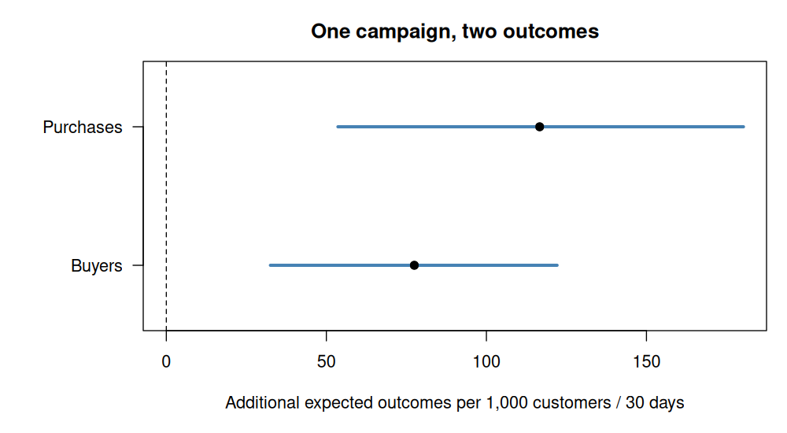

[Return to the Problem 4 walkthrough](#a09-problem4-walkthrough).


---


## 47. Common errors exposed by A09

**[Consolidation — The problem map](#a09-problem-map).** Diagnose mistakes by returning to the outcome, comparison, or causal question they change.

### Error 1: Using Gaussian regression for binary events

It can predict invalid probabilities and misrepresent event variance.

### Error 2: Treating a broad logit prior as neutral

It can imply near-certain events before seeing data.

### Error 3: Reading a logistic coefficient as a probability difference

It is a log-odds change.

### Error 4: Applying the inverse logit to a coefficient difference

Probability differences require inverse-transforming complete linear predictors first.

### Error 5: Treating odds ratios as absolute effects

The probability effect depends on baseline risk.

### Error 6: Aggregating heterogeneous trials

A grouped binomial model assumes a common modeled probability within each cell.

### Error 7: Conditioning on department while claiming the aggregate total contrast

Department adjustment changes the estimand under the mediator graph.

### Error 8: Averaging department effects without defining weights

The weighting distribution defines the target population.

### Error 9: Interpreting a Poisson coefficient as an additive count change

It is a log multiplicative change.

### Error 10: Ignoring exposure time or opportunities

Counts cannot be compared as rates without a denominator.

### Error 11: Rejecting Poisson from the marginal histogram

The equality of mean and variance is conditional on the model.

### Error 12: Using PSIS to establish causality

PSIS evaluates predictive approximation and influence, not identification.

### Error 13: Comparing information criteria across incompatible likelihood constants without care

Predictive criteria are safest for models using the same outcome distribution and data representation.

### Error 14: Assuming the link function solves omitted-variable bias

The link enforces outcome constraints; it does not repair the causal graph.

---

## 48. Lecture takeaways

**[Consolidation — The problem map](#a09-problem-map).** Consolidate the main distinctions before attempting the review questions.

1. Event likelihoods should match the support and opportunity structure of the outcome.
2. A GLM combines an outcome distribution, linear predictor, and link function.
3. Bernoulli models one binary trial.
4. Binomial models successes among a known number of trials.
5. Poisson models nonnegative event counts with no fixed observed maximum.
6. The logit link maps an unconstrained predictor to a probability.
7. The log link maps an unconstrained predictor to a positive expected count.
8. Logistic coefficients are changes in log odds.
9. Exponentiated logistic coefficients are odds ratios.
10. Poisson coefficients are changes in log expected counts.
11. Exponentiated Poisson coefficients are multiplicative count or rate ratios.
12. Absolute event effects require posterior predictions on the outcome scale.
13. Priors must be checked after inverse transformation.
14. Individual Bernoulli and grouped binomial models are equivalent only under valid aggregation.
15. The admissions example distinguishes aggregate and department-held-fixed contrasts.
16. Department weighting defines the standardized target population.
17. A link function makes parameters interact when translated to the outcome scale.
18. The `Kline` model allows contact-specific population relationships.
19. PSIS can expose influential event observations.
20. Mechanistic event models remain models requiring validation.
21. Exposure offsets distinguish event counts from event rates.
22. Event GLMs do not create causal identification by themselves.
23. CausalOps should store denominators, exposures, links, and contrast scales explicitly.

---

## 49. Review questions

**[Consolidation — The problem map](#a09-problem-map).** Check understanding of both likelihood families and the contrasts they support.

1. What are the three components of a generalized linear model?
2. Why is an ordinary linear model unsuitable for event probability?
3. What is the difference between probability, odds, and log odds?
4. How does a Bernoulli model differ from a binomial model?
5. When are individual Bernoulli and grouped binomial representations equivalent?
6. Why can aggregation destroy relevant information?
7. What does a logistic intercept prior imply on the probability scale?
8. Why can $\mathrm{Normal}(0,10)$ be extreme on the probability scale?
9. What does $\exp(\beta)$ mean in logistic regression?
10. Why is the corresponding probability difference not constant?
11. What are the aggregate and department-specific estimands in `UCBadmit`?
12. Why can their signs differ?
13. Under which graph is department a mediator?
14. How is a standardized department-held-fixed contrast calculated?
15. Why must department weights be stated?
16. What is the support of a Poisson outcome?
17. Why is the log link used for Poisson regression?
18. What does $\exp(\beta)$ mean in a Poisson model?
19. Why must Poisson priors be checked on the count scale?
20. What is the interaction structure in the `Kline` model?
21. How do expected-count and predictive-count intervals differ?
22. What does a high PSIS Pareto-$k$ value indicate?
23. How does the innovation-loss model differ from a generic log-linear model?
24. How is Poisson related to rare binomial events?
25. What is an exposure offset?
26. Why does marginal overdispersion not automatically invalidate Poisson regression?
27. How would you compute CRM conversion uplift on the probability scale?
28. How would you model purchase counts with unequal observation windows?
29. Why does a correct event likelihood not guarantee a causal estimate?
30. Which event metadata should CausalOps require?

---

## 50. Book reading guide

**[Consolidation — The problem map](#a09-problem-map).** Use the problem map to choose the relevant book material rather than reading the chapter as one model.

### Primary reading

- Chapter 10, *Big Entropy and the Generalized Linear Model*
  - Section 10.1, *Maximum entropy*
  - Section 10.2, *Generalized linear models*
  - link functions;
  - absolute versus relative differences;
  - omitted variables in GLMs;
  - prior implications on transformed scales.
- Chapter 11, *God Spiked the Integers*
  - Section 11.1, *Binomial regression*
  - Section 11.2, *Poisson regression*
  - grouped versus individual event data;
  - `UCBadmit`;
  - `Kline`;
  - count-model extensions.

### Read before A09

Focus on:

- the Gaussian item-response model and MCMC diagnostics from A08;
- posterior sampling and diagnostics;
- categorical index models;
- estimands and standardization;
- total versus direct effects.

### Revisit after A09

Return to:

- maximum-entropy and generative justifications for Bernoulli, binomial, and Poisson models;
- the distinction between linear predictor and expected outcome;
- prior predictive checks under logit and log links;
- admissions aggregation and department conditioning;
- probability-scale contrasts;
- the `Kline` interaction and process model.

### Material mainly developed in A10

The early part of `10_confounds_poisson.r` introduces:

- an unobserved applicant characteristic;
- latent confounding of department-conditioned admission contrasts;
- a joint model for department and admission;
- proxy measurements of the latent factor;
- sensitivity analysis.

These topics are reserved for **A10 — Confounds and Sensitivity Analysis**.

---

## 51. Official code guide

**[Consolidation — The problem map](#a09-problem-map).** Match the scientific examples to their original implementations and stated scope.

### `09_binomial_GLMs.r`

The script includes:

- inverse-logit visualization;
- priors on logistic intercepts;
- prior predictive logistic curves;
- sequential logistic updating;
- a simulated gender-department-admission process;
- total and department-specific models;
- log-odds and probability contrasts;
- aggregation from Bernoulli to binomial cells;
- the real `UCBadmit` data;
- MCMC trace and rank diagnostics;
- standardized predictions under changed gender perception;
- department-frequency weighting.

Core models:

$$ A \sim \mathrm{Bernoulli}(p) $$

or:

$$ A \sim \mathrm{Binomial}(N,p) $$

with:

$$ \mathrm{logit}(p) = \eta $$

### `10_confounds_poisson.r`

The A09-relevant Poisson section includes:

- priors on expected counts;
- prior predictive log-linear curves;
- the `Kline` tool-count data;
- an intercept-only Poisson model;
- a population-by-contact interaction;
- PSIS comparison and pointwise Pareto-$k$ diagnostics;
- posterior predictions on standardized and natural population scales;
- an innovation-loss process model.

Core interaction model:

$$ T_i \sim \mathrm{Poisson}(\lambda_i) $$

$$ \log(\lambda_i) = \alpha_{C_i} + \beta_{C_i}P_i $$

### Scope limitation

The script's latent-confound, proxy, and sensitivity sections are not developed here because they form the principal transition into A10.

### Complete problem walkthroughs

The five executable problem scripts are indexed in the [walkthrough source map](#a09-walkthroughs). They complement the official scripts with a directly reproducible sequence of code and results in the lesson. The grant extension has its own [primary walkthrough](#a09-lab-route). The named walkthroughs use their stated priors and numerical methods; agreement with other backends needs a separate comparison, not an assumption based on model names.


---

## 52. Sources

**[Consolidation — The problem map](#a09-problem-map).** Identify the source material supporting the main teaching sequence.

- Richard McElreath, *Statistical Rethinking: A Bayesian Course with Examples in R and Stan*, second edition, Chapters 10–11.
- Official `stat_rethinking_2026` repository and A09 lecture listing.
- Official script `09_binomial_GLMs.r`.
- Official script `10_confounds_poisson.r`, especially its Poisson and `Kline` sections.

---

## 53. Reproducible A09 laboratory

**[Grant laboratory — The complete grant question](#a09-lab-route).**

**Question in the grant problem:** Do female and male applicants have different award probabilities, and how does the answer change when both are compared at the same discipline composition?

**What to take forward:** Follow one dataset and one fitted model; distinguish raw rates, posterior estimates, and causal assumptions.

### 53.1 The problem, the evidence, and the route {#a09-lab-route}

**One dataset:** 2,823 grant applications, 467 awards, nine disciplines, and two recorded gender categories. **One direction:** female minus male. **Two headline answers:** an own-composition probability contrast and a contrast using the same pooled discipline distribution for both categories.

| Stage | Particular question | Where to see the calculation and its result |
|---|---|---|
| Observe | What happened, and out of how many applications? | Setup below; totals in 55; all 18 cells in 62 |
| Define | Which population are the groups being compared in? | Raw contrasts in 60; weights in 61 |
| Fit | How do the data update cell probabilities? | Primary fit in 64; numerical checks in 65 |
| Answer | What are the gaps and their uncertainty? | Posterior table and figure in 66; interpretation in 67–68 |
| Check | Could indexing or predictive behavior undermine the answer? | Deliberate bug in 69; prior and posterior checks in 70–72 |
| Challenge | Would a different assumption change the conclusion? | Recovery in 73; calibration in 74; sensitivity in 75; extensions in 76–77 |
| Report | What passed, what ran, and what can we conclude? | Checks in 78; commands in 79; final answer in 81; transition in 82 |

### 53.2 Source code: start with one complete script

The **primary reading route** is [A09_grants_walkthrough.R](../scripts/A09_grants_walkthrough.R). It produces the code outputs shown in this laboratory and the two grant figures. It uses numerical grid integration for the same independent-cell Normal-logit model, so it runs without compiling Stan. It requires `rethinking` only to load `NWOGrants`.

| Source file | Role | Needed for the primary route? |
|---|---|---|
| [A09_grants_walkthrough.R](../scripts/A09_grants_walkthrough.R) | Data → fit → contrasts → checks → sensitivity | **Yes: run this file** |
| [A09_grants_walkthrough_tidyverse.R](../scripts/A09_grants_walkthrough_tidyverse.R) | Same model and lesson steps, using tibbles, keyed joins, purrr and ggplot2 | Optional complete tidyverse route |
| [A09_prepare_grants.R](../scripts/A09_prepare_grants.R) | Export the canonical data for other backends | No |
| [A09_grants_ulam.R](../scripts/A09_grants_ulam.R) | Alternative R/rethinking fit | No |
| [A09_grants_cmdstanr.R](../scripts/A09_grants_cmdstanr.R) + [Stan model](../scripts/A09_grants.stan) | Alternative native Stan fit | No |
| [A09_grants_pymc.py](../scripts/A09_grants_pymc.py) | Alternative Python/PyMC fit | No |
| [A09_lab_walkthroughs.R](../scripts/A09_lab_walkthroughs.R) | Small teaching examples for diagnostics, SBC and pooling | Optional second pass |

Run the primary-route snippets below in their displayed order, or run the complete primary script from the repository root. The explicitly labeled alternative-backend and separate teaching examples are optional. The **Executed result** blocks on the primary route come from that script. The existing SBC, diagnostic and pooling demonstrations come from the separately linked teaching script. Headline results from earlier backend runs are distinguished from the newly executed grid calculation. No new HMC or cross-language parity validation is implied.

### 53.3 Load the actual data once

```{r a09-grants-step-53}
#| eval: false
# Start here. Run all blocks in order or run the complete script.
# rethinking is used only to load the dataset; fitting below uses base R.
data("NWOGrants",package="rethinking")
d <- data.frame(discipline_id=as.integer(NWOGrants$discipline),
  discipline=as.character(NWOGrants$discipline),
  gender_id=ifelse(NWOGrants$gender=="f",1L,2L),
  gender=ifelse(NWOGrants$gender=="f","female","male"),
  applications=NWOGrants$applications,awards=NWOGrants$awards)
d <- d[order(d$discipline_id,d$gender_id),]; rownames(d)<-NULL
keys <- paste(d$gender_id,d$discipline_id,sep="_")
ids <- sort(unique(d$discipline_id))
female <- match(paste(1,ids,sep="_"),keys)
male <- match(paste(2,ids,sep="_"),keys)
stopifnot(!anyNA(c(female,male)),!anyDuplicated(keys))
cat("Cells:",nrow(d),"; applications:",sum(d$applications),
    "; awards:",sum(d$awards),"\n")
```

**Executed result:**

```text
Cells: 18 ; applications: 2823 ; awards: 467
```

**Read the result.** There are 18 observed cells, not 18 applicants. The event is an award; the opportunity is an application. Identifiers determine how every later probability and weight is matched. The code retains the dataset's recorded categories and does not infer unrecorded applicant attributes.

**Notation used below.**

- $f$ denotes the aggregated female category and $m$ the aggregated male category;
- $p_{gd}$ is the modeled award probability for gender category $g$ in discipline $d$;
- $w_{d\mid g}$ is the proportion of category-$g$ applications submitted to discipline $d$;
- $w_d$ is one common target discipline distribution used for standardization;
- $\mathcal D$ denotes the complete observed dataset when it appears after a conditioning bar in a posterior probability.

### 53.4 Two passes through the laboratory

The core task is still Problem 1B: estimate award probabilities and compare groups at their observed or a common discipline composition. The next sections also contain optional computational and modeling extensions. You do not need to master all of them before understanding the homework answer.

| Reading pass | Sections | What to be able to do |
|---|---|---|
| First: understand the analysis | 55–64, the checklist in 65, then 66–72 and 81 | Identify trials and awards, calculate the contrasts, read uncertainty, and distinguish fit from causal identification |
| Second: investigate how the workflow could fail | 73–79 | Simulate known truths, calibrate an algorithm, vary assumptions, and explore information sharing across disciplines |

Section 65 introduces diagnostics one question at a time. Section 74 starts with one probability and four posterior draws before scaling up to SBC. Section 77 starts with two noisy discipline estimates before introducing a covariance matrix. Their small numerical examples are teaching models, not replacements for the NWOGrants fit.

The new [walkthrough script](../scripts/A09_lab_walkthroughs.R) generates the displayed examples and figures in sections 39, 65, 74, and 77. Run it from the repository root. Its diagnostic example requires the R package `posterior`; the other calculations use base R. The example chunks retain their verified outputs when rendering without refitting models.


---

## 54. Scope of the official A09 lecture

**[Grant laboratory — Scope of the exercise](#a09-lab-route).**

**Question in the grant problem:** Which parts reproduce the core award-probability homework, and which add optional checks or new models?

**What to take forward:** The primary answer uses the separate-cell binomial model. Calibration, pooling and cross-language checks are extensions, not prerequisites for reading the headline contrast.

The official A09 lecture concentrates primarily on:

- events and opportunity counts;
- maximum entropy;
- Bernoulli and binomial likelihoods;
- the logit link;
- `UCBadmit`;
- total versus department-conditioned contrasts;
- standardization over departments.

The Poisson material in this chapter is supported by the later part of `10_confounds_poisson.r` and Chapter 11. It is valuable preparation, but it should not obscure the principal A09 exercise: defining probability-scale contrasts for grouped binary events.

The latent-confounding portion of `10_confounds_poisson.r` remains assigned to A10.

**For this reading path:** follow the binomial grant calculation first. The count-model material earlier in A09 and the optional extensions below do not change the fact that every application here has a known binary award outcome.


---

## 55. Event data require opportunities

**[Grant laboratory — Define the observations](#a09-lab-route).**

**Question in the grant problem:** Do fewer awards mean a lower success probability, or simply fewer applications?

**What to take forward:** Every award count needs its application denominator; begin with the observed female and male rates.

An event count is meaningful only relative to its opportunity structure.

For `NWOGrants`:

- `awards` is the number of successful applications;
- `applications` is the number of opportunities;
- the observational cell is gender by discipline.

Two cells with 20 awards do not have the same modeled probability when one contains 40 applications and the other contains 400.

The contract is:

$$
0\le A_k\le N_k,
$$

where $A_k$ is awards and $N_k$ applications in cell $k$.

The parameter $p_k$ is the modeled probability that one application in cell $k$ receives an award.

The binomial likelihood is:

$$
A_k\sim\mathrm{Binomial}(N_k,p_k).
$$

Never model the proportion $A_k/N_k$ as if every cell had equal precision unless the variance model explicitly incorporates $N_k$.

### 55.1 Start with the observed denominators

```{r a09-grants-step-55}
#| eval: false
totals <- aggregate(cbind(awards,applications)~gender,d,sum)
totals$rate <- totals$awards/totals$applications
print(totals,digits=4,row.names=FALSE)
cat("Raw female-minus-male gap (percentage points):",
    round(100*(totals$rate[totals$gender=="female"]-
               totals$rate[totals$gender=="male"]),3),"\n")
# Same number of awards, very different opportunities: a separate toy example.
print(data.frame(awards=c(10,10),applications=c(20,100),rate=c(.5,.1)))
```

**Executed result:**

```text
gender awards applications   rate
 female    177         1188 0.1490
   male    290         1635 0.1774
Raw female-minus-male gap (percentage points): -2.838 
  awards applications rate
1     10           20  0.5
2     10          100  0.1
```

**Read the result.** Female applicants received 177 awards out of 1,188 applications; male applicants received 290 out of 1,635. The raw gap is about −2.84 percentage points. This is a descriptive rate difference; posterior regularization and uncertainty have not yet entered the calculation. The separate 10-award toy example shows why counts alone cannot answer the question.


---

## 56. Maximum entropy: what the argument establishes

**[Grant laboratory — Justify the likelihood](#a09-lab-route).**

**Question in the grant problem:** What assumptions let an award application be treated as a Bernoulli trial and a cell as binomial?

**What to take forward:** Binary support specifies possible outcomes; conditional independence and a common cell probability justify the binomial count likelihood. Entropy alone does not establish a causal model.

Maximum entropy selects a distribution with the least additional structure subject to stated constraints.

A **reference measure** specifies the baseline weighting relative to which a probability density and its entropy are defined. Changing that baseline can change a maximum-entropy result even when the numerical mean constraint is unchanged.

For one binary event $Y\in\{0,1\}$ with known expectation $p$:

$$
\Pr(Y=1)=p,
\qquad
\Pr(Y=0)=1-p.
$$

This is the Bernoulli distribution.

For $N$ exchangeable binary opportunities with common probability $p$, their sum is binomial:

Here **exchangeable** means that reordering the $N$ binary trials does not change their joint probability under the model. Together with a common probability and conditional independence, this justifies the binomial count representation.

$$
A=\sum_{i=1}^{N}Y_i
\sim
\mathrm{Binomial}(N,p).
$$

For a nonnegative count with only its expected value constrained, the maximum-entropy argument on the nonnegative integers leads to a geometric distribution, not Poisson. The Poisson distribution instead follows naturally from independent event arrivals, rare-event limits, or constraints that include the relevant combinatorial measure.

Therefore “maximum entropy” never means “choose a distribution from the outcome support alone.” The constraints and reference measure are part of the claim.

**Apply the argument to this dataset.** For one application, specifying mean award probability $p=0.17$ fixes probabilities 0.17 for award and 0.83 for no award. For 100 conditionally independent applications sharing that probability, the expected count is 17 and binomial variance is $100(0.17)(0.83)=14.11$. A common budget constraint or a cohort-level decision could violate the conditional-independence assumption even though each outcome remains binary. Section 76 returns to one way of modeling extra variation.


---

## 57. Bernoulli–binomial aggregation equivalence

**[Grant laboratory — Represent the same evidence](#a09-lab-route).**

**Question in the grant problem:** Can we use 18 grouped counts instead of 2,823 binary application rows without changing this posterior?

**What to take forward:** Yes, for the stated shared cell probabilities and conditionally independent trials; inspect the constant likelihood factor below.

Suppose a cell contains binary observations $y_1,\ldots,y_N$ with one common probability $p$.

The symbol $L_B(p)$ denotes the Bernoulli likelihood viewed as a function of unknown probability $p$. The product multiplies the contribution from each of the $N$ observed binary outcomes. The symbol $L_{\mathrm{Bin}}(p)$ denotes the corresponding grouped-binomial likelihood.

The Bernoulli likelihood is:

$$
L_B(p)=\prod_{i=1}^{N}p^{y_i}(1-p)^{1-y_i}
=p^A(1-p)^{N-A},
$$

where $A=\sum_i y_i$.

The binomial likelihood is:

$$
L_{\mathrm{Bin}}(p)
=
{N\choose A}p^A(1-p)^{N-A}.
$$

The combinatorial factor does not depend on $p$. With the same prior, both representations produce the same posterior for $p$.

Aggregation is safe only when all modeled predictors and the event probability are common within the cell.

It is unsafe when aggregation erases:

- applicant-level confounders;
- different exposures;
- repeated-measure identities;
- varying probabilities within a cell;
- information required by the target estimand.

### 57.1 Verify the equivalence with one real cell

```{r a09-grants-step-57}
#| eval: false
# First actual cell: same sequence likelihood up to the binomial coefficient.
k<-1; n<-d$applications[k]; a<-d$awards[k]
y<-c(rep(1,a),rep(0,n-a)); probs<-c(.10,.25,.50)
comparison<-data.frame(p=probs,
  log_individual=sapply(probs,function(p) sum(dbinom(y,1,p,log=TRUE))),
  log_grouped=dbinom(a,n,probs,log=TRUE))
comparison$gap<-comparison$log_grouped-comparison$log_individual
print(round(comparison,4),row.names=FALSE)
stopifnot(max(abs(comparison$gap-lchoose(n,a)))<1e-10)
cat("Constant gap equals log choose(n,a):",round(lchoose(n,a),4),"\n")
```

**Executed result:**

```text
p log_individual log_grouped     gap
 0.10       -26.0813     -5.8110 20.2703
 0.25       -22.2057     -1.9354 20.2703
 0.50       -27.0327     -6.7624 20.2703
Constant gap equals log choose(n,a): 20.2703
```

**Read the result.** The log-likelihoods differ by 20.2703 at every trial probability. This constant cancels when normalizing a posterior with the same prior. It does not mean the likelihoods have identical absolute values, or that any aggregation of heterogeneous applicants is safe.


---

## 58. Likelihood constants and predictive comparison

**[Grant laboratory — Define the prediction task](#a09-lab-route).**

**Question in the grant problem:** If the posterior is unchanged by aggregation, why can predictive-comparison scores still differ?

**What to take forward:** Predicting one applicant and predicting an entire cell are different held-out tasks. Preserve the same data unit when comparing predictive scores.

Bernoulli and aggregated binomial likelihoods differ by:

$$
\log {N\choose A}.
$$

This constant does not change posterior parameter inference.

It does change the numerical log likelihood and therefore can change WAIC or PSIS values if models use different data units or omit different constants.

Do not compare predictive criteria from:

- one row per application;
- one row per gender–discipline cell;

as if their pointwise predictive tasks were identical.

For LOO, “one point” must correspond to the held-out unit relevant to the prediction question.

**Use the preceding output.** For the first 39-application cell, the binary representation has 39 pointwise contributions and the grouped representation has one. Holding out one applicant asks for an individual prediction; holding out that cell asks for prediction of the entire cell. The constant difference in section 57 explains posterior equivalence, not interchangeability of these predictive tasks. A numerical LOO comparison would require a declared common held-out unit; no LOO score is fabricated here.


---

## 59. Logistic coefficients and non-collapsibility

**[Grant laboratory — Choose an interpretable scale](#a09-lab-route).**

**Question in the grant problem:** Does a changed log-odds coefficient prove that discipline composition explains a causal effect?

**What to take forward:** No. Compute probability contrasts and distinguish non-collapsibility from causal confounding.

An odds ratio can change after adjustment even when the adjustment variable is not a confounder.

This is **non-collapsibility** of the odds ratio.

Consequently, differences between a marginal log-odds coefficient and a discipline-adjusted log-odds coefficient do not by themselves prove confounding or mediation.

Probability-scale standardized contrasts are usually easier to align with the scientific question:

Here $\mathbb E_w$ means an average over disciplines using declared weights $w_d$, and $p(g,D)$ is the modeled award probability after setting gender category to $g$ while retaining discipline $D$.

$$
\Delta_p
=
\mathbb E_w[p(1,D)-p(0,D)].
$$

This is one more reason not to compare raw logistic coefficients across models as if they were the same estimand.

### 59.1 A changed odds ratio without confounding

This separate teaching example uses the same 50:50 latent composition for both predictor groups. It is not a fitted grant result.

```{r a09-grants-step-59}
#| eval: false
# Teaching population with no confounding: X and U are independent.
p <- outer(0:1,0:1,function(x,u) plogis(-2+log(2)*x+2*u))
marginal <- rowMeans(p)
cat("Conditional odds ratio:",2,"\n")
cat("Marginal odds ratio:",round(exp(diff(qlogis(marginal))),3),"\n")
cat("Marginal probability difference:",round(diff(marginal),3),"\n")
```

**Executed result:**

```text
Conditional odds ratio: 2 
Marginal odds ratio: 1.751 
Marginal probability difference: 0.13
```

**Read the result.** The conditional odds ratio is 2 while the marginal odds ratio is about 1.751. Their difference alone cannot demonstrate confounding. For the grant question, compute the desired weighted probability difference instead.


---

## 60. Three different gender comparisons

**[Grant laboratory — Name the contrast](#a09-lab-route).**

**Question in the grant problem:** Are we comparing the observed application mixtures or asking how groups compare at a common mixture?

**What to take forward:** The two choices use different weights. First compute them from raw rates, then repeat them for every posterior draw.

Let $G$ denote perceived applicant gender, $D$ discipline, and $A$ award.

### 60.1 Observed marginal disparity

$$
\Delta_{\mathrm{marginal}}
=
\Pr(A=1\mid G=f)-\Pr(A=1\mid G=m).
$$

This is descriptive and directly estimable from aggregate totals.

### 60.2 G-formula total contrast

The **g-formula** expresses an intervention or standardized contrast by combining conditional outcome predictions with a declared covariate distribution. Here it averages discipline-specific award probabilities using the observed discipline distribution within each gender category.

Under the relevant causal assumptions:

$$
\Delta_{\mathrm{total}}
=
\sum_d \Pr(A=1\mid G=f,D=d)\Pr(D=d\mid G=f)
-
\sum_d \Pr(A=1\mid G=m,D=d)\Pr(D=d\mid G=m).
$$

Each gender retains its observed discipline distribution. This includes pathways through discipline.

### 60.3 Standardized controlled contrast

For a declared target distribution $w_d$:

$$
\Delta_{\mathrm{controlled}}(w)
=
\sum_d w_d
\left[
\Pr(A=1\mid G=f,D=d)
-
\Pr(A=1\mid G=m,D=d)
\right].
$$

Both gender predictions use the same discipline weights.

The third quantity is often called a “direct effect” in the lecture exercise. More precisely, it is a standardized controlled contrast. Calling it a causal direct effect requires assumptions stated in Section 63.

### 60.4 Compute the two descriptive versions first

The following uses raw cell rates rather than posterior draws, so the change can be traced entirely to weights.

```{r a09-grants-step-60}
#| eval: false
rate <- d$awards/d$applications
nf <- d$applications[female]; nm <- d$applications[male]
w_f <- nf/sum(nf); w_m <- nm/sum(nm); w_pool <- (nf+nm)/sum(nf+nm)
names(w_f)<-names(w_m)<-names(w_pool)<-as.character(ids)
raw_total <- sum(w_f*rate[female])-sum(w_m*rate[male])
raw_standardized <- sum(w_pool*(rate[female]-rate[male]))
print(round(100*c(Observed_composition=raw_total,
                  Common_pooled_composition=raw_standardized),3))
```

**Executed result:**

```text
Observed_composition Common_pooled_composition 
                   -2.838                    -1.604
```

**Read the result.** The observed-composition gap is −2.84 points; the common pooled-composition gap is −1.60 points. Neither is yet the Bayesian estimate in section 66. Both use exactly the same 18 observed rates.


---

## 61. Why the weights are part of the estimand

**[Grant laboratory — Choose the target population](#a09-lab-route).**

**Question in the grant problem:** Which disciplines should count most in an overall standardized grant comparison?

**What to take forward:** Declare the target weights. Pooled applications and equal disciplines answer different questions.

No unique “average department-controlled effect” exists until a target distribution is chosen.

Possible weights include:

- pooled application frequencies;
- female application frequencies;
- male application frequencies;
- equal weights across disciplines;
- the discipline distribution of a policy target population.

This reconstruction uses pooled application frequencies:

$$
w_d=\frac{N_d}{\sum_jN_j}.
$$

Changing $w$ changes the estimand, not merely a computational detail.

Weights must be aligned by discipline identifier. A converged sampler cannot detect a permutation that attaches Physics weights to Medical Sciences predictions.

### 61.1 Inspect the actual discipline weights

```{r a09-grants-step-61}
#| eval: false
weights <- data.frame(id=ids,discipline=d$discipline[female],
  female=w_f,male=w_m,pooled=w_pool,equal=rep(1/length(ids),length(ids)))
print(weights,digits=3,row.names=FALSE)
stopifnot(all(abs(colSums(weights[c("female","male","pooled","equal")])-1)<1e-12))
```

**Executed result:**

```text
id          discipline  female   male pooled equal
  1   Chemical sciences 0.03283 0.0508 0.0432 0.111
  2 Earth/life sciences 0.10606 0.0954 0.0999 0.111
  3          Humanities 0.13973 0.1407 0.1403 0.111
  4   Interdisciplinary 0.06566 0.0642 0.0648 0.111
  5    Medical sciences 0.21886 0.1498 0.1789 0.111
  6   Physical sciences 0.03283 0.0826 0.0616 0.111
  7             Physics 0.00758 0.0410 0.0269 0.111
  8     Social sciences 0.34428 0.2599 0.2954 0.111
  9  Technical sciences 0.05219 0.1156 0.0889 0.111
```

**Read the result.** Social sciences account for roughly 34.4% of female applications and 26.0% of male applications; the common pooled weight is about 29.5%. Equal discipline weighting would instead give it 11.1%. That change selects a different target population, not a more correct arithmetic average.


---

## 62. The `NWOGrants` data contract

**[Grant laboratory — Validate the actual inputs](#a09-lab-route).**

**Question in the grant problem:** Do the data contain the correct awards, opportunities and matched gender–discipline pairs?

**What to take forward:** Check counts and identifiers before fitting. A model cannot repair incorrect row labels or denominators.

The data contain:

- 2,823 applications;
- 467 awards;
- 9 scientific disciplines;
- 2 aggregated gender categories;
- 18 gender–discipline cells.

Required invariants are:

| Field | Contract |
|---|---|
| `discipline_id` | contiguous integers 1–9 |
| `gender_id` | 1 = female, 2 = male |
| `applications` | positive integer opportunity count |
| `awards` | integer between 0 and applications |
| cell key | unique gender–discipline pair |
| discipline coverage | exactly two gender cells per discipline |
| totals | 2,823 applications and 467 awards |

Build the canonical cross-language table with:

```sh
Rscript scripts/A09_prepare_grants.R artifacts/A09/nwo_grants.csv
```

The published table contains aggregated gender categories. It cannot represent within-category gender diversity or applicant-level covariates that were not retained.

### 62.1 Inspect every cell and run the checks

```{r a09-grants-step-62}
#| eval: false
stopifnot(nrow(d)==18,length(ids)==9,sum(d$applications)==2823,
  sum(d$awards)==467,all(d$applications>0),all(d$awards>=0),
  all(d$awards<=d$applications),all(table(d$discipline_id)==2),
  !anyDuplicated(keys))
print(d,row.names=FALSE)
cat("PASS: 18 unique cells, nine complete discipline pairs, valid counts and totals.\n")
```

**Executed result:**

```text
discipline_id          discipline gender_id gender applications awards
             1   Chemical sciences         1 female           39     10
             1   Chemical sciences         2   male           83     22
             2 Earth/life sciences         1 female          126     18
             2 Earth/life sciences         2   male          156     38
             3          Humanities         1 female          166     32
             3          Humanities         2   male          230     33
             4   Interdisciplinary         1 female           78     17
             4   Interdisciplinary         2   male          105     12
             5    Medical sciences         1 female          260     29
             5    Medical sciences         2   male          245     46
             6   Physical sciences         1 female           39      9
             6   Physical sciences         2   male          135     26
             7             Physics         1 female            9      2
             7             Physics         2   male           67     18
             8     Social sciences         1 female          409     47
             8     Social sciences         2   male          425     65
             9  Technical sciences         1 female           62     13
             9  Technical sciences         2   male          189     30
PASS: 18 unique cells, nine complete discipline pairs, valid counts and totals.
```

**Read the result.** Female Physics has only nine applications, whereas female Social sciences has 409. Those cell probabilities will not be estimated with equal precision. The paired identifiers, not the order in which disciplines appeared in the source table, control subsequent weighting.


---

## 63. Causal interpretation and its limits

**[Grant laboratory — Limit the causal claim](#a09-lab-route).**

**Question in the grant problem:** When would comparing genders at a common discipline distribution identify a direct causal effect?

**What to take forward:** That requires assumptions about the graph and unobserved applicant characteristics. A correctly computed statistical contrast alone does not supply them.

A possible graph is:

$$
G\rightarrow D\rightarrow A,
$$

with a possible direct arrow:

$$
G\rightarrow A.
$$

Under this simple graph, leaving the gender-specific distribution of $D$ intact targets a total pathway, while holding $D$ to a common distribution removes the pathway through discipline.

But suppose latent applicant strength $U$ affects both discipline and award:

$$
G\rightarrow D\leftarrow U\rightarrow A.
$$


Here $U$ denotes unobserved applicant strength. A **collider** is a variable receiving arrows from two causes; in $G\rightarrow D\leftarrow U$, discipline $D$ is a collider. Conditioning on a collider can create a statistical association between its causes even when none existed before conditioning.
Conditioning on $D$ opens a collider path. The standardized controlled contrast can then be biased for a direct causal effect.

Additional problems include:

- gender is not a simple manipulable treatment;
- perceived gender may differ across stages;
- aggregate data omit applicant histories;
- selection into application is unmodeled;
- discipline choice may have unmeasured common causes with awards.

Therefore the code estimates well-defined posterior **contrasts**. A causal label requires the additional identification assumptions developed in A10.

**Concrete limit for the grant answer.** Suppose applicant qualifications influence both discipline choice and award. Comparing female and male applicants within a discipline may then select different qualification distributions. The same observed 18 counts can be compatible with different such latent mechanisms. A code block cannot resolve missing information by itself; the output of this section is a stated causal assumption, to be challenged in A10.


---

## 64. Saturated discipline-specific outcome model

**[Grant laboratory — Estimate cell probabilities](#a09-lab-route).**

**Question in the grant problem:** How do the 18 observed counts update the stated priors over award probabilities?

**What to take forward:** Fit the independent Normal-logit cell model once; reuse its posterior draws for all comparisons and checks.

For cell $k$ with gender $G_k$ and discipline $D_k$:

$$
A_k\sim\mathrm{Binomial}(N_k,p_k), \qquad \operatorname{logit}(p_k)=\alpha_{G_k,D_k}, \qquad \alpha_{g,d}\sim\mathrm{Normal}(0,1).
$$

A model is **saturated with respect to these cells** because it assigns a separate parameter to every observed gender–discipline combination.

### 64.1 Primary executable fit: one posterior per cell

The model has independent logits and independent cell likelihoods, so its posterior factorizes into 18 one-dimensional posteriors. The grid below approximates each posterior, then draws from their joint product. This is the same statistical cell model as the linked backend implementations, with a different numerical inference method. It is not a hierarchical pooling fit.

```{r a09-grants-step-64}
#| eval: false
#| code-fold: true
#| code-summary: "Show the complete numerical fitting helper"
# Saturated binomial model: independent Normal(0,1) cell logits.
# Fit each one-dimensional posterior on an evenly spaced logit grid.
fit_cells <- function(y,n,prior_mean=0,prior_sd=1,step=.01,S=60000) {
  alpha<-seq(-10,10,by=step);p<-plogis(alpha)
  mass<-vapply(seq_along(y),function(k) {
    z<-dbinom(y[k],n[k],p,log=TRUE)+dnorm(alpha,prior_mean,prior_sd,log=TRUE)
    w<-exp(z-max(z));w/sum(w)
  },numeric(length(alpha)))
  stopifnot(max(colSums(mass[abs(alpha)>9,,drop=FALSE]))<1e-8)
  draws<-vapply(seq_along(y),function(k)
    sample(p,S,replace=TRUE,prob=mass[,k]),numeric(S))
  list(draws=draws,mean=colSums(mass*p))
}
summary90 <- function(x)c(mean=mean(x),lo90=unname(quantile(x,.05)),
  hi90=unname(quantile(x,.95)),Pr_positive=mean(x>0))
contrasts <- function(p) {
  pf<-p[,female,drop=FALSE];pm<-p[,male,drop=FALSE]
  cbind(Total=drop(pf%*%w_f-pm%*%w_m),
        Standardized=drop((pf-pm)%*%w_pool))
}
set.seed(9064)
fit_grid <- fit_cells(d$awards,d$applications)
p_draw <- fit_grid$draws
colnames(p_draw)<-keys
# Refine the grid independently of posterior sampling variation.
fine <- fit_cells(d$awards,d$applications,step=.005,S=10)
stopifnot(max(abs(fit_grid$mean-fine$mean))<1e-6)
cat("Fitted probabilities:",ncol(p_draw),"; posterior draws:",nrow(p_draw),"\n")
cat("Maximum cell-mean change after grid refinement:",
    format(max(abs(fit_grid$mean-fine$mean)),digits=3),"\n")
```

**Executed result:**

```text
Fitted probabilities: 18 ; posterior draws: 60000 
Maximum cell-mean change after grid refinement: 5.55e-17
```

**Read the result.** The 60,000 rows are posterior draws, each containing all 18 cell probabilities. Grid refinement barely changes the deterministic posterior means. These checks concern integration accuracy; they do not prove a causal interpretation. Section 66 applies the already defined weights to these draws.

### 64.2 Alternative backend snippets and complete sources

These fragments show how the same model is expressed in other backends. They are not additional steps required after the grid fit. Use the complete files linked in section 53 for their data preparation, fitting objects, and output handling.

::: {.panel-tabset}
### R (rethinking)
```{r}
#| eval: false
m_grants <- ulam(
  alist(
    A ~ dbinom(N, p),
    logit(p) <- a[G, D],
    matrix[2, 9]:a ~ dnorm(0, 1)
  ),
  data = dat, chains = 4, cores = 4, iter = 2000, warmup = 1000,
  control = list(adapt_delta = 0.95), log_lik = TRUE, cmdstan = TRUE
)
post <- extract.samples(m_grants)
p <- inv_logit(post$a)
```

### Stan (Native)
```stan
total_female = dot_product(weight_female, to_vector(p_award[1]));
total_male = dot_product(weight_male, to_vector(p_award[2]));
total_risk_difference = total_female - total_male;

standardized_female = dot_product(weight_pooled, to_vector(p_award[1]));
standardized_male = dot_product(weight_pooled, to_vector(p_award[2]));
standardized_direct_risk_difference = standardized_female - standardized_male;
```

### Python (PyMC)
```python
logit_award = pm.Normal("logit_award", 0.0, 1.0, dims=("gender", "discipline"))
p_award = pm.Deterministic("p_award", pm.math.sigmoid(logit_award), dims=("gender", "discipline"))
pm.Binomial(
    "awards", n=applications, p=p_award[gender, discipline],
    observed=awards, dims="cell",
)
```
:::

## 65. Computational validation

**[Grant laboratory — Check numerical accuracy](#a09-lab-route).**

**Question in the grant problem:** Can we trust the computed posterior summaries rather than just the formulas?

**What to take forward:** The new grid route checks range and resolution. The MCMC route needs its own chain diagnostics; those are different numerical methods.

### 65.1 Why 4,000 draws are not necessarily 4,000 independent answers

A **chain** is a sequence of posterior draws produced by an algorithm. Adjacent MCMC draws are generally dependent. Run multiple chains from different initial states to check whether they reach compatible posterior regions. **Warmup** is the discarded initial period used to adapt the sampler. The retained draws describe posterior uncertainty; their finite number adds a separate source of numerical error.

First ask three questions: do chains agree, is the numerical precision sufficient, and did the sampler report geometric problems? These are separate from whether the model fits the data or identifies a causal effect.

### 65.2 Agreement and precision: R-hat, ESS, and MCSE

**R-hat** compares variation within and between chains. Modern implementations use rank normalization and split chains to detect location or scale disagreement. A value close to 1 is reassuring but does not prove convergence; values above 1.01 warrant investigation.

**Effective sample size (ESS)** expresses how much information a dependent sequence contains relative to independent draws. **Bulk ESS** concerns the central distribution; **tail ESS** concerns tail quantiles used in interval endpoints. Compute diagnostics for the derived grant contrasts as well as their component logits.

**Monte Carlo standard error (MCSE)** describes numerical precision, not the scientific uncertainty represented by a posterior interval. As an approximation for a posterior mean, $\mathrm{MCSE}\approx\mathrm{SD}_{\mathrm{post}}/\sqrt{\mathrm{ESS}_{\mathrm{mean}}}$. If a risk difference has posterior SD 0.03 and mean-specific ESS 100, MCSE is about 0.003; at ESS 2,500 it is about 0.0006. More draws can reduce MCSE without making the underlying posterior SD smaller.

The example below compares independent synthetic chains, one deliberately shifted chain, and strongly autocorrelated chains. These sequences illustrate diagnostics; they are not grant-model fits.

```{r a09-lab-diagnostics}
#| eval: false
# Synthetic chains, not the NWOGrants fit; posterior supplies modern diagnostics.
set.seed(9065)
chains <- matrix(rnorm(4000),nrow=1000,ncol=4)
shifted <- chains
shifted[,4] <- shifted[,4]+2
slow <- replicate(4,as.numeric(arima.sim(list(ar=.95),n=1000,
                                       sd=sqrt(1-.95^2))))
report <- function(x) c(Rhat=posterior::rhat(x),
  ESS_bulk=posterior::ess_bulk(x),ESS_tail=posterior::ess_tail(x),
  MCSE_mean=posterior::mcse_mean(x))
print(round(rbind(Independent=report(chains),Shifted_chain=report(shifted),
                  Correlated=report(slow)),3))
cat("If posterior SD = 0.03 and ESS for the mean = 100, MCSE is about",
    .03/sqrt(100),"\n")
cat("At ESS = 2500, it is about",.03/sqrt(2500),"\n")
```

**Executed result:**

```text
Rhat ESS_bulk ESS_tail MCSE_mean
Independent   1.00 4000.575 3896.848     0.016
Shifted_chain 1.32    9.804   34.329     0.446
Correlated    1.09   32.815  209.916     0.169
If posterior SD = 0.03 and ESS for the mean = 100, MCSE is about 0.003 
At ESS = 2500, it is about 6e-04
```

**Read the output.** The independent sequences agree (R-hat about 1) and provide about 4,000 effective draws. Moving one chain by 2 creates strong disagreement (R-hat about 1.32). The correlated sequences also yield much less information: bulk ESS is about 33 despite 4,000 stored values. Do not interpret the narrower numerical precision of the first row as evidence that its hypothetical scientific model is better.

### 65.3 Geometry and work: divergences, treedepth, and E-BFMI

**Hamiltonian Monte Carlo (HMC)** explores continuous parameter space using gradients and an artificial momentum. **NUTS**, the No-U-Turn Sampler, chooses trajectory lengths adaptively. You can read their warnings before learning the mechanics of either algorithm:

| Diagnostic | Question and concrete warning | What to examine next |
|---|---|---|
| Divergence | Did a numerical trajectory become inaccurate? Even a few post-warmup divergences may conceal biased exploration. | Parameter scales, priors and reparameterization; inspect where warnings occur, rather than merely deleting affected draws. |
| Maximum treedepth | Did NUTS hit its limit on trajectory doublings? Repeated hits indicate expensive or restricted exploration. | Geometry and efficiency; raising the limit can permit longer trajectories but is not a general fix for divergences. |
| E-BFMI | Does momentum resampling let the chain explore its energy distribution effectively? Values below about 0.3 are a warning. | Per-chain energy behavior, heavy tails, and parameterization. This is not an acceptance rate or a percentage of explained variance. |

For orientation, E-BFMI compares average squared changes between successive energy values with the variance of energy within a chain. A chain that changes energy very little relative to the range it needs to explore can have low E-BFMI even when a coefficient trace looks acceptable. The synthetic examples above have no HMC trajectories or energies, so they cannot yield these three HMC-specific diagnostics.

**First-pass checklist:** inspect all chain warnings, R-hat, bulk and tail ESS, and MCSE for the reported contrasts. Diagnose failures before trusting summaries. Good numerical diagnostics do not establish that unmeasured confounding is absent. Thresholds are warning guides, not certificates; consult the [Stan diagnostic guide](https://mc-stan.org/learn-stan/diagnostics-warnings.html).

### 65.4 Previously recorded NWOGrants computation

The following settings and results are retained from the laboratory's existing validation record; the teaching simulations above do not rerun that model.

The full native Stan validation used:

- four chains;
- 1,000 warmup iterations per chain;
- 1,000 retained iterations per chain;
- `adapt_delta = 0.95`;
- seed 202609.

Results:

- headline R-hat values approximately 1.00;
- zero post-warmup divergences;
- zero maximum-treedepth events;
- bulk ESS around 4,500–4,900 for the headline contrasts;
- E-BFMI around 0.99–1.07.

The `ulam()` full fit and PyMC smoke test returned compatible summaries.

These diagnostics support numerical reliability for the reported summaries. They do not prove that all posterior regions were explored or establish causal identification.

### 65.5 What was checked for the displayed grid route

The primary code in section 64 checks that posterior mass near the finite grid boundaries is negligible and repeats integration with twice the grid resolution. Those are the relevant numerical checks for this method. The stored posterior samples are independent draws from the discretized cell posteriors. The previous HMC diagnostics above are a separate historical record; no new MCMC run is required to reproduce the grid tables.


---

## 66. Homework A09 results

**[Grant laboratory — Read the main answer](#a09-lab-route).**

**Question in the grant problem:** What are the estimated gaps and how uncertain are they under the primary model?

**What to take forward:** Read both the contrast and its interval. A result near zero is not evidence that the two categories are exactly equal.

### 66.1 Compute both contrasts from the same joint draws

Use the weights created in section 60. For every posterior row, average the female and male probabilities under their own weights for the total contrast, and use one common pooled weight vector for the standardized contrast. The printed intervals are central 90% posterior intervals on the probability scale, not percentage points until multiplied by 100.

```{r a09-grants-step-66}
#| eval: false
posterior_contrasts<-contrasts(p_draw)
posterior_table<-t(apply(posterior_contrasts,2,summary90))
print(round(posterior_table,4))
probabilities<-rbind(
  Observed_composition=c(Female=mean(p_draw[,female]%*%w_f),
                         Male=mean(p_draw[,male]%*%w_m)),
  Common_composition=c(Female=mean(p_draw[,female]%*%w_pool),
                       Male=mean(p_draw[,male]%*%w_pool)))
print(round(probabilities,4))
dir.create("courses/figures/A09_grants",recursive=TRUE,showWarnings=FALSE)
write.csv(posterior_table,"courses/figures/A09_grants/posterior_summary.csv")
png("courses/figures/A09_grants/contrasts.png",width=1100,height=550,res=130)
z<-100*posterior_table
par(mar=c(5,8,3,1))
plot(z[,"mean"],1:2,xlim=range(z[,c("lo90","hi90")]),ylim=c(.6,2.4),
  yaxt="n",ylab="",xlab="Female minus male (percentage points)",pch=19,
  main="NWOGrants: changing the target composition")
axis(2,at=1:2,labels=rownames(z),las=1)
segments(z[,"lo90"],1:2,z[,"hi90"],1:2,col="steelblue",lwd=3)
points(z[,"mean"],1:2,pch=19);abline(v=0,lty=2)
invisible(dev.off())
```

**Executed result:**

```text
mean    lo90    hi90 Pr_positive
Total        -0.0257 -0.0486 -0.0030      0.0310
Standardized -0.0101 -0.0342  0.0141      0.2484
                     Female   Male
Observed_composition 0.1594 0.1852
Common_composition   0.1727 0.1827
```

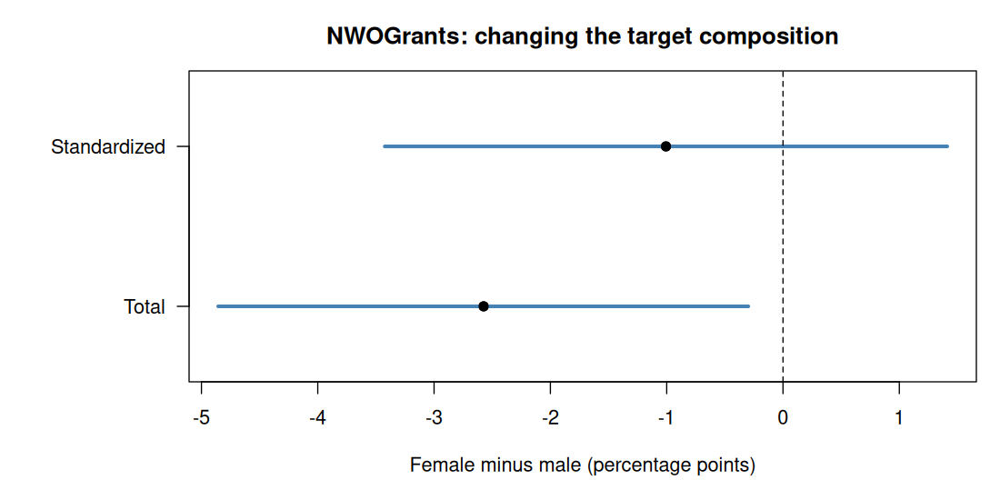

### 66.2 Read the result in the language of the problem

Under the primary Normal(0,1) logit model, the own-composition gap is about **−2.57 percentage points**, with a 90% interval **[−4.86, −0.30]**. Standardizing both categories to the pooled discipline distribution gives about **−1.01 points**, with interval **[−3.42, +1.41]**. The posterior probabilities of a positive contrast are about 3.1% and 24.8%, respectively.

The raw −2.84/−1.60-point comparisons in section 60 differ because these are regularized estimates of cell probabilities, not raw rates. The intervals quantify uncertainty under this specified model and prior. Their inclusion of zero does not establish equality.

The earlier backend record gave approximately −0.0256 and −0.0101 for the two means. The new grid results are close; this is not a fresh cross-language validation or a claim that every posterior quantile must match exactly. The [machine-readable summary](figures/A09_grants/posterior_summary.csv) records the current run.

---

## 67. What the homework result does and does not say

**[Grant laboratory — State what the answer establishes](#a09-lab-route).**

**Question in the grant problem:** What can we say about awards from these estimates without overstating what the grouped data identify?

**What to take forward:** Separate estimated disparities, assumptions about composition, and claims about discrimination or causal mechanisms.

The result supports these statements:

- observed award probability is lower for female applicants in aggregate;
- discipline composition explains an important portion of that disparity under the model;
- within-discipline evidence for a common average disadvantage is weak and uncertain.

It does not establish:

- absence of discrimination;
- that discipline should always be controlled;
- a natural direct causal effect;
- that unmeasured applicant characteristics are irrelevant;
- that every discipline has the same contrast;
- that gender categories are measured without error.

“No clear standardized contrast” is not equivalent to “the categories are equal.”

**A report tied to the result:** “At a common pooled discipline composition, the estimated female-minus-male award probability difference is about −1 point, with a 90% interval spanning approximately −3.4 to +1.4 points.” That sentence reports an estimand, scale, direction and uncertainty. “There is no discrimination” would assert something these data and this calculation do not establish.


---

## 68. Why the total and direct signs can differ

**[Grant laboratory — Explain the composition contribution](#a09-lab-route).**

**Question in the grant problem:** Why is the own-composition gap more negative than the common-composition gap?

**What to take forward:** Reconstruct the difference as an arithmetic decomposition of predictions and weights; this is not by itself a causal mediation analysis.

Write:

Here $\bar p_g$ is the marginal award probability for gender category $g$, obtained by mixing discipline-specific probabilities $p_{gd}$ with category-specific weights $w_{d\mid g}$. The weights are nonnegative and sum to one over disciplines.

$$
\bar p_g=\sum_d p_{gd}w_{d\mid g}.
$$

The marginal contrast depends on both:

- within-discipline award probabilities $p_{gd}$;
- gender-specific discipline distributions $w_{d\mid g}$.

The standardized contrast replaces both $w_{d\mid g}$ with one common $w_d$.

> [!IMPORTANT]
> **Simpson-type Reversal**
> This is the anatomy of Simpson-type reversal. Nothing paradoxical occurs: the estimands use different mixtures.
> The data do not “change their story.” The question changes.

### 68.1 Reconstruct the fitted total contrast

```{r a09-grants-step-68}
#| eval: false
# One transparent decomposition using the common pooled composition.
pf<-fit_grid$mean[female];pm<-fit_grid$mean[male]
common<-sum(w_pool*(pf-pm))
female_shift<-sum((w_f-w_pool)*pf)
male_shift<- -sum((w_m-w_pool)*pm)
reconstructed<-common+female_shift+male_shift
print(round(100*c(Common_composition=common,
  Female_composition_shift=female_shift,Male_composition_shift=male_shift,
  Total_reconstructed=reconstructed),3))
stopifnot(abs(reconstructed-(sum(w_f*pf)-sum(w_m*pm)))<1e-12)
```

**Executed result:**

```text
Common_composition Female_composition_shift   Male_composition_shift 
                  -1.006                   -1.323                   -0.244 
     Total_reconstructed 
                  -2.573
```

**Read the result.** Starting with the common-composition gap of about −1.01 points, the female and male composition shifts contribute about −1.32 and −0.24 points, yielding about −2.57 points in total. Both headline signs are negative in this dataset: the present result is attenuation, not an actual Simpson reversal. Other weights can change a sign, as section 75 shows. This decomposition is relative to the declared pooled target and is not a causal mediation decomposition.


---

## 69. A critical implementation failure: permuted weights

**[Grant laboratory — Prevent a silent implementation error](#a09-lab-route).**

**Question in the grant problem:** What happens if a probability is multiplied by another discipline’s weight?

**What to take forward:** The output can look plausible but target the wrong comparison. Match identifiers, not just vector lengths.

> [!WARNING]
> **Implementation Error: Permuted Weights**
> During validation, a deliberately exposed implementation error attached gender-specific application weights in raw row order to probabilities in factor-level discipline order.

The chains showed:

- R-hat near one;
- no divergences;
- excellent ESS;

yet the computed total contrast was wrong.

The correction is to align weights with `discipline_id` in every language. The executable example below preserves identifiers and checks that alignment explicitly.

This is why an analysis needs data and estimand tests in addition to sampler diagnostics.

### 69.1 Make the error visible, then defend against it

```{r a09-grants-step-69}
#| eval: false
correct<-sum(w_f*pf)-sum(w_m*pm)
# Deliberately attach both gender-specific weight vectors in reverse ID order.
wrong<-sum(rev(w_f)*pf)-sum(rev(w_m)*pm)
print(round(100*c(Correct=correct,Permuted_weights=wrong),3))
# A safe function demands matching keys instead of trusting vector position.
safe_average<-function(p,w) {
  stopifnot(!is.null(names(p)),!is.null(names(w)),
            setequal(names(p),names(w)))
  sum(p*w[names(p)])
}
names(pf)<-names(pm)<-as.character(ids)
recovered<-safe_average(pf,rev(w_f))-safe_average(pm,rev(w_m))
stopifnot(abs(correct-recovered)<1e-12)
cat("PASS: identifier alignment recovers the result even when weight order changes.\n")
```

**Executed result:**

```text
Correct Permuted_weights 
          -2.573           -3.447 
PASS: identifier alignment recovers the result even when weight order changes.
```

**Read the result.** Reversing weights without matching their names changes the mean gap from about −2.57 to −3.45 points without changing one posterior draw. The safe version matches discipline IDs and recovers the correct answer even if the weight vector arrives in a different order. Good sampler diagnostics cannot catch this semantic error.


---

## 70. Prior predictive checks for grants

**[Grant laboratory — Inspect assumptions before fitting](#a09-lab-route).**

**Question in the grant problem:** What award totals does the prior expect before it sees the 467 observed awards?

**What to take forward:** Prior simulations expose the implications of the logit scale and motivate a labeled prior-sensitivity check.

For each prior draw:

1. draw the 18 cell logits;
2. transform them to probabilities;
3. compute total and standardized contrasts;
4. simulate award counts with the observed application totals.

Inspect:

- probability mass near zero and one;
- prior total award rate;
- discipline-specific risk differences;
- the largest implied gender contrast;
- replicated cells with almost all or almost no awards.

The $\mathrm{Normal}(0,1)$ cell-logit prior is broad relative to an overall award rate near 0.17. A sensitivity prior such as

$$
\alpha_{g,d}\sim
\mathrm{Normal}(\operatorname{logit}(0.17),0.75)
$$

places more prior mass on plausible grant rates while still allowing strong discipline variation.

Prior choice should be judged through simulated probabilities and counts.

### 70.1 What totals do these two priors predict?

```{r a09-grants-step-70}
#| eval: false
set.seed(9070)
prior_counts<-function(mu,sd) {
  pp<-matrix(plogis(rnorm(10000*nrow(d),mu,sd)),ncol=nrow(d))
  yy<-matrix(rbinom(length(pp),size=rep(d$applications,each=nrow(pp)),
                    prob=as.vector(pp)),nrow=nrow(pp))
  rowSums(yy)
}
prior_default<-prior_counts(0,1)
prior_centered<-prior_counts(qlogis(.17),.75)
print(round(rbind(Normal_0_1=summary90(prior_default)[1:3],
  Rate_centered=summary90(prior_centered)[1:3]),1))
cat("Observed total awards:",sum(d$awards),"\n")
```

**Executed result:**

```text
mean lo90 hi90
Normal_0_1    1411.8 1124 1702
Rate_centered  546.4  399  713
Observed total awards: 467
```

**Read the result.** The default prior predicts about 1,412 awards, with a central 90% predictive range around 1,124–1,702, far above the observed 467. Its logit mean zero centers probabilities at 0.5. The rate-centered alternative predicts much lower totals. This is a reason to examine sensitivity, not to disguise a changed prior as the original analysis.

The value 0.17 is close to this dataset’s observed award rate. Unless supported by genuinely external knowledge, choosing it after seeing these outcomes is a data-informed sensitivity choice, not an independent prior-predictive validation. Section 75 labels that alternative explicitly.


---

## 71. Posterior predictive checks for grouped awards

**[Grant laboratory — Understand posterior prediction](#a09-lab-route).**

**Question in the grant problem:** How does uncertainty in an expected award count differ from variation in a replicated count?

**What to take forward:** A new count includes binomial event variation as well as uncertainty in the fitted probability.

For posterior draw $s$:

$$
A_k^{\mathrm{rep},(s)} \sim
\mathrm{Binomial}(N_k,p_k^{(s)}).
$$

Check:

- total awards;
- total awards by gender;
- total awards by discipline;
- maximum absolute cell-rate residual;
- dispersion of cell rates;
- **Pearson discrepancy**, a sum of squared residuals scaled by their model-implied variances;
- whether the same cells are repeatedly extreme.

The saturated model has one probability for every observed cell, so it can fit cell means closely. Posterior prediction still checks binomial variability, but it has limited ability to detect structure that was already saturated.

> [!NOTE]
> **Scientific Generalization**
> For scientific generalization to new disciplines, fit a hierarchical discipline model and evaluate leave-one-discipline-out prediction.

### 71.1 Follow the smallest cell through prediction

```{r a09-grants-step-71}
#| eval: false
# One cell shows expected-count uncertainty versus new count variation.
set.seed(9071)
k<-which.min(d$applications)
expected<-d$applications[k]*p_draw[,k]
replicated<-rbinom(nrow(p_draw),d$applications[k],p_draw[,k])
print(d[k,c("discipline","gender","applications","awards")],row.names=FALSE)
print(round(rbind(Expected_count=summary90(expected)[1:3],
                  Replicated_count=summary90(replicated)[1:3]),3))
```

**Executed result:**

```text
discipline gender applications awards
    Physics female            9      2
                  mean  lo90 hi90
Expected_count   2.840 1.223 4.77
Replicated_count 2.839 0.000 6.00
```

**Read the result.** For the nine female Physics applications, the posterior expected award count is about 2.84; its interval concerns uncertainty in that expectation. A replicated count is integer-valued and has additional event variation, here with a 90% interval from 0 to 6. Neither distribution changes the observed fact that two awards were recorded.


---

## 72. Posterior predictive code

**[Grant laboratory — Check observable implications](#a09-lab-route).**

**Question in the grant problem:** Does the fitted model produce plausible totals and residual variation for the observed opportunities?

**What to take forward:** Compare observed statistics with the same statistics computed on posterior replicates; adequate fit does not validate the causal story.

### 72.1 Replicate the counts in exactly the same cell order

The primary route below generates new counts at the observed cell sizes from the section 64 posterior draws. It then compares totals and a **Pearson discrepancy**: squared residuals divided by the corresponding binomial variances. Observed and replicated discrepancies use the same draw-specific expected counts and variances.

```{r a09-grants-step-72}
#| eval: false
set.seed(9072)
y_rep<-vapply(seq_len(nrow(d)),function(k)
  rbinom(nrow(p_draw),d$applications[k],p_draw[,k]),numeric(nrow(p_draw)))
colnames(y_rep)<-keys
rep_totals<-cbind(All=rowSums(y_rep),Female=rowSums(y_rep[,female]),
                  Male=rowSums(y_rep[,male]))
observed<-c(All=sum(d$awards),Female=sum(d$awards[female]),Male=sum(d$awards[male]))
print(round(data.frame(observed,t(apply(rep_totals,2,function(x)
  summary90(x)[1:3]))),1))
# Pearson discrepancies use the same posterior p for observed and replicated data.
expected<-sweep(p_draw,2,d$applications,"*")
variance<-sweep(p_draw*(1-p_draw),2,d$applications,"*")
observed_matrix<-matrix(d$awards,nrow(p_draw),nrow(d),byrow=TRUE)
T_obs<-rowSums((observed_matrix-expected)^2/variance)
T_rep<-rowSums((y_rep-expected)^2/variance)
cat("Posterior predictive tail fraction for Pearson discrepancy:",
    round(mean(T_rep>=T_obs),3),"\n")
png("courses/figures/A09_grants/ppc.png",width=1000,height=600,res=130)
hist(rep_totals[,"All"],breaks=35,col="lightblue",border="white",
  main="NWOGrants: replicated total awards",xlab="Total awards in a replicated cohort")
abline(v=sum(d$awards),col="firebrick",lwd=3)
legend("topright","Observed total",col="firebrick",lwd=3,bty="n")
invisible(dev.off())
```

**Executed result:**

```text
observed  mean lo90 hi90
All         467 492.1  447  539
Female      177 189.4  161  219
Male        290 302.8  268  339
Posterior predictive tail fraction for Pearson discrepancy: 0.5
```

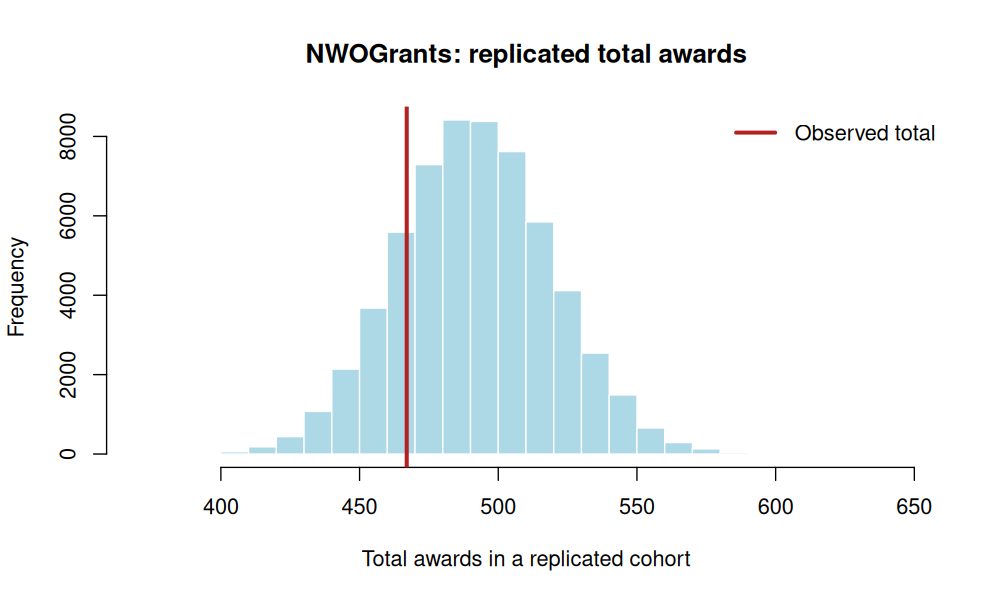

**Read the result.** The posterior predictive total averages about 492 awards, and the observed 467 lies in the displayed 90% predictive interval. Prior regularization need not make the replicated mean equal the observed total. The Pearson tail fraction near 0.5 is a comparison under this fitted model, not a probability that the model or causal claim is true.

The model gives each cell its own mean, so these checks have limited power to diagnose structure within cells. More detailed applicant or repeated-cohort data would be needed for those questions.

### 72.2 If you use the native Stan route instead

The Stan model generates `awards_rep`. After running its complete fitting script, extract that quantity and match columns to the original cell indices before applying the same summaries. The grid and Stan routes should target the same predictive quantity, but parity requires actually running and comparing both; it is not implied by similarly named output columns.

---

## 73. Parameter and estimand recovery

**[Grant laboratory — Recover a known answer](#a09-lab-route).**

**Question in the grant problem:** Does the complete fitting-and-weighting pipeline recover a deliberately chosen simulated contrast?

**What to take forward:** One recovery exercise checks one setting. Repeated prior-generated experiments are the separate SBC question in section 74.

A recovery test should simulate:

1. discipline-specific baseline logits;
2. discipline-specific female–male differences;
3. gender-specific discipline application distributions;
4. binomial award counts at the observed cell sizes.

Then fit the same model and recover:

- all cell probabilities;
- total contrast;
- standardized controlled contrast;
- discipline-specific contrasts.

The most important recovery test is for the estimands, because correct recovery of individual logits does not guarantee correct weighting code.

Test scenarios should include:

- no within-discipline contrast but strong composition imbalance;
- constant within-discipline disadvantage;
- heterogeneous effects with average near zero;
- sparse cells;
- one influential discipline.

### 73.1 Simulate one case with no within-discipline gap

```{r a09-grants-step-73}
#| eval: false
# One recovery exercise: no within-discipline difference, unequal composition.
# Chosen truths, not prior draws: this is NOT SBC.
set.seed(9073)
base<-seq(.08,.30,length.out=length(ids))
p_true<-base[match(d$discipline_id,ids)]
y_sim<-rbinom(nrow(d),d$applications,p_true)
recovery<-fit_cells(y_sim,d$applications,S=30000)
true_contrast<-contrasts(matrix(p_true,nrow=1))
recovered_contrast<-contrasts(recovery$draws)
print(round(cbind(truth=as.numeric(true_contrast),
  t(apply(recovered_contrast,2,summary90))[,1:3]),4))
stopifnot(abs(true_contrast[1,"Standardized"])<1e-12)
cat("One recovery run checks the pipeline; it does not establish coverage or SBC.\n")
```

**Executed result:**

```text
truth    mean    lo90   hi90
Total        -0.0021 -0.0065 -0.0312 0.0187
Standardized  0.0000 -0.0025 -0.0280 0.0233
One recovery run checks the pipeline; it does not establish coverage or SBC.
```

**Read the result.** The true standardized contrast is exactly zero because female and male probabilities are identical in every discipline. The true total contrast can still differ from zero because application weights differ. The fitted intervals include the truths in this particular run. One such success does not establish coverage or validate all recovery scenarios listed above.


---

## 74. Simulation-based calibration

**[Grant laboratory — Calibrate the inference procedure](#a09-lab-route).**

**Question in the grant problem:** Across repeated simulated datasets, are true values ranked as a correct posterior procedure requires?

**What to take forward:** Start with the existing Beta-binomial teaching example. It explains SBC without claiming that a full NWOGrants SBC suite has been run.

### 74.1 From recovering one truth to calibrating a procedure

Section 73 asks whether a fit can recover a selected generating setting. **Simulation-based calibration (SBC)** asks a repeated question: when truths are drawn from the model's own prior and data are generated from its likelihood, does the inference procedure behave as the posterior requires? It checks computation under that model, not whether the prior or likelihood is appropriate for real grants.

Start with a smaller model: one event probability $p\sim\mathrm{Beta}(2,2)$ and $Y\mid p\sim\mathrm{Binomial}(20,p)$. A Beta(a,b) distribution lives between zero and one and has mean $a/(a+b)$. Here the posterior is available exactly: $p\mid y\sim\mathrm{Beta}(2+y,2+20-y)$. For six successes it is Beta(8,16), with mean one third. This deliberately differs from the grants' Normal prior on logits so that no MCMC or grid approximation is needed to learn the SBC idea.

### 74.2 One rank, by hand

Imagine the generating probability is 0.30 and four illustrative posterior draws are 0.10, 0.20, 0.35, and 0.45. Two draws fall below the truth, so its **rank is 2**. The possible ranks with four draws are 0, 1, 2, 3, and 4. These four numbers are a counting illustration, not claimed random output from the preceding posterior.

A single middle rank establishes nothing. Repeat the entire experiment with a fresh prior truth and fresh dataset each time. For continuous parameters and independent exact posterior draws, truth and posterior draws are exchangeable conditional on the simulated data, so each rank is equally likely. This is a statement across repeated simulations, not an expectation that one posterior histogram should be uniform. See the [Stan SBC guide](https://mc-stan.org/docs/stan-users-guide/simulation-based-calibration.html).

### 74.3 A complete small experiment, including a deliberate error

The code runs 1,000 simulations with 19 posterior draws each. There are 20 possible ranks; the table groups them into five equal-width bins, each with expected count 200. A second calculation deliberately shifts posterior logits upward by 0.8, so truths tend to rank too low.

```{r a09-lab-sbc}
#| eval: false
# Exact Beta-binomial toy model: distinct from the grants' Normal-logit prior.
# One fixed numerical illustration of the rank calculation:
p_true <- .30; illustrative_draws <- c(.10,.20,.35,.45)
cat("Illustrative rank:",sum(illustrative_draws<p_true),"out of 0:4\n")
# If 6 of 20 trials succeed, Beta(2,2) updates to Beta(8,16).
cat("Posterior mean for y=6, n=20:",8/(8+16),"\n")
set.seed(9074)
B <- 1000; L <- 19; n <- 20
ranks <- biased_ranks <- integer(B)
for (b in seq_len(B)) {
  truth <- rbeta(1,2,2)                    # 1: draw a fresh truth from the prior
  y <- rbinom(1,n,truth)                  # 2: simulate its data
  draws <- rbeta(L,2+y,2+n-y)             # 3: exact independent posterior draws
  ranks[b] <- sum(draws<truth)            # 4: number below truth, from 0 to 19
  wrong_draws <- plogis(qlogis(draws)+.8) # deliberately biased algorithm
  biased_ranks[b] <- sum(wrong_draws<truth)
}
bins <- function(r) tabulate(r %/% 4+1,nbins=5)
print(data.frame(rank_range=c("0-3","4-7","8-11","12-15","16-19"),
  expected=B/5,exact=bins(ranks),biased=bins(biased_ranks)),row.names=FALSE)
dir.create("courses/figures/A09_lab",recursive=TRUE,showWarnings=FALSE)
png("courses/figures/A09_lab/sbc.png",width=1200,height=600,res=130)
par(mfrow=c(1,2),mar=c(4,4,3,1))
for (r in list(ranks,biased_ranks)) {
  barplot(bins(r),names.arg=c("0-3","4-7","8-11","12-15","16-19"),
    ylim=c(0,max(c(bins(ranks),bins(biased_ranks)))+20),
    main=if(identical(r,ranks)) "Exact posterior" else "Deliberately shifted posterior",
    xlab="Rank among 19 draws (grouped)",ylab="Number of simulations",col="steelblue")
  abline(h=B/5,lty=2)
}
invisible(dev.off())
```

**Executed result:**

```text
Illustrative rank: 2 out of 0:4
Posterior mean for y=6, n=20: 0.3333333 
 rank_range expected exact biased
        0-3      200   186    778
        4-7      200   195    126
       8-11      200   207     57
      12-15      200   203     30
      16-19      200   209      9
```

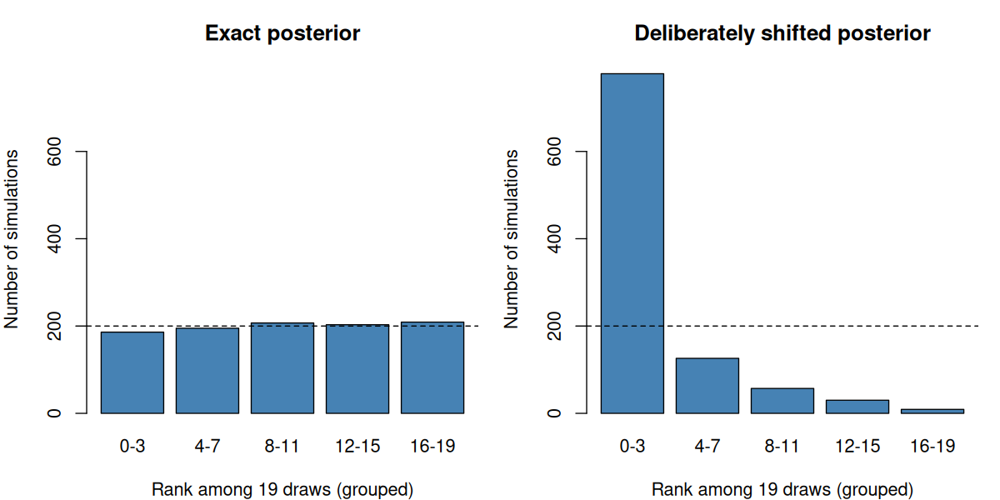

In this run, the exact-posterior bin counts range from 186 to 209, while the deliberately biased procedure places 778 of 1,000 ranks in the lowest bin. Expect random variation around 200, not equal bar heights. For a single bin the count SD is about $\sqrt{1000(0.2)(0.8)}=12.65$; simultaneous assessment of several dependent bins requires more than treating this as a universal cutoff. The deliberately shifted algorithm creates a systematic pattern. Other failures can produce other patterns, and a flat histogram alone cannot validate every aspect of an inference program.

### 74.4 Return to the 18 grant cells

To calibrate the actual grant pipeline, draw all 18 logits from its stated prior, transform them into cell probabilities, simulate awards at fixed application totals, and refit using the implementation being checked. For every repetition, compute both true and posterior total and standardized contrasts with the same correctly aligned weights. Rank each true quantity against its posterior draws and repeat over many datasets.

If weights or hyperparameters are modeled as random, simulate them from their model too; otherwise hold declared design quantities fixed. MCMC autocorrelation can distort ordinary rank histograms, so adequate effective sampling and an SBC procedure accounting for dependence are necessary. The independent Beta draws above avoid this complication. Continuous examples have no ties with probability one; discrete test quantities need appropriate randomized tie handling.

**What has been demonstrated here:** the rank calculation, repeated exact calibration, and detection of one deliberate bias. This example does not claim a completed SBC validation of the Stan, ulam, or PyMC NWOGrants implementation. Shared mistakes in both the truth calculation and the fitted estimand can also escape this check; retain the independent weight-alignment tests in section 69.

---

## 75. Sensitivity analysis

**[Grant laboratory — Test dependence on choices](#a09-lab-route).**

**Question in the grant problem:** Does the conclusion change with a different prior or a different target discipline population?

**What to take forward:** Report each scenario on the same probability scale and state whether the model or the estimand changed.

Vary one defensible assumption at a time:

- $\mathrm{Normal}(0,1)$ versus award-rate-centered logit priors;
- saturated versus hierarchical discipline effects;
- pooled versus equal discipline weights;
- pooled versus policy-population weights;
- binomial versus beta-binomial cell variation;
- inclusion of discipline-specific gender interactions;
- leave-one-discipline-out refits.

Report the same total and standardized contrasts in every scenario.

If the scientific conclusion changes when one discipline is removed or when target weights change modestly, that dependence is part of the result.

### 75.1 Put the alternative answers next to the primary result

```{r a09-grants-step-75}
#| eval: false
set.seed(9075)
alternative<-fit_cells(d$awards,d$applications,prior_mean=qlogis(.17),prior_sd=.75)
scenarios<-list(Default_total=posterior_contrasts[,"Total"],
  Default_pooled=posterior_contrasts[,"Standardized"],
  Default_equal=rowMeans(p_draw[,female]-p_draw[,male]),
  Centered_prior_pooled=contrasts(alternative$draws)[,"Standardized"])
print(round(t(vapply(scenarios,summary90,numeric(4))),4))
# Same independent cell fit, excluding one discipline and renormalizing weights.
# This changes the target population; it is not new-discipline prediction.
leave_out<-sapply(seq_along(ids),function(j) {
  w<-w_pool[-j]/sum(w_pool[-j])
  mean((p_draw[,female[-j],drop=FALSE]-p_draw[,male[-j],drop=FALSE])%*%w)
})
cat("Leave-one-discipline-out standardized posterior means, range:",
    paste(round(range(leave_out),4),collapse=" to "),"\n")
```

**Executed result:**

```text
mean    lo90    hi90 Pr_positive
Default_total         -0.0257 -0.0486 -0.0030      0.0310
Default_pooled        -0.0101 -0.0342  0.0141      0.2484
Default_equal          0.0111 -0.0250  0.0489      0.6834
Centered_prior_pooled -0.0172 -0.0399  0.0059      0.1078
Leave-one-discipline-out standardized posterior means, range: -0.0199 to 0.0039
```

**Read the result.** Equal discipline weights give a posterior mean around **+1.11 points**, whereas pooled application weights give **−1.01 points**. This changes the target population. Keeping the pooled target but using the rate-centered prior gives about **−1.72 points**; this changes a modeling assumption instead. All three standardized intervals span zero in this run.

Omitting one discipline and renormalizing the remaining pooled weights produces mean contrasts ranging from about −1.99 to +0.39 points. Because this primary model has independent cell parameters, the retained cells need no refit. The operation changes the target population and measures its dependence on discipline inclusion; it is not a test of prediction in a new discipline or a substitute for hierarchical leave-one-group-out validation.


---

## 76. Binomial overdispersion

**[Grant laboratory — Consider extra-binomial variation](#a09-lab-route).**

**Question in the grant problem:** Could a shared unmodeled cell process create more variation than the binomial likelihood allows?

**What to take forward:** A beta-binomial adds a random cell probability. One observed count per cell offers limited evidence for estimating that extra variation.

A **beta-binomial model** first lets the cell probability vary according to a beta distribution and then models the count conditionally as binomial. This adds more conditional variance than a binomial model with one fixed cell probability.

The binomial model assumes:

$$
\operatorname{Var}(A_k\mid p_k,N_k)=N_kp_k(1-p_k).
$$

Unmodeled within-cell heterogeneity can create extra-binomial variation.

A beta-binomial model allows cell probabilities to vary around a mean and introduces overdispersion.

But with only one aggregated count per gender–discipline cell, overdispersion is difficult to diagnose separately from cell effects. Applicant-level or repeated cohort data would be more informative.

Do not add a beta-binomial solely because observed cell rates vary; the saturated predictor already allows their expectations to differ.

### 76.1 Define the extra variance before trying to estimate it

Write $P_k\sim\mathrm{Beta}(\mu\kappa,(1-\mu)\kappa)$ and $A_k\mid P_k\sim\mathrm{Binomial}(N_k,P_k)$. Here $\mu$ is the mean probability and $\kappa>0$ its concentration. Marginalizing the shared cell probability gives

$$
\mathbb E[A_k]=N_k\mu,\qquad
\operatorname{Var}(A_k)=N_k\mu(1-\mu)\frac{N_k+\kappa}{1+\kappa}.
$$

The extra variation comes from a **shared random probability** for the trials in a cell or cohort. Independent trials with different fixed probabilities do not automatically have this variance inflation.

```{r a09-grants-step-76}
#| eval: false
# Illustration only: a shared random cell probability creates extra variation.
n<-100;mu<-.17;kappa<-20
alpha<-mu*kappa;beta<-(1-mu)*kappa
binomial_variance<-n*mu*(1-mu)
beta_binomial_variance<-binomial_variance*(n+kappa)/(1+kappa)
print(data.frame(model=c("Binomial","Beta-binomial"),mean=n*mu,
                 variance=c(binomial_variance,beta_binomial_variance)),digits=4,
      row.names=FALSE)
```

**Executed result:**

```text
model mean variance
      Binomial   17    14.11
 Beta-binomial   17    80.63
```

**Read the result.** Both toy models expect 17 awards out of 100 applications, but their variances are 14.11 and 80.63. The beta-binomial is therefore a substantive change in the data-generating assumptions, not just a different name for varying cell means. This numerical comparison does not claim a fitted beta-binomial model for the 18 real cells.


---

## 77. Hierarchical extension across disciplines

**[Grant laboratory — Consider information sharing](#a09-lab-route).**

**Question in the grant problem:** Should a sparse discipline borrow information from other disciplines instead of being fitted independently?

**What to take forward:** The pooling example explains that mechanism. A hierarchical fit is a separate model requiring its own priors and validation.

### 77.1 Why share information?

Suppose two disciplines both have an estimated female-minus-male log-odds contrast of −0.8. One estimate comes from many informative applications; the other has a much larger standard error. Treating them as equally reliable wastes that distinction. A hierarchical model lets each discipline use its own data and information about the distribution of effects across comparable disciplines.

**No pooling** estimates separate discipline effects. **Complete pooling** imposes one common effect. **Partial pooling** allows differences while drawing noisy estimates toward a shared distribution. Small sample size often means stronger pooling, but the relevant quantity is information, which also depends on event probabilities and design.

### 77.2 A numerical example before the logistic model

For intuition only, approximate an estimated discipline contrast as $\widehat b_d\mid b_d\sim\mathrm{Normal}(b_d,s_d)$, where $s_d$ is its known standard error, and let $b_d\sim\mathrm{Normal}(m,\tau)$ with known population mean $m$ and SD $\tau$. Normal updating gives

$$
\mathbb E[b_d\mid\widehat b_d]=w_d\widehat b_d+(1-w_d)m,
\qquad w_d=\frac{\tau^2}{\tau^2+s_d^2}.
$$

Here $w_d$ is a precision-based shrinkage weight, **not the discipline-composition weight used in the grant estimand**. At $m=0$, $\tau=0.3$, and estimate −0.8, a precise discipline with $s_d=0.1$ has posterior mean −0.72. A sparse discipline with $s_d=0.8$ has posterior mean about −0.099. More uncertainty in its own estimate produces greater movement toward the population mean.

### 77.3 Rebuild the grant model one coefficient at a time

Code $x_g=0$ for male and $x_g=1$ for female. Then

$$
A_{gd}\sim\mathrm{Binomial}(N_{gd},p_{gd}),\qquad
\operatorname{logit}(p_{gd})=\alpha_d+\beta_d x_g.
$$

Thus $\alpha_d$ is the male baseline log odds in discipline $d$ and $\beta_d$ is its female-minus-male log-odds contrast. Begin with separate population distributions $\alpha_d\sim\mathrm{Normal}(\bar\alpha,\tau_\alpha)$ and $\beta_d\sim\mathrm{Normal}(\bar\beta,\tau_\beta)$. The bars denote population means of coefficients, not average probabilities; the positive $\tau$ values describe how much disciplines differ.

**Exchangeability** means that, given this population description and any modeled discipline predictors, permuting discipline labels does not change the prior distribution. It does not say disciplines are identical. If disciplines have systematically different processes, include that structure or reconsider the shared population assumption. Prediction for a new discipline relies on its belonging to this modeled population.

### 77.4 What the covariance matrix adds

A **multivariate Normal (MVNormal)** is a joint Normal distribution for a vector of coefficients. It can allow baseline and contrast to vary together:

$$
\begin{pmatrix}\alpha_d\\\beta_d\end{pmatrix}
\sim\mathrm{MVNormal}\!\left(
\begin{pmatrix}\bar\alpha\\\bar\beta\end{pmatrix},
\Sigma\right),\qquad
\Sigma=\begin{pmatrix}
\tau_\alpha^2 & \rho\tau_\alpha\tau_\beta\\
\rho\tau_\alpha\tau_\beta & \tau_\beta^2
\end{pmatrix}.
$$

The diagonal entries are variances, the off-diagonal entries are covariances, and $-1<\rho<1$ is the correlation. With $\tau_\alpha=0.5$, $\tau_\beta=0.3$, and $\rho=0.4$, the entries are 0.25, 0.09, and 0.06. Positive correlation means higher baseline logits tend to accompany more positive category contrasts under the population model; it does not assert a causal relationship.

The code reproduces the shrinkage calculation, constructs this matrix, and generates coefficient pairs. `chol(Sigma)` is a matrix factor used to turn independent standard Normal draws into correlated ones. These are **prior simulations with fixed hyperparameters**, not a fitted hierarchical model.

```{r a09-lab-pooling}
#| eval: false
# Teaching approximation with known hyperparameters, not a fitted grant model.
m <- 0; tau <- .30
b_hat <- c(-.80,-.80); se <- c(.10,.80)
w <- tau^2/(tau^2+se^2)
pooled <- w*b_hat+(1-w)*m
print(data.frame(discipline=c("Precise","Sparse"),estimate=b_hat,se=se,
  data_weight=round(w,3),pooled_mean=round(pooled,3)),row.names=FALSE)
# A bivariate Normal prior for baseline and contrast:
tau_alpha <- .50; tau_beta <- .30; rho <- .40
Sigma <- matrix(c(tau_alpha^2,rho*tau_alpha*tau_beta,
                  rho*tau_alpha*tau_beta,tau_beta^2),2,2)
print(Sigma)
set.seed(9077)
z <- matrix(rnorm(20000),ncol=2)
coef <- sweep(z %*% chol(Sigma),2,c(qlogis(.20),0),FUN="+")
cat("Simulated prior correlation:",round(cor(coef)[1,2],3),"\n")
stopifnot(max(abs(cov(coef)-Sigma))<.02)
png("courses/figures/A09_lab/pooling.png",width=1000,height=600,res=130)
par(mar=c(5,5,3,1))
plot(b_hat,1:2,xlim=c(-.9,.1),ylim=c(.5,2.5),yaxt="n",pch=1,
  xlab="Discipline log-odds contrast",ylab="",main="Partial pooling: a normal approximation")
axis(2,at=1:2,labels=c("Precise","Sparse"),las=1)
arrows(b_hat,1:2,pooled,1:2,length=.1,col="steelblue",lwd=2)
points(pooled,1:2,pch=19,col="steelblue"); abline(v=m,lty=2)
legend("bottomright",c("Unpooled estimate","Pooled mean","Population mean"),
  pch=c(1,19,NA),lty=c(NA,NA,2),col=c("black","steelblue","black"),bty="n")
invisible(dev.off())
```

**Executed result:**

```text
discipline estimate  se data_weight pooled_mean
    Precise     -0.8 0.1       0.900      -0.720
     Sparse     -0.8 0.8       0.123      -0.099
     [,1] [,2]
[1,] 0.25 0.06
[2,] 0.06 0.09
Simulated prior correlation: 0.402
```

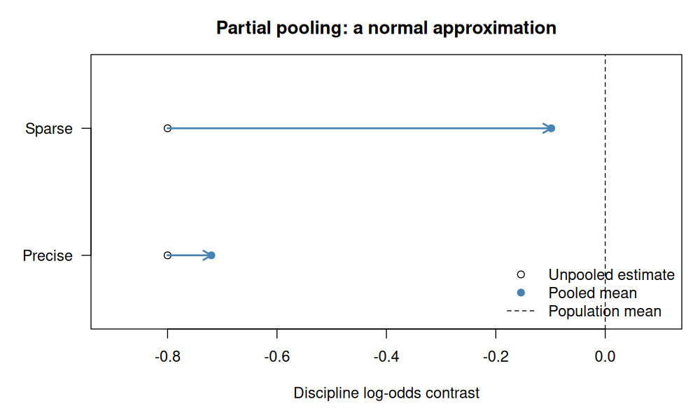

### 77.5 What a full hierarchical fit would still require

In a real hierarchical analysis the population means, scales, and correlation are generally unknown. They need declared priors, a joint fit, prior and posterior predictive checks, and computational diagnostics. Their posterior uncertainty must propagate into each discipline contrast. The Normal calculation above explains the mechanism but is not the exact posterior formula for a binomial-logistic model.

For every posterior draw, compute $p_{md}=\operatorname{logit}^{-1}(\alpha_d)$ and $p_{fd}=\operatorname{logit}^{-1}(\alpha_d+\beta_d)$ before applying the target discipline weights. Do not replace the standardized probability difference with $\bar\beta$. Compare the resulting estimand with the saturated model as a sensitivity analysis. The separate-cell model remains the transparent primary homework solution; pooling is an extension justified by a scientific population assumption.

---

## 78. Fitness-style acceptance suite

**[Grant laboratory — Check what has actually passed](#a09-lab-route).**

**Question in the grant problem:** Which parts of this execution have evidence of correctness, and which checks remain outside its scope?

**What to take forward:** Use the printed checks for the grid route. Do not count unrun HMC, calibration, or cross-language tests as passed.

| Stage | Test | Pass condition |
|---|---|---|
| Data | awards within opportunities | all $0\le A_k\le N_k$ |
| Keys | complete gender–discipline grid | 18 unique cells |
| Totals | source-data checksum | 2,823 applications; 467 awards |
| Weights | ID alignment | names/order match discipline IDs |
| Weights | normalization | every weight vector sums to one |
| Aggregation | Bernoulli/binomial equivalence | compatible posterior under common $p$ |
| Prior predictive | event rates/counts plausible | declared discrepancy bounds pass |
| Recovery | known estimands recovered | bias/coverage tolerance passes |
| Chains | R-hat | below 1.01 for final run |
| Geometry | divergences | zero post-warmup |
| Geometry | treedepth | zero saturation |
| Precision | MCSE/ESS | adequate for reported decimals |
| PPC | grouped outcomes | no material systematic discrepancy |
| Cross-language | estimand parity | differences compatible with MCSE |
| Sensitivity | alternative weights/priors | scenario table produced |
| Report | Quarto | render exits successfully |

The weight-alignment test is mandatory because MCMC diagnostics cannot detect semantic index permutations.

### 78.1 Checks executed by the primary route

```{r a09-grants-step-78}
#| eval: false
checks<-c(complete_cells=nrow(d)==18 && !anyDuplicated(keys),
  valid_counts=all(d$awards>=0 & d$awards<=d$applications),
  correct_totals=sum(d$applications)==2823 && sum(d$awards)==467,
  weights_normalized=all(abs(c(sum(w_f),sum(w_m),sum(w_pool))-1)<1e-12),
  aligned_draws=identical(colnames(p_draw),keys),
  refinement=max(abs(fit_grid$mean-fine$mean))<1e-6,
  decomposition=abs(reconstructed-correct)<1e-12,
  permutation_defense=abs(correct-recovered)<1e-12)
print(checks)
stopifnot(all(checks))
cat("PASS for these deterministic checks only; HMC and cross-language parity not run.\n")
```

**Executed result:**

```text
complete_cells        valid_counts      correct_totals  weights_normalized 
               TRUE                TRUE                TRUE                TRUE 
      aligned_draws          refinement       decomposition permutation_defense 
               TRUE                TRUE                TRUE                TRUE 
PASS for these deterministic checks only; HMC and cross-language parity not run.
```

**Read the result.** These checks cover data structure, identities and numerical integration. The broader acceptance table above is a workflow specification, not a list of tests all completed by this script. Scientific prior plausibility needs interpretation (section 70); HMC diagnostics, full SBC, hierarchical validation and cross-language parity require their separate runs.


---

## 79. Reproducible execution

**[Grant laboratory — Reproduce the result](#a09-lab-route).**

**Question in the grant problem:** Which command reproduces the displayed tables and figures, and which files implement alternative backends?

**What to take forward:** Start with the single readable walkthrough; choose an alternative backend only when that is the computation you intend to reproduce.

### 79.1 One command for the displayed reading route

From the repository root:

```sh
Rscript scripts/A09_grants_walkthrough.R
```

It prints the labeled section results and writes `posterior_summary.csv`, `contrasts.png`, and `ppc.png` under `courses/figures/A09_grants/`. The code blocks in the MD/QMD are excerpts from that file. The HTML contains the verified outputs, so reading it does not require R or a model fit.

For the complete **tidyverse version**, run:

```sh
Rscript scripts/A09_grants_walkthrough_tidyverse.R
```

This companion follows the same numbered lesson steps, using `dplyr` and `tidyr` for tables and identifier-based joins, `purrr` for cell-wise grid fitting, `readr` for CSV exports, and `ggplot2` for figures. It requires those packages plus `tibble` and `rethinking` (data only). It writes its tables and figures separately under `courses/figures/A09_grants_tidyverse/`. The statistical model and contrasts are unchanged. The leave-one-discipline-out means use direct grid expectations instead of Monte Carlo averages. Both routes use grid integration; neither runs HMC or a full SBC experiment.

For the separate small diagnostic, SBC and pooling demonstrations:

```sh
Rscript scripts/A09_lab_walkthroughs.R
```

### 79.2 Optional alternative fitting backends

Choose one backend and prepare its data first. The following commands document the alternatives; reproducing the displayed grid results does not require running all of them. Check the packages and compiler required by the chosen script.

```sh
Rscript scripts/A09_prepare_grants.R artifacts/A09/nwo_grants.csv

Rscript scripts/A09_grants_ulam.R artifacts/A09/nwo_grants.csv

Rscript scripts/A09_grants_cmdstanr.R \
  artifacts/A09/nwo_grants.csv \
  scripts/A09_grants.stan \
  artifacts/A09

conda run -n causal1 python scripts/A09_grants_pymc.py \
  --data artifacts/A09/nwo_grants.csv \
  --output artifacts/A09
```

Short smoke tests check syntax and dimensions but are not final inference:

```sh
Rscript scripts/A09_prepare_grants.R /tmp/a09_grants.csv

A09_QUICK=true Rscript scripts/A09_grants_ulam.R /tmp/a09_grants.csv

A09_QUICK=true Rscript scripts/A09_grants_cmdstanr.R \
  /tmp/a09_grants.csv scripts/A09_grants.stan /tmp/a09_stan

conda run -n causal1 python scripts/A09_grants_pymc.py \
  --data /tmp/a09_grants.csv \
  --output /tmp/a09_pymc \
  --quick
```

---

## 80. Additional common errors

**[Grant laboratory — Recognize failure modes](#a09-lab-route).**

**Question in the grant problem:** Which practical mistakes could change the grant answer while leaving the software apparently functional?

**What to take forward:** Use the weight-permutation and predictive-unit examples to distinguish semantic mistakes from sampler failures.

### Error 15: Treating a proportion as equally precise in every cell

The denominator controls binomial information.

### Error 16: Calling any department adjustment a direct causal effect

Identification requires assumptions about mediator–outcome confounding and collider paths.

### Error 17: Using gender-specific weights for a controlled contrast

Different weights reintroduce the composition pathway.

### Error 18: Permuting weights and predictions

Excellent MCMC diagnostics cannot detect semantic index misalignment.

### Error 19: Comparing marginal and conditional odds ratios as the same quantity

Logistic odds ratios are non-collapsible.

### Error 20: Comparing LOO across different data units

Individual Bernoulli and grouped binomial rows define different pointwise prediction tasks.

### Error 21: Interpreting aggregate gender categories as randomized treatment

The estimated disparities require careful causal language.

### Error 22: Using a saturated model to claim generalization to new disciplines

New-group prediction needs an exchangeable hierarchical model.

**Use the executed counterexamples.** Section 69 changes the answer by permuting weights without changing the posterior. Section 75 changes it by deliberately choosing equal rather than pooled weights. The first is a bug; the second is a different estimand. The distinction is essential when reviewing a seemingly surprising output.


---

## 81. Homework A09 — complete answer

**[Grant laboratory — Write the homework answer](#a09-lab-route).**

**Question in the grant problem:** How should the estimands, numerical results, uncertainty and causal limitations be reported together?

**What to take forward:** Use the values from the named executed route, with the same direction and target weights throughout.

### Question

> The data in `data(NWOGrants)` are decisions for 2,823 grant applications in 9 scientific disciplines. These data are organized just like the Berkeley application data from lecture and the book. Estimate both the total and direct effect of applicant gender on probability of award.

### Operational estimands

The reported orientation is female minus male.

Total composition-preserving contrast:

$$
\Delta_T
=
\sum_d p_{fd}w_{d\mid f}
-
\sum_d p_{md}w_{d\mid m}.
$$

Pooled-discipline standardized contrast:

$$
\Delta_C
=
\sum_d w_d(p_{fd}-p_{md}).
$$

### Answer

For the executed grid route in `A09_grants_walkthrough.R`, the posterior mean total contrast is approximately -0.0257, with a central 90% posterior interval of about [-0.0486, -0.0030] and about 3.1% posterior probability above zero.

The pooled-discipline standardized contrast is approximately -0.0101, with a central 90% interval of about [-0.0342, 0.0141] and about 24.8% posterior probability above zero. These values come from the same model draws and weights displayed in sections 64–66; they are not a new HMC run.

Thus the aggregate award disparity is more negative than the comparison obtained after placing both categories into the same discipline distribution. Discipline composition explains an important part of the marginal disparity. The remaining standardized contrast is uncertain and compatible with small differences in either direction.

### Causal qualification

For a causal interpretation, **positivity** requires every intervention level being compared to have positive probability within relevant covariate strata. **Consistency** requires the observed outcome under the treatment actually received to equal the corresponding potential outcome under that treatment. **No unmeasured confounding** requires the adjustment set to block relevant noncausal common-cause paths.

These are model-based probability contrasts. Interpreting the second as a direct causal effect requires no unmeasured discipline–award confounding, adequate positivity, consistency, and a defensible intervention/interpretation for perceived gender. Those assumptions cannot be established from the 18 aggregated cells alone.

### Reporting sentence

> Female applicants had an estimated aggregate award probability about 2.6 percentage points lower than male applicants. Standardizing both categories to the same pooled discipline distribution reduced the estimated difference to about 1.0 percentage point, with substantial posterior uncertainty across zero. The contrast attenuation is consistent with different application patterns across disciplines, but the aggregate data alone do not identify a direct causal effect without additional assumptions.

**Trace the answer back to its source:** counts in 55 and 62 → weights in 60–61 → posterior cell probabilities in 64 → summaries in 66 → qualifications in 63, 67 and 75. This chain is the reproducible answer, rather than a standalone numerical claim.


---

## 82. Revised transition to A10

**[Grant laboratory — Identify the remaining problem](#a09-lab-route).**

**Question in the grant problem:** What if discipline adjustment selects applicants with different unobserved qualifications?

**What to take forward:** The numerical workflow is complete, but causal identification remains conditional; A10 investigates that hidden-selection mechanism.

A09 establishes how to compute conditional and standardized event contrasts.

A10 asks what happens when the controlled variable is also a collider or when an unobserved applicant characteristic affects both discipline and award.

The transition is:

$$
\text{identified contrast under a simple DAG}
\longrightarrow
\text{latent alternative DAGs}
\longrightarrow
\text{sensitivity parameters}
\longrightarrow
\text{robustness analysis}.
$$

This distinction prevents a correct logistic regression from being mistaken for a complete causal identification argument.

**The unresolved question to carry forward:** would the common-discipline contrast change if unmeasured qualifications influenced both discipline choice and award? A10 holds the target comparison explicit while varying assumptions about that hidden selection. The transition concerns identification, not another way to calculate the same weighted average.


---

## 83. Additional sources

**[Grant laboratory — Locate evidence and implementation](#a09-lab-route).**

**Question in the grant problem:** Where can the source data, model specification and executed examples be inspected?

**What to take forward:** Use the linked scripts to distinguish the primary walkthrough from alternative fits and conceptual extensions.

- Official homework A09, `homework/homework_A09.pdf`.
- Official lecture A09, *Modeling Events*, 3 March 2026.
- `rethinking::NWOGrants` data and documentation.
- New executable scripts `A09_prepare_grants.R`, `A09_grants_ulam.R`, `A09_grants.stan`, `A09_grants_cmdstanr.R`, and `A09_grants_pymc.py`.
- Beginner walkthroughs: `scripts/A09_lab_walkthroughs.R` (count mixtures, synthetic-chain diagnostics, SBC, and partial pooling).
- [Stan diagnostic guidance](https://mc-stan.org/learn-stan/diagnostics-warnings.html) and [simulation-based calibration](https://mc-stan.org/docs/stan-users-guide/simulation-based-calibration.html).
- [R negative-binomial parameterization](https://stat.ethz.ch/R-manual/R-devel/library/stats/html/NegBinomial.html).

- Primary code and displayed results: [A09_grants_walkthrough.R](../scripts/A09_grants_walkthrough.R).
- Current numeric output: [posterior_summary.csv](figures/A09_grants/posterior_summary.csv).
- Alternative backend source links are collected in [section 53](#a09-lab-route).


---

## 84. Annex: Complete Solutions to Review Questions

**[Consolidation — All A09 problems](#a09-problem-map).**

**Question for the whole chapter:** How do binary events, counts, group comparisons and causal assumptions fit together?

**What to take forward:** These review questions cover the whole course chapter, not only the grant laboratory. Return to the corresponding worked examples when a definition alone does not explain the result.

These answers follow the 30 questions in section 49. The Poisson material extends the core binomial lecture, as explained in section 54.

#### 1. What are the three components of a generalized linear model?

A **generalized linear model (GLM)** combines:

1. An **outcome distribution** appropriate to the observations, such as Bernoulli, binomial, or Poisson.
2. A **linear predictor**, such as $\eta_i=\alpha+X_i^{\mathsf T}\beta$.
3. A **link function** connecting the expected outcome to that predictor: for example, $\operatorname{logit}(p_i)=\eta_i$ or $\log(\lambda_i)=\eta_i$.

A Bayesian GLM additionally specifies priors for its unknown parameters.

#### 2. Why is an ordinary linear model unsuitable for event probability?

An unconstrained linear predictor can produce values below zero or above one, which cannot be event probabilities. Gaussian errors also fail to represent the binary outcome support and its probability-dependent variance $p_i(1-p_i)$. A Bernoulli model with a logit link respects these constraints. A linear probability model can sometimes provide a useful approximation, but it is not a coherent binary generative model over an unrestricted predictor range.

#### 3. What is the difference between probability, odds, and log odds?

For an event probability $0<p<1$:

$$
\text{probability}=p,\qquad
\text{odds}=\frac{p}{1-p},\qquad
\text{log odds}=\log\frac{p}{1-p}.
$$

Probability compares successes with all opportunities; odds compare successes with failures. For example, $p=0.8$ gives odds of $4$ and log odds of $\log 4$. Probability lies between zero and one, odds are positive, and log odds can be any real number.

#### 4. How does a Bernoulli model differ from a binomial model?

A Bernoulli model describes one trial, $Y_i\sim\mathrm{Bernoulli}(p_i)$ with $Y_i\in\{0,1\}$. A binomial model describes the total successes in $N$ conditionally independent trials sharing probability $p$: $Y\sim\mathrm{Binomial}(N,p)$ with $Y\in\{0,\ldots,N\}$. Bernoulli is the special case $N=1$. The binomial denominator is part of the data and determines the precision of the observed proportion.

#### 5. When are individual Bernoulli and grouped binomial representations equivalent?

They yield the same parameter posterior, with the same priors, when trials within each group are conditionally independent and share the same modeled success probability. If $y=\sum_i y_i$, their likelihoods differ only by the parameter-independent binomial coefficient:

$$
\prod_{i=1}^N p^{y_i}(1-p)^{1-y_i}
=p^y(1-p)^{N-y},\qquad
p(y\mid N,p)=\binom Ny p^y(1-p)^{N-y}.
$$

Equivalence for parameter inference does not make their predictive scoring units interchangeable: leaving out one person and leaving out an entire cell are different prediction tasks.

#### 6. Why can aggregation destroy relevant information?

Aggregation can discard individual covariates, treatment assignments, exposure histories, and dependencies needed for prediction or causal adjustment. If individual probabilities differ, their independent sum is generally not binomial with a single common probability. Aggregation is lossless for the specified common-probability model, but not necessarily for a richer model or a different estimand.

#### 7. What does a logistic intercept prior imply on the probability scale?

For an intercept-only logistic model, $p=\operatorname{logit}^{-1}(\alpha)$. A prior on $\alpha$ therefore induces a prior on baseline probability. For example, $\alpha\sim\mathrm{Normal}(0,1)$ places approximately 95% of its probability between baseline probabilities 0.12 and 0.88. With predictors, the intercept describes their reference values; full prior predictive checks must also include slopes and the actual predictor range.

#### 8. Why can $\mathrm{Normal}(0,10)$ be extreme on the probability scale?

The standard deviation 10 is enormous on the log-odds scale. Values $\alpha=10$ and $\alpha=-10$ imply probabilities approximately 0.99995 and 0.000045. Thus $\alpha\sim\mathrm{Normal}(0,10)$ assigns substantial mass to nearly deterministic outcomes. It is not a neutral prior over probabilities merely because it is broad over coefficients.

#### 9. What does $\exp(\beta)$ mean in logistic regression?

In a logistic model with coefficient $\beta$ for predictor $x$, $\exp(\beta)$ is the **conditional odds ratio** for a one-unit increase in $x$, holding other predictors fixed. It is not a probability ratio or a probability difference. If $x$ participates in an interaction, its odds ratio also depends on the interacting predictor through the relevant combined coefficient.

#### 10. Why is the corresponding probability difference not constant?

The probability-scale change depends on the baseline linear predictor $\eta$:

$$
\Delta p=\operatorname{logit}^{-1}(\eta+\beta)
-\operatorname{logit}^{-1}(\eta).
$$

Because the inverse logit is nonlinear, the same $\beta$ gives different changes at different baseline probabilities. For an infinitesimal change in a continuous predictor without interactions, $\partial p/\partial x=\beta p(1-p)$. Transform both predictions before subtracting; applying the inverse logit to $\beta$ does not give a risk difference.

#### 11. What are the aggregate and department-specific estimands in `UCBadmit`?

Writing $A$ for admission, $G$ for gender category, and $D$ for department, the aggregate estimand is

$$
\Delta_{\mathrm{aggregate}}=\Pr(A=1\mid G=1)-\Pr(A=1\mid G=2).
$$

Each group retains its own department composition. The department-specific estimands are

$$
\Delta_d=\Pr(A=1\mid G=1,D=d)-\Pr(A=1\mid G=2,D=d).
$$

These compare categories within the same department. An average of $\Delta_d$ additionally requires declared department weights. Calling either contrast causal requires identification assumptions beyond the fitted probabilities.

#### 12. Why can their signs differ?

Each aggregate probability is a mixture:

$$
\Pr(A=1\mid G=g)=\sum_d p_{gd}\Pr(D=d\mid G=g).
$$

If the groups apply to different departments and departments differ in selectivity, the mixture contrast can have the opposite sign from the within-department contrasts. This is a Simpson-type reversal: the comparisons use different compositions and answer different questions.

#### 13. Under which graph is department a mediator?

Department is a mediator under the directed path $G\rightarrow D\rightarrow A$, potentially alongside a direct arrow $G\rightarrow A$. Conditioning on $D$ blocks the pathway through department. This graph is an assumption, not something established by regression. For example, under $G\rightarrow D\leftarrow U\rightarrow A$, where $U$ is unobserved applicant strength, conditioning on department opens a collider path and can bias a causal interpretation.

#### 14. How is a standardized department-held-fixed contrast calculated?

For every posterior draw $s$, transform the cell predictors into probabilities $p_{gd}^{(s)}$, then compute

$$
\Delta_{\mathrm{std}}^{(s)}=\sum_d w_d
\left[p_{1d}^{(s)}-p_{2d}^{(s)}\right],
\qquad w_d\ge0,\quad\sum_d w_d=1.
$$

Both categories use the same department weights. Pooled application weights are $w_d=N_d/\sum_kN_k$. Summarize the resulting posterior contrasts with a mean or median and an uncertainty interval. Align weights and predictions by department identifier.

#### 15. Why must department weights be stated?

The weights specify the population for which the average contrast is defined. Equal department weights, pooled application frequencies, and a future policy population can yield different averages when department contrasts vary. Changing these weights changes the estimand. Using separate gender-specific weights instead produces a composition-preserving comparison rather than a department-held-fixed standardized contrast.

#### 16. What is the support of a Poisson outcome?

A Poisson outcome takes nonnegative integer values:

$$
Y\in\{0,1,2,\ldots\},\qquad
\Pr(Y=y\mid\lambda)=\frac{e^{-\lambda}\lambda^y}{y!}.
$$

There is no fixed upper limit given by a known number of trials. For $\lambda>0$, its conditional mean and variance both equal $\lambda$.

#### 17. Why is the log link used for Poisson regression?

The log link writes $\log\lambda_i=\eta_i$, hence $\lambda_i=\exp(\eta_i)>0$ for any real linear predictor. It also expresses additive predictor changes as multiplicative changes in the expected count. It is the canonical Poisson link, but positivity alone does not validate the assumed count-generating process.

#### 18. What does $\exp(\beta)$ mean in a Poisson model?

With $\log\lambda_i=\alpha+\beta x_i+\cdots$, a one-unit increase in $x_i$ multiplies the conditional expected count by $e^\beta$, holding other predictors and exposure fixed. With an exposure offset, it is also the corresponding conditional rate ratio. The absolute expected-count change is $\lambda_i(e^\beta-1)$, so it depends on baseline intensity. Interactions can make the ratio depend on other covariates.

#### 19. Why must Poisson priors be checked on the count scale?

Exponentiation can turn seemingly moderate log-scale priors into implausibly large counts or rates. For example, an intercept of 10 implies an expected count of about 22,026 at the reference predictor values and unit exposure. Simulate parameters and counts across realistic predictors and exposures to assess zeros, typical magnitudes, and extreme outcomes before fitting.

#### 20. What is the interaction structure in the `Kline` model?

The `Kline` interaction model gives each contact category $c$ its own intercept and population slope:

$$
T_i\sim\mathrm{Poisson}(\lambda_i),\qquad
\log\lambda_i=\alpha_{C_i}+\beta_{C_i}P_i.
$$

Here $P_i$ is **standardized log population**, not raw population. Thus population can have a different association with expected tool count in low- and high-contact societies. Within category $c$, a one-unit increase in $P$ multiplies the expected count by $e^{\beta_c}$.

#### 21. How do expected-count and predictive-count intervals differ?

An expected-count interval summarizes posterior uncertainty about $\lambda_i$. A predictive-count interval summarizes replicated outcomes generated as

$$
\widetilde Y_i^{(s)}\sim\mathrm{Poisson}(\lambda_i^{(s)}).
$$

Prediction includes both uncertainty in $\lambda_i$ and variation in future counts. In particular,

$$
\operatorname{Var}(\widetilde Y_i\mid y)
=\mathbb E[\lambda_i\mid y]+\operatorname{Var}(\lambda_i\mid y).
$$

Predictive intervals are therefore generally wider and describe discrete observations rather than their underlying mean.

#### 22. What does a high PSIS Pareto-$k$ value indicate?

**Pareto-smoothed importance sampling (PSIS)** approximates leave-one-out predictive evaluation using importance weights from the fitted posterior. A high Pareto-$k$ diagnostic indicates a heavy weight tail and potentially unreliable approximation, often because leaving out that observation changes the posterior substantially. Inspect the influential unit and use a more reliable calculation, such as an explicit leave-one-out refit, when needed. High $k$ is neither proof of an erroneous observation nor evidence of causality.

#### 23. How does the innovation-loss model differ from a generic log-linear model?

The process-motivated model writes expected tool count as

$$
\lambda_i=\frac{e^{\alpha_{C_i}}P_i^{\beta_{C_i}}}{\gamma},
$$

where $P_i$ is **natural positive population**, $e^{\alpha_c}$ represents innovation intensity, $\beta_c$ controls population scaling, and $\gamma$ is a loss-rate parameter. This proposes a scientific process interpretation rather than only a fitted association.

Taking logs still gives a log-linear expression in log population. Moreover, the count likelihood identifies $\alpha_c-\log\gamma$, not innovation and loss separately without additional information or constraints. A mechanistic interpretation therefore requires validation and identification, not merely a suggestive equation.

#### 24. How is Poisson related to rare binomial events?

If $Y\sim\mathrm{Binomial}(N,p)$, then as $N\to\infty$ and $p\to0$ with $Np=\lambda$ fixed, the distribution approaches $\mathrm{Poisson}(\lambda)$. This describes many independent opportunities with rare success. The approximation can be useful in finite samples, but the binomial remains appropriate when its known denominator and upper bound matter.

#### 25. What is an exposure offset?

An exposure offset accounts for known opportunity or time at risk $E_i>0$:

$$
Y_i\sim\mathrm{Poisson}(E_i r_i),\qquad
\log\mathbb E[Y_i]=\underbrace{\log E_i}_{\text{offset}}
+\alpha+X_i^{\mathsf T}\beta.
$$

The offset coefficient is fixed at one, so doubling exposure doubles expected count at the same rate. Specify its units. Zero exposure requires separate handling because $\log0$ is undefined; under this process, it permits no events.

#### 26. Why does marginal overdispersion not automatically invalidate Poisson regression?

Poisson equidispersion holds **conditional on predictors**. If $Y\mid X\sim\mathrm{Poisson}(\lambda(X))$, then

$$
\operatorname{Var}(Y)=\mathbb E[\lambda(X)]+\operatorname{Var}(\lambda(X)).
$$

Variation in expected counts across observations can therefore make the marginal variance exceed the marginal mean even when the conditional Poisson model is correct. Check conditional fit using **posterior predictive checks (PPCs)**, comparisons of observed summaries with those from replicated data. Remaining unexplained overdispersion may motivate a richer model, such as a negative-binomial likelihood or latent heterogeneity.

#### 27. How would you compute CRM conversion uplift on the probability scale?

For each posterior draw, predict the same eligible customers under campaign assignment $A=1$ and $A=0$, holding valid pre-treatment covariates fixed. Then compute

$$
\tau^{(s)}=\frac1N\sum_{i=1}^N
\left[p_i^{(s)}(1)-p_i^{(s)}(0)\right].
$$

Report this posterior probability difference, optionally multiplied by 100 for percentage points, with its uncertainty. Target-population weights can replace equal weights. Calling it causal uplift requires a defensible assignment or adjustment strategy, adequate overlap, and a well-defined intervention.

#### 28. How would you model purchase counts with unequal observation windows?

Use each customer's observed time at risk $E_i$ as exposure:

$$
Y_i\sim\mathrm{Poisson}(E_i r_i),\qquad
\log r_i=\alpha+\beta_A A_i+X_i^{\mathsf T}\beta_X.
$$

Compare rates or predict counts over a common window rather than comparing raw totals across unequal windows. The offset assumes expected count scales proportionally with exposure; time-varying rates may require splitting follow-up into intervals. Check residual dispersion and whether censoring or treatment-dependent exposure changes the intended estimand.

#### 29. Why does a correct event likelihood not guarantee a causal estimate?

A suitable likelihood respects outcome support and models conditional variation; it does not determine which variables should be adjusted for or identify an intervention effect. Confounding, collider conditioning, selection, measurement error, and inadequate overlap can remain. Causal claims require an explicit graph or identification argument, consistency, positivity, and the relevant no-unmeasured-confounding assumptions. Predictive accuracy and computational convergence cannot establish those assumptions.

#### 30. Which event metadata should CausalOps require?

CausalOps should retain enough metadata to reconstruct both the event process and the requested comparison:

- **Outcome definition:** event meaning, coding, support, observational unit, and observation window.
- **Opportunities:** trial denominator for binomial outcomes, or exposure amount and units for rates.
- **Data structure:** individual or cell identifiers, grouping keys, aggregation assumptions, and censoring information.
- **Causal context:** treatment definition and timing, eligibility, and timing of adjustment variables.
- **Model specification:** likelihood, link, offset, priors, and predictive-check results.
- **Estimand definition:** contrast direction, reporting scale, target population, and standardization weights aligned with group identifiers.

This prevents confusing a count with a rate, a log-odds coefficient with a probability difference, or a standardized association with an identified causal effect.
