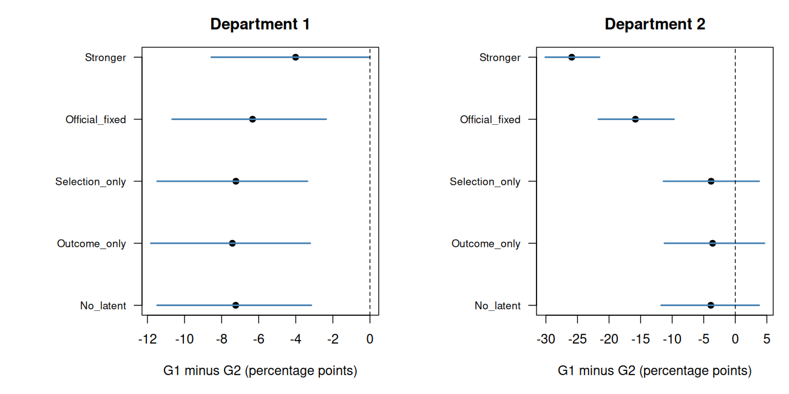

# A10 — Confounds and Sensitivity Analysis

**Course:** Statistical Rethinking 2026  
**Section:** A — Beginner  
**Lecture:** A10 — Confounds and Sensitivity Analysis  
**Meeting date:** 10 March 2026  
**Official reading listed by the course:** Chapter 12  
**Central question:** When an important causal variable is unobserved, how can we represent plausible confounding explicitly and determine how strongly it could alter the scientific conclusion?

## Executive summary {.unnumbered}

**A10 asks whether a conclusion would survive plausible unobserved confounding.** Rather than assuming that missing variables do not matter, it models how they could influence the analysis and identifies the assumptions under which the conclusion changes.

The running example is university admissions. Comparing groups within departments may seem fairer than comparing overall admission rates. However, if both group membership and unobserved applicant characteristics influence department choice, **adjusting for department can introduce bias**. The appropriate comparison therefore depends on the scientific question and the assumed causal structure.

The chapter develops a joint model of department selection and admission, connected by an unobserved applicant characteristic. Sensitivity parameters describe how strongly that characteristic influences each process. Analysts either examine fixed scenarios or assign priors over these parameters. Because observed data may provide limited information about them, conclusions must be reported alongside the assumptions supporting them.

The main output is a **robustness assessment**: which conclusions survive plausible scenarios, and where are the tipping points that reverse the result or decision? These comparisons should use interpretable probability differences, rather than logistic coefficients alone.

Three practical limits matter:

- Grouped data cannot recover missing individual information merely by expanding counts into rows.
- Proxy measurements can help, but require explicit measurement and causal assumptions.
- Good predictive fit and reliable computation do not establish causal validity.

The CRM application transfers this reasoning to campaign evaluation: unobserved customer affinity may influence both targeting and purchases. A useful report shows how estimated uplift—and profitability—changes under plausible hidden-confounding assumptions.

**The management implication:** report the estimated result, the assumptions that sustain it, the conditions that would reverse the decision, and the additional data most likely to reduce that uncertainty.

> **Source note**
>
> This guide is grounded in the official 2026 course outline, the official script `A10_sensitivity.R`, the latent-confounding and proxy sections of `10_confounds_poisson.r`, and the uploaded second edition of *Statistical Rethinking*.
>
> There is an important source mismatch that should not be hidden. The official schedule assigns Chapter 12. In the uploaded second edition, Chapter 12 is *Monsters and Mixtures*, covering over-dispersed counts, zero inflation, and ordered categories. It does not contain the lecture's central admissions sensitivity model. The closest second-edition material is distributed across:
>
> - Chapter 6 on confounding, colliders, and adjustment;
> - Section 10.2.3 on omitted-variable bias in generalized linear models;
> - Section 14.3 on causal designs and the value of sensitivity analysis when confounding cannot be ruled out;
> - Section 15.1 on measurement error and proxy variables;
> - Chapter 12's broader idea that latent heterogeneity creates mixture distributions and overdispersion.
>
> The course repository states that draft third-edition material may also be used. This guide does not assume the contents of an unavailable draft chapter. It maps the official A10 code to the closest supported second-edition material and labels the mismatch explicitly.

***
## 0. Notation and reading conventions

**[Orientation](#a10-problem-map).** Define the notation and distinguish observed variables, latent assumptions, and posterior uncertainty.

This chapter uses one notation throughout. A symbol is introduced here before it enters a model; when its meaning changes in the CRM example, the new meaning is stated locally.

### 0.1 Variables and indices

- $i\in\{1,\ldots,N\}$ indexes an applicant and $N$ is the number of applicants.
- $g\in\{1,2\}$ indexes a perceived-gender category and $d\in\{1,\ldots,J\}$ indexes a department; $J$ is the number of departments.
- $G_i$ and $D_i$ are applicant $i$'s observed gender category and department.
- $A_i\in\{0,1\}$ is the admission indicator: $A_i=1$ means admitted and $A_i=0$ means rejected.
- $U_i$ denotes a substantively meaningful but unobserved applicant characteristic. The lower-case $u_i$ denotes its value in a continuous latent-factor model.
- $X_i$ denotes a vector of measured pre-exposure covariates when a generic adjustment set is discussed.
- $j$ indexes a proxy measurement, $k$ a sensitivity scenario, and $s$ a posterior draw.
- $A_i(g)$ is the potential admission outcome applicant $i$ would have under category or policy level $g$. It is used only for defining a causal estimand; it is not simultaneously observed at both levels.
- $\mathcal D_{\mathrm{obs}}$ denotes the complete observed dataset. This calligraphic symbol prevents confusion with the department variable $D$.

**Contrast direction throughout the worked examples: category 1 minus category 2.** In section 5, choose $g_1=1$ and $g_0=2$ to match this convention. The simulated category labels do not identify real genders. In the real table, use its explicit male/female labels and state the direction separately.

An upper-case letter denotes a random variable and the corresponding lower-case letter a possible value. Thus $G_i$ is a variable, whereas $g$ is one of its levels. Subscripts identify individuals or groups; a superscript $(s)$ identifies a posterior draw, `true` identifies a simulation truth, and `rep` identifies posterior-replicated data.

### 0.2 Probability and causal operators

- $p(z)$ is a probability mass or density evaluated at $z$; $\Pr(E)$ is the probability of event $E$.
- $X\sim F$ means that random variable $X$ follows distribution $F$.
- The vertical bar in $p(y\mid x)$ means “conditional on,” not intervention.
- $X\perp\!\!\!\perp Y\mid Z$ means that $X$ and $Y$ are conditionally independent given $Z$; $X\not\perp\!\!\!\perp Y\mid Z$ means that this independence does not hold.
- $\mathbb E[Z]$ is the expected value of $Z$ under the distribution indicated by the context.
- $\mathrm{do}(G=g)$ denotes an intervention that sets $G$ to $g$ and severs the usual causes of $G$. It is different from merely observing $G=g$.
- $\int f(u)\,du$ averages a quantity over every possible value of the continuous variable $u$; the density multiplying $f(u)$ supplies the weights.
- $\partial f/\partial u$ is the local rate at which $f$ changes as $u$ changes.
- $\propto$ means “proportional to”: two non-negative expressions differ only by a normalizing constant.

The exponential and logit functions are

$$
\exp(x)=e^x,
\qquad
\mathrm{logit}(p)=\log\!\left(\frac{p}{1-p}\right),
\qquad
\mathrm{logit}^{-1}(x)=\frac{1}{1+\exp(-x)}.
$$

Here $e\approx2.718$ is Euler's number, $p\in(0,1)$ is a probability, and $p/(1-p)$ is its odds. Consequently, adding a coefficient $c$ on the log-odds scale multiplies the odds by $\exp(c)$.

### 0.3 Distribution conventions

This chapter uses the following parameterizations:

- $\mathrm{Bernoulli}(p)$: a binary variable equals one with probability $p$;
- $\mathrm{Binomial}(n,p)$: the number of successes in $n$ exchangeable Bernoulli trials;
- $\mathrm{Categorical}(\boldsymbol\pi)$: one category is drawn with probability vector $\boldsymbol\pi$, whose non-negative entries sum to one;
- $\mathrm{CategoricalLogit}(\boldsymbol\eta)$: a categorical distribution with category probabilities $\mathrm{softmax}(\boldsymbol\eta)$, where $\mathrm{softmax}(\boldsymbol\eta)_d=\exp(\eta_d)/\sum_{r=1}^{J}\exp(\eta_r)$;
- $\mathrm{Normal}(\mu,\sigma)$: a normal distribution with mean $\mu$ and standard deviation $\sigma>0$;
- $\mathrm{Uniform}(l,h)$: constant density between lower bound $l$ and upper bound $h$;
- $\mathrm{Exponential}(\lambda)$: a positive distribution with rate $\lambda>0$ and mean $1/\lambda$.

Vectors are written in bold when this prevents ambiguity, for example $\boldsymbol b=(b_1,b_2)$. A probability such as $p_i$ or $q_i$ always lies between zero and one; a coefficient such as $a_{g,d}$, $b_g$, or $g_g$ lives on the real-valued log-odds scale unless a prior restricts it.

### 0.4 Core vocabulary and diagnostics

A **directed acyclic graph (DAG)** is a graph whose arrows encode assumed causal directions and contain no directed cycles. A **confounder** is a common cause of an exposure and an outcome. A **mediator** lies on a causal path from exposure to outcome. A **collider** receives arrows from two variables; conditioning on it can create an association between its causes. A **latent variable** is represented in the model but not directly observed. A **proxy** is an observed, imperfect measurement that carries information about a latent variable.

An estimand is the population quantity the analysis seeks to learn. **Identification** asks whether its value is uniquely determined by the observed-data distribution plus declared assumptions. A **sensitivity parameter** represents an assumption not well learned from the observed data and is deliberately varied or given a scientifically justified prior.

Later sections use these abbreviations: MCMC for Markov chain Monte Carlo, PPC for posterior predictive check, ESS for effective sample size, and CRM for customer relationship management. $\widehat R$ compares within-chain and between-chain variation; values materially above one warn that the chains may not have mixed. Treedepth and divergences are diagnostics of the Hamiltonian Monte Carlo computation.

***


## 1. Main thesis

The central argument is:

> **Unobserved confounding should be represented as an explicit causal and statistical model, not silently replaced by an assumption that it is absent.**

A conventional causal analysis may assume **conditional exchangeability**:

$$ A(g) \perp\!\!\!\perp G \mid X $$

This states that, after conditioning on the measured pre-exposure covariates $X$, category assignment $G$ carries no further information about the potential admission outcome $A(g)$. In causal language, $X$ blocks every relevant backdoor path from $G$ to admission.

A sensitivity analysis asks what follows when this assumption fails because of an unobserved variable $U$.

The workflow is:

$$ \text{causal estimand} \rightarrow \text{baseline identifying assumptions} \rightarrow \text{plausible unobserved structure} \rightarrow \text{sensitivity parameters} \rightarrow \text{joint generative model} \rightarrow \text{posterior estimand under each scenario} \rightarrow \text{robustness or tipping-point conclusion} $$

The goal is not to manufacture certainty about $U$.

The goal is to determine:

- which unobserved structures could change the result;
- how strong those structures must be;
- which conclusions survive plausible alternatives;
- what new measurements would reduce uncertainty.

Sensitivity analysis converts an unverifiable statement into an auditable set of assumptions.

### 1.1 Reading map: which problem are we solving? {#a10-problem-map}

A09 asked how to estimate event probabilities and compare groups with different compositions. A10 asks **whether those comparisons retain their causal meaning when an important variable is unobserved**. Most of this chapter follows one admissions example: applicants choose departments, departments admit applicants, and an unmeasured applicant characteristic can influence both processes.

Read the chapter as four connected problems. Problem 1 has three stages: define the causal question, test it in a simulation, and examine how the answer changes under explicit assumptions about the missing variable.

| Problem or transition | Question to keep in mind | Sections | Example and output |
|---|---|---|---|
| **1A — Define the admissions comparison** | Can adjusting for department create bias, and which contrast do we actually want? | [3–5](#baseline-admissions-graph) | Admissions DAG; total versus department-held-fixed estimands |
| **1B — Learn from a known simulation** | What do models miss when the simulated applicant characteristic is hidden? | [6–10](#the-a10-simulated-data-generating-process) | Simulated admissions; naïve models and an observed-confound benchmark |
| **1C — Test sensitivity to the missing variable** | How strongly would the latent characteristic have to affect selection and admission to change the conclusion? | [11–23](#joint-latent-confounding-model) | Joint model; scenario contrasts, prior sensitivity, and tipping points |
| **2 — Work with limited real measurements** | What can grouped admissions data and imperfect proxies tell us about the missing characteristic? | [24–30](#the-real-ucbadmit-analysis) | Real `UCBadmit` counts, then proxy measurement models and their assumptions |
| **3 — Check what supports the conclusion** | Is a change due to confounding, the nonlinear scale, modeling assumptions, or unreliable computation? | [31–39](#omitted-variables-under-nonlinear-links) | Interpretation checks, predictive checks, diagnostics, and better data collection |
| **4 — Transfer the workflow to CRM** | Could unobserved customer affinity change a campaign or targeting decision? | [40–43](#crm-application-unobserved-customer-affinity) | Purchase and offer-assignment models; proxies and a profit-aware tipping-point report |
| **Operational bridge — Record the evidence** | How can the assumptions and robustness results be made auditable? | [44–45](#implications-for-causalops) | CausalOps artifacts; separate data, structural assumptions, and prior information |

**The simulated admissions block starts at 6 and ends at 23. The real-data discussion starts at 24.** In a simulation, the generating variable is known to us even when we hide it from the fitted model. In the real analysis, its values are unavailable: the simulation's benchmark cannot simply be reproduced. Sections 27–30 explain how additional proxy measurements could help; they do not imply that such measurements are present in `UCBadmit`.

**The CRM application starts at 40 and ends at 43.** It reuses the causal reasoning with customers, offers, and purchases. The local meanings of the symbols change there. Unlike A09, A10 has no separate Poisson case-study block: references to mixtures and nonlinear links support the sensitivity argument.

### 1.2 How the steps connect, and where to return

Within Problem 1C, **11–14** build the joint model and specify the sensitivity assumptions; **15–18** explain identification and averaging over the unobserved factor; **19–23** translate the model into probability contrasts and robustness conclusions. A tipping point is meaningful only relative to the estimand and the range of assumptions declared earlier.

Within Problem 3, **31–33** clarify what a changing coefficient or incompletely identified contrast means; **34–38** check predictions, computation, and alternative sensitivity models; **39** turns the remaining uncertainty into a data-collection question. A model that reproduces observed data does not thereby establish that its hidden-confounding assumptions are correct.

Sections **0–2** provide notation, the main question, and the book correspondence. Sections **46–48** consolidate the argument through common errors, takeaways, and review questions. Sections **49–51** provide reading, code, and source guides; **52** answers all 37 review questions. For a first conceptual pass, follow **3–5 → 6–10 → 11–14 → 19–23**, then return to **15–18** to understand what identifies the latent model. Read **24–39** before transferring the conclusions to real data, and **40–45** for the business application and its reporting requirements.

Each numbered section below starts with a linked problem label and a sentence explaining its role. Use that link to return to this map whenever a new equation or example obscures the question being answered.

### 1.3 Choose a first pass, then return to the machinery

A first reading should answer a concrete question: **why might comparing applicants in the same department hide an admission disadvantage?** Follow the graph and the numerical selection example in 3–6, the fitted contrasts in 8–9, the interpretation of sensitivity coefficients in 11–14, and the scenario results in 19–23. Return to 15–18 for the integration and identification details.

The worked R path follows one simulated dataset across these blocks. Sections 25–26 introduce the real grouped table, which contains no measured applicant ability; sections 27–30 then show what additional proxy measurements could contribute. Read 34–37 for checks, 40–43 for the CRM translation, and 52 for answers to all review questions.

The [complete teaching script](../scripts/A10_walkthroughs.R) runs from the repository root with `Rscript scripts/A10_walkthroughs.R`. It uses base R except for the synthetic diagnostic example, which requires `posterior`. The printed outputs below were generated by that script; figures are embedded in the local HTML. Section 17 contains the numerical integration helper and can be skipped on a first reading.

**Separate the evidence.** The data-generating probabilities come from `scripts/A10_sensitivity.R`. The fixed Gaussian-latent models are fitted here by numerical integration, not by rerunning its HMC sampler. Simplified examples for tipping points, proxies, and profit are labeled separately. No sensitivity-prior fit or latent model for real `UCBadmit` is claimed as newly validated by these demonstrations.

### 1.4 The four problems in plain language

**Problem 1: hidden selection in admissions.** We observe category, chosen department, and admission. We do not normally observe every characteristic influencing both choice and success. The question is whether a department-adjusted gap describes a fair comparison or a selected mixture. A simulation provides a known answer; sensitivity models then show how conclusions depend on assumptions about the missing characteristic.

**Problem 2: what real measurements can support.** The real admissions table has counts rather than detailed applicant records. Expanding those counts cannot recreate missing qualifications. Additional proxies could constrain latent characteristics, but only through a measurement model. The desired result is a clear distinction between what is observed, inferred under assumptions, and unavailable.

**Problem 3: which checks justify trust.** A changed odds ratio, a good predictive fit, and an apparently smooth chain each answer a different question. We need to distinguish scale effects, observable model adequacy, numerical accuracy, and causal identification. The output is a qualified robustness statement and a plan for better measurements, not a single “model passed” label.

**Problem 4: a campaign decision.** Replace department choice with offer assignment and applicant characteristics with customer affinity. Comparing customer groups within an offer, changing the offer, and changing the campaign policy are different interventions. The business answer needs a declared intervention, target population, and profit threshold as well as a purchase model.

***

## 2. Relationship to the book

**[Orientation](#a10-problem-map).** Locate the sensitivity argument in the book and understand the mismatch with the assigned chapter.

The official Chapter 12 assignment does not align directly with the second-edition chapter title or contents.

| A10 topic | Closest second-edition counterpart | Relationship |
|---|---|---|
| Collider confounding after adjustment | Sections 6.3–6.4 | Department conditioning opens a latent path |
| Omitted-variable bias under a logit link | Section 10.2.3 | Missing causes distort probability-scale inference |
| Inevitable confounding and sensitivity analysis | Section 14.3 | Hypothetical confounds can be modeled structurally |
| Latent heterogeneity and mixtures | Chapter 12 | Integrating over unobserved variation creates mixtures |
| Proxy measurements | Section 15.1 | Noisy indicators can inform a latent variable |
| Joint latent-factor model | Chapters 15–16 style | Several observed processes share one latent cause |
| MCMC for individual latent effects | Chapter 9 | High-dimensional posterior computation |

### 2.1 What Chapter 12 contributes conceptually

Here $Y$ denotes a generic observed outcome and $X$ a vector of observed predictors. The conditional density $p(Y\mid X,U=u)$ describes the outcome at a fixed latent value $u$, while $p(u\mid X)$ weights how common that latent value is. Integrating over $u$ therefore produces the observed outcome distribution after the unobserved heterogeneity has been averaged out.


Chapter 12 emphasizes that observed counts may arise from mixtures of heterogeneous processes.

A simple likelihood assumes one event probability or rate conditional on predictors.

Latent variation in $U$ creates a mixture:

$$ p(Y \mid X) = \int p(Y \mid X,U=u) p(u \mid X) \,du $$

Such mixing can create:

- extra-binomial or extra-Poisson variation;
- thick tails;
- apparent subgroup differences;
- instability in regression coefficients.

This is conceptually relevant to A10, even though the chapter does not present the admissions sensitivity model.

***

## 3. Baseline admissions graph

**[Problem 1A — Admissions comparison](#a10-problem-map).** Specify how gender category, department selection, and the unobserved applicant characteristic could jointly affect admission.

Let:

- $G$ denote perceived gender category;
- $D$ denote department application;
- $A$ denote admission;
- $U$ denote unobserved applicant ability or another favorable applicant characteristic.

A candidate graph is:

$$ G \rightarrow D \rightarrow A $$

with:

$$ G \rightarrow A $$

and latent paths:

$$ U \rightarrow D $$

$$ U \rightarrow A $$

The full structure is therefore:

$$ G \rightarrow D \leftarrow U \rightarrow A $$

plus possible arrows:

$$ D \rightarrow A $$

and:

$$ G \rightarrow A $$

Department is both:

- a mediator of some gender-associated pathways;
- a collider between $G$ and $U$.

This dual role is the source of the sensitivity problem.

***

## 4. The causal trap in department adjustment

**[Problem 1A — Admissions comparison](#a10-problem-map).** Explain why conditioning on department can open a path through the unobserved characteristic.

Without conditioning on department, the collider path is closed:

$$ G \rightarrow D \leftarrow U \rightarrow A $$

If $G$ and $U$ are independent before selection, then:

$$ G \perp\!\!\!\perp U $$

Conditioning on $D$ opens the path:

$$ G \not\perp\!\!\!\perp U \mid D $$

Within the same department, perceived gender carries information about latent ability because the two variables contributed differently to department selection.

The department-adjusted association can therefore contain:

$$ G \rightarrow D \leftarrow U \rightarrow A $$

This is collider-induced confounding of the intended direct contrast.

The adjustment is not merely imprecise. It may target a systematically distorted comparison.

### 4.1 Watch the selection mechanism before fitting a model

In the official simulation, 10% of each category has the high latent characteristic. For category 1, every high-$U$ applicant chooses department 2 and every low-$U$ applicant chooses department 1. For category 2, 75% choose department 2 regardless of $U$.

| Population being compared | High-$U$ fraction, category 1 | High-$U$ fraction, category 2 |
|---|---|---|
| Before department selection | 10% | 10% |
| Within department 1 | 0% | 10% |
| Within department 2 | 100% | 10% |

So “same department” does not mean “same latent composition.” Within department 2 the category-1 applicants are all high-$U$, while only one tenth of category-2 applicants are. Their higher latent propensity to be admitted can conceal a disadvantage in the admission mechanism. Section 6 supplies every probability needed to check this numerically.

***

## 5. Total and direct estimands

**[Problem 1A — Admissions comparison](#a10-problem-map).** Choose between a total contrast and a department-held-fixed contrast before interpreting any model.

### 5.1 Total effect or total category contrast

Let $g_0$ and $g_1$ be the two category or policy levels being compared. Expectations below average over the target applicant population. Because perceived gender is not itself a fully specified intervention, $\mathrm{do}(G=g)$ should be read as a precisely specified policy intervention on the perception or decision process represented by $G$, not as a literal operation on a person.


A total interventional contrast is:

$$ \tau_{\mathrm{total}} = \mathbb{E} \left[ A \mid \mathrm{do}(G=g_1) \right] - \mathbb{E} \left[ A \mid \mathrm{do}(G=g_0) \right] $$

It allows department selection to change under the intervention and includes any pathway through $D$.

The unadjusted category model in the script is:

$$ A_i \sim \mathrm{Bernoulli}(p_i) $$

$$ \mathrm{logit}(p_i) = a_{G_i} $$

This estimates an aggregate observed contrast. Its causal interpretation still depends on whether intervention on $G$ is meaningful and whether baseline common causes of $G$ and $A$ are absent.

### 5.2 Department-held-fixed contrast

A controlled direct contrast at department $d$ is:

$$ \tau_{\mathrm{direct}}(d) = \mathbb{E} \left[ A \mid \mathrm{do}(G=g_1), \mathrm{do}(D=d) \right] - \mathbb{E} \left[ A \mid \mathrm{do}(G=g_0), \mathrm{do}(D=d) \right] $$

A naïve department-specific model is:

$$ \mathrm{logit}(p_i) = a_{G_i,D_i} $$

But observed conditioning on:

$$ D_i=d $$

is not the same as intervening to set:

$$ \mathrm{do}(D=d) $$

Under the graph in section 3, the former opens the collider path. The latter conceptually breaks the natural causes of department assignment.

***

## 6. The A10 simulated data-generating process

**[Problem 1B — Known simulation](#a10-problem-map).** Create applicants with a known hidden characteristic so that the consequences of omitting it can be examined.

In this simulation $N$ is fixed at 2,000, $G_i\in\{1,2\}$, and the probability vector $(0.5,0.5)$ gives each category probability one half. The value $U_i=1$ labels the high-latent-characteristic state; it is not a one-standard-deviation value of the later Gaussian factor.


The official A10 script simulates:

$$ N=2000 $$

applications.

Perceived gender category is sampled evenly:

$$
\boldsymbol\pi_G=(0.5,0.5),
\qquad
G_i\sim\mathrm{Categorical}(\boldsymbol\pi_G).
$$


The true latent characteristic is binary:

$$ U_i \sim \mathrm{Bernoulli}(0.1) $$

Only ten percent of applicants have the high latent characteristic in the simulation.

Department choice depends on both $G$ and $U$.

Admission depends on:

- department;
- gender category;
- latent characteristic.

The exact probability matrices are specified directly in the script.

The essential causal structure is:

$$ G,U \rightarrow D $$

and:

$$ G,D,U \rightarrow A $$

### 6.1 The complete generating probabilities

The matrices below are read as department rows and category columns. They specify probabilities rather than fitted coefficients:

| Latent state | Department | Category 1 admission probability | Category 2 admission probability |
|---|---|---|---|
| $U=0$ | 1 | 0.10 | 0.10 |
| $U=0$ | 2 | 0.10 | 0.30 |
| $U=1$ | 1 | 0.30 | 0.50 |
| $U=1$ | 2 | 0.30 | 0.50 |

Within observed department 2, admission probabilities are 0.30 for category 1 and $0.9(0.30)+0.1(0.50)=0.32$ for category 2: a −2-point gap. Under a controlled intervention setting department 2 for both categories, average over the same original 90:10 latent mixture. Category 1 then has probability $0.9(0.10)+0.1(0.30)=0.12$, compared with 0.32 for category 2: a **−20-point controlled gap**. The observed comparison hides most of the structural disadvantage in this simulated world.

The `intervention` columns below use the known generating equations, not an inference from observed counts. A finite sample fluctuates around these population probabilities.

```{r a10-worked-6}
#| eval: false
# Same data-generating probabilities as scripts/A10_sensitivity.R.
# Base-R Bernoulli draws; this is simulated data, not UCBadmit.
set.seed(12)
N <- 2000
G <- sample(1:2,N,replace=TRUE)
U <- rbinom(N,1,.1)
D <- 1+rbinom(N,1,ifelse(G==1,U,.75))
p0 <- matrix(c(.1,.1,.1,.3),nrow=2) # rows: D; columns: G
p1 <- matrix(c(.3,.3,.5,.5),nrow=2)
p <- ifelse(U==1,p1[cbind(D,G)],p0[cbind(D,G)])
A <- rbinom(N,1,p)
sim <- data.frame(G,D,U,A)
counts <- aggregate(cbind(admitted=A,applied=rep(1,N))~G+D,sim,sum)
counts$rate <- with(counts,admitted/applied)
print(counts,row.names=FALSE)
# Population truths, obtained by averaging over Pr(U=1)=0.1.
truth <- data.frame(department=1:2,
  U_high_G1=c(0,1),U_high_G2=c(.1,.1),
  observed_G1=c(.1,.3),observed_G2=c(.14,.32),
  intervention_G1=c(.12,.12),intervention_G2=c(.14,.32))
truth$observed_difference <- with(truth,observed_G1-observed_G2)
truth$controlled_difference <- with(truth,intervention_G1-intervention_G2)
print(truth,row.names=FALSE)
cat("True total contrast G1-G2:",.12-(.25*.14+.75*.32),"\n")
stopifnot(all.equal(truth$controlled_difference,c(-.02,-.20)))
```

**Executed result:**

```text
G D admitted applied      rate
 1 1       88     908 0.0969163
 2 1       41     248 0.1653226
 1 2       37     114 0.3245614
 2 2      269     730 0.3684932
 department U_high_G1 U_high_G2 observed_G1 observed_G2 intervention_G1
          1         0       0.1         0.1        0.14            0.12
          2         1       0.1         0.3        0.32            0.12
 intervention_G2 observed_difference controlled_difference
            0.14               -0.04                 -0.02
            0.32               -0.02                 -0.20
True total contrast G1-G2: -0.155
```

***

## 7. An intentional model mismatch

**[Problem 1B — Known simulation](#a10-problem-map).** Distinguish the binary simulation truth from the continuous factor used later for sensitivity analysis.

The simulated latent variable is binary:

$$ U_i^{\mathrm{true}} \in \{0,1\} $$

The sensitivity model later assumes a continuous latent factor:

$$ u_i \sim \mathrm{Normal}(0,1) $$

This is an important detail.

The fitted model is not trying to recover the literal binary variable exactly.

It asks whether a generic continuous latent factor, with specified influence on department and admission, can absorb the confounding pattern.

This makes the exercise a sensitivity model rather than a perfectly specified latent-variable recovery exercise.

The distinction should be preserved:

$$ \text{latent sensitivity factor} \neq \text{known true applicant ability measure} $$

### 7.1 What “true” means, and what it does not

The binary $U$ above belongs to the simulator: its values and probabilities are known because we chose them. The fitted continuous $u$ is an analyst's latent sensitivity representation. It is neither a recovered applicant score nor an assertion that real ability is Normal. Consequently, a well-computed Gaussian-latent fit need not recover the binary simulator's controlled contrast exactly. Compare the generating truth, sampling uncertainty, and model mismatch separately.

***

## 8. Naïve total model

**[Problem 1B — Known simulation](#a10-problem-map).** Establish the aggregate comparison without department adjustment or access to the hidden variable.

For group $g$, $a_g$ is the baseline log odds of admission, $p_i$ is applicant $i$'s admission probability, and $a_g\sim\mathrm{Normal}(0,1)$ is a prior statement rather than an observed sampling distribution. The contrast $\Delta_a$ is on the log-odds scale, whereas $\Delta_p$ is a difference in admission probabilities.


The first official model is:

$$ A_i \sim \mathrm{Bernoulli}(p_i) $$

$$ \mathrm{logit}(p_i) = a_{G_i} $$

with:

$$ a_g \sim \mathrm{Normal}(0,1) $$

The aggregate log-odds contrast is:

$$ \Delta_a = a_1-a_2 $$

The probability contrast should be calculated as:

$$ \Delta_p = \mathrm{logit}^{-1}(a_1) - \mathrm{logit}^{-1}(a_2) $$

The model does not condition on department and therefore does not open the department collider.

It estimates the observed total category contrast, which includes differences in department application patterns.

### 8.1 Fit the aggregate model and read its uncertainty

This grid calculation uses the stated independent Normal(0,1) logit priors. It approximates each one-dimensional posterior and samples from its normalized grid. Run the section 6 data block first. Outputs are probability differences multiplied by 100; `lo90` and `hi90` are central 90% posterior interval endpoints.

```{r a10-worked-8}
#| eval: false
summary90 <- function(x) c(mean=mean(x),lo90=unname(quantile(x,.05)),
                           hi90=unname(quantile(x,.95)))
normalize <- function(z) {w<-exp(z-max(z)); w/sum(w)}
set.seed(1008)
S <- 30000
agrid <- seq(-8,8,length.out=401)
totals <- aggregate(cbind(admitted,applied)~G,counts,sum)
naive_p <- sapply(1:2,function(g) {
  w <- normalize(dbinom(totals$admitted[g],totals$applied[g],
                       plogis(agrid),log=TRUE)+dnorm(agrid,log=TRUE))
  sample(plogis(agrid),S,replace=TRUE,prob=w)
})
cat("Naive aggregate posterior, G1-G2, percentage points:\n")
print(round(100*summary90(naive_p[,1]-naive_p[,2]),2))
```

**Executed result:**

```text
Naive aggregate posterior, G1-G2, percentage points:
  mean   lo90   hi90 
-19.36 -22.40 -16.45
```

The population total contrast is −15.5 points in the simulator, while this finite dataset produces a more negative estimate. A particular posterior interval need not contain the generating truth; repeated sampling behavior, not one interval, evaluates calibration. This contrast retains each category's own department composition.

***

## 9. Naïve department-specific model

**[Problem 1B — Known simulation](#a10-problem-map).** Examine the within-department comparison when the hidden variable is still omitted.

The second model is:

$$ A_i \sim \mathrm{Bernoulli}(p_i) $$

$$ \mathrm{logit}(p_i) = a_{G_i,D_i} $$

with:

$$ a_{g,d} \sim \mathrm{Normal}(0,1) $$

The script computes department-specific log-odds contrasts:

$$ \Delta_{a,d} = a_{1,d}-a_{2,d} $$

The corresponding probability contrast is:

$$ \Delta_{p,d} = \mathrm{logit}^{-1}(a_{1,d}) - \mathrm{logit}^{-1}(a_{2,d}) $$

Because $D$ is a collider of $G$ and $U$, these observed within-department contrasts can be confounded even when the direct causal effect is absent.

This is the quantity the sensitivity model attempts to reassess.

### 9.1 Fit within departments using the same applications

These four cell posteriors again use Normal(0,1) logit priors. The department-2 contrast now looks much closer to zero than the aggregate contrast. It remains an observed within-department comparison, not the known −20-point controlled effect from the simulator.

```{r a10-worked-9}
#| eval: false
set.seed(1009)
naive_cell <- sapply(seq_len(nrow(counts)),function(k) {
  w <- normalize(dbinom(counts$admitted[k],counts$applied[k],
                       plogis(agrid),log=TRUE)+dnorm(agrid,log=TRUE))
  sample(plogis(agrid),S,replace=TRUE,prob=w)
})
cell_index <- function(g,d) which(counts$G==g & counts$D==d)
naive_difference <- sapply(1:2,function(d)
  naive_cell[,cell_index(1,d)]-naive_cell[,cell_index(2,d)])
colnames(naive_difference) <- c("Department_1","Department_2")
print(round(100*t(apply(naive_difference,2,summary90)),2))
```

**Executed result:**

```text
mean   lo90  hi90
Department_1 -7.23 -11.48 -3.16
Department_2 -3.87 -11.38  3.78
```

***

## 10. If the confound were observed

**[Problem 1B — Known simulation](#a10-problem-map).** Use the observed simulation confound as a benchmark that is unavailable in the real admissions data.

The coefficient $\beta_U$ is the change in admission log odds associated with changing the observed binary characteristic from $U_i=0$ to $U_i=1$, holding gender and department fixed. A positive-effect constraint such as $\beta_U>0$ orients “higher” $U$ as favorable; it is a substantive restriction, not a consequence of the data.


The longer official script first illustrates the ideal case in which $U$ is measured.

The admission model becomes:

$$ A_i \sim \mathrm{Bernoulli}(p_i) $$

$$ \mathrm{logit}(p_i) = a_{G_i,D_i} + \beta_U U_i $$

with a positive-effect constraint on $\beta_U$.

If the graph and functional form are correct, including $U$ closes the open path:

$$ G \rightarrow D \leftarrow U \rightarrow A $$

because comparisons are now made at the same value of the common cause $U$.

This provides a benchmark for the latent sensitivity model.

### 10.1 A measured confound is not sufficient without support

**Overlap (positivity)** requires data support for the exposure and covariate combinations needed by the target comparison. In the A10-specific simulation, category 1 has no high-$U$ applicants in department 1 and no low-$U$ applicants in department 2. Merely observing $U$ would not supply outcomes for those absent combinations.

The table in section 6 defines their probabilities because we know the generating mechanism. A real-data model would need extrapolation assumptions. Moreover, one common additive $\beta_U$ is not an exact representation of all the simulator's log-odds changes. The longer script's observed-confound illustration should therefore not be read as a guarantee that this particular saturated intervention contrast becomes nonparametrically identified whenever $U$ is measured.

***

## 11. Joint latent-confounding model

**[Problem 1C — Latent sensitivity](#a10-problem-map).** Represent department selection and admission jointly through a shared unobserved factor.

The two likelihoods share the same person-specific latent value $u_i$. In the admission equation, $a_{g,d}$ is a gender-by-department baseline log odds and $b_g$ is the admission log-odds change per one-unit increase in $u$. In the selection equation, $D_{2i}=1$ means that applicant $i$ selected department 2, $q_i=\Pr(D_{2i}=1)$, $\delta_g$ is a group-specific baseline selection log odds, and $g_g$ is the corresponding latent selection coefficient. The letter $g$ is therefore used both as a group index and, in $g_g$, as the conventional name of a coefficient vector; the subscript always identifies the group.


When $U$ is not observed, the script models both admission and department assignment.

### Admission model

$$ A_i \sim \mathrm{Bernoulli}(p_i) $$

$$ \mathrm{logit}(p_i) = a_{G_i,D_i} + b_{G_i}u_i $$

### Department model

For a binary department indicator:

$$ D_{2i} \sim \mathrm{Bernoulli}(q_i) $$

$$ \mathrm{logit}(q_i) = \delta_{G_i} + g_{G_i}u_i $$

### Latent factor

$$ u_i \sim \mathrm{Normal}(0,1) $$

The same latent factor affects both processes.

This shared influence induces the required dependence between department selection and admission.

### 11.1 Follow one applicant through the two equations

First draw a latent value $u_i$ from the shared population. With a hypothetical selection baseline $\delta_g=\operatorname{logit}(0.25)$, $g_g=1$, and $u_i=1$, department-2 probability is $\operatorname{logit}^{-1}[\operatorname{logit}(0.25)+1]\approx0.475$. Draw the department from that probability. Then use the intercept for the selected department in the admission equation.

For an admission baseline of 0.10 and $b_g=1$, that same latent value gives admission probability about 0.232. These illustrative intercepts are not estimates from the official simulation. The point is the shared $u_i$: drawing a separate unrelated latent value for each equation would remove the dependence that the model is intended to represent.

***

## 12. Sensitivity parameters

**[Problem 1C — Latent sensitivity](#a10-problem-map).** Give the hidden factor’s influence on admission and selection an explicit, interpretable scale.

The group-indexed coefficient vectors

$$
\boldsymbol b=(b_1,b_2),
\qquad
\boldsymbol g=(g_1,g_2)
$$

are the sensitivity parameters. The coefficient $b_g$ belongs to the admission equation for group $g$, whereas $g_g$ belongs to the department-selection equation for that same group. Despite the shared letter, the group index $g$ and the coefficient $g_g$ are different mathematical objects.


### Admission sensitivity

$b_g$ controls how strongly one standard-deviation increase in latent $u$ changes admission log odds for gender group $g$:

$$ \frac{ \partial \mathrm{logit}(p) }{ \partial u } = b_g $$

The admission odds multiplier is:

$$ \exp(b_g) $$

### Department-selection sensitivity

$g_g$ controls how strongly latent $u$ changes log odds of applying to department 2:

$$ \frac{ \partial \mathrm{logit}(q) }{ \partial u } = g_g $$

The department-selection odds multiplier is:

$$ \exp(g_g) $$

Sensitivity analysis asks how the target contrast changes as these parameters vary.

### 12.1 Translate both coefficients into probabilities

With one fixed set of illustrative baselines, change the latent value from −1 to +1. The zero selection coefficient for group 2 keeps its selection probability unchanged. An odds multiplier of 2.718 is not a multiplication of the probability by 2.718.

```{r a10-worked-12}
#| eval: false
u <- c(-1,0,1)
# Illustrative baselines, not fitted coefficients: admission .1, selection .25.
print(data.frame(u=u,
  admission=round(plogis(qlogis(.1)+1*u),3),
  dept2_group1=round(plogis(qlogis(.25)+1*u),3),
  dept2_group2=round(plogis(qlogis(.25)+0*u),3)),row.names=FALSE)
cat("Odds multiplier for coefficient 1:",round(exp(1),3),"\n")
```

**Executed result:**

```text
u admission dept2_group1 dept2_group2
 -1     0.039        0.109         0.25
  0     0.100        0.250         0.25
  1     0.232        0.475         0.25
Odds multiplier for coefficient 1: 2.718
```

***

## 13. Fixed sensitivity scenarios

**[Problem 1C — Latent sensitivity](#a10-problem-map).** Compare conclusions under fixed assumptions about the strength of the hidden pathways.

In vector notation, $\boldsymbol b=(b_1,b_2)$ and $\boldsymbol g=(g_1,g_2)$. Thus the scenario below fixes four coefficients; it does not set either observed variable $G$ or a generic group label $g$.


In the first latent model, the script supplies fixed values:

$$ \boldsymbol b=(1,1) $$

$$ \boldsymbol g=(1,0) $$

This scenario asserts that:

- latent ability affects admission in both groups;
- latent ability affects department selection in group 1;
- it does not affect department selection in group 2.

Because $u$ has standard deviation one:

$$ b_g=1 $$

corresponds to an admission odds multiplier of:

$$ \exp(1) \approx 2.72 $$

per one-standard-deviation increase in the latent factor.

The sensitivity coefficients are fixed by the analyst. The admission intercepts, selection intercepts, and latent quantities are still inferred from the data under that scenario.

It is an explicit hypothetical confounding structure.

That is precisely what makes it a sensitivity analysis.

### 13.1 Use meaningful reference scenarios

The worked analysis below compares five declared scenarios, with vectors ordered as $(b_1,b_2,g_1,g_2)$:

| Scenario | Coefficients | Purpose |
|---|---|---|
| No latent effect | (0,0,0,0) | Recover the ordinary department-specific model |
| Outcome only | (1,1,0,0) | Add outcome heterogeneity without latent department selection |
| Selection only | (0,0,1,0) | Change selection without giving the latent factor an admission effect |
| Official fixed scenario | (1,1,1,0) | Use the fixed values in the A10 script |
| Stronger scenario | (2,2,2,0) | Stress-test a stronger pathway, beyond the later Uniform(0,1) prior support |

Only the last two connect the hidden factor to both selection and admission. These are teaching scenarios, not a claim that coefficients of 1 or 2 are scientifically plausible for real applicants. The fitted results appear in section 19 after the integration helper has been introduced.

***

## 14. Priors over sensitivity parameters

**[Problem 1C — Latent sensitivity](#a10-problem-map).** Express uncertainty over sensitivity assumptions with priors and examine their implications.

The A10-specific script then removes the fixed values and assigns:

$$ b_g \sim \mathrm{Uniform}(0,1) $$

$$ g_g \sim \mathrm{Uniform}(0,1) $$

This averages over a range of non-negative confounding strengths.

On the odds-ratio scale:

$$ 1 \leq \exp(b_g) \leq e $$

and:

$$ 1 \leq \exp(g_g) \leq e $$

The uniform prior is not neutral.

It asserts:

- no negative latent effects;
- at most an odds multiplier of approximately $2.72$ per latent standard deviation;
- equal prior density over log-odds coefficients, not over odds ratios or probability changes.

The prior range should therefore be scientifically justified.

### 14.1 A uniform prior still favors a particular range of probabilities

For $b\sim\mathrm{Uniform}(0,1)$, the odds ratio $r=e^b$ has density $1/r$ on $[1,e]$. Thus equal-width intervals on the odds-ratio scale are not equally likely. At a baseline probability of 0.10, the table shows how prior quantiles translate into probabilities after a one-SD increase in the latent factor.

```{r a10-worked-14}
#| eval: false
# Uniform log-odds coefficient does not imply uniform odds ratio.
z <- c(.05,.50,.95)
print(data.frame(prior_quantile=z,coefficient=z,odds_ratio=round(exp(z),3),
  probability_from_10pct=round(plogis(qlogis(.1)+z),3)),row.names=FALSE)
cat("Prior mean odds ratio:",round(exp(1)-1,3),"\n")
```

**Executed result:**

```text
prior_quantile coefficient odds_ratio probability_from_10pct
           0.05        0.05      1.051                  0.105
           0.50        0.50      1.649                  0.155
           0.95        0.95      2.586                  0.223
Prior mean odds ratio: 1.718
```

The common sign restriction rules out negative effects, and the upper bound rules out odds multipliers above $e$. Reconsider those restrictions if substantive knowledge suggests different directions or magnitudes. In a complete Bayesian fit, the data may update these coefficients, so posterior averaging need not use their original prior weights.

***

## 15. Sensitivity parameters may be weakly identified

**[Problem 1C — Latent sensitivity](#a10-problem-map).** Explain why observed outcomes may not determine the sensitivity coefficients precisely.

Observed data contain:

- one department outcome;
- one admission outcome;
- one gender category

per applicant.

The model introduces an individual latent variable:

$$ u_i $$

for every applicant, along with group-specific $b$ and $g$.

Without proxy measurements or strong structural restrictions, the data may not separately determine:

- each $u_i$;
- the scale of $u$;
- $b$;
- $g$;
- cell-specific admission parameters.

Fixing:

$$ u_i \sim \mathrm{Normal}(0,1) $$

sets the latent scale.

But substantial non-identification may remain.

The posterior of the sensitivity parameters can be largely prior-driven.

This is not a defect when the goal is explicit scenario averaging. It becomes a defect only if prior-driven results are misrepresented as data-identified discoveries.

### 15.1 A precise observable can coexist with an uncertain explanation

An observed cell rate of 0.30 could arise because every applicant has probability 0.30, or because half have probability 0.10 and half 0.50. The mean alone cannot distinguish these explanations. A joint selection model adds information and restrictions, but may still permit several latent stories. More applications can estimate the cell rate very precisely while leaving uncertainty about the decomposition.

***

## 16. Scale and sign identification

**[Problem 1C — Latent sensitivity](#a10-problem-map).** Anchor the latent factor’s units and orientation before comparing coefficient values.

In the scale transformation, $c$ is any positive constant. The products remain unchanged because $(b_g/c)(cu_i)=b_gu_i$ and $(g_g/c)(cu_i)=g_gu_i$. Negative $c$ additionally reverses orientation and is represented separately by the sign transformation below. Fixing the latent standard deviation to one removes arbitrary rescaling; a sign constraint or interpretive convention removes the remaining orientation ambiguity.


The latent contribution enters through products such as:

$$ b_g u_i $$

and:

$$ g_g u_i $$

Without constraints, the scale transformation:

$$ u_i^* = c u_i $$

$$ b_g^* = \frac{b_g}{c} $$

$$ g_g^* = \frac{g_g}{c} $$

leaves the products unchanged.

Fixing:

$$ u_i \sim \mathrm{Normal}(0,1) $$

anchors the scale.

There is also a sign symmetry:

$$ u_i^* = -u_i $$

$$ b_g^* = -b_g $$

$$ g_g^* = -g_g $$

A sign convention can orient one reference loading. Requiring every component of $b$ and $g$ to be positive additionally rules out opposite-direction effects: that is a substantive restriction, not merely removal of sign symmetry.

Identification conventions define the meaning of the latent factor.

### 16.1 Check the symmetry with numbers

At $u=2$, $b=0.5$, the admission contribution is $bu=1$. Rescaling to $u^*=4$, $b^*=0.25$ gives the same contribution. Reversing both signs to $u^*=-2$, $b^*=-0.5$ also gives 1. Fixing the latent SD prevents arbitrary rescaling; a reference sign or other orientation convention handles reflection. Constraining every loading to be positive additionally excludes some causal stories.

***

## 17. Why the joint model carries information

**[Problem 1C — Latent sensitivity](#a10-problem-map).** Identify what observing both selection and admission contributes to learning about the shared factor.

Let $\boldsymbol u=(u_1,\ldots,u_N)$ collect the individual latent values; let $\boldsymbol a$, $\boldsymbol\delta$, $\boldsymbol b$, and $\boldsymbol g$ collect their respective model coefficients. Bayes' rule gives the posterior density below, where the two likelihood factors correspond to admission and selection and the remaining factors are priors. Conditional-independence assumptions justify this factorization.


Department selection provides indirect information about $u_i$.

Admission provides additional indirect information.

The posterior is:

$$
p\!\left(\boldsymbol u,\boldsymbol a,\boldsymbol\delta,\boldsymbol b,\boldsymbol g\mid\mathcal D_{\mathrm{obs}}\right)
\propto
p(A\mid G,D,\boldsymbol u,\boldsymbol a,\boldsymbol b)\,
p(D\mid G,\boldsymbol u,\boldsymbol\delta,\boldsymbol g)\,
p(\boldsymbol u)\,p(\boldsymbol a)\,p(\boldsymbol\delta)\,p(\boldsymbol b)\,p(\boldsymbol g).
$$

The left-hand side is the joint posterior density of every unknown. On the right, the first two terms are the admission and department likelihoods and the remaining terms are priors. The missing normalizing constant is the marginal probability of the observed dataset.


For an applicant whose observed department and admission are more likely under high $u$, the posterior for $u_i$ shifts upward.

But this information is probabilistic and model-dependent.

One binary department and one binary admission outcome contain little information about a person-specific latent variable.

The hierarchical distribution and shared process assumptions do much of the work.

### 17.1 Integrate the shared factor before fitting the observed cells

For fixed coefficients, define the joint cell probability

$$
r_{g,d,a}=\int \Pr(D=d\mid g,u)\Pr(A=a\mid g,d,u)\varphi(u)\,du,
$$

where $\varphi$ is the standard Normal density. **Marginalization** means averaging out the unobserved $u$, not replacing it with zero. With independent applicants and fixed group counts, the four $(D,A)$ cell counts in each group have a multinomial likelihood with probabilities $r_{g,d,a}$. This retains the selection–outcome association without estimating an explicit $u_i$ for every applicant.

The implementation factors this likelihood into the department count and the conditional admission count within each department. For each selection intercept $\delta_g$, it computes a separate conditional posterior for the two admission intercepts, then weights $\delta_g$ by the full likelihood. Priors on all intercepts remain Normal(0,1); $b$ and $g$ are fixed by scenario. Conditional on $\delta_g$ the intercepts separate, but they need not be marginally independent.

The helper below uses a grid for intercepts and **quadrature**, a weighted numerical approximation to an integral, for the Normal latent factor. Equal-probability Normal quantiles supply the integration points. It returns posterior coefficient draws and probabilities standardized to the same Normal(0,1) population in both categories. The standardization is an intervention-style quantity under the assumed model, not an empirical ability distribution inferred without assumptions. The [Stan mixture guide](https://mc-stan.org/docs/stan-users-guide/finite-mixtures.html) explains the general principle of integrating latent quantities out of a likelihood.

```{r a10-worked-17}
#| eval: false
#| code-fold: true
#| code-summary: "Numerical integration helper (advanced implementation)"
# Fixed b,g scenarios: integrate out each new applicant's u ~ Normal(0,1).
# Conditional on delta, the two department intercepts are independent.
fit_group <- function(group,b,g,K=201,Q=301,S=30000) {
  aa <- seq(-8,8,length.out=K)
  dd <- aa
  uu <- qnorm(((1:Q)-.5)/Q) # equal-weight quadrature under standard Normal
  admission <- plogis(outer(aa,b*uu,"+"))
  selection <- plogis(outer(uu*g,dd,"+"))
  qbar <- colMeans(selection)
  # P(A=1 | G,D,parameters), with selection-dependent latent weights.
  joint2 <- admission %*% selection/Q
  joint1 <- admission %*% (1-selection)/Q
  p2 <- sweep(joint2,2,qbar,"/")
  p1 <- sweep(joint1,2,1-qbar,"/")
  cells <- counts[counts$G==group,]
  cells <- cells[match(1:2,cells$D),]
  lw <- lapply(list(p1,p2),function(p) matrix(0,nrow=K,ncol=K))
  probs <- list(p1,p2)
  for (d in 1:2) lw[[d]] <- matrix(dbinom(cells$admitted[d],
    cells$applied[d],as.vector(probs[[d]]),log=TRUE),K,K)+dnorm(aa,log=TRUE)
  logsum <- function(x) {v<-max(x);v+log(sum(exp(x-v)))}
  z <- lapply(lw,function(x) apply(x,2,logsum))
  delta_mass <- normalize(dbinom(cells$applied[2],sum(cells$applied),
    qbar,log=TRUE)+dnorm(dd,log=TRUE)+z[[1]]+z[[2]])
  amass <- lapply(lw,function(x) apply(x,2,normalize))
  stopifnot(sum(delta_mass[abs(dd)>7])<1e-6)
  for (d in 1:2) stopifnot(sum(colSums(amass[[d]][abs(aa)>7,,drop=FALSE])*
                             delta_mass)<1e-6)
  # Population-standardized admission probability at each intercept.
  target_p <- rowMeans(admission)
  exact_mean <- sapply(1:2,function(d)
    sum(delta_mass*colSums(amass[[d]]*target_p)))
  di <- sample.int(K,S,replace=TRUE,prob=delta_mass)
  ai <- matrix(NA_integer_,S,2)
  for (j in unique(di)) for (d in 1:2) {
    rows <- which(di==j)
    ai[rows,d] <- sample.int(K,length(rows),replace=TRUE,prob=amass[[d]][,j])
  }
  list(mean=exact_mean,a=matrix(aa[ai],S,2),delta=dd[di],b=b,g=g,
       standardized=matrix(target_p[ai],S,2))
}
cat("Model: independent Normal(0,1) priors on a and delta; fixed b,g.\n")
```

**Executed result:**

```text
Model: independent Normal(0,1) priors on a and delta; fixed b,g.
```

***

## 18. Marginalizing the latent factor

**[Problem 1C — Latent sensitivity](#a10-problem-map).** Average over the unobserved factor to obtain quantities connected to observed outcomes.

The observed admission probability within a gender-department cell is a mixture:

$$ p(A=1 \mid G=g,D=d) = \int p(A=1 \mid G=g,D=d,u) p(u \mid G=g,D=d) \,du $$

Conditioning on department changes the latent distribution:

$$ p(u \mid G=g,D=d) $$

because $G$ and $u$ both affect $D$.

Thus two gender groups in the same department may have different latent-ability distributions even when their original population distributions were identical.

The naïve cell comparison mixes:

- direct gender-associated admission effects;
- differences in selected latent composition.

The joint model attempts to separate them using explicit assumptions.

### 18.1 Replace the integral with a two-point sum first

In the binary simulation, $\Pr(U=1\mid G=1,D=2)=1$, whereas $\Pr(U=1\mid G=2,D=2)=0.1$. The observed department-2 probabilities therefore use different weights: $1(0.30)=0.30$ versus $0.9(0.30)+0.1(0.50)=0.32$.

Standardizing both groups to the original population uses 0.9 and 0.1 for both, giving 0.12 and 0.32. For a continuous $u$, the integral does exactly the same kind of averaging, with a density instead of two masses. Using $u=0$ alone generally differs from averaging the nonlinear logistic function over that density.

***

## 19. Probability-scale sensitivity estimands

**[Problem 1C — Latent sensitivity](#a10-problem-map).** Translate each sensitivity assumption into the probability-scale estimand chosen earlier.

The density $p_{\mathrm{target}}(u)$ is a declared standardization distribution for the latent factor—for example, $\mathrm{Normal}(0,1)$ or the posterior distribution in a target population. It must integrate to one. The overbar in $\overline p_{g,d}^{(s)}$ means that the conditional probability has been averaged over this same distribution for both groups, so the resulting contrast is not driven by different latent compositions.


The script plots log-odds contrasts, but scientific conclusions are often clearer on the probability scale.

For posterior draw $s$, department $d$, and latent value $u$:

$$ p_{g,d}^{(s)}(u) = \mathrm{logit}^{-1} \left[ a_{g,d}^{(s)} + b_g^{(s)}u \right] $$

A controlled probability contrast at latent value $u$ is:

$$ \Delta_d^{(s)}(u) = p_{1,d}^{(s)}(u) - p_{2,d}^{(s)}(u) $$

A standardized latent contrast averages over a chosen latent distribution:

$$ \overline{p}_{g,d}^{(s)} = \int p_{g,d}^{(s)}(u) p_{\mathrm{target}}(u) \,du $$

Then:

$$ \Delta_{d,\mathrm{std}}^{(s)} = \overline{p}_{1,d}^{(s)} - \overline{p}_{2,d}^{(s)} $$

The target distribution of $u$ must be declared.

### 19.1 Actual posterior comparisons under the five fixed scenarios

The table reports category 1 minus category 2 within each department, standardized over a common Normal(0,1) latent distribution. The data are the one simulated sample from section 6. The code fits each scenario; it does not just change coefficients in a previously fitted model. Read uncertainty within a row separately from sensitivity across rows.

```{r a10-worked-19}
#| eval: false
settings <- list(No_latent=c(0,0,0,0),
  Outcome_only=c(1,1,0,0),Selection_only=c(0,0,1,0),
  Official_fixed=c(1,1,1,0),Stronger=c(2,2,2,0)) # b1,b2,g1,g2
set.seed(1019)
fits <- lapply(settings,function(v) list(
  fit_group(1,v[1],v[3]),fit_group(2,v[2],v[4])))
scenario_draws <- lapply(fits,function(f) f[[1]]$standardized-f[[2]]$standardized)
scenario_table <- do.call(rbind,lapply(names(settings),function(nm) {
  x<-scenario_draws[[nm]]
  data.frame(scenario=nm,department=1:2,
    round(100*t(apply(x,2,summary90)),2),prob_positive=round(colMeans(x>0),3))
}))
print(scenario_table,row.names=FALSE)
# Deterministic posterior means, not random draws, for resolution check.
v <- settings$Official_fixed
fine <- list(fit_group(1,v[1],v[3],K=401,Q=601,S=10),
             fit_group(2,v[2],v[4],K=401,Q=601,S=10))
coarse_mean <- fits$Official_fixed[[1]]$mean-fits$Official_fixed[[2]]$mean
fine_mean <- fine[[1]]$mean-fine[[2]]$mean
cat("Maximum refinement change in contrast (percentage points):",
    round(100*max(abs(coarse_mean-fine_mean)),4),"\n")
stopifnot(max(abs(coarse_mean-fine_mean))<.001)
# Null latent case must agree with independent cell-logit grid integration.
null_mean <- fits$No_latent[[1]]$mean-fits$No_latent[[2]]$mean
independent_mean <- sapply(1:2,function(d) {
  m <- sapply(1:2,function(g) {
    k<-cell_index(g,d)
    w<-normalize(dbinom(counts$admitted[k],counts$applied[k],plogis(agrid),
                       log=TRUE)+dnorm(agrid,log=TRUE))
    sum(w*plogis(agrid))
  });m[1]-m[2]
})
stopifnot(max(abs(null_mean-independent_mean))<1e-5)
dir.create("courses/figures/A10",recursive=TRUE,showWarnings=FALSE)
png("courses/figures/A10/scenarios.png",width=1300,height=650,res=130)
par(mfrow=c(1,2),mar=c(5,9,3,1))
for(d in 1:2) {
 z<-scenario_table[scenario_table$department==d,]
 plot(z$mean,1:nrow(z),xlim=range(c(z$lo90,z$hi90)),yaxt="n",ylab="",
  xlab="G1 minus G2 (percentage points)",main=paste("Department",d),pch=19)
 axis(2,at=1:nrow(z),labels=z$scenario,las=1,cex.axis=.8)
 segments(z$lo90,1:nrow(z),z$hi90,1:nrow(z),col="steelblue",lwd=2)
 abline(v=0,lty=2)
}
invisible(dev.off())
```

**Executed result:**

```text
scenario department   mean   lo90   hi90 prob_positive
      No_latent          1  -7.24 -11.48  -3.16         0.001
      No_latent          2  -3.87 -11.75   3.78         0.151
   Outcome_only          1  -7.42 -11.82  -3.22         0.000
   Outcome_only          2  -3.59 -11.22   4.62         0.169
 Selection_only          1  -7.23 -11.48  -3.37         0.001
 Selection_only          2  -3.83 -11.38   3.78         0.152
 Official_fixed          1  -6.33 -10.67  -2.36         0.003
 Official_fixed          2 -15.82 -21.69  -9.70         0.000
       Stronger          1  -4.01  -8.56   0.00         0.047
       Stronger          2 -25.91 -30.10 -21.51         0.000
Maximum refinement change in contrast (percentage points): 0.0189
```



For department 2, the no-latent posterior mean is about **−3.87 points**, with a 90% interval spanning zero. The official fixed scenario gives about **−15.82 points**, and the stronger scenario about **−25.91 points**. Thus the near-zero observed comparison is not robust to the modeled selection mechanism. This does not establish which scenario is true; the binary simulator's known controlled contrast is −20 points, and the fitted latent distribution is intentionally different.

**Numerical checks.** The no-latent case agrees with direct independent cell fitting. Refining the official fixed scenario from 201 to 401 intercept points and 301 to 601 integration points changes the deterministic mean contrast by at most about 0.019 percentage points. Posterior mass near the intercept-grid boundaries is checked in every fit. Intervals and sign probabilities use 30,000 sampled draws and retain Monte Carlo variation. These checks validate this numerical illustration within its stated tolerances; they do not validate the official HMC implementations.

***

## 20. Scenario sensitivity versus prior-weighted sensitivity

**[Problem 1C — Latent sensitivity](#a10-problem-map).** Distinguish separate scenario results from an average weighted by a prior over scenarios.

There are two distinct analysis styles.

### 20.1 Scenario analysis

For scenario $k$, fix the sensitivity vectors at

$$
(\boldsymbol b,\boldsymbol g)
=
(\boldsymbol b^{(k)},\boldsymbol g^{(k)}).
$$

Then estimate

$$
p\!\left(\tau\mid\mathcal D_{\mathrm{obs}},\boldsymbol b^{(k)},\boldsymbol g^{(k)}\right).
$$

Comparing this posterior across a grid of plausible scenarios makes the assumptions transparent.

### 20.2 Prior-weighted analysis

Alternatively, assign the joint prior $p(\boldsymbol b,\boldsymbol g)$. The posterior for the target estimand is

$$
p(\tau\mid\mathcal D_{\mathrm{obs}})
=
\int
p(\tau\mid\mathcal D_{\mathrm{obs}},\boldsymbol b,\boldsymbol g)\,
p(\boldsymbol b,\boldsymbol g\mid\mathcal D_{\mathrm{obs}})\,
d\boldsymbol b\,d\boldsymbol g.
$$

This integral averages the scenario-specific posterior over the posterior weights assigned to all sensitivity vectors. It produces one compact answer, but can hide which prior regions drive the conclusion. A strong workflow reports both the scenario surface and the prior-weighted summary.


### 20.3 Why averaging scenario means with equal weights is a different analysis

Suppose two hypothetical scenario-specific posterior means are −0.02 and −0.12. Equal weights give −0.07; weights 0.9 and 0.1 give −0.03. Neither choice is supplied automatically by the scenario table. A full Bayesian analysis uses posterior scenario weights, which depend on both prior plausibility and the observed-data likelihood. If those weights are deliberately held at external values, label the result as that chosen sensitivity mixture.

For uncertainty, combine the full scenario distributions with their weights. Averaging interval endpoints does not generally yield a valid interval for the mixture. The executed section 19 analysis reports separate scenarios and does not claim to have fitted the Uniform(0,1) sensitivity-prior model.

***

## 21. Tipping-point analysis

**[Problem 1C — Latent sensitivity](#a10-problem-map).** Find which sensitivity assumptions cross a declared scientific or decision threshold.

A useful sensitivity question is: how strong must the unobserved confounding be to change the substantive conclusion?

Let $\tau(\boldsymbol b,\boldsymbol g)$ be the target contrast under the admission-sensitivity vector $\boldsymbol b$ and selection-sensitivity vector $\boldsymbol g$. A **sign tipping point** is any sensitivity setting satisfying

$$
\tau(\boldsymbol b,\boldsymbol g)=0.
$$

Let $\tau_{\min}$ be the smallest effect considered scientifically or operationally important. A **practical-significance tipping point** satisfies

$$
\tau(\boldsymbol b,\boldsymbol g)=\tau_{\min}.
$$

The threshold $\tau_{\min}$ must be chosen on the same scale as $\tau$ and preferably before examining which threshold preserves a desired conclusion. Posterior summaries over a scenario grid can include

$$
\Pr\!\left[\tau(\boldsymbol b,\boldsymbol g)>0\mid\mathcal D_{\mathrm{obs}}\right]
$$

and


$$
\Pr\!\left[\left|\tau(\boldsymbol b,\boldsymbol g)\right|>\tau_{\min}\mid\mathcal D_{\mathrm{obs}}\right].
$$

The first is the posterior probability of a positive contrast under the specified scenario. The second is the posterior probability that its absolute magnitude exceeds the declared threshold. The output should identify the sensitivity strengths required to overturn the conclusion, not merely state that unobserved confounding is possible.

### 21.1 A tipping point that can be calculated by hand

Use a separate binary-confound teaching model on the probability scale. Suppose the observed group difference is +0.06; the latent high state increases event probability by a common $h=0.20$ within either group; and the selected groups differ in high-state prevalence by $q_1-q_2$. Then

$$
\Delta_{\mathrm{observed}}=\Delta_{\mathrm{standardized}}+h(q_1-q_2).
$$

Here $q_g$ is a latent prevalence, **not** the department-selection probability from section 11. This additive toy model requires all underlying probabilities to stay between zero and one. For example, observed probabilities 0.16 and 0.10 with $q_2=0.1$ satisfy that constraint for the table below.

```{r a10-worked-21}
#| eval: false
# Separate probability-scale teaching model for a transparent tipping point.
# Observed difference = standardized difference + h*(q1-q2).
observed_difference <- .06
latent_risk_difference <- .20
imbalance <- c(0,.1,.2,.3,.4)
print(data.frame(imbalance=imbalance,
  corrected_difference=observed_difference-latent_risk_difference*imbalance),
  row.names=FALSE)
cat("Sign tipping imbalance:",observed_difference/latent_risk_difference,"\n")
cat("For a 2-point decision threshold:",
    (observed_difference-.02)/latent_risk_difference,"\n")
```

**Executed result:**

```text
imbalance corrected_difference
       0.0                 0.06
       0.1                 0.04
       0.2                 0.02
       0.3                 0.00
       0.4                -0.02
Sign tipping imbalance: 0.3 
For a 2-point decision threshold: 0.2
```

A 30-percentage-point latent-prevalence imbalance erases the +6-point gap. A decision requiring at least +2 points changes earlier, at an imbalance of 20 points. These are exact arithmetic thresholds in this toy model, not posterior results from the Gaussian-latent analysis. A posterior tipping analysis must also specify whether the threshold concerns a mean, an interval, or a probability such as $\Pr(\tau>0)>0.95$.

### 21.2 Explore the tipping point in the local HTML

Change the observed gap, the latent risk effect, the prevalence imbalance, and the decision threshold. The graph holds the observed category-2 probability at 0.10 and its high-state prevalence at 0.10. It adjusts the category-specific low-state probabilities to preserve the observed gap as the hidden-composition assumption changes. The standardized target uses a common latent prevalence, so its difference is the observed gap minus the confounding contribution.

This is the additive binary-confound teaching model from 21.1, **not a posterior fit and not the Gaussian sensitivity coefficients b and g**. Only combinations yielding valid underlying probabilities are shown. Plausibility remains a scientific judgment; a mathematically possible scenario is not automatically credible. In MD, use the R table above; the controls operate offline in the rendered HTML.

```{=html}
<div id="a10-tipping-simulator" style="padding:1rem;border:1px solid #94a3b8;border-radius:8px;margin:1rem 0">
  <div style="display:grid;grid-template-columns:repeat(auto-fit,minmax(240px,1fr));gap:1rem">
    <label>Observed probability gap <output data-value="gap"></output><br><input aria-label="Observed probability gap" name="gap" type="range" min="0" max="0.10" step="0.005" value="0.06" style="width:100%"></label>
    <label>Latent risk effect h <output data-value="h"></output><br><input aria-label="Latent risk effect" name="h" type="range" min="0" max="0.40" step="0.01" value="0.20" style="width:100%"></label>
    <label>Latent-prevalence imbalance <output data-value="imbalance"></output><br><input aria-label="Latent prevalence imbalance" name="imbalance" type="range" min="0" max="0.60" step="0.01" value="0.20" style="width:100%"></label>
    <label>Decision threshold <output data-value="threshold"></output><br><input aria-label="Decision threshold" name="threshold" type="range" min="0" max="0.04" step="0.005" value="0.02" style="width:100%"></label>
  </div>
  <p data-result aria-live="polite">Enable JavaScript to explore the example; the executed R table above remains available.</p>
  <svg role="img" aria-label="Sensitivity of the standardized probability difference to latent prevalence imbalance" viewBox="0 0 700 330" style="width:100%;height:auto"></svg>
  <button type="button">Reset example</button>
</div>
```

***

## 22. Robust and fragile conclusions

**[Problem 1C — Latent sensitivity](#a10-problem-map).** State which conclusions survive the examined assumptions and which depend on them.

A conclusion is relatively robust when it remains materially similar across a broad, scientifically plausible sensitivity region.

A conclusion is fragile when:

- its sign changes under modest confounding;
- its magnitude crosses a decision threshold;
- its interval expands enough to make decisions unstable;
- its posterior is dominated by the prior on sensitivity parameters.

Robustness is conditional:

$$ \text{robust to considered scenarios} \neq \text{robust to every possible violation} $$

A sensitivity analysis explores a defined family of alternative worlds.

It cannot prove that no other unmodeled structure matters.

***

## 23. Sensitivity analysis is not p-hacking

**[Problem 1C — Latent sensitivity](#a10-problem-map).** Keep the estimand and plausibility criteria explicit when exploring alternative conclusions.

P-hacking tries many analyses and selectively reports a favorable one.

Sensitivity analysis tries defensible alternatives and reports the full pattern.

The reporting principle is:

$$ \text{all justified scenarios} \rightarrow \text{all corresponding conclusions} $$

not:

$$ \text{many scenarios} \rightarrow \text{one preferred result} $$

The purpose is to reveal dependence on assumptions.

A sensitivity report should preserve:

- scenario definitions;
- parameter ranges;
- prior choices;
- results under every scenario;
- rationale for plausibility bounds.

***

## 24. The real `UCBadmit` analysis

**[Problem 2 — Real data and proxies](#a10-problem-map).** Leave the known simulation and ask what the real grouped admissions observations can support.

For cell $(g,d)$, $N_{g,d}$ is the number of applications, $A_{g,d}$ is the number admitted, and $p_{g,d}$ is the cell admission probability. The binomial likelihood represents grouped counts; it does not assert that applicant-level covariates were observed.


The longer script applies the latent model to the real admissions table.

The original data are grouped counts:

$$ A_{g,d} \sim \mathrm{Binomial}(N_{g,d},p_{g,d}) $$

The latent model assigns one $u_i$ per application.

Therefore, the script expands the grouped table into a long binary dataset:

- one row for each admitted application;
- one row for each rejected application.

The long-format representation is compatible with the aggregate counts.

But it does not recover actual individual applicant records or measured traits.

Every individual latent $u_i$ remains inferred only through:

- gender category;
- department;
- admission outcome;
- the sensitivity model.

This limitation must be stated explicitly.

***

## 25. Why aggregation matters for latent confounding

**[Problem 2 — Real data and proxies](#a10-problem-map).** Explain why expanding grouped counts does not recover missing individual measurements.

The grouped likelihood records:

- number admitted;
- number rejected

in each gender-department cell.

It does not record which other applicant features co-occurred with each outcome.

A latent individual model can be fitted after expanding the counts because binary outcomes can be reconstructed.

However, the aggregate data cannot identify individual-level latent heterogeneity beyond the assumed exchangeable model.

Different individual latent configurations can generate the same grouped counts.

Thus:

$$ \text{long-format expansion} \neq \text{new individual information} $$

It changes the computational representation, not the information content.

### 25.1 Expand real counts and inspect what is still missing

Base R supplies `UCBAdmissions`, the same admissions counts represented in a three-dimensional table. Expanding them reproduces admissions, gender labels, and department exactly. It creates no qualification, test-score, or proxy column.

```{r a10-worked-25}
#| eval: false
# Real counts available in base R: admission x gender x department.
ucb <- as.data.frame(UCBAdmissions)
print(aggregate(Freq~Admit,ucb,sum),row.names=FALSE)
expanded <- ucb[rep(seq_len(nrow(ucb)),ucb$Freq),c("Admit","Gender","Dept")]
cat("Expanded rows:",nrow(expanded),"\n")
stopifnot(all(xtabs(~Admit+Gender+Dept,expanded)==UCBAdmissions))
cat("Columns after expansion:",paste(names(expanded),collapse=", "),"\n")
```

**Executed result:**

```text
Admit Freq
 Admitted 1755
 Rejected 2771
Expanded rows: 4526 
Columns after expansion: Admit, Gender, Dept
```

***

## 26. Six-department selection model

**[Problem 2 — Real data and proxies](#a10-problem-map).** Extend the department-selection component to the six departments in the real example.

Here $\boldsymbol\theta_g=(\theta_{g,1},\ldots,\theta_{g,6})$ is a six-component vector of department logits for group $g$. Because adding the same constant to every component leaves softmax probabilities unchanged, one logit must be fixed as a reference or another location constraint must be imposed. A latent adjustment to one component changes that department's probability and, through softmax normalization, the probabilities of all six departments.


For the real data, department has six categories.

The raw Stan example models:

$$
D_i\sim\mathrm{CategoricalLogit}(\boldsymbol\theta_{G_i}).
$$


The script then adds a latent adjustment to department 1 for one group.

Admission is modeled as:

$$ A_i \sim \mathrm{Bernoulli}(p_i) $$

$$ \mathrm{logit}(p_i) = a_{G_i,D_i} + u_i $$

This demonstrates a general principle:

> Sensitivity analysis may require modeling the treatment, mediator, or selection process jointly with the outcome.

An outcome regression alone cannot represent how the latent variable changes the composition of selected groups.

### 26.1 One changed logit changes every category probability

With six equal logits, each department has probability 1/6. Add one to the first logit: its probability rises to about 0.352 and all others fall to about 0.130. Adding seven to every logit changes nothing, which is why a reference constraint is necessary.

```{r a10-worked-26}
#| eval: false
softmax <- function(x) {w<-exp(x-max(x));w/sum(w)}
base <- rep(0,6)
shift <- base;shift[1]<-1
print(data.frame(department=LETTERS[1:6],
  baseline=round(softmax(base),3),shifted=round(softmax(shift),3)),row.names=FALSE)
stopifnot(max(abs(softmax(shift)-softmax(shift+7)))<1e-12)
```

**Executed result:**

```text
department baseline shifted
          A    0.167   0.352
          B    0.167   0.130
          C    0.167   0.130
          D    0.167   0.130
          E    0.167   0.130
          F    0.167   0.130
```

***

## 27. Proxies for the latent confound

**[Problem 2 — Real data and proxies](#a10-problem-map).** Introduce additional noisy measurements that could inform the otherwise unobserved characteristic.

For proxy $j\in\{1,2,3\}$, $T_{ji}$ is applicant $i$'s observed proxy value and $\tau_j>0$ is its residual standard deviation around $u_i$. The rate-one exponential prior on $\tau_j$ has mean one. Smaller $\tau_j$ means a more precise proxy; it must not be confused with an effect estimand also conventionally denoted by $\tau$.


The longer script simulates three noisy measurements:

$$ T_{1i} \sim \mathrm{Normal}(u_i,\tau_1) $$

$$ T_{2i} \sim \mathrm{Normal}(u_i,\tau_2) $$

$$ T_{3i} \sim \mathrm{Normal}(u_i,\tau_3) $$


with:

$$ \tau_j \sim \mathrm{Exponential}(1) $$

The admission model remains:

Here $b$ is a single admission-sensitivity coefficient shared by both groups, unlike the group-specific $b_g$ used earlier.

$$ \mathrm{logit}(p_i) = a_{G_i,D_i} + b u_i $$

The proxies provide direct evidence about $u_i$.

Several imperfect measurements can be more informative than one because their shared covariance identifies the common latent factor.

### 27.1 A proxy is a measurement, not the missing variable itself

Imagine a qualification test standardized to the latent scale. For an applicant with $u_i=1$, a measurement model $T_i\sim\mathrm{Normal}(u_i,1)$ gives expected score 1 but SD 1: an observed score near 0 is still possible. More independent measurements can reduce uncertainty about $u_i$; repeatedly recording the same noisy score cannot create independent evidence. These are hypothetical additional measurements, absent from the grouped admissions table.

***

## 28. Proxy assumptions

**[Problem 2 — Real data and proxies](#a10-problem-map).** State the causal and measurement assumptions required for those proxies to be informative.

The proxy model assumes:

### Shared latent cause

$$ u_i \rightarrow T_{1i},T_{2i},T_{3i} $$

### Conditional independence

$$
p(T_{1i},T_{2i},T_{3i}\mid u_i)
=
\prod_{j=1}^{3}p(T_{ji}\mid u_i).
$$

This factorization defines mutual conditional independence: after $u_i$ is known, learning one proxy supplies no additional information about either other proxy. It is stronger and less ambiguous than chaining pairwise independence symbols.


### No direct proxy effects on admission

The proxies affect $A$ only through the latent variable represented by $u$.

### Measurement invariance

The proxy scale and error process do not change across gender or department unless modeled.

If these assumptions fail, the latent factor may combine:

- ability;
- measurement bias;
- group-specific response behavior;
- direct proxy effects.

A proxy model moves assumptions from “no confounding” to “correct measurement structure.” It does not eliminate assumptions.

***

## 29. Multiple proxies versus one proxy

**[Problem 2 — Real data and proxies](#a10-problem-map).** Explain what multiple indicators can add and why their number alone does not ensure identification.

The residual $\epsilon_{ji}$ is proxy-specific measurement error with mean zero under the model. To recover the normal measurement model above one may write $\epsilon_{ji}\sim\mathrm{Normal}(0,\tau_j)$ and assume that these residuals are mutually independent conditional on $u_i$. This assumption is substantive: correlated residuals would otherwise be mistaken for evidence about the common factor.


With one noisy proxy:

$$ T_i=u_i+\epsilon_i $$

the latent value and measurement error are difficult to distinguish without strong prior information.

With several conditionally independent proxies:

$$ T_{ji}=u_i+\epsilon_{ji} $$

their common covariance is attributed to $u_i$, while proxy-specific variation is attributed to measurement noise.

This can identify:

- relative proxy precision;
- posterior latent scores;
- confounding-adjusted contrasts.

But the quality of the result depends strongly on conditional independence and scale constraints.

### 29.1 One noisy measurement versus three

In a small conjugate example, $u\sim\mathrm{Normal}(0,1)$ and each measurement has known loading 1 and independent Normal noise of SD 1. For $J$ measurements $t_j$, posterior variance is $1/(1+J)$ and posterior mean is $\sum_jt_j/(1+J)$. The loading is the expected score change for a one-unit change in the latent factor.

```{r a10-worked-29}
#| eval: false
# Known loadings = 1, known independent noise SD = 1, prior u ~ N(0,1).
# Conjugate toy measurement model, not fitted UCB applicant measurements.
measurements <- c(1.2,.8,1.0)
proxy_update <- function(t) {
  variance<-1/(1+length(t)); c(mean=variance*sum(t),sd=sqrt(variance))
}
print(round(rbind(One_proxy=proxy_update(measurements[1]),
                  Three_proxies=proxy_update(measurements)),3))
cat("If all three are copies of one measurement, use one likelihood term.\n")
```

**Executed result:**

```text
mean    sd
One_proxy     0.60 0.707
Three_proxies 0.75 0.500
If all three are copies of one measurement, use one likelihood term.
```

With correlated measurement errors or unknown loadings, the simple formula no longer applies. If three scores duplicate the same measurement, treating them as independent would overstate precision. Multiple proxies help under a justified measurement model, not by their number alone.

***

## 30. Measurement error and residual confounding

**[Problem 2 — Real data and proxies](#a10-problem-map).** Show why treating an imperfect proxy as the confound itself can leave residual confounding.

Using a noisy proxy directly as though it were the true confound can leave residual confounding.

Suppose:

$$ T=U+\epsilon $$

and regress admission on $T$.

Conditioning on $T$ does not fully condition on $U$ unless measurement error is zero.

The latent measurement model instead estimates:

$$ p(U \mid T_1,T_2,T_3) $$

and propagates uncertainty about $U$ into the admission contrast.

This is more coherent than replacing $U$ with a point estimate and treating it as known.

***

## 31. Omitted variables under nonlinear links

**[Problem 3 — Interpretation and checks](#a10-problem-map).** Explain why omitted variables can change logistic coefficients even beyond familiar linear-regression intuition.

Here $X$ and $U$ are two predictors, $\alpha$ is an intercept, and $\beta_X$ and $\beta_U$ are conditional log-odds coefficients. The symbols $\alpha^*$ and, more generally, $\beta_X^*$ would denote coefficients of a reduced model that omits $U$; a star marks a different estimand, not a known transformation of the original coefficients. The expectation $\mathbb E[p\mid X]$ averages the individual probability over the distribution of $U$ at a fixed $X$.


The admission model uses a logit link.

Even when an omitted variable is not a classical common cause, leaving it out can alter other coefficients because probabilities are bounded by zero and one.

For two independent causes $X$ and $U$:

$$ \mathrm{logit}(p) = \alpha + \beta_X X + \beta_U U $$

marginalizing over $U$ generally does not yield:

$$
\mathrm{logit}\!\left(\mathbb E[p\mid X]\right)
=
\alpha^*+\beta_X^*X.
$$

The omitted-variable model generally has both a different intercept and a different slope; equality with the original $\beta_X$ is not guaranteed even when $X$ and $U$ are independent.

Logistic coefficients are non-collapsible.

Sensitivity analysis should therefore focus on probability-scale estimands rather than asking only how a log-odds coefficient changes.

***

## 32. Non-collapsibility versus confounding

**[Problem 3 — Interpretation and checks](#a10-problem-map).** Separate non-collapsibility of odds ratios from causal confounding.

These phenomena should remain distinct.

### Confounding

A causal path creates a noncausal association between exposure and outcome.

### Non-collapsibility

The conditional and marginal logistic coefficients can differ even without confounding because of the nonlinear link.

Therefore, a change in a logistic coefficient after adding $U$ does not by itself quantify confounding.

The more defensible comparison is between posterior intervention contrasts on a common probability scale:

$$ \tau_{\mathrm{naive}} $$

and:

$$ \tau_{\mathrm{sensitivity}} $$

computed for the same estimand and target population.

### 32.1 An odds-ratio change without confounding

In this constructed population, binary `X` and `U` are independent and both X groups contain the same 50:50 mix of U. The conditional odds ratio for X is exactly 2 at either U value. Averaging probabilities over U gives a marginal odds ratio about 1.751, even though no unequal U composition confounds the comparison.

```{r a10-worked-32}
#| eval: false
# X independent of binary U, with the same 50:50 mix in both X groups.
alpha <- -2; beta <- log(2); gamma <- 2
conditional <- outer(0:1,0:1,function(x,u) plogis(alpha+beta*x+gamma*u))
marginal <- rowMeans(conditional)
print(round(data.frame(X=0:1,U0=conditional[,1],U1=conditional[,2],
                       marginal=marginal),4),row.names=FALSE)
cat("Conditional OR:",exp(beta),"; marginal OR:",
    round(exp(diff(qlogis(marginal))),4),"\n")
```

**Executed result:**

```text
X     U0     U1 marginal
 0 0.1192 0.5000   0.3096
 1 0.2130 0.6667   0.4398
Conditional OR: 2 ; marginal OR: 1.751
```

***

## 33. Sensitivity analysis and partial identification

**[Problem 3 — Interpretation and checks](#a10-problem-map).** Describe what can be learned when the data and assumptions constrain a range of causal answers.

When the sensitivity vectors $\boldsymbol b$ and $\boldsymbol g$ are not learned uniquely from the observed distribution, the causal effect is not point identified. Instead, the assumptions define a set of plausible effects.

Let

$$
\mathcal S
=
\left\{(\boldsymbol b,\boldsymbol g):
(\boldsymbol b,\boldsymbol g)\text{ is judged scientifically plausible}\right\}
$$

be the scenario set. Its image under the estimand function is the sensitivity region

$$
\mathcal T
=
\left\{\tau(\boldsymbol b,\boldsymbol g):
(\boldsymbol b,\boldsymbol g)\in\mathcal S\right\}.
$$

The set $\mathcal S$ contains assumptions about confounding strength; $\mathcal T$ contains all resulting estimand values. **Partial identification** means that the assumptions restrict the estimand to $\mathcal T$ but do not select a unique point from it. A Bayesian prior $p(\boldsymbol b,\boldsymbol g)$ assigns weights within $\mathcal S$; it does not convert untestable assumptions into observed information.

The posterior therefore combines information from the observed data, structural restrictions, and prior beliefs about unmeasured confounding. These sources should be reported separately.

### 33.1 Separate a scenario range from a posterior interval

If two allowed scenarios imply effects −0.02 and −0.12 in a hypothetical population, the scenario range spans those values. Each scenario can also have its own sampling or posterior uncertainty. An envelope of estimated means is therefore not a 90% posterior interval and is not automatically a formal identified set. Calling it an identified set requires a precise population model and proof that the range contains all and only effects compatible with the assumptions and observed distribution. Otherwise, report it as a sensitivity range.

***

## 34. Posterior predictive checks

**[Problem 3 — Interpretation and checks](#a10-problem-map).** Check the observed implications of the joint process, while keeping predictive adequacy distinct from causal identification.

### 34.1 State what is being replicated

A **posterior predictive check (PPC)** generates observations using posterior parameter draws and compares relevant summaries with the observed data. A joint check must preserve the dependency order. For new applicants, draw fresh $u_i^{\mathrm{rep}}\sim\mathrm{Normal}(0,1)$, simulate their departments, and then recompute admission probabilities using those simulated departments:

$$
q_i^{\mathrm{rep},(s)}=\operatorname{logit}^{-1}(\delta_{G_i}^{(s)}+g_{G_i}^{(s)}u_i^{\mathrm{rep}}),\qquad
D_{2i}^{\mathrm{rep},(s)}\sim\mathrm{Bernoulli}(q_i^{\mathrm{rep},(s)}),
$$

$$
p_i^{\mathrm{rep},(s)}=\operatorname{logit}^{-1}(a_{G_i,D_i^{\mathrm{rep},(s)}}^{(s)}+b_{G_i}^{(s)}u_i^{\mathrm{rep}}),\qquad
A_i^{\mathrm{rep},(s)}\sim\mathrm{Bernoulli}(p_i^{\mathrm{rep},(s)}).
$$

Here $D_i^{\mathrm{rep},(s)}=1+D_{2i}^{\mathrm{rep},(s)}$. Simulating a department but keeping the admission probability for the observed department would not generate the intended joint model. For a check conditional on existing departments, hold departments fixed and explicitly label that different replication target. Existing-person replication may condition on posterior $u_i$ rather than draw a fresh population value. See the [Stan predictive-check guide](https://mc-stan.org/docs/stan-users-guide/posterior-predictive-checks.html).

### 34.2 Replicate new cohorts from the fitted fixed scenario

The following uses posterior coefficients from section 19, retains each group's observed cohort size, and generates fresh latent characteristics. It reports selection and admission fractions. An interval here describes replicated data, not an interval for the true event probability.

```{r a10-worked-34}
#| eval: false
# New applicants: draw fresh u, then D, then A using that simulated D.
# Parameters come from the fixed-scenario posterior, not from their priors.
set.seed(1034)
R <- 500
rep_summary <- matrix(NA_real_,R,4)
colnames(rep_summary)<-c("D2_G1","D2_G2","A_G1","A_G2")
for(s in 1:R) for(group in 1:2) {
 f<-fits$Official_fixed[[group]]
 n<-sum(G==group);u<-rnorm(n)
 d<-1+rbinom(n,1,plogis(f$delta[s]+f$g*u))
 a<-rbinom(n,1,plogis(f$a[s,d]+f$b*u))
 rep_summary[s,group]<-mean(d==2)
 rep_summary[s,group+2]<-mean(a)
}
observed<-c(mean(D[G==1]==2),mean(D[G==2]==2),mean(A[G==1]),mean(A[G==2]))
print(round(data.frame(observed=observed,t(apply(rep_summary,2,summary90))),3))
```

**Executed result:**

```text
observed  mean  lo90  hi90
D2_G1    0.112 0.115 0.092 0.139
D2_G2    0.746 0.745 0.711 0.779
A_G1     0.122 0.127 0.103 0.152
A_G2     0.317 0.319 0.284 0.356
```

The observed fractions lie within these illustrative predictive intervals. This is only a basic check: also inspect admission by category and department, not just margins, and proxy dependence if measured. Several latent stories can reproduce the same observable counts, so adequate PPCs do not select a causal story as true.

***

## 35. Prior predictive checks

**[Problem 3 — Interpretation and checks](#a10-problem-map).** Check whether sensitivity priors generate plausible selection and admission patterns before fitting.

A prior predictive check simulates every unknown parameter from its prior and then simulates observable data before conditioning on real outcomes. For the binary-department version, one simulated sequence is

$$
u_i\sim\mathrm{Normal}(0,1),
$$

$$
q_i=\mathrm{logit}^{-1}(\delta_{G_i}+g_{G_i}u_i),
\qquad
D_{2i}^{\mathrm{prior}}\sim\mathrm{Bernoulli}(q_i),
$$

and, after the simulated department $D_i^{\mathrm{prior}}$ is determined,

$$
p_i=\mathrm{logit}^{-1}\!\left(a_{G_i,D_i^{\mathrm{prior}}}+b_{G_i}u_i\right),
\qquad
A_i^{\mathrm{prior}}\sim\mathrm{Bernoulli}(p_i).
$$

The superscript `prior` labels prior-predictive replicated data. Inspect whether repeated simulations imply nearly deterministic department selection, admission probabilities near zero or one, implausibly large group differences, latent effects that overwhelm department effects, or impossible proxy distributions.

Prior predictive checks are particularly important because sensitivity parameters may remain weakly identified. Their priors can dominate the final robustness conclusion.

### 35.1 Generate the entire process before seeing outcomes

Unlike section 34, every coefficient below is drawn from its prior. One run illustrates the order of operations; repeat many times and summarize the resulting distributions before judging prior plausibility. These coefficients are hypothetical, not estimates.

```{r a10-worked-35}
#| eval: false
# One full prior draw for two groups; repeat before assessing plausibility.
set.seed(1035)
n <- 500
u_prior <- rnorm(n);group <- rep(1:2,each=n/2)
a_prior <- matrix(rnorm(4),2,2);delta_prior <- rnorm(2)
b_prior <- runif(2);g_prior <- runif(2)
d_prior <- 1+rbinom(n,1,plogis(delta_prior[group]+g_prior[group]*u_prior))
p_prior <- plogis(a_prior[cbind(group,d_prior)]+b_prior[group]*u_prior)
y_prior <- rbinom(n,1,p_prior)
print(data.frame(G=1:2,dept2=tapply(d_prior==2,group,mean),
                 admission=tapply(y_prior,group,mean)),row.names=FALSE)
```

**Executed result:**

```text
G dept2 admission
 1 0.740     0.548
 2 0.748     0.356
```

***

## 36. MCMC diagnostics for latent sensitivity models

**[Problem 3 — Interpretation and checks](#a10-problem-map).** Separate numerical reliability from scientific uncertainty and identification.

### 36.1 Do chains agree, and is numerical precision sufficient?

A **chain** is a dependent sequence of posterior draws. **Warmup** is the discarded adaptation phase. Run several chains from different initial values: disagreement can reveal unexplored regions. **R-hat** compares within- and between-chain behavior; the modern rank-normalized split version also checks changes in location and scale. Values above about 1.01 warrant investigation, not automatic acceptance after rounding to 1.0.

**Effective sample size (ESS)** translates dependent draws into an approximate equivalent number of independent draws. Bulk ESS concerns central summaries and tail ESS concerns interval endpoints. **Monte Carlo standard error (MCSE)** measures numerical uncertainty in a computed summary, distinct from the posterior SD. For a mean, MCSE is approximately posterior SD divided by the square root of its mean-specific ESS. More iterations can reduce MCSE without reducing scientific uncertainty.

The example creates four independent synthetic sequences and then deliberately shifts one. It illustrates diagnostic behavior only; it is not an HMC fit of the latent model.

```{r a10-worked-36}
#| eval: false
# Artificial MCMC arrays; no claims about an HMC fit follow from these.
set.seed(1036)
x<-matrix(rnorm(4000),1000,4);bad<-x;bad[,4]<-bad[,4]+2
report<-function(z)c(Rhat=posterior::rhat(z),ESS_bulk=posterior::ess_bulk(z),
                    ESS_tail=posterior::ess_tail(z),MCSE=posterior::mcse_mean(z))
print(round(rbind(Agreeing=report(x),Shifted_chain=report(bad)),3))
cat("Posterior SD .03, mean-specific ESS 100: MCSE about",.03/sqrt(100),"\n")
```

**Executed result:**

```text
Rhat ESS_bulk ESS_tail  MCSE
Agreeing      1.001 3926.592 3827.396 0.016
Shifted_chain 1.311    9.924   31.648 0.432
Posterior SD .03, mean-specific ESS 100: MCSE about 0.003
```

The shifted chain raises R-hat to about 1.31 and reduces bulk ESS to about 10 despite 4,000 stored values. Its output is not made trustworthy by plotting a smooth pooled density. Check the final standardized contrast as well as all global parameters.

### 36.2 Did HMC explore the geometry reliably?

**Hamiltonian Monte Carlo (HMC)** uses gradients and auxiliary momentum to explore parameter space. **NUTS**, the No-U-Turn Sampler, adapts the trajectory length. In a latent model, coefficients and person-specific $u_i$ can be strongly dependent, making exploration difficult.

| Warning or plot | Meaning | Next investigation |
|---|---|---|
| Divergence | Numerical integration of an HMC trajectory became inaccurate. | Inspect parameter scales, priors and parameterization; do not simply remove flagged draws. |
| Maximum treedepth | NUTS reached its limit of trajectory doublings. | Assess efficiency and geometry; a higher limit alone does not cure every problem. |
| E-BFMI | Energy Bayesian fraction of missing information assesses exploration of the sampler's energy distribution; below about 0.3 is a warning. | Inspect per-chain energies, heavy tails and parameterization. It is not an acceptance rate. |
| Rank plots | Compare relative ranks of draws between chains. | Look for unequal occupancy rather than treating one trace as representative. |
| Pairs plots | Show joint parameter draws. | Look for curves, separated regions or a funnel: one parameter's scale narrows sharply as another changes. |

A **parameterization** is the coordinate system used to express a model. For example, $u_i=\mu+\sigma z_i$ with $z_i\sim\mathrm{Normal}(0,1)$ is a non-centered representation of $u_i\sim\mathrm{Normal}(\mu,\sigma)$; its computational usefulness depends on the information in the data. Changing coordinates preserves the model only when priors and transformations are handled consistently.

Use the [Stan diagnostic guide](https://mc-stan.org/learn-stan/diagnostics-warnings.html) to investigate warnings. These signals guide investigation; no threshold proves convergence or identification. The numerical fits in section 19 use quadrature and grid checks instead of HMC, so they have no HMC divergences, treedepth or E-BFMI to report. A future HMC reproduction needs its own diagnostics.

***

## 37. Computational identification warnings

**[Problem 3 — Interpretation and checks](#a10-problem-map).** Recognize computational symptoms of weak identification before trusting summaries.

Several symptoms suggest weak identification:

- posterior sensitivity parameters resemble their priors;
- strong posterior correlation between $b$, $g$, and latent scale;
- divergences near zero or upper bounds;
- individual $u_i$ estimates remain nearly standard normal;
- contrast posteriors change drastically under mild prior changes;
- chains occupy different latent orientations.

These are not merely computational inconveniences.

They motivate an investigation of identification and computation. None is conclusive alone: posterior–prior similarity can reflect weak data, while divergences can arise from difficult geometry even in an identified model. Compare priors, parameterizations, and estimand stability before attributing the problem to non-identification.

The analysis should report this limitation rather than tuning it away.

***

## 38. Sensitivity to the sensitivity model

**[Problem 3 — Interpretation and checks](#a10-problem-map).** Test alternative latent structures as well as alternative coefficient values.

A robust sensitivity analysis should vary more than coefficient values.

Possible model dimensions include:

- binary versus continuous latent $U$;
- group-common versus group-specific $b$;
- group-common versus group-specific $g$;
- linear versus nonlinear latent effects;
- one versus several latent factors;
- alternative proxy error distributions;
- direct proxy effects;
- alternative department-selection models.

The goal is not to enumerate every imaginable model.

It is to examine the scientifically plausible ways in which the baseline identification assumption could fail.

***

## 39. Designing better data collection

**[Problem 3 — Interpretation and checks](#a10-problem-map).** Use the assumptions that threaten the conclusion to prioritize new measurements or study designs.

The numerical bounds below are illustrative log-odds coefficients per one latent standard deviation. Thus $b>0.3$ corresponds to an admission-odds multiplier above $\exp(0.3)\approx1.35$, while $g>0.2$ corresponds to a selection-odds multiplier above $\exp(0.2)\approx1.22$. A real study must replace these numbers with thresholds calibrated to its subject matter.


Sensitivity analysis is useful before data collection.

Suppose the conclusion becomes unstable when:

$$ b>0.3 $$

and:

$$ g>0.2 $$

A future study can prioritize measurements that constrain these relationships.

Potential design responses include:

- measuring applicant qualifications;
- recording fine-grained department preferences;
- collecting several pre-decision proxies;
- randomizing anonymized review;
- exploiting a quasi-random assignment rule;
- measuring the selection process before the outcome occurs.

The exact design should follow the sensitivity path that threatens identification.

Sensitivity analysis is therefore a study-design tool, not merely a post hoc disclaimer.

***

## 40. CRM application: unobserved customer affinity

**[Problem 4 — CRM decisions](#a10-problem-map).** Translate the admissions selection problem into customer affinity, offer assignment, and purchases.

In this local analogy the symbols are reassigned explicitly:

- $G_i$ is customer group or campaign-policy category;
- $D_i$ is the offer or channel assigned to customer $i$;
- $Y_i\in\{0,1\}$ is the purchase outcome;
- $U_i$ or its standardized latent representation $u_i$ is unobserved pre-campaign affinity.

The corresponding causal structure is

$$
G\rightarrow D\leftarrow U\rightarrow Y,
$$

with a causal offer effect $D\rightarrow Y$ and possibly a direct path $G\rightarrow Y$. Because $D$ is a collider on the first path, conditioning on the received offer can associate customer group with latent affinity. A within-offer comparison may therefore be confounded even when the aggregate group contrast is not.

### 40.1 Define the business intervention before interpreting the analogy

The collider story compares customer categories $G$ within the same offer $D$. That targets a group or policy contrast while holding offer fixed. Asking what happens if we change the offer itself instead targets an intervention on $D$, and its confounding structure must be examined separately. In section 43, specify which policy is changed and which descendants are regenerated; reusing one letter for several business decisions does not make their estimands equivalent.

***

## 41. CRM sensitivity model

**[Problem 4 — CRM decisions](#a10-problem-map).** Model purchase and offer assignment jointly to represent hidden affinity explicitly.

Let $p_i=\Pr(Y_i=1)$ be customer $i$'s purchase probability. A binary purchase model is

$$
Y_i\sim\mathrm{Bernoulli}(p_i),
\qquad
\mathrm{logit}(p_i)=a_{G_i,D_i}+b_{G_i}u_i,
$$

where $a_{g,d}$ is the group-by-offer baseline log odds and $b_g$ is the affinity-to-purchase coefficient. For offer assignment, define the $J$-component logit vector

$$
\boldsymbol\eta_i=\boldsymbol\delta_{G_i}+\boldsymbol g_{G_i}u_i,
$$

where $\boldsymbol\delta_g$ contains group $g$'s baseline offer logits and $\boldsymbol g_g$ contains the change in each offer logit per latent standard deviation. Then

$$
D_i\sim\mathrm{CategoricalLogit}(\boldsymbol\eta_i),
\qquad
u_i\sim\mathrm{Normal}(0,1).
$$

One component of each logit vector must be fixed as a reference, or an equivalent sum-to-zero constraint must be imposed, because softmax probabilities are invariant to a common additive constant. The vectors $\boldsymbol b$ and $\boldsymbol g$ encode how strongly affinity affects purchase and historical targeting. The target is a probability or profit contrast standardized over a declared affinity distribution.

***
## 42. CRM proxy measurements

**[Problem 4 — CRM decisions](#a10-problem-map).** Identify pre-campaign affinity proxies and the assumptions needed to use them.

Here $T_{ji}$ is pre-campaign proxy $j$ for customer $i$, $\lambda_j$ is its factor loading, and $\tau_j>0$ is its residual standard deviation. A loading gives the expected change in the proxy for one standard-deviation increase in affinity. Fixing $u_i\sim\mathrm{Normal}(0,1)$ anchors latent scale; a positive reference loading or another sign constraint anchors orientation.


Possible noisy indicators of latent affinity include:

- prior organic visits;
- branded search behavior;
- unpaid product views;
- wishlist activity;
- historic full-price purchases;
- pre-campaign engagement.

A measurement model might be:

$$ T_{ji} \sim \mathrm{Normal} \left( \lambda_j u_i, \tau_j \right) $$

or use event-specific likelihoods for binary and count proxies.

The proxies must be measured before the focal treatment.

Variables generated by previous campaigns may be descendants of earlier treatment and require a longitudinal causal model.

A high-quality predictive score is not automatically a clean pre-treatment proxy.

***

## 43. CRM tipping-point report

**[Problem 4 — CRM decisions](#a10-problem-map).** Report when hidden-confounding assumptions change the campaign conclusion or profitability decision.

Let $Y_i(1)$ and $Y_i(0)$ be customer $i$'s potential purchase outcomes under active campaign and comparison policy. The average treatment effect over the declared target customer population is

$$
\tau(\boldsymbol b,\boldsymbol g)
=
\mathbb E\!\left[Y(1)-Y(0)\right].
$$

Writing the estimand as a function of $\boldsymbol b$ and $\boldsymbol g$ emphasizes its dependence on the assumed affinity-to-outcome and affinity-to-targeting coefficients. A useful business report includes:

- posterior mean uplift under no hidden confounding;
- uplift over a grid of $(\boldsymbol b,\boldsymbol g)$;
- posterior probability that uplift is positive;
- posterior probability that incremental net profit is positive;
- the smallest confounding strength that reverses the decision;
- expected regret under each scenario, meaning the expected payoff lost by using the selected policy rather than the scenario-optimal policy.

Define $\tau_{\mathrm{conversion}}$ as the expected incremental purchase probability and $\tau_{\mathrm{profit}}$ as expected incremental revenue minus campaign and offer costs. The decision threshold may be

$$
\tau_{\mathrm{profit}}>0
$$

rather than merely

$$
\tau_{\mathrm{conversion}}>0.
$$

A small positive conversion effect can be economically negative after offer cost.

### 43.1 A positive conversion effect can still lose money

Let the campaign cost be 0.50 currency units per eligible customer and the contribution margin be 40 per incremental purchase. In this simplified example each extra buyer contributes one purchase and there are no additional cost or margin changes. Net incremental profit per customer is $40\tau_{\mathrm{conversion}}-0.50$, so break-even uplift is 0.0125, or 1.25 percentage points.

```{r a10-worked-43}
#| eval: false
# Invented business inputs, not causal estimates from a fitted campaign.
margin <- 40;cost <- .50
uplift <- c(.03,.015,.005)
print(data.frame(scenario=c("Optimistic","Intermediate","Pessimistic"),
  uplift=uplift,incremental_profit_per_customer=margin*uplift-cost),row.names=FALSE)
cat("Break-even conversion uplift:",cost/margin,"\n")
```

**Executed result:**

```text
scenario uplift incremental_profit_per_customer
   Optimistic  0.030                             0.7
 Intermediate  0.015                             0.1
  Pessimistic  0.005                            -0.3
Break-even conversion uplift: 0.0125
```

The pessimistic scenario still has positive conversion uplift but negative profit. For posterior decision reporting, apply the profit formula to every draw, including uncertainty in costs and margins when relevant. These three numbers illustrate a reporting rule; they are not posterior campaign estimates.

***

## 44. Implications for CausalOps

**[Operational bridge — CausalOps](#a10-problem-map).** Turn sensitivity assumptions, models, and robustness results into explicit reporting artifacts.

A10 requires hidden-confounding assumptions to become explicit, versioned artifacts.

| A10 concept | CausalOps implication |
|---|---|
| Unobserved cause | `LatentConfoundArtifact` |
| Baseline identifying assumption | Record exchangeability claim |
| Sensitivity coefficient | Parameter with scientific scale and prior |
| Joint selection-outcome model | Multi-equation `SensitivityModelArtifact` |
| Fixed scenario | Deterministic sensitivity configuration |
| Prior-weighted scenario | Bayesian uncertainty over sensitivity parameters |
| Tipping point | Robustness-threshold report |
| Proxy measurement | `MeasurementModelArtifact` |
| Partial identification | Distinguish data-identified and assumption-identified quantities |
| Long-format expansion | Record that no new individual information was created |
| Prior sensitivity | Mandatory when sensitivity parameters are weakly identified |
| MCMC warnings | Fail-closed diagnostic rules |
| Study-design implication | Recommend measurements that constrain threatening paths |

### 44.1 Latent-confound schema

```yaml
latent_confound_id: applicant_ability
distribution:
  family: normal
  mean: 0
  sd: 1
causal_paths:
  - applicant_ability -> department
  - applicant_ability -> admission
interpretation: standardized_unobserved_applicant_quality
identification:
  scale_fixed: true
  sign_oriented_positive: true
```

### 44.2 Sensitivity scenario

```yaml
scenario_id: moderate_positive_ability
admission_effect:
  group_1: 0.5
  group_2: 0.5
department_selection_effect:
  group_1: 0.4
  group_2: 0.0
parameter_scale: log_odds_per_latent_sd
```

### 44.3 Sensitivity prior

```yaml
parameter: latent_ability_to_admission
groups:
  - group_1
  - group_2
prior:
  family: uniform
  lower: 0
  upper: 1
interpretation:
  odds_ratio_range:
    lower: 1.0
    upper: 2.718
```

### 44.4 Robustness report

```yaml
estimand: standardized_direct_admission_probability_difference
example_status: illustrative_not_fitted
baseline_posterior_mean: 0.04
scenario_grid:
  admission_strength: [0.0, 0.25, 0.5, 0.75, 1.0]
  selection_strength: [0.0, 0.25, 0.5, 0.75, 1.0]
outputs:
  - posterior_mean
  - interval_89
  - probability_positive
  - probability_above_business_threshold
  - sign_tipping_point
```

***

## 45. CausalOps separation of evidence sources

**[Operational bridge — CausalOps](#a10-problem-map).** Distinguish conclusions supported by observations from those supplied by structure or priors.

The system should distinguish three layers.

### Data-identified quantities

Parameters strongly learned from observed distributions.

### Structurally identified quantities

Parameters or estimands identified only after graph restrictions and functional assumptions.

### Prior-identified quantities

Sensitivity dimensions whose posterior remains primarily determined by assigned priors.

A result card should not display all three with the same epistemic status.

For example:

```yaml
evidence_decomposition:
  observed_data:
    - gender_department_counts
    - gender_department_admission_counts
  structural_assumptions:
    - shared_latent_factor
    - conditional_independence
    - logistic_links
  sensitivity_priors:
    - positive_admission_effect
    - positive_selection_effect
    - coefficient_upper_bound_1
```

This is necessary for auditable causal AI.

***

## 46. Common errors exposed by A10

**[Consolidation](#a10-problem-map).** Revisit common failures across the admissions, proxy, and CRM problems.

### Error 1: Declaring no unobserved confounding without examining plausible paths

Absence from the dataset is not absence from the causal system.

### Error 2: Treating department adjustment as automatically safer

Department is a collider in the latent-ability graph.

### Error 3: Calling an observed within-department contrast a controlled intervention effect

Conditioning and intervention are different operations.

### Error 4: Treating sensitivity parameters as ordinary identified coefficients

They may be driven primarily by fixed values or priors.

### Error 5: Calling a uniform prior neutral

Uniformity depends on the chosen scale and bounds.

### Error 6: Failing to anchor the latent scale

The products $bu$ and $gu$ are otherwise scale-indeterminate.

### Error 7: Ignoring sign symmetry

The orientation of a latent factor must be constrained or interpreted consistently.

### Error 8: Comparing only logistic coefficients

Non-collapsibility and nonlinear transformation complicate coefficient comparisons.

### Error 9: Reporting only one sensitivity scenario

Robustness requires a scientifically justified range or prior.

### Error 10: Expanding grouped data and claiming individual information

Long-format expansion changes representation, not information content.

### Error 11: Treating proxy scores as error-free confounders

Measurement error can leave residual confounding.

### Error 12: Assuming several proxies solve every problem

Conditional independence and measurement invariance remain assumptions.

### Error 13: Ignoring MCMC warnings in the latent model

Poor geometry can invalidate the apparent sensitivity result.

### Error 14: Treating robustness to one latent model as universal robustness

Sensitivity is conditional on the family of violations considered.

***

## 47. Lecture takeaways

**[Consolidation](#a10-problem-map).** Collect the main lessons about identification, sensitivity, and decision robustness.

1. Unobserved confounding should be modeled explicitly rather than silently assumed absent.
2. Department can be both a mediator and a collider.
3. Conditioning on department opens the path $G \rightarrow D \leftarrow U \rightarrow A$.
4. The naïve within-department contrast may therefore be confounded.
5. The total and department-held-fixed estimands are different.
6. The official simulation uses a binary true confound but a continuous latent sensitivity factor.
7. A sensitivity model need not literally recover the true omitted variable.
8. Jointly modeling selection and outcome represents how the confound changes group composition.
9. $b$ controls latent influence on admission.
10. $g$ controls latent influence on department selection.
11. Fixing $b$ and $g$ defines a scenario.
12. Assigning priors to $b$ and $g$ averages over scenarios.
13. Sensitivity priors are substantive assumptions on the log-odds scale.
14. Latent scale and sign require identification constraints.
15. Sensitivity parameters may be weakly identified by the data.
16. Probability-scale estimands are preferable to isolated log-odds comparisons.
17. Tipping-point analysis reports how much confounding is required to alter the conclusion.
18. Long-format expansion of aggregated counts creates no new applicant information.
19. Multiple noisy proxies can inform a latent confound under a measurement model.
20. Proxy assumptions replace, rather than eliminate, unverifiable assumptions.
21. Sensitivity analysis is the opposite of selective p-hacking when all scenarios are reported.
22. Sensitivity results should inform future measurement and study design.
23. CausalOps should distinguish data-, structure-, and prior-identified conclusions.
24. The official Chapter 12 assignment does not map directly to the second-edition admissions material and should be recorded as such.

***

## 48. Review questions

**[Consolidation](#a10-problem-map).** Check that you can explain the causal question, sensitivity assumptions, and practical conclusions.

1. What causal path is opened by conditioning on department?
2. Why can department be both a mediator and a collider?
3. How does the total admission contrast differ from a department-held-fixed contrast?
4. Why is conditioning on $D=d$ not equivalent to $\mathrm{do}(D=d)$?
5. What variables are simulated in the official A10 data-generating process?
6. Why is the fitted latent factor not identical to the binary simulated ability variable?
7. What does the naïve total model estimate?
8. Why can the naïve department-specific model be confounded?
9. How would the analysis change if $U$ were measured?
10. What are the two equations in the joint latent sensitivity model?
11. What does $b_g$ mean?
12. What does $g_g$ mean?
13. What assumptions are encoded by $b=(1,1)$ and $g=(1,0)$?
14. What odds-ratio range follows from a uniform prior between zero and one on a log-odds coefficient?
15. Why may the sensitivity parameters remain weakly identified?
16. Why must the scale of $u$ be anchored, and how does fixing its variance achieve this?
17. What sign symmetry exists in the latent model?
18. How does conditioning on department change $p(u \mid G,D)$?
19. How should a probability-scale direct contrast be calculated?
20. What is the difference between scenario sensitivity and prior-weighted sensitivity?
21. What is a tipping point?
22. What makes a conclusion fragile?
23. Why is sensitivity analysis not p-hacking?
24. What information is lost in grouped `UCBadmit` data?
25. Why does long-format expansion not recreate applicant covariates?
26. Under which assumptions can multiple proxies inform a common latent factor?
27. Which conditional-independence assumption does the proxy model make?
28. Why can using a noisy proxy directly leave residual confounding?
29. How does logistic non-collapsibility differ from causal confounding?
30. Which posterior predictive checks are relevant to the joint model?
31. Why are prior predictive checks essential here?
32. Which MCMC symptoms warrant investigation of latent identification, and why are they not proof by themselves?
33. How can sensitivity analysis guide future data collection?
34. What is the analogous collider structure in a CRM targeting system?
35. Which fields should a CausalOps sensitivity artifact store?
36. Why must the system distinguish data-identified from prior-identified quantities?
37. Why does the official Chapter 12 assignment require a mapping caveat for the second edition?

***

## 49. Book reading guide

**[Reading and code guide](#a10-problem-map).** Choose book sections that support the particular part of the sensitivity workflow you need to revisit.

### Official assigned reading

- Chapter 12, *Monsters and Mixtures*

In the second edition, focus on the general idea that latent heterogeneity produces mixture distributions and extra variation. Do not expect this chapter to reproduce the A10 admissions sensitivity model.

### Closest causal reading

- Chapter 6, *The Haunted DAG & The Causal Terror*
  - collider bias;
  - haunted DAGs;
  - backdoor analysis;
  - unobserved causes.
- Chapter 10, Section 10.2.3
  - omitted-variable bias in generalized linear models.
- Chapter 14, Section 14.3
  - causal designs;
  - inevitable confounding;
  - structural sensitivity analysis.
- Chapter 15, Section 15.1
  - measurement error;
  - proxy and latent-variable models.

### Read before A10

Focus on:

- A06 collider paths;
- A07 bad controls;
- A09 logistic admission models;
- total versus direct estimands;
- posterior standardization;
- A08 MCMC diagnostics.

### Revisit after A10

Return to:

- the department collider;
- latent-factor scale identification;
- fixed versus prior-distributed sensitivity parameters;
- probability-scale contrasts;
- measurement models for proxies;
- the difference between observed information and assumption-driven inference.

### Course-to-book translation

The best-supported mapping is:

$$ \text{A10 code} \approx \text{Chapter 6 confounding} + \text{Chapter 10 nonlinear omitted variables} + \text{Chapter 14 sensitivity} + \text{Chapter 15 proxies} $$

Chapter 12 contributes the broader mixture interpretation but is not an exact match in the uploaded second edition.

***

## 50. Official code guide

**[Reading and code guide](#a10-problem-map).** Connect the conceptual stages to the official simulation, real-data, and proxy code.

### `A10_sensitivity.R`

The dedicated A10 script:

- simulates 2,000 applications;
- samples a binary latent applicant characteristic;
- makes department selection depend on gender and the latent characteristic;
- makes admission depend on department, gender, and the latent characteristic;
- fits an aggregate gender model;
- fits a naïve gender-by-department model;
- computes department-specific contrasts;
- introduces a continuous latent factor;
- jointly models department and admission;
- first fixes sensitivity effects;
- then assigns uniform priors to the effects of the latent factor.

Core joint model:

$$ A_i \sim \mathrm{Bernoulli}(p_i) $$

$$ \mathrm{logit}(p_i) = a_{G_i,D_i} + b_{G_i}u_i $$

$$ D_{2i} \sim \mathrm{Bernoulli}(q_i) $$

$$ \mathrm{logit}(q_i) = \delta_{G_i} + g_{G_i}u_i $$

$$ u_i \sim \mathrm{Normal}(0,1) $$

### `10_confounds_poisson.r`

The A10-relevant portion:

- continues the `UCBadmit` example with unobserved ability;
- shows that department-specific contrasts become confounded;
- compares the naïve model with a model that observes $U$;
- fits a joint latent model for department and admission;
- applies the model to real admissions data;
- converts grouped counts to a long Bernoulli representation;
- supplies a raw Stan version;
- simulates three noisy proxies;
- fits a latent measurement model.

The later Poisson section belongs primarily to A09.

### Scope limitation

The official scripts demonstrate one particular sensitivity family.

They do not establish that:

- applicant ability is the only possible confound;
- the latent effect is linear on the logit scale;
- the latent factor is Gaussian;
- the proxy errors are conditionally independent;
- the chosen prior bounds are scientifically correct.

Those are assumptions to inspect, vary, and report.

### Reproducible teaching additions

`scripts/A10_walkthroughs.R` reproduces the new numerical outputs and scenario figure. It uses the A10 simulation probabilities, integrates fixed Gaussian-latent scenarios, and supplies the explicitly separate measurement and decision examples. It does not replace the official script or claim an HMC validation.

***

## 51. Sources

**[Sources](#a10-problem-map).** Locate the material supporting the chapter’s models and interpretation.

- Richard McElreath, *Statistical Rethinking: A Bayesian Course with Examples in R and Stan*, second edition.
- Official `stat_rethinking_2026` repository and A10 lecture listing.
- Official script `A10_sensitivity.R`.
- Official script `10_confounds_poisson.r`, especially the latent-confounding, real-admissions, raw-Stan, and proxy sections.
- The course repository statement that second-edition and possibly draft third-edition material may be used.

- [Executed teaching script](../scripts/A10_walkthroughs.R).
- [Stan mixture likelihoods](https://mc-stan.org/docs/stan-users-guide/finite-mixtures.html).
- [Stan posterior predictive checks](https://mc-stan.org/docs/stan-users-guide/posterior-predictive-checks.html).
- [Stan diagnostics and warnings](https://mc-stan.org/learn-stan/diagnostics-warnings.html).

***

## 52. Annex: answers to the review questions

**[Consolidation](#a10-problem-map).** Check your reasoning against the 37 questions in section 48. Numerical answers refer to the explicitly labeled examples above.

### 52.1 What causal path is opened by conditioning on department?

The path is $G\rightarrow D\leftarrow U\rightarrow A$. Department is a collider on this path. Conditioning on it can associate G with U, which also predicts admission.

### 52.2 Why can department be both a mediator and a collider?

Department mediates the path $G\rightarrow D\rightarrow A$, but is also the common effect of G and U. A variable can have both roles on different paths in the same graph.

### 52.3 How does the total admission contrast differ from a department-held-fixed contrast?

A total contrast allows department choice to vary with the intervention on G. A controlled contrast intervenes on both G and D, keeping D fixed. In the simulation, the total population difference is −15.5 points while the department-2 controlled contrast is −20 points.

### 52.4 Why is conditioning on $D=d$ not equivalent to $\mathrm{do}(D=d)$?

Conditioning selects applicants whose natural choices produced D=d. Intervening sets D=d and removes its usual incoming causes. The selected applicants can have different U compositions; the intervention averages over the specified common target population.

### 52.5 What variables are simulated in the official A10 data-generating process?

The script generates category G, binary U with probability 0.1, department D depending on G and U, and admission A depending on G, D and U. Section 6 gives the matrices and runnable base-R simulation.

### 52.6 Why is the fitted latent factor not identical to the binary simulated ability variable?

The generating U is binary and has prevalence 0.1. The sensitivity model uses a continuous standardized Normal factor. It represents a hypothetical hidden pathway, not a literal reconstruction of binary ability. Model mismatch remains even with accurate computation.

### 52.7 What does the naïve total model estimate?

It estimates admission probabilities by category and their observed aggregate contrast, retaining each category’s department composition. A total causal interpretation additionally requires a meaningful intervention and appropriate identification assumptions.

### 52.8 Why can the naïve department-specific model be confounded?

Within a department, the categories can have different latent compositions. In simulated department 2, all category-1 applicants are high-U but only 10% of category-2 applicants are, obscuring their structural admission disadvantage.

### 52.9 How would the analysis change if $U$ were measured?

One could adjust or standardize using measured U under a suitable graph, model and overlap. Measurement does not create missing combinations: the official simulation has structural zero-support cells. Estimating those counterfactual outcomes still requires extrapolation.

### 52.10 What are the two equations in the joint latent sensitivity model?

The admission equation is logit(p_i)=a[G_i,D_i]+b[G_i]u_i. The selection equation is logit(q_i)=delta[G_i]+g[G_i]u_i for the department-2 indicator. Both use the same latent u_i.

### 52.11 What does $b_g$ mean?

It is the change in admission log odds for a one-standard-deviation increase in the latent factor in category g. Its odds multiplier is exp(b_g); the probability change also depends on baseline admission probability.

### 52.12 What does $g_g$ mean?

It is the change in department-2 selection log odds per latent standard deviation for category g. It describes the selection pathway, not the admission pathway.

### 52.13 What assumptions are encoded by $b=(1,1)$ and $g=(1,0)$?

The latent factor affects admission equally on the log-odds scale in both categories; it affects department selection in category 1 but not category 2. The four values are fixed sensitivity assumptions; other model parameters are still inferred.

### 52.14 What odds-ratio range follows from a uniform prior between zero and one on a log-odds coefficient?

The odds multiplier lies between 1 and e, about 2.718. Its density is proportional to 1/r, not uniform on that scale. Negative effects and larger positive effects are excluded.

### 52.15 Why may the sensitivity parameters remain weakly identified?

Only a few outcomes inform each latent value, and several coefficient/latent configurations can generate similar observations. Scale constraints help but do not ensure that the data determine the sensitivity correction. Examine prior sensitivity and the estimand directly.

### 52.16 Why must the scale of $u$ be anchored, and how does fixing its variance achieve this?

Products such as bu can remain unchanged if u is multiplied by c and b divided by c. Fixing Var(u)=1 anchors units. Another valid scale constraint is possible; fixing that particular variance is a convention, not the only identification device.

### 52.17 What sign symmetry exists in the latent model?

Reversing the sign of u and all its loadings leaves their products unchanged. A reference sign anchors orientation. Requiring all loadings to be positive goes further by ruling out opposite-direction effects.

### 52.18 How does conditioning on department change $p(u \mid G,D)$?

Bayes’ rule weights the original latent distribution by the probability of selecting that department. If that selection mechanism differs by category, so does the conditional latent distribution. The table in section 4 gives an extreme numerical example.

### 52.19 How should a probability-scale direct contrast be calculated?

For each joint posterior draw, transform each complete predictor to a probability, average both categories over the same declared latent distribution, and subtract category 2 from category 1. Apply common department weights if an across-department target is intended.

### 52.20 What is the difference between scenario sensitivity and prior-weighted sensitivity?

Scenario analysis reports separate conditional posteriors at fixed sensitivity settings. Bayesian averaging integrates them with posterior sensitivity weights induced by the prior and likelihood. Equal weighting of scenarios is an additional choice, not the automatic Bayesian result.

### 52.21 What is a tipping point?

A tipping point crosses a declared sign or practical decision threshold. In the section 21 toy model, a 30-point latent-prevalence imbalance erases a +6-point observed gap when the latent risk effect is 0.20. Specify which posterior summary is being thresholded.

### 52.22 What makes a conclusion fragile?

A conclusion is fragile when plausible changes to assumptions change its sign, practical decision, or uncertainty materially. Robustness always refers to a specified scenario family, not every unmodeled possibility.

### 52.23 Why is sensitivity analysis not p-hacking?

It reports the results across scientifically justified alternatives, including unfavorable ones, while keeping the estimand and thresholds explicit. Selectively reporting only scenarios that preserve a preferred result would defeat that purpose.

### 52.24 What information is lost in grouped `UCBadmit` data?

The table retains admissions and rejections by gender and department, but not individual qualifications or which unrecorded traits co-occurred with each outcome. It contains 4,526 applications in the base-R representation.

### 52.25 Why does long-format expansion not recreate applicant covariates?

Expansion repeats observed cell labels into binary outcome rows and reproduces the counts. It adds no qualification scores, individual histories or proxy measurements. Any applicant-specific latent inference remains model-based.

### 52.26 Under which assumptions can multiple proxies inform a common latent factor?

Under suitable loadings, scale constraints, measurement invariance and conditional error independence, shared variation across proxies informs the common factor. Several redundant or misspecified proxies do not automatically identify it.

### 52.27 Which conditional-independence assumption does the proxy model make?

Proxy errors are independent conditional on the latent characteristic and any modeled covariates. Correlated residual errors require representation; otherwise their covariance can be mistaken for information about the common factor.

### 52.28 Why can using a noisy proxy directly leave residual confounding?

A noisy observed score does not fix the underlying U. Applicants with equal scores can still differ in U, leaving residual confounding. A measurement model can propagate this uncertainty under its assumptions.

### 52.29 How does logistic non-collapsibility differ from causal confounding?

Confounding is a causal identification problem involving unblocked paths. Non-collapsibility is a scale property: marginal and conditional odds ratios may differ even when X and U are independent. Section 32 gives conditional OR 2 and marginal OR about 1.751.

### 52.30 Which posterior predictive checks are relevant to the joint model?

Check department proportions, admission rates by category and department, aggregate contrasts and relevant proxy dependence. A joint replication must generate departments before admission probabilities are recomputed using them. Distinguish new-applicant from existing-applicant replication.

### 52.31 Why are prior predictive checks essential here?

Weakly learned sensitivity parameters can retain strong prior influence. Prior simulations show whether their ranges imply plausible selection patterns, admissions and proxy distributions before those assumptions drive a robustness conclusion.

### 52.32 Which MCMC symptoms warrant investigation of latent identification, and why are they not proof by themselves?

Investigate chain disagreement, low ESS, large MCSE, divergences, energy warnings and prior-sensitive contrasts. These symptoms can reflect numerical geometry as well as weak identification; none proves the cause alone. Diagnose global parameters and final estimands.

### 52.33 How can sensitivity analysis guide future data collection?

Prioritize measurements or designs that constrain the latent pathways at which conclusions become unstable: qualifications, pre-decision proxies, selection histories or randomized review, depending on the causal question.

### 52.34 What is the analogous collider structure in a CRM targeting system?

The analogous path is customer group G to assigned offer D, with affinity U also affecting D and purchase Y: G→D←U→Y. Within-offer group comparisons can be selected. An effect of changing the offer itself is a different intervention.

### 52.35 Which fields should a CausalOps sensitivity artifact store?

Store the estimand, contrast direction, target population, latent interpretation and scale, scenario coefficients or priors, data provenance, model version, diagnostics, uncertainty summaries and decision thresholds. Example report values must be labeled as illustrative or fitted.

### 52.36 Why must the system distinguish data-identified from prior-identified quantities?

Otherwise precise results driven by structural restrictions or priors can be misrepresented as discoveries from data. The robustness report should identify which assumption changes can alter the decision and what new observations would help.

### 52.37 Why does the official Chapter 12 assignment require a mapping caveat for the second edition?

The second-edition Chapter 12 covers mixtures and related outcomes rather than the central admissions sensitivity model. Relevant causal and measurement material is distributed across Chapters 6, 10, 14 and 15. The guide should not claim knowledge of unavailable third-edition material.

