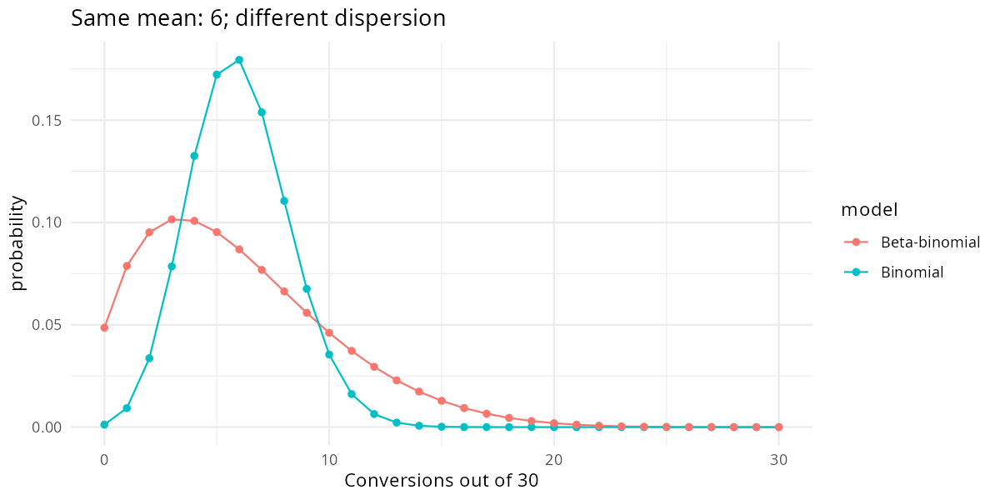
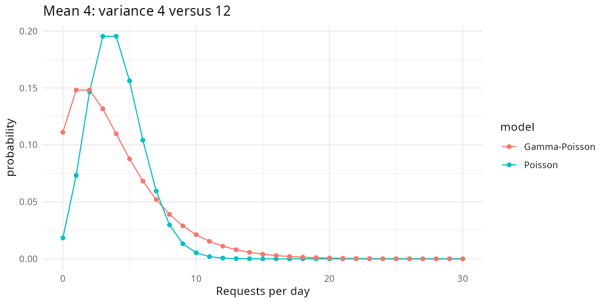
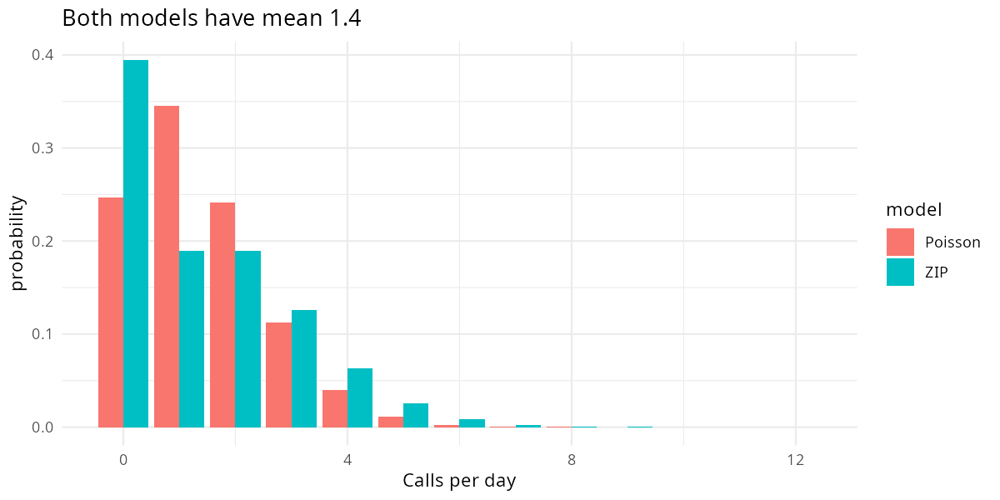
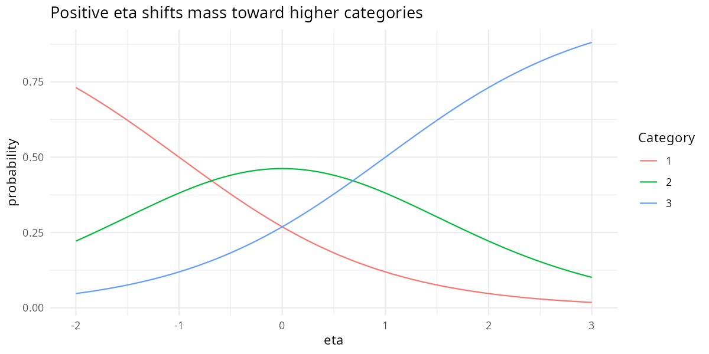
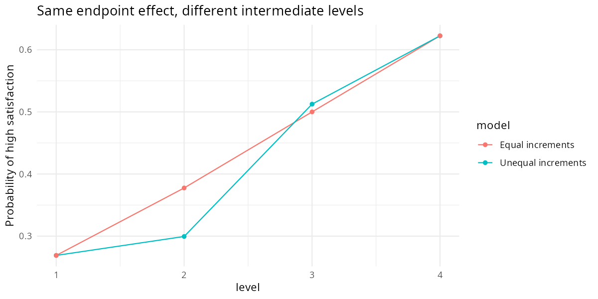

# A11 — Monsters and Mixtures

**Course:** Statistical Rethinking 2026 — supplementary study guide  
**Level:** A — Beginner, with explicitly marked extensions  
**Reading:** Richard McElreath, *Statistical Rethinking*, second edition, Chapter 12, “Monsters and Mixtures,” printed pp. 369–398  
**Status:** An additional lesson prepared for this repository; not an official eleventh meeting or assigned homework.  
**Central question:** How can we build an observation model when ordinary binomial, Poisson, or equally spaced numerical descriptions miss how the measurements arise?

## Executive summary {.unnumbered}

**A11 builds more realistic observation models from familiar components.** A09 introduced binomial and Poisson models. This lesson asks what changes when probabilities vary between cohorts, rates vary between days, zeros have more than one source, or measurements record an order without a numerical distance.

Four problems organize the lesson. **Problem 1** adds latent heterogeneity to count models: beta-binomial for bounded counts and Gamma-Poisson, also called negative-binomial, for unbounded counts. **Problem 2** separates an inactive state from an active count process, using zero-inflated and hurdle models. **Problem 3** converts ordered response categories into cumulative probabilities, then uses an ordered-logistic model. **Problem 4** models an ordered predictor through unequal, monotonic increments rather than assuming that every step has the same effect.

The practical output is a probability distribution over observable outcomes: a conversion count, a number of calls, or a satisfaction category. Coefficients and latent states help construct that distribution, but they are not themselves the final business or scientific answer. Every worked problem therefore returns to predictions, moments, or an interpretable probability difference.

The examples below are **original simulated teaching cases**, with executable R/tidyverse code, recorded results, figures, and a local HTML explorer. They do not reproduce the book's prose, figures, practice questions, or empirical fits. Small Bayesian grids make the examples reproducible without Stan; the conditional assumptions and numerical limitations are stated where they matter.

> **Connection to A09 and A10.** A09 briefly introduced extra-binomial variation and Gamma-Poisson counts. A10 studies unobserved confounding. A11 develops the second-edition Chapter 12 topics that the official A10 sensitivity lesson does not cover. Modeling residual heterogeneity can improve predictions; it does not automatically remove causal confounding. [B01](B01.md) then develops partial pooling and multilevel models.

## 0. Notation and reading conventions {#a11-notation}

An **observed outcome** is what the dataset records. A **latent quantity** is represented by the model but not observed. A **generative model** describes a sequence that could produce the observations. A **mixture** averages an observation distribution over different latent states or parameter values.

| Symbol | Meaning in this lesson |
|---|---|
| $i$, $j$, $s$ | Observation/cohort, category/transition, posterior draw |
| $Y_i$, $y_i$ | Random outcome and its observed value |
| $n_i$ | Known number of opportunities for a bounded count |
| $P_i$, $\Lambda_i$ | Latent cohort probability and latent count rate |
| $\mu$ | Mean probability in beta-binomial; mean count in Gamma-Poisson, stated locally |
| $\kappa$, $\phi$ | Positive concentration/shape parameters; larger values mean less mixing variation |
| $\psi$, $\lambda$ | Probability of an inactive state and mean count when active |
| $\eta_i$ | Linear predictor, on a link scale rather than the outcome scale |
| $c_1<\cdots<c_{K-1}$ | Ordered cutpoints for $K$ response categories |
| $E_i$, $\boldsymbol\delta$ | Ordered predictor level and nonnegative fractions allocating its total effect |

Here $\mathrm{Normal}(m,s)$ uses **standard deviation** $s$; $\mathrm{Gamma}(a,b)$ uses **shape** $a$ and **rate** $b$. Consequently, a Gamma has mean $a/b$ and variance $a/b^2$. A Beta$(a,b)$ has mean $a/(a+b)$ and variance $ab/[(a+b)^2(a+b+1)]$.

$\operatorname{logit}(p)=\log[p/(1-p)]$ maps a probability to the real line. Its inverse is $\operatorname{logit}^{-1}(z)=1/(1+e^{-z})$, implemented by `plogis(z)`. The log link uses $\mu=\exp(\eta)$ to produce a positive mean.

A **prior** describes uncertainty before the outcome data; a **posterior** updates it with the likelihood. A **posterior predictive check (PPC)** compares observed statistics with the same statistics from posterior-simulated datasets. A central **90% posterior interval** runs from the 5th to the 95th posterior percentile. `true` labels a chosen simulation truth; `rep` labels simulated observations, not another observed dataset.

## 1. Reading map: four problems and their outputs {#a11-problem-map}

| Problem | Concrete question | Sections | What you will produce |
|---|---|---|---|
| **1A — Different conversion probabilities** | Why do comparable campaign cohorts differ more than a fixed binomial predicts? | [4–8](#a11-problem1) | Beta-binomial moments, simulation, posterior for mean and concentration |
| **1B — Different daily rates** | Why do daily service requests have a long tail despite similar measured conditions? | [9–13](#a11-gamma-poisson) | Gamma-Poisson moments, posterior, replicated-data checks |
| **2 — Two routes to zero** | Was a support desk offline, or simply active without receiving calls? | [14–18](#a11-problem2) | Mixture likelihood, zero-source probability, fitted ZIP parameters |
| **3 — Ordered responses** | How does a predictor shift low/medium/high satisfaction without assuming equal category spacing? | [19–26](#a11-problem3) | Cumulative link, category probabilities, posterior probability difference |
| **4 — Ordered predictors** | How can successive training levels have unequal increments while retaining a common direction? | [27–31](#a11-problem4) | Simplex increments, Dirichlet prior, conditional learning example |
| **Apply and verify** | What would we report, and what has actually been checked? | [32–35](#a11-crm) | CRM interpretation, interactive explorer, reproducibility and source map |
| **Review** | Can you explain and reconstruct the models? | [36–37](#a11-review) | Original review questions with worked answers |

**First pass:** read each problem statement, formula, numerical example, and conclusion. **Second pass:** run the full walkthrough and inspect the fitting functions. Sections 23, 30, and 34 make assumptions explicit before you extend the models.

## 2. One construction rule: specify the hidden step, then average it out

**Goal/premise:** Different processes can produce the same observation. **Action:** Write their conditional distributions before naming a model. **Conclusion:** The likelihood is the probability of the observed value after averaging over unobserved possibilities.

For a discrete latent state $Z$,

$$
p(y\mid\theta)=\sum_z p(y\mid z,\theta)\Pr(z\mid\theta).
$$

For a continuous latent quantity $U$,

$$
p(y\mid\theta)=\int p(y\mid u,\theta)p(u\mid\theta)\,du.
$$

Here $\theta$ collects the model parameters. The weights in a mixture must be nonnegative and sum or integrate to one. We **sum probabilities**, then take the logarithm when evaluating the log likelihood. Averaging component log likelihoods is a different calculation.

Three different kinds of uncertainty must stay separate. Cohorts may truly have different probabilities; we may be uncertain about the distribution of those probabilities; future counts still vary even if the probability is known. A mixture observation model represents the first, posterior inference the second, and posterior prediction combines all relevant levels.

Ordinal outcomes use a related construction: a continuous latent propensity crosses thresholds to generate categories. This is a threshold measurement model; it need not be described as a finite mixture of populations.

## 3. Reproducible route and shared code {#a11-run}

Run from the repository root:

```sh
Rscript scripts/A11_walkthroughs.R
quarto render courses/A11.qmd --to html
```

The complete source is [A11_walkthroughs.R](../scripts/A11_walkthroughs.R). It needs `dplyr`, `tidyr`, `purrr`, `tibble`, `readr`, and `ggplot2`. It creates the original simulated datasets, fits the small models, prints numbered results, and writes figures and CSV summaries under `courses/figures/A11/`.

The MD and QMD contain identical code excerpts and executed outputs. Quarto displays those verified outputs with `eval: false`; rendering does not refit the models. If you change the script or its data, rerun it and refresh the displayed outputs as well. The snippets below run in order after this setup, with the repository root as the working directory.

```{r a11-setup}
# A11 — Monsters and Mixtures: original tidyverse teaching examples.
# Run from the repository root: Rscript scripts/A11_walkthroughs.R
# No book datasets or Stan compiler required. All data below are simulated.
# Grids approximate Bayesian posteriors; their range/resolution checks are printed.
suppressPackageStartupMessages({
  library(dplyr); library(tidyr); library(purrr); library(tibble)
  library(readr); library(ggplot2)
})
options(width = 105, digits = 4)
out <- "courses/figures/A11"
dir.create(out, recursive = TRUE, showWarnings = FALSE)
show_table <- function(x) print(as.data.frame(x), row.names = FALSE, digits = 4)
normalize_grid <- function(g) {
  g |> mutate(weight = exp(log_weight - max(log_weight)), weight = weight / sum(weight))
}
weighted_summary <- function(g, variables) {
  map_dfr(variables, function(v) {
    z <- g |> arrange(.data[[v]])
    q <- function(p) z[[v]][which(cumsum(z$weight) >= p)[1]]
    tibble(parameter = v, mean = sum(z[[v]] * z$weight), lo90 = q(.05), hi90 = q(.95))
  })
}
# A boundary check concerns finite support; refinement concerns grid resolution.
check_grid <- function(coarse, fine, variables, boundary) {
  a <- weighted_summary(coarse, variables)
  b <- weighted_summary(fine, variables)
  error <- max(abs(a$mean - b$mean))
  edge_mass <- sum(coarse$weight[boundary])
  stopifnot(error < .02, edge_mass < .001)
  tibble(max_mean_change = error, boundary_mass = edge_mass)
}
log_beta_binomial <- function(y, n, mu, kappa) {
  lchoose(n, y) + lbeta(y + mu*kappa, n - y + (1-mu)*kappa) - lbeta(mu*kappa, (1-mu)*kappa)
}
```

**How the grids work.** Evaluate prior density times likelihood on a regular grid, subtract the largest log weight for numerical stability, then normalize. Cell volumes cancel because the grid spacing is constant in the coordinates being integrated. When a prior is specified directly on a log or logit coordinate, its density is evaluated there; no extra Jacobian is needed. A prior specified on the untransformed parameter would require the corresponding change-of-variable factor when integrating in transformed coordinates.

The printed `mean` is a weighted grid expectation, and `lo90`/`hi90` are weighted grid quantiles. A small simulation exercise is not automatically a calibrated inference procedure: range, resolution, probability identities, and recovery need their own checks.

## 4. Problem 1: extra variation after accounting for the mean {#a11-problem1}

**Goal/premise:** One hundred campaign cohorts each contain 30 customers, but otherwise comparable cohorts differ in unmeasured readiness to buy. **Action:** Let each cohort have its own shared conversion probability. **Conclusion:** Variation between cohort probabilities increases the variability of cohort conversion counts.

For a binomial with fixed probability, $\mathbb E[Y\mid p,n]=np$ and $\operatorname{Var}(Y\mid p,n)=np(1-p)$. A Poisson with fixed mean has $\mathbb E[Y\mid\lambda]=\operatorname{Var}(Y\mid\lambda)=\lambda$.

**Overdispersion** means variation beyond the relevant conditional model's allowance. Different raw means across groups are not by themselves evidence of residual overdispersion. First account for measured predictors, different denominators/exposures, and clustering. Missing predictors, shared events, or residual heterogeneity may then motivate a richer observation model.

For this first example, cohorts are independent and customers within a cohort are conditionally independent given its shared $P_i$. Sharing $P_i$ creates dependence after we average it out. Drawing a new independent probability for every single customer would not produce this same beta-binomial cohort model.

## 5. Beta-binomial: a distribution of cohort probabilities

**Problem 1A — Build the model.** Let $\mu\in(0,1)$ be the average cohort conversion probability and $\kappa>0$ its concentration:

$$
P_i\sim\mathrm{Beta}(\mu\kappa,(1-\mu)\kappa),
\qquad Y_i\mid P_i\sim\mathrm{Binomial}(n_i,P_i).
$$

Larger $\kappa$ concentrates $P_i$ near $\mu$. Integrating out $P_i$ gives the **beta-binomial** probability mass function:

$$
\Pr(Y_i=y)=\binom{n_i}{y}
\frac{B(y+\mu\kappa,n_i-y+(1-\mu)\kappa)}{B(\mu\kappa,(1-\mu)\kappa)},
\quad y=0,\ldots,n_i.
$$

$B(a,b)$ is the beta function, the normalizing integral for a Beta density. In code, `lbeta(a,b)` returns its logarithm, avoiding tiny intermediate numbers.

A distribution used for population variation is not automatically a prior expressing our uncertainty about one common probability. Here a new $P_i$ is drawn for every cohort. The shared hyperparameters $\mu$ and $\kappa$ also need priors when unknown.

## 6. Beta-binomial moments and a simulated dataset

**Problem 1A — See what changes.** The law of total variance separates within-cohort event variation from between-cohort variation:

$$
\operatorname{Var}(Y)=\mathbb E[\operatorname{Var}(Y\mid P)]
+\operatorname{Var}(\mathbb E[Y\mid P]).
$$

Consequently,

$$
\mathbb E[P]=\mu,\quad\operatorname{Var}(P)=\frac{\mu(1-\mu)}{\kappa+1},\qquad
\mathbb E[Y]=n\mu,\quad
\operatorname{Var}(Y)=n\mu(1-\mu)\frac{n+\kappa}{1+\kappa}.
$$

The implied correlation between two distinct trials in one cohort is $1/(\kappa+1)$. As $\kappa\to\infty$, the beta-binomial approaches the ordinary binomial. With only one trial per cohort, it reduces to Bernoulli$(\mu)$ and cannot identify $\kappa$ from those outcomes alone.

```{r a11-step-6}
# Problem 1A: each campaign cohort shares an unobserved conversion probability.
mu <- .20; n <- 30
bb_moments <- tibble(kappa = c(2, 10, 50, Inf)) |>
  mutate(mean = n*mu, variance_p = mu*(1-mu)/(kappa+1),
         variance_y = n*mu*(1-mu)*(1+(n-1)/(kappa+1)),
         within_cohort_correlation = 1/(kappa+1))
show_table(bb_moments)
# Same cohort-level P is shared by all 30 opportunities. New cohort, new P.
set.seed(1106)
bb_data <- tibble(cohort = 1:100, n = n, p_true = rbeta(100, mu*10, (1-mu)*10)) |>
  mutate(y = rbinom(n(), n, p_true))
show_table(bb_data |> summarise(cohorts = n(), mean_count = mean(y), variance_count = var(y)))
```

**Executed result:**

```text
kappa mean variance_p variance_y within_cohort_correlation
     2    6   0.053333     51.200                   0.33333
    10    6   0.014545     17.455                   0.09091
    50    6   0.003137      7.529                   0.01961
   Inf    6   0.000000      4.800                   0.00000
 cohorts mean_count variance_count
     100       7.06          18.06
```

**Conclusion.** All four settings expect six conversions. Their count variances differ because concentration changes the extent of shared heterogeneity. The simulation uses known truths $\mu=0.2$, $\kappa=10$; `p_true` is retained only to explain generation and is not supplied to the likelihood in section 8.

## 7. Choosing priors for mean and concentration

**Problem 1A — State assumptions on interpretable scales.** We use

$$
\operatorname{logit}(\mu)\sim\mathrm{Normal}(\operatorname{logit}(0.2),1),
\qquad \log\kappa\sim\mathrm{Normal}(\log 10,1).
$$

These are illustrative priors declared before generating the teaching data, not universal defaults for conversion models. The first has median probability 0.2, not necessarily mean probability 0.2. The second gives $\kappa$ median 10, mean $10e^{1/2}\approx16.49$, and variance $100e(e-1)\approx467.08$. A log-scale SD of 1 therefore permits substantial heterogeneity uncertainty.

For any $X$ with $\log X\sim\mathrm{Normal}(m,s)$, $\mathbb E[X]=e^{m+s^2/2}$ and $\operatorname{Var}(X)=(e^{s^2}-1)e^{2m+s^2}$. A prior's median, mean, and mode need not agree.

Generate full prior-predictive cohorts when choosing these scales for an application. Inspect nearly empty/full cohorts as well as their average. A Beta$(\mu\kappa,(1-\mu)\kappa)$ distribution is uniform only when both shapes equal one: $\mu=0.5$ **and** $\kappa=2$. Concentration 2 alone does not imply uniformity.

## 8. Learn mean and heterogeneity jointly

**Problem 1A — Action:** Fit the simulated counts, then refine the grid. **Output:** A posterior for population mean and concentration, rather than 100 unrelated conversion-rate estimates.

```{r a11-step-8}
# Learn both the population mean and heterogeneity from repeated cohorts.
# Priors on transformed coordinates: logit(mu) ~ N(logit(.2),1), log(kappa) ~ N(log(10),1).
fit_bb <- function(step) {
  g <- expand_grid(a = seq(-4, .8, by = step), h = seq(-2, 7, by = step)) |>
    mutate(mu = plogis(a), kappa = exp(h),
           log_weight = dnorm(a, qlogis(.2), 1, log = TRUE) + dnorm(h, log(10), 1, log = TRUE))
  for (i in seq_len(nrow(bb_data))) {
    g$log_weight <- g$log_weight + log_beta_binomial(bb_data$y[i], bb_data$n[i], g$mu, g$kappa)
  }
  normalize_grid(g)
}
bb_fit <- fit_bb(.08); bb_fine <- fit_bb(.04)
bb_check <- check_grid(bb_fit, bb_fine, c("mu", "kappa"),
                      with(bb_fit, a < -3.8 | a > .6 | h < -1.8 | h > 6.8))
show_table(weighted_summary(bb_fit, c("mu", "kappa")))
show_table(bb_check)
write_csv(weighted_summary(bb_fit, c("mu", "kappa")), file.path(out, "beta_binomial_posterior.csv"))
bb_curve <- tibble(y = 0:30) |>
  mutate(Binomial = dbinom(y, 30, .2),
         `Beta-binomial` = exp(log_beta_binomial(y, 30, .2, 10))) |>
  pivot_longer(-y, names_to = "model", values_to = "probability")
ggsave(file.path(out, "beta_binomial.png"),
       ggplot(bb_curve, aes(y, probability, colour = model)) + geom_line() + geom_point() +
         theme_minimal() + labs(x = "Conversions out of 30", title = "Same mean: 6; different dispersion"),
       width = 8, height = 4, dpi = 150)
```

**Executed result:**

```text
parameter    mean   lo90    hi90
        mu  0.2348 0.2176  0.2611
     kappa 11.1023 8.0045 15.1803
 max_mean_change boundary_mass
       2.285e-07     8.867e-31
```



**Conclusion.** The data constrain both $\mu$ and $\kappa$ because many independent cohorts contain multiple opportunities. The figure holds the mean fixed to reveal the distributional effect of mixing. It is not a posterior plot. The separate printed intervals quantify parameter uncertainty under the stated priors. In this particular sample, the posterior mean conversion probability is about 0.235, with a 90% interval [0.218, 0.261], which excludes the generating value 0.2. The realized cohorts averaged 7.06 conversions rather than the population expectation 6. This is a useful reminder that a generating truth is not guaranteed to fall in every interval; no repeated-simulation coverage claim follows from this run.

## 9. Gamma-Poisson: a distribution of daily rates {#a11-gamma-poisson}

**Problem 1B — Goal:** Model service-request counts with no fixed upper bound. **Premise:** Independent days have different latent rates even after the measured conditions are held constant.

Let $\mu>0$ denote the average daily count and $\phi>0$ the Gamma shape:

$$
\Lambda_i\sim\mathrm{Gamma}\left(\phi,\frac{\phi}{\mu}\right),
\qquad Y_i\mid\Lambda_i\sim\mathrm{Poisson}(\Lambda_i).
$$

Integrating out $\Lambda_i$ gives a **Gamma-Poisson**, also called a **negative-binomial**, distribution:

$$
\Pr(Y=y)=\frac{\Gamma(y+\phi)}{\Gamma(\phi)y!}
\left(\frac{\phi}{\phi+\mu}\right)^\phi
\left(\frac{\mu}{\phi+\mu}\right)^y,\qquad y=0,1,2,\ldots.
$$

$\Gamma$ is the Gamma function, extending the factorial. Here $\phi$ need not be an integer; the name “negative-binomial” does not require a literal stop-after-successes sampling story. In base R, the matching parameterization is `dnbinom(y, size = phi, mu = mu)`.

## 10. Gamma-Poisson moments and simulation

**Problem 1B — Action:** Separate variation in latent rates from Poisson event variation.

$$
\mathbb E[\Lambda]=\mu,\quad\operatorname{Var}(\Lambda)=\frac{\mu^2}{\phi},\qquad
\mathbb E[Y]=\mu,\quad\operatorname{Var}(Y)=\mu+\frac{\mu^2}{\phi}.
$$

$$
\Pr(Y=0)=\left(\frac{\phi}{\phi+\mu}\right)^\phi.
$$

```{r a11-step-10}
# Problem 1B: different days have different latent service-request rates.
# Gamma uses SHAPE and RATE, never an unspecified second parameter.
mu_nb <- 4
nb_moments <- tibble(phi = c(.5, 2, 10, Inf)) |>
  mutate(mean = mu_nb, variance_rate = mu_nb^2/phi, variance_count = mu_nb + mu_nb^2/phi,
         probability_zero = if_else(is.infinite(phi), exp(-mu_nb),
                                    dnbinom(0, size = phi, mu = mu_nb)))
show_table(nb_moments)
set.seed(1110)
nb_data <- tibble(day = 1:200, lambda_true = rgamma(200, shape = 2, rate = 2/4)) |>
  mutate(y = rpois(n(), lambda_true))
show_table(nb_data |> summarise(mean_count = mean(y), variance_count = var(y), zeros = sum(y == 0)))
```

**Executed result:**

```text
phi mean variance_rate variance_count probability_zero
  0.5    4          32.0           36.0          0.33333
  2.0    4           8.0           12.0          0.11111
 10.0    4           1.6            5.6          0.03457
  Inf    4           0.0            4.0          0.01832
 mean_count variance_count zeros
      4.305          15.83    11
```

**Conclusion.** At mean 4 and shape 2, the count variance is 12, three times the Poisson variance. Larger $\phi$ approaches Poisson; smaller $\phi$ allows heavier tails and more zeros. More zeros do not necessarily imply a separate inactive population.

## 11. Add regression and exposure without changing the support

**Problem 1B — Extend the mean model.** If days have different measured conditions $x_i$, use $\log\mu_i=\alpha+\beta x_i$. Then $e^\beta$ multiplies the conditional mean count for a one-unit increase in $x$.

If observation duration $t_i$ differs, model a rate $r_i$ and expected count $\mu_i=t_ir_i$:

$$
\log\mu_i=\log t_i+\alpha+\beta x_i.
$$

$\log t_i$ is an **offset**: its coefficient is fixed to one because doubling time doubles expected count under the stated process. Exposure is positive and measured; an unmodeled change in operating hours should not be silently assigned to dispersion.

The same principle works for beta-binomial regression: $\operatorname{logit}(\mu_i)=\alpha+\beta x_i$, with observed $n_i$ retained. The linear predictor controls a mean; the inverse link enforces its support; the mixture likelihood determines the remaining variability.

## 12. Fit the count mixture and check new datasets

**Problem 1B — Goal:** Infer the mean and residual heterogeneity, then ask whether replicated datasets resemble the observed counts. Priors are $\log\mu\sim N(\log4,1)$ and $\log\phi\sim N(\log2,1)$.

```{r a11-step-12}
# Learn the average rate and gamma mixing shape, then predict new days.
fit_nb <- function(step) {
  g <- expand_grid(a = seq(-.5, 3.5, by = step), h = seq(-3, 5, by = step)) |>
    mutate(mu = exp(a), phi = exp(h),
           log_weight = dnorm(a, log(4), 1, log = TRUE) + dnorm(h, log(2), 1, log = TRUE))
  for (y in nb_data$y) g$log_weight <- g$log_weight + dnbinom(y, mu = g$mu, size = g$phi, log = TRUE)
  normalize_grid(g)
}
nb_fit <- fit_nb(.08); nb_fine <- fit_nb(.04)
nb_check <- check_grid(nb_fit, nb_fine, c("mu", "phi"),
                      with(nb_fit, a < -.3 | a > 3.3 | h < -2.8 | h > 4.8))
show_table(weighted_summary(nb_fit, c("mu", "phi")))
show_table(nb_check)
set.seed(1112)
nb_draws <- nb_fit |> slice_sample(n = 3000, replace = TRUE, weight_by = weight)
nb_reps <- map2_dfr(nb_draws$mu, nb_draws$phi, function(mu, phi) {
  y <- rnbinom(nrow(nb_data), mu = mu, size = phi)
  tibble(mean = mean(y), variance = var(y), zero_fraction = mean(y == 0))
})
nb_ppc <- nb_reps |> pivot_longer(everything(), names_to = "statistic") |>
  group_by(statistic) |> summarise(lo90 = quantile(value, .05), hi90 = quantile(value, .95), .groups = "drop") |>
  left_join(tibble(statistic = c("mean", "variance", "zero_fraction"),
                   observed = c(mean(nb_data$y), var(nb_data$y), mean(nb_data$y == 0))), by = "statistic")
show_table(nb_ppc)
write_csv(nb_ppc, file.path(out, "negative_binomial_ppc.csv"))
nb_curve <- tibble(y = 0:30) |>
  mutate(Poisson = dpois(y, 4), `Gamma-Poisson` = dnbinom(y, size = 2, mu = 4)) |>
  pivot_longer(-y, names_to = "model", values_to = "probability")
ggsave(file.path(out, "gamma_poisson.png"),
       ggplot(nb_curve, aes(y, probability, colour = model)) + geom_line() + geom_point() +
         theme_minimal() + labs(x = "Requests per day", title = "Mean 4: variance 4 versus 12"),
       width = 8, height = 4, dpi = 150)
```

**Executed result:**

```text
parameter  mean  lo90  hi90
        mu 4.315 3.819 4.855
       phi 1.947 1.553 2.509
 max_mean_change boundary_mass
       1.005e-05     1.418e-48
     statistic  lo90   hi90 observed
          mean 3.715  4.955    4.305
      variance 9.683 19.543   15.831
 zero_fraction 0.065  0.155    0.055
```



**Conclusion.** The PPC compares the mean, variance, and zero fraction of replicated 200-day datasets with the observed statistics. For every replicate, draw posterior parameters first, then new counts. A fitted mean alone cannot show whether the model captures dispersion or zeros. This simulation checks the stated independent-day model, not temporal dependence or a real operational mechanism. Here the observed zero fraction, 0.055, is **below** the 90% predictive range [0.065, 0.155], although the mean and variance lie inside their ranges. Do not label every PPC as passed. This discrepancy warrants inspection; it can occur in a finite sample even under the known generating model, and it does not by itself identify a different mechanism.

## 13. What overdispersion models solve—and what remains

**Problem 1 — Return to the question.** A wider conditional count distribution can prevent extreme observations from dominating a mean model as strongly as under a narrow likelihood. Whether this improves an actual regression must be assessed with its data and scientific assumptions.

These mixtures do not discover the omitted cause of heterogeneity. If omitted demand affects both staffing and calls, replacing Poisson by negative-binomial does not automatically identify a causal staffing effect. This is the connection to [A10](A10.md).

Beta-binomial and binomial can be compared on the same bounded-count observations; Gamma-Poisson and Poisson on the same nonnegative counts. Keep likelihood constants and held-out units consistent. Predicting a new cohort requires integrating over its latent probability or rate. Predicting another observation from an existing group is a different task and may motivate a multilevel model.

Neither mixture handles every possible dispersion pattern. Processes constrained by quotas can be underdispersed. Distribution choice requires a generative argument and predictive checks, not merely a variance-to-mean ratio computed across heterogeneous rows.

## 14. Problem 2: a zero does not reveal its cause {#a11-problem2}

**Goal/premise:** A support desk records zero calls on some days. It may have been offline, or online with no arriving calls. **Action:** Model operational state and active-day calls separately. **Conclusion:** Zero observations contribute evidence about both processes; they are not known offline labels.

Let $Z_i=1$ mean offline, with probability $\psi$. If $Z_i=1$, set $Y_i=0$. If $Z_i=0$, draw $Y_i\sim\mathrm{Poisson}(\lambda)$. Here $\lambda$ is the expected count **conditional on being active**; it is not the overall daily average.

A structural zero is imposed by the latent inactive state in this model. It is a modeling claim, not a label that can be inferred with certainty from the observed zero alone. Recorded operating status would be valuable additional information.

## 15. Zero-inflated Poisson: likelihood and moments

**Problem 2 — Combine both routes.** The **zero-inflated Poisson (ZIP)** mass function is

$$
\Pr(Y=y)=
\begin{cases}
\psi+(1-\psi)e^{-\lambda}, & y=0,\\
(1-\psi)e^{-\lambda}\lambda^y/y!, & y>0.
\end{cases}
$$

Its moments and the conditional source probability are

$$
\mathbb E[Y]=(1-\psi)\lambda,\qquad
\operatorname{Var}(Y)=(1-\psi)\lambda(1+\psi\lambda),
$$

$$
\Pr(Z=1\mid Y=0,\psi,\lambda)
=\frac{\psi}{\psi+(1-\psi)e^{-\lambda}}.
$$

```{r a11-step-15}
# Problem 2: some support desks are offline; active desks may also receive zero calls.
psi_true <- .30; lambda_true <- 2
zip_moments <- tibble(psi = psi_true, lambda = lambda_true) |>
  mutate(mean = (1-psi)*lambda, variance = (1-psi)*lambda*(1+psi*lambda),
         probability_zero = psi+(1-psi)*exp(-lambda),
         offline_given_zero = psi/probability_zero)
show_table(zip_moments)
set.seed(1115)
zip_data <- tibble(day = 1:300, offline_true = rbinom(300, 1, psi_true)) |>
  mutate(y = if_else(offline_true == 1, 0L, rpois(n(), lambda_true)))
show_table(zip_data |> summarise(days = n(), mean_count = mean(y), zero_fraction = mean(y == 0)))
```

**Executed result:**

```text
psi lambda mean variance probability_zero offline_given_zero
 0.3      2  1.4     2.24           0.3947               0.76
 days mean_count zero_fraction
  300      1.443        0.4133
```

**Conclusion.** With $\psi=0.3$ and $\lambda=2$, the mean is 1.4, variance 2.24, and zero probability about 0.395. A zero has approximately 76% probability of coming from the offline state **at those parameter values**. That source probability is neither the offline prevalence 30% nor the observed zero fraction.

## 16. Hurdle versus zero-inflated models

**Problem 2 — Alternative premise:** Suppose one process decides whether any call occurs, and a second determines the number of calls **conditional on at least one**. This is a hurdle model.

With $h=\Pr(Y=0)$ and a positive-count Poisson component,

$$
\Pr(Y=y)=
\begin{cases}
h,&y=0,\\
(1-h)\dfrac{\mathrm{Poisson}(y\mid\lambda)}{1-e^{-\lambda}},&y\ge1.
\end{cases}
$$

The denominator renormalizes the positive probabilities; leaving it out produces a distribution whose probabilities do not sum to one. Its mean is $(1-h)\lambda/(1-e^{-\lambda})$.

| | ZIP | Poisson hurdle |
|---|---|---|
| Can the count component produce zero? | Yes | No: it is truncated below 1 |
| Overall zero probability | $\psi+(1-\psi)e^{-\lambda}$ | $h$ |
| Meaning of zero | One of two possible routes | Failure to cross the hurdle |
| Zero deflation relative to a Poisson component | Not with nonnegative mixing weight | Possible |

At the same $\lambda$, setting $h=\psi+(1-\psi)e^{-\lambda}$ makes a hurdle model reproduce that ZIP distribution. Thus observational fit alone need not uniquely identify the latent story. The [Stan mixture guide](https://mc-stan.org/docs/2_32/stan-users-guide/zero-inflated.html) documents the two likelihood constructions and their implementation.

## 17. Fit the mixture without observing its labels

**Problem 2 — Action:** Fit $\psi$ and $\lambda$ using only `y`. The `offline_true` labels are excluded. The priors on their link scales are stated in the code.

```{r a11-step-17}
# Marginal likelihood sums the two routes to zero; latent labels remain unobserved.
# Priors: logit(psi) ~ N(logit(.3),1), log(lambda) ~ N(log(2),1).
fit_zip <- function(step) {
  g <- expand_grid(a = seq(-5, 2, by = step), b = seq(-2, 3, by = step)) |>
    mutate(psi = plogis(a), lambda = exp(b),
           log_weight = dnorm(a, qlogis(.3), 1, log = TRUE) + dnorm(b, log(2), 1, log = TRUE))
  # Factoring out psi is avoided: log1p is accurate when the mixture is near 1.
  nz <- sum(zip_data$y == 0)
  pos <- zip_data$y[zip_data$y > 0]
  g$log_weight <- g$log_weight + nz * log1p((1-g$psi)*expm1(-g$lambda)) +
    length(pos)*log1p(-g$psi) + sum(pos)*log(g$lambda) - length(pos)*g$lambda - sum(lgamma(pos+1))
  normalize_grid(g) |> mutate(overall_mean = (1-psi)*lambda,
    probability_zero = psi+(1-psi)*exp(-lambda), offline_given_zero = psi/probability_zero)
}
zip_fit <- fit_zip(.05); zip_fine <- fit_zip(.025)
zip_check <- check_grid(zip_fit, zip_fine, c("psi", "lambda", "overall_mean"),
                       with(zip_fit, a < -4.8 | a > 1.8 | b < -1.8 | b > 2.8))
show_table(weighted_summary(zip_fit, c("psi", "lambda", "overall_mean", "offline_given_zero")))
show_table(zip_check)
# A Poisson calibrated to the observed mean has no separate zero-generating mechanism.
show_table(tibble(observed_zero_fraction = mean(zip_data$y == 0),
                 fitted_Poisson_zero_probability = exp(-mean(zip_data$y)),
                 posterior_ZIP_zero_probability = sum(zip_fit$weight * zip_fit$probability_zero)))
write_csv(weighted_summary(zip_fit, c("psi", "lambda", "overall_mean")), file.path(out, "zip_posterior.csv"))
zip_curve <- tibble(y = 0:12) |> mutate(
  Poisson = dpois(y, (1-psi_true)*lambda_true),
  ZIP = if_else(y == 0, psi_true, 0) + (1-psi_true)*dpois(y, lambda_true)) |>
  pivot_longer(-y, names_to = "model", values_to = "probability")
ggsave(file.path(out, "zero_inflation.png"),
       ggplot(zip_curve, aes(y, probability, fill = model)) + geom_col(position = "dodge") +
         theme_minimal() + labs(x = "Calls per day", title = "Both models have mean 1.4"),
       width = 8, height = 4, dpi = 150)
```

**Executed result:**

```text
parameter   mean   lo90   hi90
                psi 0.3359 0.2789 0.3894
             lambda 2.1766 2.0138 2.3396
       overall_mean 1.4442 1.3002 1.5890
 offline_given_zero 0.8139 0.7532 0.8629
 max_mean_change boundary_mass
        3.99e-11     9.772e-24
 observed_zero_fraction fitted_Poisson_zero_probability posterior_ZIP_zero_probability
                 0.4133                          0.2361                         0.4119
```



**Conclusion.** The fitted ZIP distinguishes active intensity from the overall mean and closely reproduces the observed zero fraction in this simulation. The fitted Poisson comparison matches the empirical mean but has a substantially smaller zero probability. This comparison is a diagnostic illustration, not a reported cross-validation score.

The posterior summary of `offline_given_zero` averages the source probability over parameter uncertainty. It still depends on the assumed mixture mechanism. No individual day's hidden label is thereby known.

## 18. Two regressions, two interpretations

**Problem 2 — Extend the model.** A covariate can affect the inactive probability, active count intensity, or both:

$$
\operatorname{logit}(\psi_i)=a_z+b_zx_i,
\qquad\log\lambda_i=a_y+b_yx_i,
\qquad\mathbb E[Y_i\mid x_i]=(1-\psi_i)\lambda_i.
$$

A positive $b_z$ increases inactivity and tends to reduce counts; a positive $b_y$ increases active counts. The overall contrast must combine both. A coefficient in one component is not the effect on the unconditional mean.

Few positive observations, low active intensity, and strong heterogeneity can make component inference weak. Compare positive counts as well as zero frequency; inspect joint parameter uncertainty and prior sensitivity. A Gamma-Poisson can also create many zeros, and a zero-inflated negative-binomial adds still more flexibility. Extra flexibility needs additional information and validation.

For computation, marginalize discrete states rather than choosing a single hidden allocation. In large or extreme models, stable log-sum calculations avoid numerical underflow. The source uses a stable equivalent expression for the zero probability within its bounded grid.

## 19. Problem 3: ordered responses are not measured distances {#a11-problem3}

**Goal/premise:** Customers answer “low,” “medium,” or “high” satisfaction. The ordering is meaningful; the distance between adjacent labels is not known. **Action:** Model category probabilities through cumulative thresholds. **Conclusion:** Report changes in those probabilities, not an assumed change in numerical satisfaction units.

Ordinal responses differ from unordered categories such as preferred product color, and from counts such as number of complaints. Coding categories as 1, 2, 3 records their order; it does not establish an interval scale. In this example a redesigned interface is represented by $x=1$ versus $x=0$.

A threshold interpretation introduces latent satisfaction $L_i=\eta_i+\epsilon_i$, with standard logistic noise $\epsilon_i$. Observed category $k$ means $c_{k-1}<L_i\le c_k$, with infinite outer boundaries. The latent scale is fixed by the noise distribution; it is not independently observed satisfaction.

## 20. Cumulative probabilities and cutpoints

**Problem 3 — Build the observation probabilities.** For $K$ ordered categories, define

$$
F_{ik}=\Pr(Y_i\le k),\qquad k=1,\ldots,K-1.
$$

Use $K-1$ ordered cutpoints and the cumulative logit link:

$$
\operatorname{logit}(F_{ik})=c_k-\eta_i.
$$

The last cumulative probability is always one; it needs no estimated finite cutpoint. Recover individual category probabilities by subtraction:

$$
\pi_{i1}=F_{i1},\qquad
\pi_{ik}=F_{ik}-F_{i,k-1},\qquad
\pi_{iK}=1-F_{i,K-1}.
$$

Ordered cutpoints ensure nonnegative category probabilities. Cumulative probabilities increase with the category index; the probabilities of the individual categories need not increase.

## 21. How the linear predictor and link compose

**Problem 3 — Follow one prediction from coefficient to observation.** With $\eta_i=\beta x_i$:

$$
x_i\longrightarrow\eta_i=\beta x_i
\longrightarrow c_k-\eta_i
\longrightarrow F_{ik}=\operatorname{logit}^{-1}(c_k-\eta_i)
\longrightarrow\boldsymbol\pi_i
\longrightarrow Y_i\sim\mathrm{Categorical}(\boldsymbol\pi_i).
$$

A positive $\beta$ reduces $\Pr(Y\le k)$ at every fixed threshold when $x$ increases. Probability therefore shifts toward higher categories. It does not add $\beta$ units to the recorded category code.

The odds of being **above** threshold $k$ are $\exp(\eta_i-c_k)$. Increasing $x$ by one multiplies those odds by $e^\beta$ at every threshold: the **proportional-odds assumption**. The odds of being at or below the threshold instead multiply by $e^{-\beta}$. Stating the direction prevents sign confusion. These conventions agree with [Stan's ordered-logistic regression](https://mc-stan.org/docs/stan-users-guide/regression.html).

## 22. Concrete examples before fitting

**Problem 3 — Action:** Fix cutpoints at $(-1,1)$ and compare latent predictors zero and one.

```{r a11-step-22}
# Problem 3: low, medium, high satisfaction are ordered, not equally spaced measurements.
ordinal_prob <- function(eta, cuts) {
  stopifnot(length(cuts) >= 1, all(diff(cuts) > 0))
  diff(c(0, plogis(cuts - eta), 1))
}
ordinal_example <- map_dfr(c(0, 1), function(eta) {
  probabilities <- ordinal_prob(eta, c(-1, 1))
  tibble(eta = eta, category = c("Low", "Medium", "High"),
         probability = probabilities)
})
show_table(ordinal_example)
stopifnot(all(ordinal_example$probability >= 0))
```

**Executed result:**

```text
eta category probability
   0      Low      0.2689
   0   Medium      0.4621
   0     High      0.2689
   1      Low      0.1192
   1   Medium      0.3808
   1     High      0.5000
```

**Conclusion.** At $\eta=0$, low/medium/high probabilities are approximately $(0.269,0.462,0.269)$. At $\eta=1$, they become $(0.119,0.381,0.500)$. The high-category probability rises by 23.1 points; the number 1 on the latent scale is not itself that probability difference.

## 23. Priors and identification for ordered logits

**Problem 3 — Premise:** Only differences $c_k-\eta_i$ enter the likelihood. Adding the same constant to every cutpoint and a free intercept leaves probabilities unchanged. **Action:** Fix the intercept to zero here and estimate cutpoints plus slopes. **Conclusion:** The model has a defined location rather than redundant free parameters.

For the three-category example, use a prior density proportional to

$$
\mathrm{Normal}(c_1\mid0,1.5)\,
\mathrm{Normal}(c_2\mid0,1.5)\,
\mathbf 1(c_1<c_2),\qquad\beta\sim\mathrm{Normal}(0,1).
$$

The indicator restricts the cutpoints to increasing order. Their joint prior is not two unrestricted independent cutpoints; its normalization is constant for these fixed hyperparameters and cancels in grid normalization. An alternative uses a location and strictly positive gaps, with priors defined on those coordinates.

Before fitting a real questionnaire, simulate cutpoints and slopes, then category probabilities across realistic predictor values. Very narrow gaps nearly erase intermediate categories; extreme locations can concentrate almost everyone at one end. A familiar Normal prior on a coefficient is not automatically a sensible prior on response distributions.

## 24. Interactions and contrasts for actual questions

**Problem 3 — Extend the predictor.** If a redesigned interface $x$ might work differently for a customer group $z$, write $\eta=\beta_xx+\beta_zz+\beta_{xz}xz$. At $z=0$ the interface's latent-scale shift is $\beta_x$; at $z=1$ it is $\beta_x+\beta_{xz}$.

For each posterior draw, transform both predictions to all category probabilities. A useful output is

$$
\Delta_{\mathrm{high}}(z)=\Pr(Y=K\mid x=1,z)-\Pr(Y=K\mid x=0,z).
$$

Probability-scale differences can vary across groups even if $\beta_{xz}=0$, because the link is nonlinear. Conversely, a latent-scale interaction is not a percentage-point interaction. Standardize over an explicitly chosen covariate population when reporting an overall contrast, using the weighting discipline developed in A09.

## 25. Estimate cutpoints and the response shift together

**Problem 3 — Action:** Generate 200 observations per interface condition with chosen truth $\beta=0.8$ and cutpoints $(-1,1)$, then infer all three parameters. Unlike section 22, the cutpoints are now unknown in the fit.

```{r a11-step-25}
# Fit TWO unknown ordered cutpoints and a slope; no free intercept (location identification).
# Ordered cutpoint prior: product N(0,1.5) densities restricted to c1<c2; beta ~ N(0,1).
set.seed(1125)
ordinal_data <- tibble(x = rep(0:1, each = 200)) |>
  mutate(y = map_int(x, function(x) sample(1:3, 1, prob = ordinal_prob(.8*x, c(-1, 1)))))
ordinal_counts <- ordinal_data |> count(x, y) |> complete(x = 0:1, y = 1:3, fill = list(n = 0))
fit_ordinal <- function(step) {
  g <- expand_grid(c1 = seq(-3, .5, by = step), c2 = seq(-.5, 3, by = step), beta = seq(-2, 3, by = step)) |>
    filter(c1 < c2) |>
    mutate(log_weight = dnorm(c1, 0, 1.5, log = TRUE) + dnorm(c2, 0, 1.5, log = TRUE) + dnorm(beta, 0, 1, log = TRUE))
  for (i in seq_len(nrow(ordinal_counts))) {
    cell <- ordinal_counts[i, ]
    f1 <- plogis(g$c1 - g$beta*cell$x); f2 <- plogis(g$c2 - g$beta*cell$x)
    p <- switch(as.character(cell$y), `1` = f1, `2` = f2-f1, `3` = 1-f2)
    g$log_weight <- g$log_weight + cell$n*log(p)
  }
  normalize_grid(g) |> mutate(high_difference = plogis(beta-c2)-plogis(-c2))
}
ordinal_fit <- fit_ordinal(.10); ordinal_fine <- fit_ordinal(.05)
ordinal_check <- check_grid(ordinal_fit, ordinal_fine, c("c1", "c2", "beta", "high_difference"),
  with(ordinal_fit, c1 < -2.8 | c1 > .3 | c2 < -.3 | c2 > 2.8 | beta < -1.8 | beta > 2.8))
show_table(ordinal_counts)
show_table(weighted_summary(ordinal_fit, c("c1", "c2", "beta", "high_difference")))
show_table(ordinal_check)
write_csv(weighted_summary(ordinal_fit, c("c1", "c2", "beta", "high_difference")), file.path(out, "ordinal_posterior.csv"))
ordinal_curve <- expand_grid(eta = seq(-2, 3, length.out = 101), category = 1:3) |>
  mutate(probability = map2_dbl(eta, category, function(e, k) ordinal_prob(e, c(-1,1))[k]))
ggsave(file.path(out, "ordinal.png"),
       ggplot(ordinal_curve, aes(eta, probability, colour = factor(category))) + geom_line() +
         theme_minimal() + labs(colour = "Category", title = "Positive eta shifts mass toward higher categories"),
       width = 8, height = 4, dpi = 150)
```

**Executed result:**

```text
x y  n
 0 1 61
 0 2 93
 0 3 46
 1 1 40
 1 2 78
 1 3 82
       parameter    mean    lo90    hi90
              c1 -0.7785 -1.0000 -0.6000
              c2  1.1167  0.9000  1.4000
            beta  0.6948  0.4000  1.0000
 high_difference  0.1489  0.0854  0.2114
 max_mean_change boundary_mass
       2.529e-13     9.672e-15
```



**Conclusion.** `high_difference` directly answers how much more likely the high response is under $x=1$ than $x=0$, with both slope and cutpoint uncertainty propagated. Its generating value is $\operatorname{logit}^{-1}(-0.2)-\operatorname{logit}^{-1}(-1)\approx0.1812$. One simulation checks this example's behavior; it does not establish repeated-sampling coverage.

## 26. Check ordinal predictions and interpretation

**Problem 3 — Return to the measurement.** Compare observed and posterior-replicated proportions for every category, both overall and by predictor group. Also compare cumulative proportions at each threshold. A good overall average can conceal a poor fit to the extremes or to a subgroup.

The worked grid demonstrates parameter learning and a probability contrast; it does not execute a full ordinal PPC suite. For that extension, sample a grid row using its posterior weight, form the category probabilities for each $x$, simulate categorical outcomes, and repeat the same summaries used on the observed data.

If proportional odds is implausible, consider a carefully constrained alternative rather than independent threshold regressions that can cross and yield negative category probabilities. Repeated responses from one person may require person-level effects; the simulated rows here are independent.

An average of category codes depends on the numerical scoring rule. Probability of “high,” or the complete predicted distribution, uses the categories as measured. A causal claim about an interface also requires its assignment mechanism or adjustment assumptions; changing the likelihood cannot supply them.

## 27. Problem 4: ordered predictors need not be equally spaced {#a11-problem4}

**Goal/premise:** Training has four ordered levels, from introductory to advanced. The gain from level 2 to 3 might exceed the gain from level 1 to 2. **Action:** Allocate a total latent-scale effect across nonnegative increments. **Conclusion:** Preserve a common direction while learning unequal step sizes.

This differs from Problem 3: there the **outcome** was ordered; here an **input predictor** is ordered. Either can occur without the other. For continuity, the outcome remains low/medium/high satisfaction.

Three alternatives answer different modeling questions: numerical coding imposes equal increments; unordered indicator variables allow arbitrary level effects; a monotonic predictor allows unequal increments but requires one common direction. Monotonicity is a substantive assumption, not a consequence of the labels being ordered.

## 28. Separate total effect from incremental fractions

**Problem 4 — Build the predictor.** For levels $E_i\in\{1,\ldots,L\}$, let

$$
\delta_j\ge0,\quad\sum_{j=1}^{L-1}\delta_j=1,\qquad
s(E_i)=\sum_{j=1}^{E_i-1}\delta_j,\qquad
\eta_i=\beta_Es(E_i)+\text{other predictor terms}.
$$

The sum is empty at level 1, so $s(1)=0$; at the highest level, $s(L)=1$. Thus $\beta_E$ is the **complete lowest-to-highest change in the linear predictor**. Transition $j$ contributes $\beta_E\delta_j$.

If $\beta_E>0$, all transitions are nonnegative; if $\beta_E<0$, all are nonpositive. With $\beta_E=0$, none of the increments changes predictions and the data cannot learn how an absent effect is allocated. In an ordered-logistic outcome model, these transitions alter category probabilities through the cumulative link; $\delta_j$ is not itself a percentage-point effect.

## 29. Dirichlet priors: unequal steps without a preferred transition

**Problem 4 — Choose a prior for the fractions.** A **simplex** is a vector of nonnegative entries that sum to one. A **Dirichlet distribution** is a distribution over such vectors:

$$
\boldsymbol\delta\sim\mathrm{Dirichlet}(a_1,\ldots,a_{L-1}),\quad A=\sum_j a_j,
$$

$$
\mathbb E[\delta_j]=\frac{a_j}{A},\quad
\operatorname{Var}(\delta_j)=\frac{a_j(A-a_j)}{A^2(A+1)},\quad
\operatorname{Cov}(\delta_j,\delta_k)=-\frac{a_ja_k}{A^2(A+1)}\ (j\ne k).
$$

Equal $a_j$ values give equal expected increments. Only all $a_j=1$ give a uniform density on the simplex. Values below one favor allocations near its edges; larger values concentrate allocations around equal steps. Normalizing independent Gamma$(a_j,1)$ draws generates Dirichlet draws.

```{r a11-step-29}
# Problem 4: ordered training levels with unequal increments.
delta <- c(.10, .60, .30); beta <- 1.5
monotonic_example <- tibble(level = 1:4, score = c(0, cumsum(delta))) |>
  mutate(eta = beta*score, probability_high = plogis(eta-1))
show_table(monotonic_example)
# Symmetric Dirichlet: expected increments are equal, individual vectors need not be.
set.seed(1129)
dirichlet_moments <- map_dfr(c(.5, 1, 2, 10), function(a) {
  z <- matrix(rgamma(30000, shape = a), ncol = 3)
  z <- z / rowSums(z)
  tibble(a = a, theoretical_mean = 1/3, theoretical_variance = 2/(9*(3*a+1)),
         simulated_mean = mean(z[,1]), simulated_variance = var(z[,1]))
})
show_table(dirichlet_moments)
```

**Executed result:**

```text
level score  eta probability_high
     1   0.0 0.00           0.2689
     2   0.1 0.15           0.2994
     3   0.7 1.05           0.5125
     4   1.0 1.50           0.6225
    a theoretical_mean theoretical_variance simulated_mean simulated_variance
  0.5           0.3333             0.088889         0.3335           0.089376
  1.0           0.3333             0.055556         0.3295           0.055365
  2.0           0.3333             0.031746         0.3345           0.031513
 10.0           0.3333             0.007168         0.3334           0.007241
```

**Conclusion.** With $\beta_E=1.5$ and $\boldsymbol\delta=(0.1,0.6,0.3)$, latent predictions are $0,0.15,1.05,1.5$. The second transition receives most of the effect. The Dirichlet examples show that symmetric expectations do not force individual draws to have equal components.

## 30. Prior sensitivity, sparse levels, and confounding

**Problem 4 — State what can be learned.** Use $\beta_E\sim\mathrm{Normal}(0,1)$ and $\boldsymbol\delta\sim\mathrm{Dirichlet}(2,2,2)$ for the teaching fit. The first permits either direction; the second mildly favors balanced allocations while allowing substantial variation.

Sparse levels may give little information about their adjacent increments. A posterior centered near equal increments can reflect the prior, not strong evidence of equal effects. Check sensitivity to concentrations such as 1 and 5, and compare predictions with a numerical predictor $s(E)=(E-1)/(L-1)$.

In a real analysis, fit cutpoints and increments jointly unless cutpoints have genuinely been calibrated externally. The next example fixes the cutpoints deliberately to isolate learning of the ordered predictor. Its intervals therefore omit cutpoint uncertainty and must not be presented as an unrestricted ordinal regression.

Training or education is often associated with prior experience, age, and selection. Monotonic modeling describes an association; identifying a causal training effect still requires a causal design. More flexible category spacing does not resolve a backdoor path.

## 31. Conditional learning of unequal increments

**Problem 4 — Action:** Generate responses at four training levels. Treat $(-1,1)$ as known cutpoints and infer $\beta_E$ and the three increments. This is an explicitly conditional teaching experiment.

```{r a11-step-31}
# Conditional learning exercise: cutpoints are FIXED at (-1,1), as in an externally
# calibrated instrument. Learn beta and the three simplex increments, not cutpoints.
set.seed(1131)
mono_data <- tibble(level = rep(1:4, each = 150)) |>
  mutate(y = map_int(level, function(e) sample(1:3, 1, prob = ordinal_prob(monotonic_example$eta[e], c(-1,1)))))
mono_counts <- mono_data |> count(level, y) |> complete(level = 1:4, y = 1:3, fill = list(n = 0))
fit_monotonic <- function(M, step) {
  simplex <- expand_grid(j = seq_len(M-2), k = seq_len(M-2)) |> filter(j+k < M) |>
    transmute(d1 = j/M, d2 = k/M, d3 = 1-d1-d2)
  g <- crossing(simplex, beta = seq(-2, 4, by = step)) |>
    mutate(log_weight = dnorm(beta, 0, 1, log = TRUE) + log(d1)+log(d2)+log(d3))
  # Dirichlet(2,2,2) density is proportional to d1*d2*d3 on the simplex.
  for (i in seq_len(nrow(mono_counts))) {
    cell <- mono_counts[i, ]
    score <- switch(as.character(cell$level), `1` = 0, `2` = g$d1, `3` = g$d1+g$d2, `4` = 1)
    f1 <- plogis(-1-g$beta*score); f2 <- plogis(1-g$beta*score)
    p <- switch(as.character(cell$y), `1` = f1, `2` = f2-f1, `3` = 1-f2)
    g$log_weight <- g$log_weight + cell$n*log(p)
  }
  normalize_grid(g)
}
mono_fit <- fit_monotonic(30, .1); mono_fine <- fit_monotonic(60, .05)
# Simplex boundaries are genuine parameter boundaries, not artificial truncation.
mono_check <- check_grid(mono_fit, mono_fine, c("beta", "d1", "d2", "d3"),
                        with(mono_fit, beta < -1.8 | beta > 3.8))
show_table(weighted_summary(mono_fit, c("beta", "d1", "d2", "d3")))
show_table(mono_check)
mono_curve <- bind_rows(monotonic_example |> mutate(model = "Unequal increments"),
                       tibble(level = 1:4, score = (0:3)/3, eta = 1.5*(0:3)/3,
                              probability_high = plogis(eta-1), model = "Equal increments"))
ggsave(file.path(out, "monotonic.png"),
       ggplot(mono_curve, aes(level, probability_high, colour = model)) + geom_line() + geom_point() +
         theme_minimal() + labs(y = "Probability of high satisfaction", title = "Same endpoint effect, different intermediate levels"),
       width = 8, height = 4, dpi = 150)
write_csv(weighted_summary(mono_fit, c("beta", "d1", "d2", "d3")), file.path(out, "monotonic_posterior.csv"))
```

**Executed result:**

```text
parameter   mean   lo90   hi90
      beta 1.5085 1.3000 1.8000
        d1 0.2353 0.1000 0.4000
        d2 0.4772 0.2667 0.7000
        d3 0.2876 0.1000 0.4667
 max_mean_change boundary_mass
       0.0001265     4.013e-33
```



**Conclusion.** The fitted total shift is close to its generating value, while individual increments remain more uncertain. The generating first increment 0.1 need not equal its posterior mean in one finite sample. The plotted curves use the declared generating parameters and equal-spacing alternative; the table, separately, gives the fitted posterior.

## 32. CRM application: match the model to the decision {#a11-crm}

**Goal:** Translate latent-model parameters into quantities that an operational decision can use.

| Observed CRM problem | Candidate model | Report to the decision maker | Additional information to seek |
|---|---|---|---|
| Cohorts with bounded conversion counts and residual heterogeneity | Beta-binomial | Expected conversions and predictive interval for a new cohort | Cohort conditions, repeated campaigns, customer clustering |
| Heavy-tailed daily request counts | Gamma-Poisson | Staffing-relevant upper-tail probability, with exposure defined | Hours observed, calendar effects, demand predictors |
| Zero calls from inactive or quiet days | ZIP or hurdle, depending on the process | Overall calls, inactivity probability, and active intensity | Operating-status logs; evidence about each zero mechanism |
| Ordered satisfaction answers | Ordered logistic | Probability of each category and of exceeding a relevant threshold | Repeated-customer IDs, survey design, category interpretation |
| Ordered training or engagement levels | Monotonic predictor | Lowest-to-highest contrast and uncertain intermediate predictions | Level coverage, selection variables, causal design |

For staffing, $\Pr(Y>10)$ may matter more than $\mathbb E[Y]$. For satisfaction, “probability of high satisfaction increases by 8 points” is interpretable; “the coefficient is 0.4” needs a link and baseline before it can guide a decision. Monetary decisions additionally need explicit costs, benefits, and uncertainty about them.

## 33. Local interactive distribution explorer {#a11-simulator}

Choose a model, change its parameters, and watch the probabilities and moments change. The HTML works offline, without an R server. This is a **distribution explorer at chosen parameters**, not a posterior-fitting interface; the actual fitted posteriors are in sections 8, 12, 17, 25, and 31.

<div id="a11-explorer" style="border:1px solid #bbc9d2;padding:1.2rem;border-radius:8px">
The interactive explorer is available in the rendered A11 HTML. The static figures and executed examples above remain available in Markdown.
</div>

Try five short experiments:

1. Hold beta-binomial $\mu$ and $n$ fixed; reduce $\kappa$. Explain why the mean stays fixed while the tails grow.
2. Hold Gamma-Poisson $\mu$ fixed; reduce $\phi$. Notice that zeros increase without an inactive state.
3. Increase ZIP $\psi$ at fixed $\lambda$. Distinguish active intensity, unconditional mean, and the source probability of a zero.
4. Increase ordinal $\eta$ at fixed cutpoints. Track cumulative and individual category probabilities separately.
5. Change monotonic step weights at fixed $\beta_E$. Endpoints stay fixed while intermediate predictions move; changing the sign of $\beta_E$ reverses the direction.

## 34. Validation: formulas, numerical accuracy, and scope

**Goal/premise:** A plausible plot is insufficient evidence that a custom model is implemented correctly. **Action:** Check normalization, moments, parameter constraints, and numerical approximation independently.

```{r a11-step-34}
# Independent probability and moment checks, beyond posterior grid refinement.
stopifnot(abs(sum(exp(log_beta_binomial(0:30, 30, .2, 10))) - 1) < 1e-10)
y <- 0:30; p <- exp(log_beta_binomial(y, 30, .2, 10))
stopifnot(abs(sum(y*p)-6) < 1e-10, abs(sum((y-6)^2*p)-4.8*40/11) < 1e-9)
stopifnot(abs(sum(dnbinom(0:1000, size=2, mu=4))-1) < 1e-10)
for (eta in c(-10, 0, 10)) stopifnot(abs(sum(ordinal_prob(eta, c(-1,1)))-1) < 1e-12)
# A shift of BOTH cutpoints and eta must leave category probabilities unchanged.
stopifnot(max(abs(ordinal_prob(1,c(-1,1))-ordinal_prob(4,c(2,4)))) < 1e-12)
stopifnot(all(diff(monotonic_example$eta) >= 0), abs(sum(delta)-1) < 1e-12)
checks <- bind_rows(Beta_binomial = bb_check, Gamma_Poisson = nb_check, ZIP = zip_check,
                    Ordinal = ordinal_check, Monotonic_conditional = mono_check, .id = "model")
show_table(checks)
write_csv(checks, file.path(out, "numerical_checks.csv"))
cat("PASS: normalization, analytic moments, ordinal identification, monotonicity and grid checks.\n")
cat("No HMC, full SBC or empirical chapter-data fits were run.\n")
```

**Executed result:**

```text
model max_mean_change boundary_mass
         Beta_binomial       2.285e-07     8.867e-31
         Gamma_Poisson       1.005e-05     1.418e-48
                   ZIP       3.990e-11     9.772e-24
               Ordinal       2.529e-13     9.672e-15
 Monotonic_conditional       1.265e-04     4.013e-33
PASS: normalization, analytic moments, ordinal identification, monotonicity and grid checks.
No HMC, full SBC or empirical chapter-data fits were run.
```

The script checks analytic beta-binomial moments against its probability mass function, count-probability normalization, ordinal shift invariance, monotonicity, and posterior range/resolution. The largest displayed change in a posterior mean under refinement is below 0.001; interval endpoints remain discretized and should not be reported with arbitrary precision.

For the simplex example, approaching a boundary is legitimate parameter behavior. Its refinement check increases simplex resolution; it does not reject posterior mass merely because an increment is small. Other finite grid limits are artificial, and their boundary mass is checked explicitly.

This is not an HMC run: no R-hat, effective sample size, divergence, or treedepth results are claimed. A production model may require HMC and its diagnostics. **Simulation-based calibration (SBC)** goes further by repeatedly drawing truths from the prior, simulating data, fitting, and checking ranks; one recovery example is not SBC. This lesson runs count PPCs and numerical checks, not a full calibration suite for all five models.

Saved numerical results include [grid checks](figures/A11/numerical_checks.csv), [beta-binomial posterior](figures/A11/beta_binomial_posterior.csv), [count PPC](figures/A11/negative_binomial_ppc.csv), [ZIP posterior](figures/A11/zip_posterior.csv), [ordinal posterior](figures/A11/ordinal_posterior.csv), and [conditional monotonic posterior](figures/A11/monotonic_posterior.csv).

## 35. How this guide maps to the supplied chapter

The supplied second-edition PDF is the primary reading. Page numbers below are printed book pages, not PDF viewer positions. The guide uses original examples to teach its four main topics; consult the chapter for its narrative, empirical analyses, figures, and assigned practice.

| Book section | Subject and original book context | A11 route |
|---|---|---|
| 12.1, pp. 369–375 | Overdispersed counts; beta-binomial with `UCBadmit`, Gamma-Poisson with `Kline` tool counts | Problems 1A and 1B, sections 4–13 |
| 12.2, pp. 376–380 | Zero-inflated outcomes and a latent inactive/active count process | Problem 2, sections 14–18 |
| 12.3, pp. 380–391 | Ordered responses, cumulative links, and predictors in `Trolley` judgments | Problem 3, sections 19–26 |
| 12.4, pp. 391–396 | Ordered education predictors, monotonic increments, Dirichlet priors | Problem 4, sections 27–31 |
| 12.5–12.6, pp. 397–398 | Synthesis and practice | Original review material below |

The `Trolley` setting also motivates interactions among experimental features and distinguishing those features from observational education differences. A11 develops the transferable construction rather than claiming to have rerun those empirical analyses. Ordered predictor levels must be explicitly arranged in their scientific order; alphabetical factor order is not a substitute.

Notation is deliberately explicit about parameterization: A11 uses $\kappa$ for beta concentration, $\phi$ for Gamma shape, and $c_k$ for ordinal cutpoints. Equal Dirichlet parameters imply symmetry, not necessarily a uniform density. Entropy arguments also require stated constraints and a reference measure; mixture distributions are justified here through their generative construction rather than an unconditional maximum-entropy claim.

Implementation references: [Stan zero-inflated and hurdle models](https://mc-stan.org/docs/2_32/stan-users-guide/zero-inflated.html) and [Stan ordered regression](https://mc-stan.org/docs/stan-users-guide/regression.html). These support the likelihood and cumulative-link conventions, while the supplied book defines the reading scope.

## 36. Appendix — Review questions {#a11-review}

These questions are original to this guide. Attempt them before reading section 37.

1. What is the difference between latent heterogeneity and uncertainty about a common parameter?
2. Why must a beta-binomial cohort share one probability across its trials?
3. For $n=30$, $\mu=0.2$, and $\kappa=10$, calculate the expected count and variance. What is the binomial variance?
4. Can single Bernoulli observations, each with a separately drawn latent probability, identify beta concentration?
5. Specify the Gamma mixing distribution that gives mean count 4 and Gamma-Poisson shape 2. Calculate both variances.
6. Does a large number of zeros prove the existence of an inactive population?
7. In a count regression, what does the exposure offset do?
8. For ZIP parameters $\psi=0.3$ and $\lambda=2$, calculate the mean, zero probability, and probability that an observed zero came from the inactive state.
9. Why is the zero likelihood a sum rather than a choice of one component?
10. How does a hurdle likelihood differ from ZIP, and why is positive truncation necessary?
11. Why is a ZIP active-component slope not the overall count effect?
12. For three ordered outcomes and cutpoints $(-1,1)$, calculate category probabilities at $\eta=0$ and $\eta=1$.
13. Why does a positive ordered-logistic slope shift outcomes upward under the convention $c_k-\eta$?
14. What does proportional odds assume, and which odds multiply by $e^\beta$?
15. Why cannot an unrestricted intercept and unrestricted cutpoint location both be identified?
16. Distinguish an ordered outcome from an ordered predictor. What does numerical coding assume about the latter?
17. With $\boldsymbol\delta=(0.1,0.6,0.3)$ and $\beta_E=1.5$, calculate the four latent predictor values. What happens if $\beta_E=-1.5$?
18. Does Dirichlet$(2,2,2)$ mean equal increments, or a uniform density on the simplex?
19. What is missing from the uncertainty intervals in the conditional monotonic example?
20. Which checks were actually executed here? Why do they neither establish causal identification nor constitute full SBC?

## 37. Appendix — Answers and explanations {#a11-answers}

**1. Heterogeneity versus uncertainty.** Heterogeneity means different cohorts really have different $P_i$. Parameter uncertainty means we do not know a common probability, or the shared parameters governing those differences. More cohorts may reduce uncertainty about $\mu$ while substantial between-cohort variation remains.

**2. Shared probability.** Trials are independent conditional on their cohort's $P_i$ but dependent after integrating it out. That shared variation adds the beta-binomial variance term. Independent per-trial probabilities drawn anew would instead yield independent Bernoulli trials with marginal probability $\mu$.

**3. Bounded-count moments.** The mean is $30(0.2)=6$. The binomial variance is $30(0.2)(0.8)=4.8$. The beta-binomial variance is $4.8(30+10)/(1+10)=192/11\approx17.45$.

**4. Single trials.** No: each marginal outcome is Bernoulli$(\mu)$ regardless of $\kappa$. Learning concentration requires repeated opportunities sharing a latent probability or other informative structure.

**5. Rate mixing.** Use $\Lambda\sim\mathrm{Gamma}(2,0.5)$ with shape/rate convention. Its mean is 4 and variance 8. Conditional Poisson event variation adds another 4, giving marginal count variance 12.

**6. Zeros.** No. Low means, heterogeneous rates, unequal exposure, or observation processes can create many zeros. Gamma-Poisson mixing already increases zero probability; an inactive population needs a substantive argument and evidence beyond the zero count alone.

**7. Exposure.** $\log\mu_i=\log t_i+\eta_i$ makes expected count proportional to observed exposure at a fixed rate. The exposure coefficient is fixed to one, not estimated as another covariate slope.

**8. ZIP numbers.** Mean $=0.7(2)=1.4$; zero probability $=0.3+0.7e^{-2}\approx0.3947$; inactive given zero $=0.3/0.3947\approx0.7600$. The variance is $0.7(2)(1+0.6)=2.24$.

**9. Sum over mechanisms.** The recorded zero could come from either unobserved state. Its probability therefore sums both mutually exclusive possibilities. Assigning a state with certainty discards uncertainty that the data have not resolved. The log likelihood takes the log of that sum.

**10. Hurdle.** All hurdle zeros arise from its zero-versus-positive process; the count component is restricted to positive values. Dividing Poisson positive probabilities by $1-e^{-\lambda}$ makes them sum to one. ZIP retains ordinary Poisson zeros within its active component.

**11. Overall effect.** Expected count is $(1-\psi_i)\lambda_i$. A covariate may change either factor, with reinforcing or opposing consequences. Evaluate both components and their uncertainty for each compared covariate value.

**12. Category probabilities.** At zero, cumulative probabilities are $(0.2689,0.7311,1)$, giving $(0.2689,0.4621,0.2689)$. At one, cumulatives are $(0.1192,0.5,1)$, giving $(0.1192,0.3808,0.5)$.

**13. Direction.** Raising $\eta$ lowers $c_k-\eta$ and hence every lower-tail cumulative probability. More mass lies above each threshold. This does not require every individual category probability to increase.

**14. Proportional odds.** One common slope operates at every cutpoint. The odds of $Y>k$ multiply by $e^\beta$ for a one-unit predictor increase; the odds of $Y\le k$ multiply by $e^{-\beta}$. Probability differences need not be constant across thresholds or baselines.

**15. Location.** The likelihood sees only $c_k-\eta_i$. Shifting all cutpoints and an intercept by the same constant changes neither cumulative nor category probabilities. Fix the intercept or impose an equivalent location constraint.

**16. Outcome versus predictor.** An ordered response needs probabilities respecting its measurement order. An ordered input needs a model of how its levels affect the linear predictor. Entering codes 1, 2, 3, 4 linearly assumes equal increments; monotonic modeling permits unequal increments with a shared direction.

**17. Increment calculation.** Scores are $(0,0.1,0.7,1)$, so latent predictions are $(0,0.15,1.05,1.5)$. A negative coefficient gives $(0,-0.15,-1.05,-1.5)$. The fractions retain their sizes; direction comes from $\beta_E$.

**18. Dirichlet interpretation.** Each expected fraction is $1/3$, but realized vectors differ. Dirichlet$(2,2,2)$ favors balanced interior allocations; Dirichlet$(1,1,1)$ is uniform on the simplex. For $(2,2,2)$, each marginal variance is $2/(9\cdot7)\approx0.03175$.

**19. Conditional uncertainty.** The fit treats the cutpoints as known and propagates only uncertainty in the total slope and increments. A joint ordinal fit must propagate cutpoint uncertainty too; conditioning is justified only if the measurement calibration is genuinely fixed for the intended question.

**20. Scope of validation.** Executed checks include probability normalization, selected analytic moments, ordinal shift invariance, monotonicity, five grid-refinement comparisons, and the Gamma-Poisson PPC. These assess implementation and specified-model behavior. They do not test every possible failure, validate the real-world latent mechanism, remove confounding, or repeatedly calibrate inference under prior-generated truths as full SBC would require.
