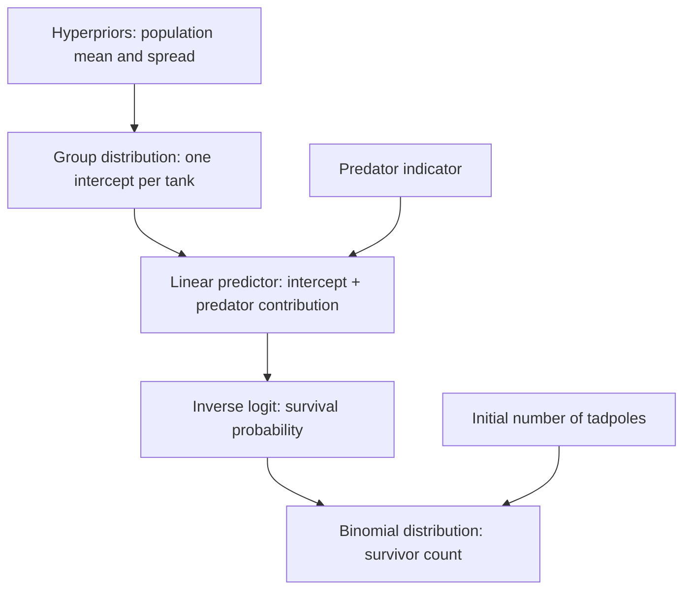

# B01 — Multilevel Models

**Course:** Statistical Rethinking 2026  
**Section:** B — Advanced  
**Lecture:** B01 — Multilevel Models  
**Official reading listed by the course:** Chapter 12  
**Closest second-edition correspondence:** Chapter 13, *Models With Memory*  
**Central question:** How can repeated observations and clustered data be modeled so that each group receives its own estimate while information is shared adaptively across groups?

> **Source note**
>
> This guide is grounded in the official 2026 course outline, the uploaded second edition of *Statistical Rethinking*, and the official script `12_intro_multilevel_models.r`.
>
> The official schedule labels B01 with Chapter 12. In the uploaded second edition, however, the material in the script—varying intercepts, partial pooling, adaptive priors, tadpole tanks, multiple clusters, and non-centered parameterization—corresponds directly to Chapter 13, *Models With Memory*. Second-edition Chapter 12 concerns mixtures, overdispersion, zero inflation, and ordered categories.
>
> This guide therefore preserves the official chapter label while explicitly mapping the lecture to Chapter 13 of the uploaded edition. It does not assume the contents of an unavailable draft third edition.

---

## 0. Notation and reading conventions

This chapter uses the following notation. A symbol is restated locally whenever its meaning changes.

### Indices and observed units

- $i$ indexes individual observations (e.g., individual tadpoles, visits, or survey responses);
- $j$ indexes a cluster or group (e.g., tadpole tank, café, participant, or story);
- $J$ denotes the total number of observed groups/clusters;
- $N$ denotes total observations across all groups, while $N_j$ or $D_j$ denotes total observations within group $j$;
- $s$ indexes a retained MCMC posterior draw ($s = 1, \dots, S$).

### Model quantities

- $Y_{ij}$: outcome for observation $i$ in group $j$;
- $S_j$: count of successes (e.g., survivors) in group $j$ out of $D_j$ trials;
- $p_j$: event probability for group $j$;
- $\lambda_j$: rate or intensity parameter for group $j$ in a Poisson model;
- $\alpha_j$: group-specific intercept for group $j$;
- $\bar{\alpha}$: population mean intercept (hyperparameter);
- $\sigma_\alpha$: population standard deviation of group intercepts (hyperparameter);
- $z_j$: standardized group offset in a non-centered parameterization ($z_j \sim \mathrm{Normal}(0, 1)$);
- $\beta$: slope coefficient for a predictor variable;
- $X_{ij}$ or $P_j$: individual-level or group-level covariate.

### Distribution conventions and three scales

Throughout this chapter, $\mathrm{Normal}(m,s)$ uses **standard deviation** $s$, not variance. $\mathrm{Exponential}(r)$ uses rate $r$, so its mean is $1/r$. The symbol $\mathcal D$ denotes the complete dataset; $D_j$ remains the number of tadpoles in tank $j$.

Keep three quantities distinct: $\alpha_j$ is an intercept on the predictor scale; $p_j=\operatorname{logit}^{-1}(\alpha_j)$ is a probability; $S_j$ is an observed integer count. A **hyperparameter** specifies the distribution of group parameters, and a **hyperprior** is a prior on that hyperparameter. A **likelihood** evaluates how compatible the observed outcomes are with proposed parameter values.

### Acronyms and shorthand

- **GLMM:** generalized linear multilevel model;
- **MCMC:** Markov chain Monte Carlo, simulation used to approximate posterior distributions;
- **HMC:** Hamiltonian Monte Carlo, an MCMC method using gradients;
- **PPC:** posterior predictive check, comparison of observed summaries with the same summaries in replicated data simulated from posterior parameter draws;
- **MCSE:** Monte Carlo standard error, simulation error in a posterior summary;
- **SBC:** simulation-based calibration, repeated prior-generative simulations used to assess computational calibration;
- **ESS:** effective sample size;
- **PSIS-LOO / WAIC:** Pareto-smoothed importance sampling leave-one-out cross-validation / Widely Applicable Information Criterion;
- **MSE:** mean squared error;
- **DAG:** directed acyclic graph.

---

## 1. Main thesis

The central argument is:

> **A multilevel model estimates group-specific effects and the population distribution of those effects simultaneously.**

This produces **partial pooling**.

Each group is informed by:

1. its own observations;
2. the observations from other groups;
3. the inferred amount of variation among groups.

The workflow is:

$$ \text{clustered generative process} \longrightarrow \text{group-specific parameters} \longrightarrow \text{population distribution of parameters} \longrightarrow \text{adaptive regularization} \longrightarrow \text{partial pooling} \longrightarrow \text{predictions for observed and new groups} $$

A multilevel model does not force every group to be identical.

It also does not treat every group as unrelated.

Instead:

$$ \text{complete pooling} \longleftrightarrow \text{partial pooling} \longleftrightarrow \text{no pooling} $$

The data and hyperpriors jointly determine the amount of pooling; with few groups, the choice of hyperprior can remain influential.

---

## 2. Relationship to the book and the lecture

The B01 script aligns closely with Chapter 13 of *Statistical Rethinking* (2nd Edition).

| B01 topic | Closest second-edition section | Role |
|---|---|---|
| Clustered observations | Chapter 13 introduction | Motivates models with memory |
| Tadpole tanks | Section 13.1 | Introductory varying-intercept model |
| Partial pooling | Sections 13.1–13.2 | Adaptive regularization across groups |
| Underfitting–overfitting trade-off | Section 13.2 | Compares pooling strategies |
| More than one cluster type | Section 13.3 | Actor and block effects |
| Non-centered parameterization | Section 13.4 | Improves MCMC geometry |
| Same- and new-cluster prediction | Section 13.5 | Distinguishes conditional and population predictions |
| Trolley stories and participants | Script extension | Cross-classified varying intercepts |
| Café population model | 2026 script-specific teaching example | Sequentially illustrates shared learning |

### 2.1 Why the mismatch matters

The official label “Chapter 12” should not be used to locate this material in the uploaded second edition.

The practical mapping is:

$$ \text{B01 official Chapter 12} \approx \text{second-edition Chapter 13} $$

This is a course reorganization or edition difference, not a statistical contradiction.

---

### 2.2 Learning objectives and continuity with A01–A10

After B01, you should be able to write a complete hierarchical model, explain where information is shared, distinguish uncertainty within and between groups, and predict for both observed and new groups. You should also be able to check whether the hierarchy fits the data and explain why pooling alone does not establish causality.

A01 supplies the generative workflow; A07 motivates regularization; A08 supplies MCMC diagnostics; A09 connects likelihood, linear predictor, and link; A10 separates estimable contrasts from causal identification. B01 adds a learned distribution of group parameters to that workflow.

## 3. Why clustered data require memory

Many datasets contain repeated observations within units.

Examples include:

- tadpoles within tanks;
- responses within participants;
- judgments within stories;
- transactions within customers;
- customers within stores;
- products within categories;
- repeated measurements within patients;
- students within schools.

Observations from the same cluster often share unmeasured causes.

If observations $i$ and $k$ belong to group $j$, then generally:

$$ Y_{ij} \not\!\perp\!\!\!\perp Y_{kj} $$

after conditioning only on global predictors.

A group-specific effect can represent the shared environment:

$$ Y_{ij} \sim p \left( Y_{ij} \mid \alpha_j, X_{ij}, \theta \right) $$

The model has “memory” because learning about group $j$ is retained and can also inform the population of groups.

---

## 4. Three pooling strategies

Suppose each group $j$ has its own baseline parameter $\alpha_j$.

### 4.1 Complete pooling

One parameter is shared by all groups:

$$ \alpha_j = \alpha $$

for every $j$.

The model assumes no residual group heterogeneity.

Advantages:

- low variance;
- simple;
- stable for sparse groups.

Disadvantages:

- underfits genuine between-group variation;
- can produce overconfident individual-group predictions;
- may mask important cluster structure.

### 4.2 No pooling

Every group receives an unrelated parameter:

$$ \alpha_j \sim p_0(\alpha_j) $$

independently under a fixed broad prior.

Advantages:

- allows arbitrary group differences;
- can reproduce group-level sample proportions closely.

Disadvantages:

- overfits sparse groups;
- does not share information;
- estimates extreme values from small samples;
- cannot learn a coherent population distribution adaptively.

### 4.3 Partial pooling

Group parameters share a learned population distribution:

$$ \alpha_j \sim \mathrm{Normal} \left( \bar{\alpha}, \sigma_\alpha \right) $$

The hyperparameters are also estimated:

$$ \bar{\alpha} \sim p \left( \bar{\alpha} \right) $$

$$ \sigma_\alpha \sim p \left( \sigma_\alpha \right) $$

This model learns how similar the groups are.

---

## 5. Varying effects

McElreath generally prefers **varying effects** over “random effects.”

A varying intercept model gives every group its own intercept:

$$ \alpha_j $$

while assuming those intercepts arise from a common population.

The word “varying” emphasizes what the model does:

$$ \text{intercept varies by group} $$

It avoids the misleading impression that:

- some parameters are random while others are not;
- varying effects are merely nuisance terms;
- population-level parameters are fixed constants known without uncertainty.

In Bayesian modeling, every unknown parameter has a posterior distribution.

---

## 6. How the observation model, link, and hierarchy fit together

### 6.1 Start with the observation and its support

The **support** is the set of possible outcomes. A tank with $D_j$ tadpoles can have $S_j\in\{0,\ldots,D_j\}$ survivors. A binomial likelihood respects this support. It also assumes conditionally independent survival trials with a common probability within the tank; sharing a tank effect does not justify all possible forms of biological dependence.

The complete predator model is:

$$
\begin{aligned}
\bar\alpha&\sim\mathrm{Normal}(0,1.5), &\sigma_\alpha&\sim\mathrm{Exponential}(1),\\
\beta_P&\sim\mathrm{Normal}(0,0.5), &z_j&\sim\mathrm{Normal}(0,1),\\
\alpha_j&=\bar\alpha+\sigma_\alpha z_j, &\eta_j&=\alpha_j+\beta_P P_j,\\
p_j&=\operatorname{logit}^{-1}(\eta_j)=\frac{1}{1+e^{-\eta_j}},
&S_j&\sim\mathrm{Binomial}(D_j,p_j).
\end{aligned}
$$

Here $P_j=1$ means predator present and $P_j=0$ means absent. The hierarchy supplies each tank's intercept; the linear predictor adds its covariate contribution; the inverse link produces a valid probability; the likelihood generates a count.



The **link** maps probability to the linear predictor, $\operatorname{logit}(p_j)=\eta_j$. To generate predictions, use its inverse, $p_j=\operatorname{logit}^{-1}(\eta_j)$. Neither transformation creates the random observed count; the final binomial sampling step does that.

### 6.2 A numerical example

Suppose one parameter draw gives $\bar\alpha=1$, $\sigma_\alpha=0.5$, $z_j=-1$, and $\beta_P=-1$. For a tank with predators and $D_j=10$:

$$
\alpha_j=1+0.5(-1)=0.5,\qquad
\eta_j=0.5-1=-0.5,\qquad
p_j\approx0.378.
$$

The expected survivor count is $D_jp_j\approx3.78$; an actual count must be an integer from 0 to 10. Holding this tank effect fixed and removing predators gives $p_j\approx0.622$, a modeled probability contrast of about $-0.245$. This is a conditional contrast for these parameter values; a causal interpretation needs assumptions about predator assignment.

### 6.3 The same construction with a Gaussian outcome

For a continuous measurement, an illustrative complete hierarchy is:

$$
Y_{ij}\sim\mathrm{Normal}(\alpha_j,\sigma_Y),\quad
\alpha_j\sim\mathrm{Normal}(\bar\alpha,\sigma_\alpha),
$$

$$
\bar\alpha\sim\mathrm{Normal}(m_\alpha,s_\alpha),\quad
\sigma_\alpha\sim\mathrm{Exponential}(r_\alpha),\quad
\sigma_Y\sim\mathrm{Exponential}(r_Y).
$$

The constants $m_\alpha,s_\alpha,r_\alpha,r_Y$ must be chosen in the measurement's units. The identity link gives $\mu_{ij}=\alpha_j$: no nonlinear transformation is required. Here $\sigma_Y$ measures variation **within groups**, whereas $\sigma_\alpha$ measures variation **between group means**. They answer different questions.

### 6.4 Why shared effects create dependence

Assuming independent Gaussian observation errors, two different observations in the same group are independent conditional on $\alpha_j$. Integrating over the shared group effect gives, conditional on the hyperparameters,

$$
\operatorname{Cov}(Y_{ij},Y_{kj})=\sigma_\alpha^2,\qquad
\operatorname{Corr}(Y_{ij},Y_{kj})=
\frac{\sigma_\alpha^2}{\sigma_\alpha^2+\sigma_Y^2},\quad i\ne k.
$$

This correlation is the **intraclass correlation coefficient (ICC)** for this Gaussian model. A shared group effect explains a particular dependence structure; it does not automatically capture serial correlation or every within-group interaction.

---

## 7. Adaptive priors and joint learning

In a no-pooling model, each group has a fixed prior, for example $\alpha_j\sim\mathrm{Normal}(0,1.5)$. In the hierarchy, the conditional prior is $\alpha_j\mid\bar\alpha,\sigma_\alpha\sim\mathrm{Normal}(\bar\alpha,\sigma_\alpha)$ and the hyperparameters are unknown.

Writing $\mathcal D_j$ for group $j$'s observations, the joint posterior factorizes as

$$
p(\boldsymbol\alpha,\bar\alpha,\sigma_\alpha\mid\mathcal D)
\propto p(\bar\alpha)p(\sigma_\alpha)
\prod_{j=1}^J p(\alpha_j\mid\bar\alpha,\sigma_\alpha)
p(\mathcal D_j\mid\alpha_j).
$$

This expression suppresses any additional likelihood parameters for clarity. Conditional on the hyperparameters,

$$
p(\alpha_j\mid\mathcal D,\bar\alpha,\sigma_\alpha)
\propto p(\mathcal D_j\mid\alpha_j)
p(\alpha_j\mid\bar\alpha,\sigma_\alpha).
$$

Full Bayesian inference then averages this conditional posterior over $p(\bar\alpha,\sigma_\alpha\mid\mathcal D)$. Information from other groups enters through that hyperparameter posterior. The phrase **adaptive prior** describes this shared learning; the joint prior specification is fixed before fitting, and observations are not counted twice.

---

## 8. Partial pooling and shrinkage: an exact Gaussian example

Suppose a group estimate satisfies $\widehat\alpha_j\mid\alpha_j\sim\mathrm{Normal}(\alpha_j,\sqrt{V_j})$ and $\alpha_j\mid\bar\alpha,\sigma_\alpha\sim\mathrm{Normal}(\bar\alpha,\sigma_\alpha)$. Conditional on known hyperparameters and sampling variance $V_j$, the posterior mean is exactly

$$
\mathbb E[\alpha_j\mid\widehat\alpha_j,\bar\alpha,\sigma_\alpha]
=w_j\widehat\alpha_j+(1-w_j)\bar\alpha,\qquad
w_j=\frac{\sigma_\alpha^2}{\sigma_\alpha^2+V_j}.
$$

The posterior variance is $(1/V_j+1/\sigma_\alpha^2)^{-1}$. Here $w_j$ is the weight on the group's own estimate; $1-w_j$ is the amount of pooling toward the population center.

For $\bar\alpha=0$, $\sigma_\alpha=1$, and two groups both having raw estimate 2:

| Group information | Sampling variance $V_j$ | Own-data weight $w_j$ | Posterior mean |
|---|---:|---:|---:|
| Weak | 4 | 0.20 | 0.40 |
| Strong | 0.25 | 0.80 | 1.60 |

The noisier estimate moves farther toward zero. Greater population variation increases $w_j$; a more homogeneous population increases pooling. In a full hierarchy the hyperparameters are uncertain, so these conditional results must themselves be averaged over their posterior.

For logistic and other nonlinear models, this weighted-average formula is an intuition or local approximation, not a universal exact identity. Group size matters through information: in a binomial model, local information about a logit intercept is $D_jp_j(1-p_j)$, so sample size is not its only determinant.

---

## 9. Shrinkage is not bias correction

Partial pooling deliberately introduces bias toward the population mean for individual groups.

Under a suitable population model, the variance reduction can outweigh the added bias and reduce average expected error. It is not guaranteed for every dataset or a misspecified hierarchy.

The bias–variance trade-off is:

$$ \mathrm{MSE} = \mathrm{Bias}^2 + \mathrm{Variance} $$

No-pooling estimates have little pooling bias but can have high variance.

Complete-pooling estimates have low variance but can have large bias for unusual groups.

Partial pooling aims to improve average out-of-sample accuracy by accepting modest shrinkage bias in exchange for a larger reduction in variance.

This is regularization, not an attempt to make every group look average.

---

## 10. The café golem

The official B01 script introduces a population of cafés.

Each café has a latent waiting-time intensity.

The teaching example represents waiting time using nonnegative integer counts. Real continuous waiting times would require a suitable duration model; the Poisson example is a simplified illustration of shared learning.

A simplified model is:

$$ Y_i \sim \mathrm{Poisson} \left( \lambda_i \right) $$

$$ \log(\lambda_i) = \alpha_{C_i} $$

where $C_i$ identifies the café.

The café effects arise from a population:

$$ \alpha_j = \bar{\alpha} + \sigma_\alpha z_j $$

$$ z_j \sim \mathrm{Normal}(0,1) $$

with:

$$ \bar{\alpha} \sim \mathrm{Normal}(2,0.5) $$

$$ \sigma_\alpha \sim \mathrm{Exponential}(10) $$

The script uses a non-centered representation directly.

---

## 11. Sequential learning in the café example

The animation in `12_intro_multilevel_models.r` begins with no café observations.

At that point, every café prediction is drawn from the same prior population.

As visits occur:

- the visited café's posterior changes directly;
- the population mean and variance may change;
- unvisited cafés can change indirectly because their prior population has changed;
- cafés with little information remain close to the population distribution;
- cafés with much information become more individually determined.

This is the key multilevel phenomenon:

> **An observation from one group can change predictions for another group through the learned population distribution.**

In a no-pooling model, a café observation would affect only that café.

In a multilevel model, the information propagates.

---

## 12. Population of cafés versus observed cafés

The model estimates two kinds of quantities.

### Café-specific effects

$$ \alpha_1,\ldots,\alpha_J $$

These describe cafés observed in the sample.

### Population distribution

$$ \alpha_{\mathrm{new}} \sim \mathrm{Normal} \left( \bar{\alpha}, \sigma_\alpha \right) $$

This describes a new café drawn from the modeled population.

The distinction becomes vital for prediction.

For an observed café $j$:

$$ p \left( Y_{\mathrm{new}} \mid C=j,D \right) $$

uses the posterior of $\alpha_j$.

For a new café:

$$ p \left( Y_{\mathrm{new}} \mid C=\mathrm{new},D \right) $$

must integrate over a newly drawn group effect $\alpha_{\mathrm{new}}$.

---

## 13. The reed-frog data

The official script uses 48 tadpole tanks from the `reedfrogs` dataset.

For tank $j$:

- $S_j$ is the number of survivors;
- $D_j$ is the initial number of tadpoles (density: 10, 20, or 35);
- $T_j$ identifies the tank.

The observation model is:

$$ S_j \sim \mathrm{Binomial} \left( D_j, p_j \right) $$

The varying-intercept model is:

$$ \mathrm{logit}(p_j) = \alpha_{T_j} $$

The group distribution is:

$$ \alpha_j \sim \mathrm{Normal} \left( \bar{\alpha}, \sigma_\alpha \right) $$

with priors:

$$ \bar{\alpha} \sim \mathrm{Normal}(0,1.5) $$

$$ \sigma_\alpha \sim \mathrm{Exponential}(1) $$

---

## 14. No-pooling tadpole model

A no-pooling version gives every tank a separate parameter under a fixed prior:

$$ \alpha_j \sim \mathrm{Normal}(0, 1.5) $$

This model does not learn how much tank intercepts vary.

Each tank is estimated independently.

Observed survival proportions are:

$$ \widehat{p}_j = \frac{S_j}{D_j} $$

Small tanks can produce extreme proportions (0 or 1) from only a few outcomes.

No pooling lacks adaptive sharing across tanks, so sparse-tank estimates may remain highly variable. A proper fixed prior can still regularize extreme proportions; no pooling does not mean no prior regularization.

---

## 15. Partial-pooling tadpole model

The multilevel model estimates $\bar{\alpha}$ and $\sigma_\alpha$ from the 48 tanks.

Posterior tank probabilities are:

$$ p_j^{(s)} = \mathrm{logit}^{-1} \left( \alpha_j^{(s)} \right) $$

The posterior mean estimate is:

$$ \widehat{p}_j = \frac{1}{S} \sum_{s=1}^{S} p_j^{(s)} $$

The estimates move toward the population center, especially for tanks with fewer tadpoles.

The model does not shrink equally on the probability scale because the hierarchy is Gaussian on the log-odds scale.

---

## 16. Pooling and tank size

The tanks have different initial counts ($D_j \in \{10, 20, 35\}$).

At comparable survival probabilities, a tank with $D_j=10$ contains less information than a tank with $D_j=35$. Smaller tanks therefore tend to pool more strongly, but outcome extremity, predictors, and population-scale uncertainty also matter.

This is visible in the difference between raw survival proportion and partially pooled posterior probability.

The model automatically accounts for uncertainty from the binomial likelihood.

No manual sample-size weighting is required.

---

## 17. Extreme groups shrink most visibly

Groups with extreme raw outcomes often move substantially toward the population mean.

This is not because the model forbids extreme true groups.

It is because extreme sample proportions from small groups are often sampling noise.

For example, $S_j=0$ out of $D_j=10$ does not imply $p_j=0$.

Likewise, $S_j=D_j$ does not imply $p_j=1$.

A multilevel posterior combines the group likelihood with evidence about the population of tanks.

---

## 18. Adaptive regularization

The script compares a model that estimates $\sigma_\alpha$ with one that fixes it.

Estimated hierarchy:

$$ \alpha_j \sim \mathrm{Normal} \left( \bar{\alpha}, \sigma_\alpha \right) $$

Fixed hierarchy:

$$ \alpha_j \sim \mathrm{Normal} \left( \bar{\alpha}, 1 \right) $$

The estimated model learns the appropriate pooling strength.

This is adaptive regularization.

The hyperparameter $\sigma_\alpha$ controls flexibility:

- **Small $\sigma_\alpha$**: $\alpha_j \approx \bar{\alpha}$ (strong pooling, low effective complexity).
- **Large $\sigma_\alpha$**: group parameters differ widely (weak pooling, greater effective complexity).

---

## 19. Effective number of parameters

A varying-intercept model may contain many nominal parameters ($\alpha_1,\ldots,\alpha_J$).

But strong shrinkage means they do not behave like $J$ fully independent parameters.

Predictive criteria estimate an effective complexity such as $p_{\mathrm{WAIC}}$ or $p_{\mathrm{LOO}}$.

If $\sigma_\alpha$ is near zero, many group effects contribute little effective flexibility.

Thus:

$$ \text{nominal parameter count} \neq \text{effective parameter count} $$

Multilevel models can include many group effects without incurring the full overfitting cost of no pooling.

---

## 20. Partial pooling as an overfitting solution

The official script varies a fixed hierarchy scale across a sequence of $\sigma_\alpha$ values.

As $\sigma_\alpha$ increases:

- group estimates move closer to raw proportions;
- in-sample fit improves;
- model flexibility increases;
- out-of-sample predictive performance can eventually worsen.

As $\sigma_\alpha$ decreases:

- estimates collapse toward the common mean;
- variance decreases;
- underfitting can increase.

The learned posterior for $\sigma_\alpha$ allows the data and prior to negotiate this trade-off automatically.

---

## 21. Simulation evidence for partial pooling

Chapter 13 simulates ponds with known survival probabilities $p_j^{\mathrm{true}}$ and compares no-pooling versus partial-pooling estimates.

For pond $j$, absolute error is:

$$ E_j = \left| \widehat{p}_j - p_j^{\mathrm{true}} \right| $$

Across simulated groups, partial pooling reduces average error:

$$ \frac{1}{J} \sum_{j=1}^{J} E_j^{\mathrm{partial}} < \frac{1}{J} \sum_{j=1}^{J} E_j^{\mathrm{no\ pool}} $$

especially for small groups.

This inequality describes a simulation result under the chosen generative setting, not a universal guarantee. Repeat simulations over group sizes, population distributions, and hyperpriors; partial pooling can perform poorly when the shared population assumption is wrong.

---

## 22. Adding a group-level predictor

The official script adds predator presence:

$$ P_j = \begin{cases} 1 & \text{predator present} \\ 0 & \text{predator absent} \end{cases} $$

The model is:

$$ S_j \sim \mathrm{Binomial} \left( D_j, p_j \right) $$

$$ \mathrm{logit}(p_j) = \alpha_j + \beta_P P_j $$

with:

$$ \beta_P \sim \mathrm{Normal}(0, 0.5) $$

$$ \alpha_j \sim \mathrm{Normal} \left( \bar{\alpha}, \sigma_\alpha \right) $$

The global predictor $\beta_P$ explains systematic variation due to predators.

The remaining $\alpha_j$ values represent residual tank heterogeneity after accounting for predators.

---

## 23. Explained and residual group variation

Adding useful group-level predictors can reduce the posterior residual scale $\sigma_\alpha$, but this is an empirical outcome to check, not a mathematical necessity.

Without predators:

$$ \sigma_\alpha $$

captures all between-tank variation.

With predators:

$$ \sigma_\alpha $$

captures variation not explained by $P_j$.

A reduction in $\sigma_\alpha$ indicates that predator status explains part of the between-tank variation.

---

## 24. Exchangeability

Partial pooling assumes groups are exchangeable conditional on modeled predictors.

Informally, before observing the group outcomes, group labels carry no additional information beyond their predictors.

Mathematically, the prior is symmetric:

$$ p \left( \alpha_1,\ldots,\alpha_J \mid \bar{\alpha}, \sigma_\alpha \right) = \prod_{j=1}^{J} p \left( \alpha_j \mid \bar{\alpha}, \sigma_\alpha \right) $$

The displayed conditionally independent, identically distributed normal model implies exchangeability. Exchangeability itself means permutation invariance and does not require marginal independence: integrating out shared hyperparameters makes group parameters dependent. With group predictors, exchangeability concerns the residual effects after accounting for those predictors.

### 24.1 When exchangeability is implausible

A single shared population may be inappropriate when groups differ structurally by country, product class, treatment regime, or measurement system.

These differences should be modeled with predictors, separate populations, or structured covariances.

---

## 25. Hierarchy is a scientific assumption

The statement:

$$ \alpha_j \sim \mathrm{Normal} \left( \bar{\alpha}, \sigma_\alpha \right) $$

asserts that groups are generated by a population distribution.

It is a substantive modeling assumption.

The normal population model may be wrong when group effects are multimodal, skewed, heavy-tailed, or spatially/temporally correlated.

---

## 26. Prior predictive checks for a hierarchy

A **prior predictive check** simulates complete datasets before conditioning on observed outcomes. Draw hyperparameters, then group effects, then outcomes. For the intercept-only frog model:

```{r b01-prior-predictive}
set.seed(2026)
D_check <- rep(c(10L, 20L, 35L), each = 16)
a_bar_check <- rnorm(1, 0, 1.5)
sigma_check <- rexp(1, rate = 1)
a_check <- rnorm(length(D_check), a_bar_check, sigma_check)
p_check <- plogis(a_check)
S_check <- rbinom(length(D_check), D_check, p_check)
```

Repeat this whole experiment to inspect the spread of group probabilities, the overall survival proportion, and the frequency of all-dead or all-surviving tanks at each size. Drawing a separate population mean for each tank would simulate a different hierarchy. When predictors are present, include their priors and the intended covariate design.

A broad prior on the logit scale may produce many near-zero and near-one probabilities. Evaluate that implication scientifically rather than judging the prior from its coefficient width alone.

---

## 27. Hyperpriors and near-zero variation

A hierarchy-scale prior might be:

$$ \sigma_\alpha \sim \mathrm{Exponential}(1) $$

This places density near zero while allowing larger values.

Near-zero group variation ($\sigma_\alpha \approx 0$) means $\alpha_j \approx \bar{\alpha}$ (complete pooling).

For logistic models, $\sigma_\alpha$ is in log-odds units. A standard deviation of $\sigma_\alpha = 1.5$ in log-odds implies very wide dispersion on the probability scale.

---

## 28. Centered parameterization

The centered hierarchy is:

$$ \alpha_j \sim \mathrm{Normal} \left( \bar{\alpha}, \sigma_\alpha \right) $$

When data per group are weak and $\sigma_\alpha$ can approach zero, the posterior forms Neal's funnel:

- group effects must contract tightly around $\bar{\alpha}$ when $\sigma_\alpha \rightarrow 0$;
- they can spread widely when $\sigma_\alpha$ is large.

This can create curvature that is difficult for numerical integration, leading to divergent transitions or low effective sample size. Diagnose the fitted model rather than assuming failure from its parameterization alone.

---

## 29. Non-centered parameterization

The hierarchy is re-parameterized as:

$$ z_j \sim \mathrm{Normal}(0, 1) $$

$$ \alpha_j = \bar{\alpha} + \sigma_\alpha z_j $$

The scientific model is unchanged.

The sampled geometry changes: the standardized offsets $z_j$ are independent of $\sigma_\alpha$ in the prior.

This removes the prior scale coupling and often improves sampling for weakly informed groups. The likelihood can still induce difficult posterior dependence; non-centering does not guarantee zero divergences or efficient sampling.

---

## 30. Centered versus non-centered is computational

Both parameterizations imply identical prior probability distributions for $\alpha_j$.

Therefore, when MCMC samples correctly from both, the target posterior distributions are identical.

With identical priors and likelihoods, the choice is computational: weakly informed group effects often favor non-centering, whereas strongly informed effects may favor centering. Compare diagnostics and ESS per second for the same scientific quantities.

---

## 31. Multiple clustering dimensions

A dataset can contain more than one grouping structure.

In the trolley data:

- each response belongs to a participant $U_i$;
- each response also belongs to a story $S_i$.

The cluster dimensions are cross-classified ($U_i \times S_i$).

The model includes two varying intercepts in the same linear predictor:

$$ \phi_i = \text{predictors} + \alpha^{\mathrm{story}}_{S_i} + \alpha^{\mathrm{person}}_{U_i} $$

---

## 32. Trolley model with varying intercepts

The official script fits an ordered-logistic model:

$$ R_i \sim \mathrm{OrderedLogistic}(\phi_i, \mathbf{\alpha}_{\text{cut}}) $$

$$ \phi_i = \mathbf{X}_i^{\mathsf T} \mathbf{\beta} + \alpha^{\mathrm{story}}_{S_i} + \alpha^{\mathrm{person}}_{U_i} $$

$$ \alpha^{\mathrm{story}}_s \sim \mathrm{Normal}(0, \sigma_S), \quad \sigma_S \sim \mathrm{Exponential}(1) $$

$$ \alpha^{\mathrm{person}}_u \sim \mathrm{Normal}(0, \sigma_U), \quad \sigma_U \sim \mathrm{Exponential}(1) $$

---

### 32.1 How ordered categories arise

An ordered outcome is neither a continuous Gaussian value nor a collection of equally spaced numeric measurements. For $K$ categories and increasing cutpoints $c_1<\cdots<c_{K-1}$,

$$
\Pr(R_i\le k\mid\phi_i,\mathbf c)
=\operatorname{logit}^{-1}(c_k-\phi_i).
$$

Set $c_0=-\infty$ and $c_K=+\infty$. Category probabilities are differences of adjacent cumulative probabilities:

$$
\Pr(R_i=k)=\operatorname{logit}^{-1}(c_k-\phi_i)
-\operatorname{logit}^{-1}(c_{k-1}-\phi_i).
$$

The story and person intercepts both enter $\phi_i$; larger $\phi_i$ shifts mass toward higher response categories. Cutpoints determine the category boundaries. Zero-centered effect distributions and omission of a redundant global intercept anchor the location relative to the cutpoints.

The code in section 51.4 is a reduced teaching model. The official script also contains participant predictors, gender-specific coefficients, and an education effect.

## 33. What the two trolley hierarchies mean

- $\sigma_S$ measures residual variation among stories after accounting for experimental factors.
- $\sigma_U$ measures persistent variation among participants after accounting for participant predictors.

If $\sigma_U > \sigma_S$, there is greater unexplained heterogeneity among individuals than among scenario stories.

---

## 34. Repeated measures and pseudoreplication

Ignoring participant clustering treats repeated responses from the same person as independent observations.

This creates:

- underestimated uncertainty;
- overconfident treatment effect estimates;
- incorrect weighting of highly observed participants.

A participant varying intercept models stable individual propensities and the associated dependence. Serial dependence, varying responses to treatment, or other residual structure may require additional terms. More responses improve knowledge of a participant, but do not create more independent participants.

---

## 35. Varying intercepts versus fixed indicators

A fixed-effects indicator model estimates unrestricted parameters per group under broad fixed priors.

A multilevel model learns the population hyperparameters $\bar{\alpha}$ and $\sigma_\alpha$.

The core difference is not parameter count (both have $J$ intercepts), but adaptive shrinkage and shared information across groups.

---

## 36. Full Bayes versus empirical Bayes

Empirical Bayes plugs in point estimates $(\widehat{\bar{\alpha}}, \widehat{\sigma}_\alpha)$ and treats them as known.

Full Bayes retains hyperparameter uncertainty $p(\bar{\alpha}, \sigma_\alpha \mid D)$ and propagates it into posterior predictions.

A naive plug-in analysis omits hyperparameter uncertainty and can understate uncertainty, especially with few groups; some empirical-Bayes procedures add corrections for that uncertainty.

---

## 37. Prediction for observed groups

For an existing group $j$, posterior predictions draw from the group's specific posterior $\alpha_j^{(s)}$:

$$ S_{\mathrm{new}, j}^{(s)} \sim \mathrm{Binomial} \left( D_{\mathrm{new}, j}, \mathrm{logit}^{-1}\left(\alpha_j^{(s)}\right) \right) $$

This conditions on the group's observed data and partial pooling.

---

## 38. Prediction for new groups

For a new, unobserved group:

1. Draw hyperparameter samples: $\bar{\alpha}^{(s)}, \sigma_\alpha^{(s)}$;
2. Draw a new group intercept: $\alpha_{\mathrm{new}}^{(s)} \sim \mathrm{Normal}\left(\bar{\alpha}^{(s)}, \sigma_\alpha^{(s)}\right)$;
3. Simulate outcomes: $S_{\mathrm{new}}^{(s)} \sim \mathrm{Binomial}\left(D_{\mathrm{new}}, \mathrm{logit}^{-1}\left(\alpha_{\mathrm{new}}^{(s)}\right)\right)$.

New-group prediction includes uncertainty about an unobserved group effect. It is often wider than prediction for a well-observed group, but interval widths also depend on the outcome scale, design, and fitted probabilities; no strict ordering holds in every case.

---

## 39. Average-group prediction is not new-group prediction

Setting $\alpha_j = \bar{\alpha}$ describes a hypothetical average group on the linear scale.

It is NOT a prediction for a randomly selected new group.

For nonlinear inverse links, transforming the population center generally differs from averaging transformed group effects:

$$ \mathrm{logit}^{-1}(\bar{\alpha}) \neq \mathbb{E}_{\alpha_{\mathrm{new}}} \left[ \mathrm{logit}^{-1}(\alpha_{\mathrm{new}}) \right] $$

The displayed inequality is generic, not universal: for a symmetric normal logit distribution centered at zero, both sides equal 0.5. With a log link the distinction is explicit:

$$
\mathbb E[e^{\alpha_{\mathrm{new}}}\mid\bar\alpha,\sigma_\alpha]
=e^{\bar\alpha+\sigma_\alpha^2/2},
$$

whereas the central group's expected count is $e^{\bar\alpha}$. New-group prediction integrates over the group distribution and over posterior hyperparameter uncertainty.

---

## 40. Population-average versus cluster-specific effects

In non-linear GLMMs:

- **Cluster-specific effect:** $\Delta_j = \mathrm{logit}^{-1}(\alpha_j + \beta) - \mathrm{logit}^{-1}(\alpha_j)$
- **Population-average effect:** $\Delta_{\mathrm{pop}} = \mathbb{E}_{\alpha} \left[ \mathrm{logit}^{-1}(\alpha + \beta) - \mathrm{logit}^{-1}(\alpha) \right]$

These quantities can differ because the probability change varies with the baseline intercept. The inverse logit is not globally convex or concave, so Jensen’s inequality does not provide a universal direction of difference. Also specify whether the target averages equally over groups or over individuals: large groups receive more weight in the latter.

---

## 41. Multilevel models and causality

A varying intercept models persistent group differences. It does not establish that treatment assignment is independent of unobserved causes of the outcome. A causal interpretation still requires a defensible assignment mechanism or adjustment set, consistency, positivity, and appropriate handling of selection and interference.

For example, if a campaign targets stores with high latent demand, a store intercept alone does not prove that the campaign coefficient isolates a causal effect. Distinguish modeling the dependence of observations from identifying the intervention contrast.

---

## 42. Within-group and between-group relationships

A useful decomposition, often called a **Mundlak** or within–between specification, is

$$
\eta_{ij}=\alpha_j+\beta_W(X_{ij}-\bar X_j)+\beta_B\bar X_j,
\qquad \alpha_j\sim\mathrm{Normal}(\bar\alpha,\sigma_\alpha),
$$

where $\bar X_j$ is group $j$'s covariate mean. Here $\beta_W$ describes within-group variation and $\beta_B$ describes differences in group means. This relaxes the assumption that one coefficient captures both relationships and models one source of correlation between group characteristics and covariates.

In an additive linear model, unrestricted unit indicators remove stable additive unit differences when estimating a within-unit slope. They do not remove time-varying confounding, and a predictor constant within each unit cannot have its effect separately estimated from those indicators. Nonlinear fixed-effects models bring additional estimation issues.

Neither fixed effects nor Mundlak terms automatically establish causality. The identifying variation, omitted variables, and treatment assignment still require examination.

---

## 43. Exchangeability and causal transport

Generalizing predictions to new clusters assumes the target cluster population is adequately represented by the fitted group distribution $p(\alpha_{\mathrm{new}}\mid\bar{\alpha},\sigma_\alpha)$, averaged over posterior hyperparameter uncertainty.

Transporting estimates to new domains requires including key domain-level predictors in the hyperdistribution.

---

## 44. CRM application: customers with repeated events

In customer relationship management (CRM):

- $i$ indexes transactions; $j$ indexes customers.
- $Y_{ij} \sim \mathrm{Bernoulli}(p_{ij})$, $\mathrm{logit}(p_{ij}) = \alpha_j + \beta_A A_{ij}$.
- $\alpha_j \sim \mathrm{Normal}(\bar{\alpha}, \sigma_\alpha)$ pools baseline customer conversion.

Customers with few interactions are shrunken toward $\bar{\alpha}$, avoiding extreme zero-or-one propensity estimates.

---

## 45. CRM application: partially pooled campaign effects

When testing $K$ marketing campaigns:

$$ \beta_k \sim \mathrm{Normal}(\bar{\beta}, \sigma_\beta) $$

Sparse campaigns with few impressions are shrunken toward the population campaign effect $\bar{\beta}$, reducing exaggerated estimates from noisy small campaigns when the shared-effect model is appropriate. This does not guarantee a false-positive rate or replace a decision rule.

---

## 46. CRM application: stores and customers

Cross-classified hierarchy for retail transactions:

$$ \log(\lambda_i) = \mu + \alpha^{\mathrm{customer}}_{C_i} + \alpha^{\mathrm{store}}_{S_i} + X_i^{\mathsf T}\beta $$

Separates persistent customer and store associations under the additive model. These terms are not automatically causal measures of purchasing power or performance. Include an exposure offset when observation windows or purchase opportunities differ.

---

## 47. CRM application: churn across products

Multi-way cross-classification for customer churn:

$$ \mathrm{logit}(p_{ipt}) = \alpha^{\mathrm{customer}}_i + \alpha^{\mathrm{product}}_p + \alpha^{\mathrm{month}}_t $$

Shares information across product subscriptions and represents customer and month differences. Independent month effects do not impose a temporal trend; use a time-structured model when temporal dependence matters. Define who is at risk and the churn observation window.

---

## 48. CausalOps implications

| B01 concept | CausalOps implication |
|---|---|
| Cluster variable | `ClusterArtifact` |
| Varying intercept | Group-specific latent parameter |
| Population distribution | `HierarchyArtifact` |
| Partial pooling | Adaptive regularization metadata |
| Hyperpriors | Explicit population-scale prior |
| Exchangeability | Declared group-population assumption |
| Observed-group prediction | Conditional prediction mode |
| New-group prediction | Population predictive mode |
| Cross-classification | Multiple cluster memberships |
| Non-centered parameterization | Computational specification |

---

## 49. Validating partial pooling

Simulation validation workflow:

1. Draw true group parameters: $\alpha_j^{\mathrm{true}} \sim \mathrm{Normal}(\bar{\alpha}_{\text{true}}, \sigma_{\text{true}})$;
2. Simulate group sample sizes $N_j$ (including sparse groups);
3. Simulate outcomes $Y_{ij} \sim p(Y \mid \alpha_j^{\mathrm{true}})$;
4. Fit complete-pooling, no-pooling, and partial-pooling models;
5. Compute RMSE: $\sqrt{\frac{1}{J}\sum (\widehat{\alpha}_j - \alpha_j^{\mathrm{true}})^2}$;
6. Repeat over many simulated datasets and compare RMSE, interval coverage, and predictive calibration for observed and new groups. Include misspecified populations and unequal group sizes; record when pooling helps or fails instead of requiring it to win.

---

## 50. Common errors exposed by B01

1. **Ignoring clustering:** Treating repeated measures as independent observations.
2. **Complete pooling assumption:** Assuming no differences between groups.
3. **No pooling overfitting:** Estimating separate parameters for sparse groups without shrinkage.
4. **Misunderstanding shrinkage:** Viewing shrinkage as an artifact rather than variance reduction.
5. **Assuming uniform shrinkage:** Expecting all groups to shrink by equal amounts regardless of $N_j$.
6. **Misinterpreting scale of $\sigma_\alpha$:** Interpreting log-odds standard deviations as probability standard deviations.
7. **Ignoring hyperparameter uncertainty:** Using plug-in empirical Bayes point estimates.
8. **Assuming exchangeability without checking:** Grouping heterogeneous sub-populations into a single hierarchy.
9. **Zeroing out new-group effects:** Setting $\alpha_{\text{new}} = \bar{\alpha}$ instead of drawing from the hyperdistribution.
10. **Expecting sample means from sparse groups:** Expecting shrunken estimates to equal sample averages.
11. **Parameter count confusion:** Equating number of nominal parameters with degrees of freedom.
12. **Ignoring MCMC diagnostics:** Assuming either centering or non-centering guarantees reliable sampling.
13. **Confounding varying intercepts with causal identification:** Expecting varying intercepts to fix treatment selection bias.
14. **Conflating observed and new group prediction:** Using conditional predictions for unobserved groups.

---

## 51. Code Demonstrations & Multi-Framework Implementation

Examples below are teaching implementations, not stored fit results. Run them from the repository root. Cross-language comparisons require identical observations, priors, likelihoods, and estimands. The R data-preparation steps export CSVs for Python; matching a seed across languages does not guarantee matching data.

### 51.1 Café Golem (R rethinking/ulam, Stan, PyMC)

#### R rethinking / ulam

```{r cafe-golem-ulam}
library(rethinking)

# Generate synthetic café data
set.seed(7)
n_cafes <- 5
w_true <- c(3, 15, 3, 1, 3)
n_visits <- 20
cafe_id <- c(rep(1, 1), rep(2, 1), 1, rep(c(1, 3, 4, 5), times = 4), 2)
y_obs <- rpois(n_visits, w_true[cafe_id])
# Generate unshifted Poisson data consistent with this demonstration's likelihood.
dir.create("artifacts/B01", recursive = TRUE, showWarnings = FALSE)
write.csv(data.frame(cafe_id = cafe_id, y = y_obs),
          "artifacts/B01/cafe.csv", row.names = FALSE)

dat_cafe <- list(
  N = n_visits,
  n_cafes = n_cafes,
  y = as.integer(y_obs),
  cafe = as.integer(cafe_id)
)

# Non-centered Poisson hierarchy in ulam
m_cafe_ulam <- ulam(
  alist(
    y ~ dpois(lambda),
    log(lambda) <- a_bar + z[cafe] * sigma,
    z[cafe] ~ dnorm(0, 1),
    a_bar ~ dnorm(2, 0.5),
    sigma ~ dexp(10)
  ),
  data = dat_cafe,
  chains = 4,
  cores = 4,
  iter = 2000
)

precis(m_cafe_ulam, depth = 2)
```

#### Stan (CmdStanR)

```stan
// cafe_golem.stan
data {
  int<lower=1> N;
  int<lower=1> n_cafes;
  array[N] int<lower=1, upper=n_cafes> cafe;
  array[N] int<lower=0> y;
}
parameters {
  real a_bar;
  real<lower=0> sigma;
  vector[n_cafes] z;
}
transformed parameters {
  vector[n_cafes] a = a_bar + z * sigma;
}
model {
  a_bar ~ normal(2, 0.5);
  sigma ~ exponential(10);
  z ~ normal(0, 1);
  
  for (i in 1:N) {
    y[i] ~ poisson_log(a[cafe[i]]);
  }
}
generated quantities {
  vector[N] log_lik;
  for (i in 1:N) {
    log_lik[i] = poisson_log_lpmf(y[i] | a[cafe[i]]);
  }
}
```

#### PyMC (Python)

```python
import pymc as pm
import numpy as np
import arviz as az

# Run the R preparation above first; preserve row order and convert indices.
import pandas as pd
cafe_data = pd.read_csv("artifacts/B01/cafe.csv")
cafe_id = cafe_data["cafe_id"].to_numpy(dtype=int) - 1
n_cafes = int(cafe_id.max()) + 1
n_visits = len(cafe_data)
y_obs = cafe_data["y"].to_numpy(dtype=int)
assert cafe_id.min() == 0 and (y_obs >= 0).all()

with pm.Model() as cafe_model:
    # Hyperpriors
    a_bar = pm.Normal("a_bar", mu=2.0, sigma=0.5)
    sigma = pm.Exponential("sigma", lam=10.0)
    
    # Non-centered parameterization
    z = pm.Normal("z", mu=0, sigma=1, shape=n_cafes)
    a = pm.Deterministic("a", a_bar + z * sigma)
    
    # Likelihood
    lambda_ = pm.math.exp(a[cafe_id])
    y = pm.Poisson("y", mu=lambda_, observed=y_obs)
    
    idata_cafe = pm.sample(draws=1000, tune=1000, chains=4, random_seed=7)

print(az.summary(idata_cafe, var_names=["a_bar", "sigma", "a"]))
```

---

The official café animation later shifts simulated counts by one and overrides one observation. This demonstration uses unshifted Poisson draws so its simulation and likelihood agree; it does not reproduce those animation values.

### 51.2 Reed-Frog Multilevel Model (R ulam, Stan, PyMC)

#### R rethinking / ulam

```{r reedfrog-multilevel}
library(rethinking)
data(reedfrogs)
d <- reedfrogs
d$tank <- 1:nrow(d)

dat_frog <- list(
  S = d$surv,
  D = d$density,
  T = d$tank,
  P = ifelse(d$pred == "pred", 1L, 0L)
)

# Export the installed dataset once; Python reads these exact observations.
dir.create("artifacts/B01", recursive = TRUE, showWarnings = FALSE)
write.csv(data.frame(tank = dat_frog$T, density = dat_frog$D,
                     surv = dat_frog$S, pred = dat_frog$P),
          "artifacts/B01/reedfrogs.csv", row.names = FALSE)
stopifnot(all(dat_frog$S >= 0), all(dat_frog$S <= dat_frog$D))

# Multilevel varying intercept model
m_frog_ulam <- ulam(
  alist(
    S ~ dbinom(D, p),
    logit(p) <- a[T],
    a[T] ~ dnorm(a_bar, sigma),
    a_bar ~ dnorm(0, 1.5),
    sigma ~ dexp(1)
  ),
  data = dat_frog,
  chains = 4,
  cores = 4,
  log_lik = TRUE
)

# Multilevel model with predator predictor
m_frog_pred_ulam <- ulam(
  alist(
    S ~ dbinom(D, p),
    logit(p) <- a[T] + bP * P,
    bP ~ dnorm(0, 0.5),
    a[T] ~ dnorm(a_bar, sigma),
    a_bar ~ dnorm(0, 1.5),
    sigma ~ dexp(1)
  ),
  data = dat_frog,
  chains = 4,
  cores = 4,
  log_lik = TRUE
)

compare(m_frog_ulam, m_frog_pred_ulam, func = PSIS)
```

#### Stan (CmdStanR)

```stan
// reedfrogs_multilevel.stan
data {
  int<lower=1> N_tanks;
  array[N_tanks] int<lower=0> S;
  array[N_tanks] int<lower=1> D;
  array[N_tanks] int<lower=0, upper=1> P;
}
parameters {
  real a_bar;
  real<lower=0> sigma;
  real bP;
  vector[N_tanks] z;
}
transformed parameters {
  vector[N_tanks] a = a_bar + z * sigma;
}
model {
  a_bar ~ normal(0, 1.5);
  sigma ~ exponential(1);
  bP ~ normal(0, 0.5);
  z ~ normal(0, 1);
  
  for (i in 1:N_tanks) {
    S[i] ~ binomial_logit(D[i], a[i] + bP * P[i]);
  }
}
generated quantities {
  vector[N_tanks] p;
  for (i in 1:N_tanks) {
    p[i] = inv_logit(a[i] + bP * P[i]);
  }
}
```

#### PyMC (Python)

```python
import pymc as pm
import pandas as pd
import numpy as np

# Run the R export above first; do not substitute hand-entered outcomes.
df_frogs = pd.read_csv("artifacts/B01/reedfrogs.csv")
assert len(df_frogs) == 48
assert ((df_frogs["surv"] >= 0) &
        (df_frogs["surv"] <= df_frogs["density"])).all()

n_tanks = len(df_frogs)
tank_id = np.arange(n_tanks)

with pm.Model() as frog_model:
    a_bar = pm.Normal("a_bar", mu=0, sigma=1.5)
    sigma = pm.Exponential("sigma", lam=1.0)
    bP = pm.Normal("bP", mu=0, sigma=0.5)
    
    z = pm.Normal("z", mu=0, sigma=1, shape=n_tanks)
    a = pm.Deterministic("a", a_bar + z * sigma)
    
    p = pm.Deterministic("p", pm.math.invlogit(a + bP * df_frogs['pred'].values))
    
    S = pm.Binomial("S", n=df_frogs['density'].values, p=p, observed=df_frogs['surv'].values)
    
    idata_frog = pm.sample(draws=1000, tune=1000, chains=4, random_seed=42)
```

---

For the general rationale, see [Stan’s guide to reparameterization](https://mc-stan.org/docs/2_28/stan-users-guide/reparameterization.html).

### 51.3 Centered vs Non-Centered Funnel Demonstration

```{r funnel-demo}
library(rethinking)
set.seed(42)
J <- 50L
# One group mean based on two noisy observations in each group.
a_true <- rnorm(J, 0, 0.1)
se <- rep(1 / sqrt(2), J)
dat_funnel <- list(y = rnorm(J, a_true, se), se = se, group = seq_len(J))

m_centered <- ulam(
  alist(
    y ~ dnorm(mu, se),
    mu <- a[group],
    a[group] ~ dnorm(a_bar, sigma),
    a_bar ~ dnorm(0, 1),
    sigma ~ dexp(1)
  ), data = dat_funnel, chains = 4, cores = 4,
  control = list(adapt_delta = 0.8)
)
m_noncentered <- ulam(
  alist(
    y ~ dnorm(mu, se),
    mu <- a_bar + z[group] * sigma,
    z[group] ~ dnorm(0, 1),
    a_bar ~ dnorm(0, 1),
    sigma ~ dexp(1)
  ), data = dat_funnel, chains = 4, cores = 4,
  control = list(adapt_delta = 0.8)
)
# RStan backend: compare divergences and the same hyperparameters.
count_divergences <- function(fit) {
  pars <- rstan::get_sampler_params(fit@stanfit, inc_warmup = FALSE)
  sum(vapply(pars, function(x) sum(x[, "divergent__"]), numeric(1)))
}
c(centered = count_divergences(m_centered),
  noncentered = count_divergences(m_noncentered))
precis(m_centered, pars = c("a_bar", "sigma"))
precis(m_noncentered, pars = c("a_bar", "sigma"))
```

The models use the same data and priors. This experiment may reveal a sampling advantage, but a particular number of divergences or a universal non-centering advantage is not guaranteed.

---

### 51.4 Trolley Cross-Classified Varying Intercepts Model

```{r trolley-cross-classified}
library(rethinking)
data(Trolley)
d <- Trolley

dat_trolley <- list(
  R = d$response,
  A = d$action,
  I = d$intention,
  C = d$contact,
  S = as.integer(factor(d$story)),
  U = as.integer(factor(d$id))
)

# Non-centered cross-classified model
m_trolley_nc <- ulam(
  alist(
    R ~ ordered_logistic(phi, cutpoints),
    phi <- bA * A + bI * I + bC * C + zs[S] * sigma_S + zu[U] * sigma_U,
    cutpoints ~ dnorm(0, 1.5),
    c(bA, bI, bC) ~ dnorm(0, 0.5),
    zs[S] ~ dnorm(0, 1),
    zu[U] ~ dnorm(0, 1),
    sigma_S ~ dexp(1),
    sigma_U ~ dexp(1)
  ),
  data = dat_trolley,
  chains = 4,
  cores = 4,
  sample = FALSE
)
```

---

### 51.5 Posterior Predictive Simulation: Same-Cluster vs New-Cluster

```{r posterior-predictive-simulation}
library(rethinking)

# Extract samples from fitted frog model
post <- extract.samples(m_frog_ulam)
n_samples <- length(post$a_bar)

# 1. Prediction for existing tank j=1 (density = 10)
p_existing_tank1 <- inv_logit(post$a[, 1])
surv_sim_existing <- rbinom(n_samples, size = 10, prob = p_existing_tank1)

# 2. Prediction for a NEW tank (density = 10)
a_new_tank <- rnorm(n_samples, mean = post$a_bar, sd = post$sigma)
p_new_tank <- inv_logit(a_new_tank)
surv_sim_new <- rbinom(n_samples, size = 10, prob = p_new_tank)

# Contrast predictive interval widths
cat("Existing tank 1 89% PI survival count:", HPDI(surv_sim_existing, prob = 0.89), "\n")
cat("New tank 89% PI survival count:", HPDI(surv_sim_new, prob = 0.89), "\n")
```

---

## 52. Supplementary practice exercises and worked model specifications

The exercise labels below organize the existing frog and Bangladesh practice material. They are not the official 2026 B01 homework, which uses `BMJSubmissions.csv` and is covered in section 59. Code specifies analyses to run; numerical posterior conclusions must come from validated fits, not from the expected behavior of a model.

### Exercise 13M1

**Question:** Formulate a varying-intercept model for the reed frogs data including both density ($D$) and predation ($P$) as predictors. Write down the complete generative probability model including likelihood, link function, group distribution, and hyperpriors.

**Solution:**

Let $S_j$ be the number of surviving tadpoles in tank $j$ ($j = 1, \dots, 48$) out of initial density $D_j$. Let $P_j \in \{0, 1\}$ denote predator presence.

The mathematical model is:

$$ S_j \sim \mathrm{Binomial}(D_j, p_j) $$

$$ \mathrm{logit}(p_j) = \alpha_j + \beta_P P_j + \beta_D D_j^* $$

where $D_j^*$ is standardized density ($D_j^* = (D_j - \bar{D}) / s_D$).

The group distribution for residual tank intercepts is:

$$ \alpha_j \sim \mathrm{Normal}(\bar{\alpha}, \sigma_\alpha) $$

The hyperpriors and prior specifications are:

$$ \bar{\alpha} \sim \mathrm{Normal}(0, 1.5) $$

$$ \sigma_\alpha \sim \mathrm{Exponential}(1) $$

$$ \beta_P \sim \mathrm{Normal}(0, 0.5) $$

$$ \beta_D \sim \mathrm{Normal}(0, 0.5) $$

---

### Exercise 13M2

**Question:** Write down the `ulam` formula list for the model in 13M1. Fit the model and compare its PSIS/WAIC score and estimated $\sigma_\alpha$ with the model containing only predation (`mSTP`).

**Solution:**

```{r solution-13m2}
library(rethinking)
data(reedfrogs)
d <- reedfrogs
d$tank <- 1:nrow(d)
d$D_std <- standardize(d$density)
d$P <- ifelse(d$pred == "pred", 1L, 0L)

dat_13m2 <- list(
  S = d$surv,
  D = d$density,
  D_std = d$D_std,
  P = d$P,
  T = d$tank
)

m_13m2 <- ulam(
  alist(
    S ~ dbinom(D, p),
    logit(p) <- a[T] + bP * P + bD * D_std,
    a[T] ~ dnorm(a_bar, sigma),
    a_bar ~ dnorm(0, 1.5),
    sigma ~ dexp(1),
    bP ~ dnorm(0, 0.5),
    bD ~ dnorm(0, 0.5)
  ),
  data = dat_13m2,
  chains = 4,
  cores = 4,
  log_lik = TRUE
)

# Fit mSTP (predator only)
m_STP <- ulam(
  alist(
    S ~ dbinom(D, p),
    logit(p) <- a[T] + bP * P,
    a[T] ~ dnorm(a_bar, sigma),
    a_bar ~ dnorm(0, 1.5),
    sigma ~ dexp(1),
    bP ~ dnorm(0, 0.5)
  ),
  data = dat_13m2,
  chains = 4,
  cores = 4,
  log_lik = TRUE
)

# Compare models
compare(m_STP, m_13m2, func = PSIS)

# Compare residual standard deviations
precis(m_STP, pars = "sigma")
precis(m_13m2, pars = "sigma")
```

**Interpretation:** Density is already accounted for in the binomial likelihood through trial count $D_j$. Adding density as a linear predictor in log-odds tests whether per-tadpole survival probability varies systematically with tank density. Inspect the posterior of the density coefficient and probability contrasts directly. A small change in residual scale alone does not establish a negligible density effect.

---

### Exercise 13M3

**Question:** Re-estimate the varying-intercept reed frog model `mST` using a Half-Cauchy hyperprior on $\sigma_\alpha$ instead of Exponential: $\sigma_\alpha \sim \mathrm{HalfCauchy}(0, 1)$. Compare the posterior distribution of $\sigma_\alpha$ under both hyperpriors.

**Solution:**

```{r solution-13m3}
library(rethinking)
data(reedfrogs)
d <- reedfrogs
d$tank <- 1:nrow(d)

dat_frog <- list(
  S = d$surv,
  D = d$density,
  T = d$tank
)

# Model with Exponential(1)
m_exp <- ulam(
  alist(
    S ~ dbinom(D, p),
    logit(p) <- a[T],
    a[T] ~ dnorm(a_bar, sigma),
    a_bar ~ dnorm(0, 1.5),
    sigma ~ dexp(1)
  ),
  data = dat_frog,
  chains = 4,
  cores = 4
)

# Model with Half-Cauchy(0, 1)
m_cauchy <- ulam(
  alist(
    S ~ dbinom(D, p),
    logit(p) <- a[T],
    a[T] ~ dnorm(a_bar, sigma),
    a_bar ~ dnorm(0, 1.5),
    sigma ~ dcauchy(0, 1)
  ),
  data = dat_frog,
  chains = 4,
  cores = 4
)

plot(coeftab(m_exp, m_cauchy), pars = "sigma")
```

**Interpretation to check:** The half-Cauchy has a much heavier upper tail. Compare posterior scale summaries, group predictions, and sampling diagnostics before concluding that the priors agree. Forty-eight groups do not by themselves guarantee negligible prior sensitivity. The scale must be constrained positive for the Cauchy prior to represent a half-Cauchy.

---

### Exercise 13M4

**Question:** Fit a non-centered version of `mST` and compare sampling efficiency (number of effective samples `n_eff` and $\widehat{R}$) between the centered and non-centered parameterizations.

**Solution:**

```{r solution-13m4}
library(rethinking)
data(reedfrogs)
d <- reedfrogs
d$tank <- 1:nrow(d)

dat_frog <- list(
  S = d$surv,
  D = d$density,
  T = d$tank
)

# Centered model
m_centered <- ulam(
  alist(
    S ~ dbinom(D, p),
    logit(p) <- a[T],
    a[T] ~ dnorm(a_bar, sigma),
    a_bar ~ dnorm(0, 1.5),
    sigma ~ dexp(1)
  ),
  data = dat_frog,
  chains = 4,
  cores = 4
)

# Non-centered model
m_noncentered <- ulam(
  alist(
    S ~ dbinom(D, p),
    logit(p) <- a_bar + z[T] * sigma,
    z[T] ~ dnorm(0, 1),
    a_bar ~ dnorm(0, 1.5),
    sigma ~ dexp(1)
  ),
  data = dat_frog,
  chains = 4,
  cores = 4
)

# Compare n_eff for hyperparameters
precis(m_centered, pars = c("a_bar", "sigma"))
precis(m_noncentered, pars = c("a_bar", "sigma"))
```

---

### Exercise 13H1

**Question:** Using the `bangladesh` dataset in `rethinking`, fit a varying-intercept logistic regression model for baseline contraceptive use (`use`) across districts (`district`). Fit both a no-pooling model and a multilevel partial-pooling model. Plot district-level posterior probability predictions and describe the observed shrinkage.

**Solution:**

```{r solution-13h1}
library(rethinking)
data(bangladesh)
d <- bangladesh
d$district_id <- as.integer(as.factor(d$district))

dat_bangla <- list(
  use = d$use,
  district = d$district_id,
  N_districts = max(d$district_id)
)

# 1. No-pooling model
m_nopool <- ulam(
  alist(
    use ~ dbinom(1, p),
    logit(p) <- a[district],
    a[district] ~ dnorm(0, 1.5)
  ),
  data = dat_bangla,
  chains = 4,
  cores = 4
)

# 2. Multilevel partial-pooling model
m_partpool <- ulam(
  alist(
    use ~ dbinom(1, p),
    logit(p) <- a_bar + z[district] * sigma,
    z[district] ~ dnorm(0, 1),
    a_bar ~ dnorm(0, 1.5),
    sigma ~ dexp(1)
  ),
  data = dat_bangla,
  chains = 4,
  cores = 4
)

# Extract estimates and calculate shrinkage
post_np <- extract.samples(m_nopool)
post_pp <- extract.samples(m_partpool)

p_np <- apply(inv_logit(post_np$a), 2, mean)
p_pp <- apply(inv_logit(post_pp$a_bar + post_pp$z * post_pp$sigma), 2, mean)

# Plot raw vs shrunken
plot(p_np, p_pp, xlab = "No-pooling District Mean", ylab = "Partial-pooling District Mean",
     pch = 16, col = 4, xlim = c(0, 1), ylim = c(0, 1))
abline(a = 0, b = 1, lty = 2)
```

#### PyMC Code for 13H1

```python
import pymc as pm
import pandas as pd
import numpy as np

# PyMC Multilevel Bangladesh Model
# assuming df_bangladesh loaded with columns 'use' and 'district_id'
district_idx, district_levels = pd.factorize(df_bangladesh["district_id"], sort=True)
n_districts = len(district_levels)
assert (district_idx >= 0).all()  # no missing IDs; Python indices start at zero

with pm.Model() as bangladesh_pymc:
    a_bar = pm.Normal("a_bar", mu=0, sigma=1.5)
    sigma = pm.Exponential("sigma", lam=1.0)
    
    z = pm.Normal("z", mu=0, sigma=1, shape=n_districts)
    a = pm.Deterministic("a", a_bar + z * sigma)
    
    p = pm.Deterministic("p", pm.math.invlogit(a[district_idx]))
    
    use = pm.Bernoulli("use", p=p, observed=df_bangladesh['use'].values)
    
    idata_bangla = pm.sample(draws=1000, tune=1000, chains=4)
```

---

### Exercise 13H2

**Question:** Extend the Bangladesh model to include urban indicator $U_i$ (`urban`) and centered age ($A_i$). Compare fixed-slope versus varying-slope hypotheses across districts.

**Solution:**

```{r solution-13h2}
library(rethinking)
data(bangladesh)
d <- bangladesh
d$district_id <- as.integer(as.factor(d$district))
d$age_std <- standardize(d$age.center)

dat_13h2 <- list(
  use = d$use,
  district = d$district_id,
  urban = d$urban,
  age = d$age_std
)

# Varying intercept model with urban and age predictors
m_13h2 <- ulam(
  alist(
    use ~ dbinom(1, p),
    logit(p) <- a_bar + z[district] * sigma + bU * urban + bA * age,
    z[district] ~ dnorm(0, 1),
    a_bar ~ dnorm(0, 1.5),
    sigma ~ dexp(1),
    bU ~ dnorm(0, 0.5),
    bA ~ dnorm(0, 0.5)
  ),
  data = dat_13h2,
  chains = 4,
  cores = 4
)

precis(m_13h2)

# Alternative: the urban association also varies across districts.
m_13h2_varying <- ulam(
  alist(
    use ~ dbinom(1, p),
    logit(p) <- a_bar + z[district] * sigma +
                (bU + zU[district] * sigma_U) * urban + bA * age,
    z[district] ~ dnorm(0, 1),
    zU[district] ~ dnorm(0, 1),
    a_bar ~ dnorm(0, 1.5),
    sigma ~ dexp(1),
    bU ~ dnorm(0, 0.5),
    sigma_U ~ dexp(2),
    bA ~ dnorm(0, 0.5)
  ), data = dat_13h2, chains = 4, cores = 4
)
precis(m_13h2_varying, pars = c("bU", "sigma_U", "bA"))
```

This extension assumes independent intercept and urban-slope offsets; a correlated hierarchy is a further model choice. Inspect district-specific probability contrasts and predictive performance using a holdout design matched to the intended prediction. A positive continuous scale prior does not make $\Pr(\sigma_U>0)$ a useful test of varying slopes.

---

## 53. Lecture takeaways

1. Multilevel models estimate group effects and their population distribution jointly.
2. Complete pooling assumes no residual group heterogeneity.
3. No pooling treats groups as unrelated.
4. Partial pooling shares information adaptively.
5. Varying effects are group-specific parameters with learned population priors.
6. Shrinkage is stronger for weakly informed groups.
7. Shrinkage is weaker when the population is genuinely heterogeneous.
8. Adaptive priors learn the regularization strength from all groups.
9. Partial pooling usually improves average group prediction, especially for small groups.
10. It need not improve every individual group estimate.
11. The café example shows information propagating between groups through hyperparameters.
12. The tadpole model uses binomial observations and varying log-odds intercepts.
13. Adding predictors can explain part of the group-level variance.
14. Nominal parameter count differs from effective complexity.
15. Exchangeability is a scientific population assumption.
16. A centered hierarchy can create funnel geometry.
17. Non-centered parameterization often improves MCMC efficiency.
18. Multiple cluster types can be modeled simultaneously.
19. Participant and story effects in the trolley model are cross-classified.
20. Predictions for observed groups differ from predictions for new groups.
21. An average-group prediction is not a new-group prediction.
22. Nonlinear links make population-average and cluster-specific effects differ.
23. Multilevel structure improves modeling but does not itself identify causal effects.
24. The official B01 material maps to Chapter 13 of the uploaded second edition, despite the schedule's Chapter 12 label.

---

## 54. Review questions

1. What distinguishes complete, no, and partial pooling?
2. Why is a varying intercept different from an unrelated group indicator?
3. What makes the prior on $\alpha_j$ adaptive?
4. How do group sample size and $\sigma_\alpha$ affect shrinkage?
5. Why can biased shrinkage estimates have lower mean squared error?
6. How can one café's observation affect another café's posterior?
7. What is the difference between a café-specific parameter and the café population distribution?
8. What is the reed-frog likelihood?
9. Why do small tanks shrink more strongly?
10. Why do raw proportions of zero and one not imply true probabilities of zero and one?
11. What does $\sigma_\alpha$ control in the tadpole model?
12. Why can a model with 48 varying intercepts have far fewer than 48 effective parameters?
13. How does adding predator status change the meaning of tank variation?
14. What does exchangeability mean?
15. Which kinds of group differences can violate exchangeability?
16. What is the centered hierarchy?
17. How does the non-centered form represent the same model?
18. When is non-centering often advantageous?
19. What two clustering dimensions occur in the trolley model?
20. Why does ignoring participant clustering create pseudoreplication?
21. How does full Bayes differ from empirical Bayes?
22. How is prediction for an observed group constructed?
23. How is prediction for a new group constructed?
24. Why is setting a new group's effect to zero incorrect?
25. Why can cluster-specific and population-average probability effects differ?
26. Why does a varying intercept not automatically solve treatment confounding?
27. How does a random-intercept model differ causally from a unit fixed-effects design?
28. Which metadata should CausalOps store about a hierarchy?
29. How would you validate partial pooling by simulation?
30. Why is the official Chapter 12 label a mismatch for the uploaded second edition?

---

## 55. Book reading guide

### Official assigned reading

- Chapter 12, according to the 2026 schedule.

### Closest second-edition reading

- Chapter 13, *Models With Memory*
  - Section 13.1, *Example: Multilevel tadpoles*
  - Section 13.2, *Varying effects and the underfitting/overfitting trade-off*
  - Section 13.3, *More than one type of cluster*
  - Section 13.4, *Divergent transitions and non-centered priors*
  - Section 13.5, *Multilevel posterior predictions*

### Read before B01

Focus on:

- A04 categorical index models;
- A07 regularization and overfitting;
- A08 HMC diagnostics;
- A09 binomial likelihoods and inverse links; the ordinal extension is explained in section 32 here;
- the distinction between parameter uncertainty and predictive uncertainty.

---

## 56. Official code guide

### `12_intro_multilevel_models.r`

The script contains four principal blocks.

#### Trolley heterogeneity preview

Plots response distributions across stories and participants to motivate multiple cluster dimensions.

#### Café golem

Simulates café waiting-time counts, defines a non-centered Poisson hierarchy, updates sequentially, and demonstrates cross-group information propagation.

#### Reed-frog tanks

Displays raw survival proportions, fits a multilevel binomial model, compares learned and fixed pooling strength, plots partially shrunken estimates, and adds predator presence.

#### Full trolley model

Fits an ordered-logistic model with experimental and participant predictors and crossed story/person effects. In the local script, the displayed centered and non-centered fits also change scale priors from exponential to half-normal; they are therefore not a pure parameterization comparison. Keep the priors identical when testing computational efficiency.

---

## 57. Sources

- Richard McElreath, *Statistical Rethinking: A Bayesian Course with Examples in R and Stan*, second edition, Chapter 13.
- Official `stat_rethinking_2026` repository and B01 lecture listing.
- Official script `12_intro_multilevel_models.r`.

---

## 58. A validation workflow for multilevel models

### 58.1 Check data and computation separately

Before fitting, verify group IDs, trial counts, and observation units. R/Stan indices start at one; Python array indices start at zero. Check $0\le S_j\le D_j$, use the same mapping in every implementation, and distinguish a missing group from an observed group with zero successes.

Use multiple chains and examine rank-normalized split $\widehat R$, bulk and tail ESS, MCSE for important summaries, divergent transitions, and tree-depth warnings. A value of $\widehat R$ close to one is a screening diagnostic, not proof that every posterior region has been explored. Compare centered and non-centered implementations with identical likelihoods and priors before interpreting a difference as computational.

Code chunks in this chapter are disabled during rendering (`eval: false`). Reading or rendering the document does not fit the models. Statements about the fitted data must be supported by a separately executed and checked analysis.

### 58.2 Posterior predictive checks at two levels

A **posterior predictive check (PPC)** compares observations with replicated data generated using posterior parameter draws. A tank's posterior mean probability alone is not a replicated count.

For the existing tanks, keep their fitted effects and original sizes. For each posterior draw $s$:

$$
S_j^{\mathrm{rep},(s)}\sim\mathrm{Binomial}
\left(D_j,\operatorname{logit}^{-1}(\alpha_j^{(s)})\right).
$$

Compare tank counts, proportions by tank size, the number of all-dead or all-surviving tanks, and patterns by predator status. Include the predator coefficient if checking the predator model.

To challenge the population hierarchy, draw fresh tank effects from the posterior hyperparameters before generating counts. This **mixed replication** checks whether a new collection of tanks resembles the observed collection; conditional checks can hide a poor population model when fitted tank intercepts absorb most differences.

```{r b01-posterior-checks}
# Intercept-only model from section 51.2; rows are draws, columns are tanks.
post <- extract.samples(m_frog_ulam)
M <- nrow(post$a)
J_check <- length(dat_frog$D)
stopifnot(ncol(post$a) == J_check)
set.seed(2026)
rep_existing <- rep_population <- matrix(NA_integer_, M, J_check)
for (s in seq_len(M)) {
  rep_existing[s, ] <- rbinom(J_check, dat_frog$D, plogis(post$a[s, ]))
  a_fresh <- rnorm(J_check, post$a_bar[s], post$sigma[s])
  rep_population[s, ] <- rbinom(J_check, dat_frog$D, plogis(a_fresh))
}
# Compare the observed total with both replicated distributions.
c(observed = sum(dat_frog$S),
  conditional_median = median(rowSums(rep_existing)),
  population_median = median(rowSums(rep_population)))
```

The same new group effect must be reused for all observations belonging to one new group within a draw. Drawing an independent effect for each visit would erase the modeled within-group dependence. See [Stan's guide to predictive checks](https://mc-stan.org/docs/stan-users-guide/posterior-predictive-checks.html) for hierarchical replication.

### 58.3 Match validation to the prediction target

| Target | Suitable holdout | Group effect used for prediction |
|---|---|---|
| Another response from a known person | Hold out responses, retain that person's other data | Posterior effect informed by retained data |
| Responses from a new person | Hold out all responses from that person | Fresh effect drawn from the population hierarchy |
| A new story for known participants | Hold out the story across participants | New story effect, retained participant effects |
| A new person and a new story | Hold out the relevant units on both dimensions | Fresh effects for both dimensions |

An aggregated tank likelihood has one contribution per tank. Leaving out that contribution removes the tank's outcome information; it is not equivalent to leaving out one tadpole while retaining the rest. PSIS-LOO approximations can struggle when the full-data fit has strongly learned the held-out group's effect. Inspect Pareto-$k$ diagnostics and use explicit group refits or suitable integrated predictions when necessary.

### 58.4 Recovery, calibration, and sensitivity

**Parameter recovery** compares estimates from simulated data with their known generating values. Repeat it across many datasets to measure error and interval coverage; a successful single fit does not prove identifiability. Compare performance for group probabilities, population scales, and scientific contrasts, not only intercepts.

**Simulation-based calibration (SBC)** draws parameters from the joint prior, simulates data, refits, and checks ranks of generating quantities among effectively independent posterior draws. It tests computational calibration averaged over the chosen prior-generative scenarios, not scientific validity for the real population.

Vary plausible scale priors, the group-effect distribution, group predictors, and influential groups. Few groups, informative group sizes, or an omitted subgroup can change pooling materially. A model should not be accepted merely because partial pooling wins one simulation or two software implementations agree.

---

## 59. Official B01 homework: weekend submissions to the BMJ

### 59.1 Data and scientific question

The official [homework](../homework/homework_B01.pdf) asks for country-specific probabilities that a submitted article arrives on a weekend, using first no pooling and then partial pooling. The local file `homework/BMJSubmissions.csv` contains 49,464 submissions from 38 countries, with local submission time `T`, year `Y`, country name, country ID `L`, weekend indicator `W`, and holiday indicator `H`.

The estimand is $\Pr(W=1\mid\text{submission},\text{country}=j)$ for submissions represented by this dataset. It is not the probability that an arbitrary researcher works on a weekend, and it is not a causal country effect. The event definition comes from `W`; do not substitute a calendar baseline without checking how weekends are coded.

### 59.2 Aggregate only under the intended model

If submissions are conditionally independent and share one weekend probability within country, aggregate them into $K_j$ weekend submissions among $N_j$ submissions:

$$
K_j\sim\mathrm{Binomial}(N_j,p_j).
$$

This gives the same parameter likelihood as individual Bernoulli observations up to a parameter-independent combinatorial factor. It discards information needed for year, local-time, author-level, or other covariate models. No author identifier is provided here, so dependence from repeated submissions by the same author cannot be directly modeled with these columns.

```{r b01-bmj-prepare}
# Run from the repository root.
bmj <- read.csv("homework/BMJSubmissions.csv")
stopifnot(nrow(bmj) == 49464L, all(bmj$W %in% 0:1),
          length(unique(bmj$L)) == 38L)
key <- unique(bmj[c("L", "country_name")])
key <- key[order(key$L), ]
stopifnot(nrow(key) == 38L, !anyDuplicated(key$L))
N_country <- vapply(key$L, function(j) sum(bmj$L == j), integer(1))
K_country <- vapply(key$L, function(j) sum(bmj$W[bmj$L == j]), numeric(1))
dat_bmj <- list(K = as.integer(K_country), N = N_country,
                country = seq_len(nrow(key)))
stopifnot(all(dat_bmj$K >= 0), all(dat_bmj$K <= dat_bmj$N))
```

### 59.3 Two explicit pooling specifications

A strict no-pooling model gives independent country logits fixed priors, for example $\theta_j\sim\mathrm{Normal}(-1,1)$. A partial-pooling alternative learns their common center and spread:

$$
\theta_j=\bar\theta+\sigma_\theta z_j,\quad z_j\sim\mathrm{Normal}(0,1),
\quad \bar\theta\sim\mathrm{Normal}(-1,1),
\quad\sigma_\theta\sim\mathrm{Exponential}(1).
$$

Both use $p_j=\operatorname{logit}^{-1}(\theta_j)$ and the same binomial observations. These priors are illustrative choices to inspect and vary, not automatic defaults or a claimed reproduction of the official numerical solution.

```{r b01-bmj-models}
library(rethinking)
m_bmj_np <- ulam(
  alist(
    K ~ dbinom(N, p),
    logit(p) <- theta[country],
    theta[country] ~ dnorm(-1, 1)
  ), data = dat_bmj, chains = 4, cores = 4
)
m_bmj_pp <- ulam(
  alist(
    K ~ dbinom(N, p),
    logit(p) <- theta_bar + z[country] * sigma,
    z[country] ~ dnorm(0, 1),
    theta_bar ~ dnorm(-1, 1),
    sigma ~ dexp(1)
  ), data = dat_bmj, chains = 4, cores = 4
)
```

The supplied [solution PDF](../homework/homework_B01_solutions.pdf) calls a model with $a+b_j$ and fixed-scale priors on $b_j$ “no pooling.” Its shared unknown intercept $a$ nevertheless couples country inferences. Distinguish **fixed pooling scale** from the strictly independent country parameters used above. Also, the PDF's reference probability $1/7$ is not a universal weekend baseline: two equally likely weekend days in a seven-day week would give $2/7$; the operational event definition matters.

### 59.4 Compare posterior probabilities and uncertainty

```{r b01-bmj-compare}
p_np <- link(m_bmj_np)
p_pp <- link(m_bmj_pp)
stopifnot(ncol(p_np) == nrow(key), ncol(p_pp) == nrow(key))
ci_np <- apply(p_np, 2, quantile, probs = c(0.05, 0.95))
ci_pp <- apply(p_pp, 2, quantile, probs = c(0.05, 0.95))
ord <- order(colMeans(p_pp))
ypos <- seq_along(ord)
plot(colMeans(p_pp)[ord], ypos, yaxt = "n", xlim = c(0, 1),
     xlab = "Probability of weekend submission", ylab = "",
     pch = 16, col = 4)
axis(2, at = ypos, labels = key$country_name[ord], las = 2, cex.axis = 0.55)
segments(ci_pp[1, ord], ypos, ci_pp[2, ord], ypos, col = 4)
points(colMeans(p_np)[ord], ypos + 0.2, pch = 1)
segments(ci_np[1, ord], ypos + 0.2, ci_np[2, ord], ypos + 0.2)
legend("bottomright", c("Partial pooling", "No pooling"),
       col = c(4, 1), pch = c(16, 1), bty = "n")
# A ranking of posterior means is not certainty about the highest country.
prob_highest <- tabulate(max.col(p_pp, ties.method = "random"),
                         nbins = ncol(p_pp)) / nrow(p_pp)
report_bmj <- data.frame(
  country = key$country_name, submissions = N_country,
  raw_proportion = K_country / N_country,
  mean_no_pool = colMeans(p_np), mean_partial_pool = colMeans(p_pp),
  lower90 = ci_pp[1, ], upper90 = ci_pp[2, ], prob_highest = prob_highest
)
report_bmj[order(-report_bmj$mean_partial_pool), ]
```

Report which countries have high posterior probabilities together with intervals and ranking uncertainty after checking diagnostics. Explain changes using country sample size, observed proportions, and the learned scale. Small countries often move more, but shrinkage strength and direction must be read from the actual fits. No fitted country ranking is asserted by this code-only guide.

---

## 60. Annex: Complete Solutions to Review Questions

These answers follow the questions in section 54 and use the distribution conventions in section 0.

#### 1. What distinguishes complete, no, and partial pooling?

**Complete pooling** uses one common residual group parameter. **No pooling** estimates separate group parameters under fixed independent priors, which may still regularize each group. **Partial pooling** places group effects in a shared distribution whose hyperparameters are inferred jointly. It shares information without forcing equal effects; the useful amount of sharing depends on data and population assumptions.

#### 2. Why is a varying intercept different from an unrelated group indicator?

An unrestricted group-indicator model allows each group its own coefficient without a learned distribution linking them. A hierarchical varying intercept adds that distribution and propagates uncertainty about its center and spread. The design matrix can look the same; the difference lies in the prior structure and shared learning. Predictions for new groups additionally assume that those groups belong to the modeled population.

#### 3. What makes the prior on $\alpha_j$ adaptive?

The conditional prior $p(\alpha_j\mid\bar\alpha,\sigma_\alpha)$ depends on unknown hyperparameters informed by all groups. Full Bayes integrates over their posterior when estimating each group. “Adaptive” describes this feedback through a fixed joint probability model; it does not mean changing the prior after inspecting the data or counting observations twice.

#### 4. How do group sample size and $\sigma_\alpha$ affect shrinkage?

In the conditional Gaussian example, $w_j=\sigma_\alpha^2/(\sigma_\alpha^2+V_j)$ weights the group's own estimate and $1-w_j$ weights the population center. More group information usually reduces $V_j$ and weakens pooling. A small population scale strengthens pooling. This identity is exact for known Gaussian variances and hyperparameters; nonlinear models and uncertain hyperparameters require posterior inference rather than a universal sample-size weighting rule.

#### 5. Why can biased shrinkage estimates have lower mean squared error?

For a scalar estimator, repeated-sampling mean squared error is variance plus squared bias. Shrinkage can reduce variance enough to offset the bias it introduces. It need not improve every group or every dataset, and no-pooling Bayesian estimates are not automatically unbiased. A misspecified hierarchy can make sharing harmful; compare performance across plausible simulation scenarios.

#### 6. How can one café's observation affect another café's posterior?

Café A's data update the shared population hyperparameters. Café B's posterior averages over those hyperparameters, so it can change even without new observations at B. The fixed joint model connects the cafés through their population distribution; it does not insert A's observations directly into B's likelihood.

#### 7. What is the difference between a café-specific parameter and the café population distribution?

$\alpha_j$ is the log expected count for a particular café in the simplified Poisson model. The population distribution describes variation among café intercepts through $\bar\alpha$ and $\sigma_\alpha$. An observed café uses its fitted effect; a new café requires a fresh effect drawn from that distribution, conditional on a posterior hyperparameter draw. A population need not be literally infinite to use this model.

#### 8. What is the reed-frog likelihood?

For tank $j$, $S_j\sim\mathrm{Binomial}(D_j,p_j)$, where $D_j$ is the initial tadpole count and $S_j$ the survivors. In the intercept-only hierarchy, $p_j=\operatorname{logit}^{-1}(\alpha_j)$. Conditional on this probability, the binomial assumes independent trials with a common survival probability in the tank. With predictors, replace $\alpha_j$ by the complete linear predictor.

#### 9. Why do small tanks shrink more strongly?

At comparable probabilities, fewer tadpoles provide less likelihood information about a tank's logit. Locally that information is $D_jp_j(1-p_j)$, so weaker evidence gives the population distribution more influence. Tank size alone does not determine shrinkage: extreme outcomes, predictors, and hyperparameter uncertainty also matter. The local normal approximation can be poor for all-zero or all-one outcomes.

#### 10. Why do raw proportions of zero and one not imply true probabilities of zero and one?

Finite samples can be extreme under non-extreme probabilities: for example, $\Pr(S_j=0\mid D_j=10,p_j=0.15)=0.85^{10}\approx0.197$. Observing zero survivors therefore does not establish certain death. A proper finite-logit prior keeps the probability in $(0,1)$ while the posterior describes uncertainty about how close to a boundary it lies.

#### 11. What does $\sigma_\alpha$ control in the tadpole model?

$\sigma_\alpha$ is the between-tank standard deviation on the log-odds scale, not a standard deviation of probabilities or survivor counts. Small values imply strong pooling; larger values allow greater residual heterogeneity and generally less pooling. It does not determine the whole outcome variance by itself, and taking it arbitrarily large is not necessarily equivalent to a particular proper no-pooling prior.

#### 12. Why can a model with 48 varying intercepts have far fewer than 48 effective parameters?

A strong shared hierarchy limits how independently the tank effects adapt to the observations. Their effective predictive flexibility can therefore be much smaller than their nominal count. Quantities such as $p_{\mathrm{LOO}}$ depend on the likelihood, priors, posterior, and scoring units; they are estimates of complexity, not a fixed count guaranteed to be below 48 in every fit.

#### 13. How does adding predator status change the meaning of tank variation?

In the intercept-only model, the hierarchy represents between-tank logit differences without a predator explanation. With $\eta_j=\alpha_j+\beta_PP_j$, the population scale describes remaining tank differences after including predator status. A decrease in that scale suggests the predictor explains some variation, but is not guaranteed. Examine $\beta_P$, probability contrasts, and predictive fit as well.

#### 14. What does exchangeability mean?

Exchangeability means that relabeling groups leaves their joint distribution unchanged, conditional on the modeled background information. Identically distributed independent residual effects given hyperparameters imply this property. Marginal independence is not required: shared unknown hyperparameters create dependence among group parameters after integration.

#### 15. Which kinds of group differences can violate exchangeability?

Known population subtypes, omitted group predictors, spatial proximity, temporal order, or nesting can make one undifferentiated exchangeable distribution inappropriate. Model those differences with predictors, separate hierarchies, or structured dependence. The issue is whether the remaining residual group effects are plausibly exchangeable after these distinctions are represented.

#### 16. What is the centered hierarchy?

The centered hierarchy samples the group parameters directly under $\alpha_j\sim\mathrm{Normal}(\bar\alpha,\sigma_\alpha)$ with hyperpriors on the center and scale. When the scale is small, all intercepts must lie close to the center, which can create a narrow region of posterior geometry. HMC explores the parameters jointly; “centered” does not mean it performs Gibbs updates.

#### 17. How does the non-centered form represent the same model?

Sample $z_j\sim\mathrm{Normal}(0,1)$ and define $\alpha_j=\bar\alpha+\sigma_\alpha z_j$. This induces the same conditional normal distribution for $\alpha_j$. Keeping the likelihood and hyperpriors unchanged preserves the scientific posterior over the original quantities, while changing the coordinates used by the sampler.

#### 18. When is non-centering often advantageous?

It often helps when individual group effects are weakly informed by the likelihood and their dependence on the population scale creates a funnel. Non-centering removes that dependence in the prior coordinates, but the likelihood can still create difficult geometry. Strongly informed effects may favor centering. Compare diagnostics and efficiency for the same parameters rather than assuming one form always wins.

#### 19. What two clustering dimensions occur in the trolley model?

Responses are grouped both by **participant**, who evaluates several scenarios, and by **story**, evaluated by several participants. These are crossed groupings because a story is not uniquely nested inside one participant. Their varying intercepts enter the same predictor and have separate population scales. Prediction must specify whether each grouping level is known or new.

#### 20. Why does ignoring participant clustering create pseudoreplication?

Repeated answers from one person share persistent causes. Treating them as independent replications of people can exaggerate the information about population-level effects and understate uncertainty. A participant intercept models stable response tendencies, but additional dependence or varying treatment responses may need further structure. More responses and more participants are different sources of information.

#### 21. How does full Bayes differ from empirical Bayes?

Empirical Bayes typically estimates hyperparameters and plugs them into group-level calculations. Full Bayes puts priors on those quantities and integrates over their posterior uncertainty. A naive plug-in approach omits an uncertainty source, especially relevant with few groups; some empirical-Bayes methods add corrections. Full Bayes still depends on the chosen hyperpriors and model.

#### 22. How is prediction for an observed group constructed?

Use a joint posterior draw containing the fitted effect $\alpha_j^{(s)}$ and any other required coefficients. Compute the mean through the inverse link, then simulate the new outcome from its likelihood. The first step gives uncertainty about the mean; the additional sampling step gives a predictive distribution for an observation. Use the same group's effect for all its new observations within that draw.

#### 23. How is prediction for a new group constructed?

For each joint posterior draw, retain the population parameters, draw one new group effect $\alpha_{\mathrm{new}}^{(s)}\sim\mathrm{Normal}(\bar\alpha^{(s)},\sigma_\alpha^{(s)})$, add predictors, apply the inverse link, and simulate outcomes. Reuse that effect for repeated observations in the same new group. This propagates hyperparameter uncertainty, group heterogeneity, and observation noise.

#### 24. Why is setting a new group's effect to zero incorrect?

Setting the standardized offset $z_{\mathrm{new}}$ to zero describes the population-center group, with $\alpha_{\mathrm{new}}=\bar\alpha$. Setting the full intercept to zero is a different assertion unless $\bar\alpha=0$. Neither operation represents a random new group when the population has nonzero spread. Under nonlinear links it also generally changes the mean prediction; symmetry can produce exceptions for means, but not remove group heterogeneity.

#### 25. Why can cluster-specific and population-average probability effects differ?

A probability contrast $\operatorname{logit}^{-1}(\alpha_j+\beta)-\operatorname{logit}^{-1}(\alpha_j)$ depends on the baseline intercept. Averaging such contrasts over a group distribution can differ from evaluating the contrast at a single intercept. There is no universal direction from Jensen's inequality because the inverse logit changes curvature. State whether the population weights groups or individuals equally.

#### 26. Why does a varying intercept not automatically solve treatment confounding?

A varying intercept represents residual group structure, not the treatment assignment process. If treatment is associated with omitted group causes of the outcome, an independent residual-intercept assumption may be inappropriate. Within–between terms can model some of that relationship, but identification still requires an appropriate causal argument, overlap, and assumptions about remaining confounding.

#### 27. How does a random-intercept model differ causally from a unit fixed-effects design?

In an additive linear model, unit indicators permit unrestricted stable unit differences and identify slopes from within-unit changes. They do not resolve time-varying confounding or identify a treatment constant within units. A standard hierarchical intercept model also shares information and can use between-unit variation under its assumptions. Mundlak terms help distinguish within- and between-unit associations; neither approach is automatically a causal design, and nonlinear models require additional care.

#### 28. Which metadata should CausalOps store about a hierarchy?

Store group IDs and mappings, observation units, nested or crossed membership, outcome support, trial denominators or exposures, group-level predictors, the hierarchy family, hyperpriors, and exchangeability assumptions. Also record computational parameterization, diagnostics, prediction mode, target-population weights, and validation holdout units. These distinguish predictions for observed groups from transport to a new group population.

#### 29. How would you validate partial pooling by simulation?

Simulate group parameters and observations under declared populations, fit all three pooling strategies, and repeat over many datasets. Compare error, interval coverage, and predictive calibration for group probabilities, hyperparameters, and relevant contrasts. Include sparse groups, unequal group sizes, and departures from the fitted hierarchy. Do not define success as partial pooling always winning: the purpose is to learn where the workflow works and where it fails. SBC adds a separate prior-averaged computational check.

#### 30. Why is the official Chapter 12 label a mismatch for the uploaded second edition?

The local course schedule assigns B01 to Chapter 12, whereas the multilevel material described here corresponds to second-edition Chapter 13, *Models With Memory*. Second-edition Chapter 12 treats mixtures, overdispersion, zero inflation, and ordered outcomes. Preserve the schedule label but use the explicit second-edition mapping; the label alone does not establish the contents or numbering of an unavailable later edition.
