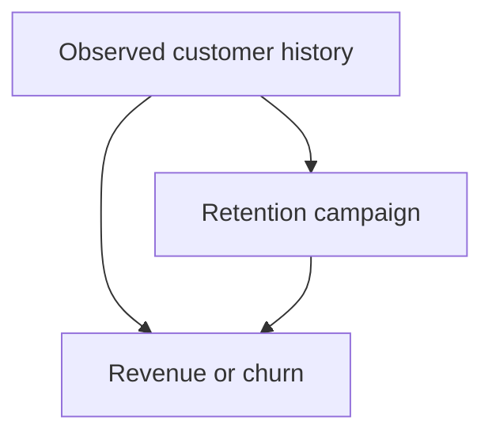
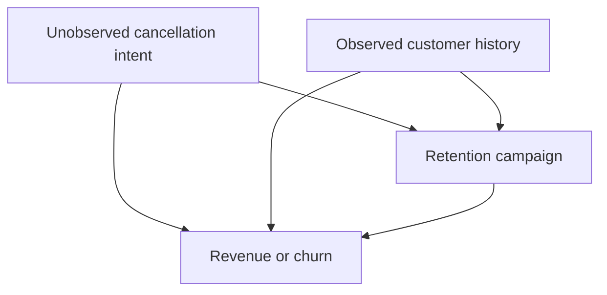
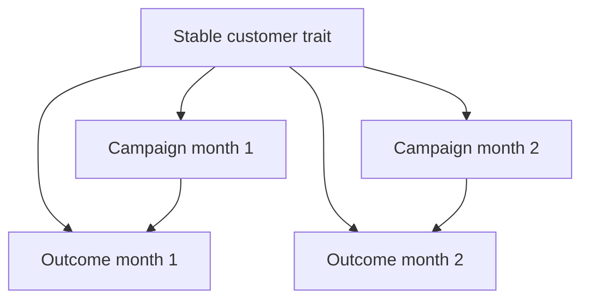
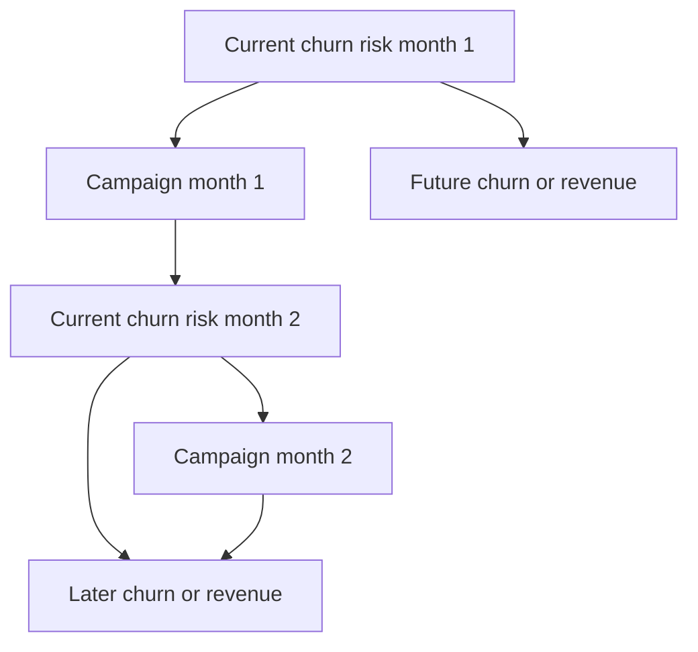
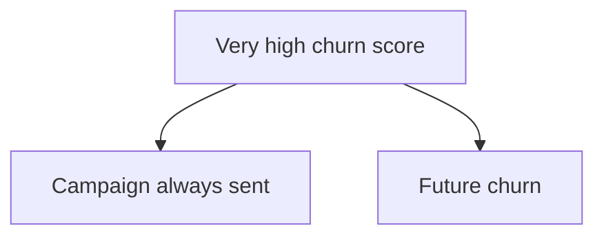
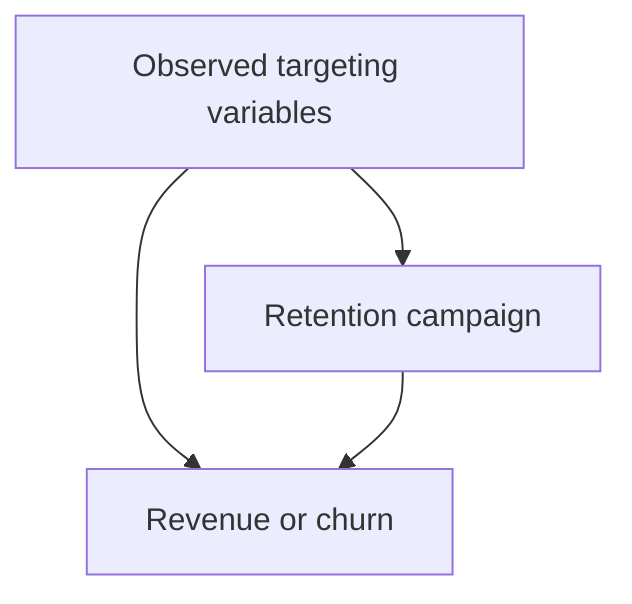
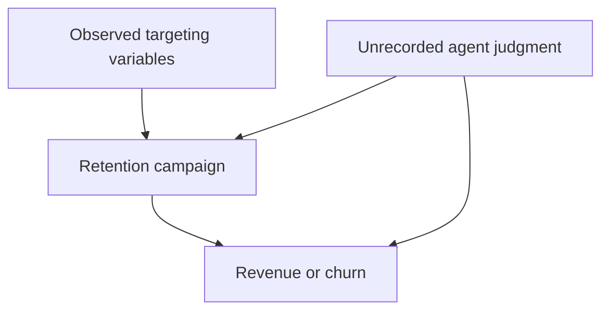
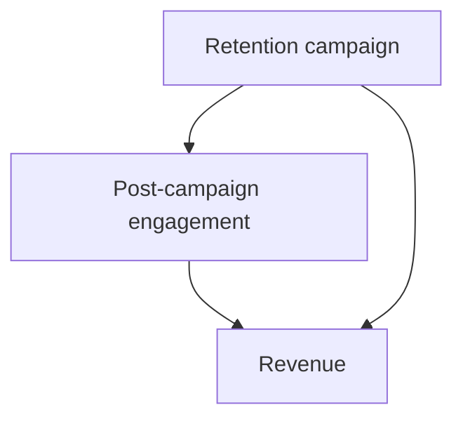
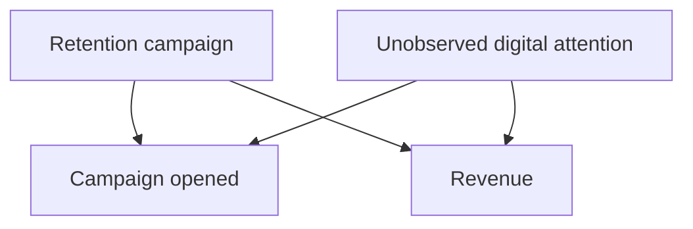
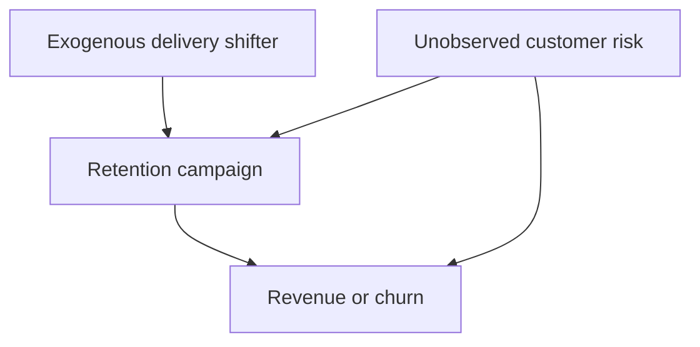

# Which Treatment Variation Survives?

## Guiding question

For every causal design or adjustment strategy, ask:

> **What variation in treatment remains after my design, where did that variation come from, and would it exist independently of the units' potential outcomes?**

This question separates three issues:

1. **Mechanical variation** — what treatment variation remains after adjustment.
2. **Source of variation** — which business rule, customer characteristic, timing shock, or random mechanism generated it.
3. **Causal validity** — whether that surviving variation is independent of the potential outcomes, under defensible assumptions.

The examples below use a common CRM setting:

- `A`: retention campaign sent
- `Y`: revenue or churn outcome
- `L`: observed customer history
- `U`: unobserved customer risk or motivation
- `M`: post-campaign engagement
- `C`: campaign response or sample-selection variable
- `Z`: exogenous campaign-assignment shifter

---

## Summary table

| Operation | Variation removed | Variation that survives | Intended comparison | CRM DAG example | Main danger |
|---|---|---|---|---|---|
| **Add confounder controls** | Treatment differences explained by measured common causes | Campaign differences among customers with similar measured histories | Comparable treated and untreated customers within covariate profiles | `L → A`, `L → Y`, `A → Y` | Residual unmeasured confounding if an important common cause is missing |
| **Fixed effects** | Between-customer differences and, with time effects, common calendar shocks | Within-customer campaign deviations net of stable customer traits and common time shocks | The same customer during periods with different campaign exposure | `U_i → A_it`, `U_i → Y_it`, removed by customer FE; `A_it → Y_it` remains | Time-varying confounding such as current churn risk driving both campaign assignment and future outcome |
| **Matching** | Comparisons between customers with very different observed histories | Treated-control comparisons inside matched or overlap regions | Locally comparable customers | `L → A`, `L → Y`; compare only units with similar `L` | Hidden confounding and a target population restricted to matched customers |
| **Residualization** | Campaign assignment predicted by observed policy variables | Deviations from the observed targeting policy | Outcomes associated with unexpectedly high or low campaign exposure given observed predictors | `L → A`; use `A - E[A|L]` | Residual campaign variation may still be driven by unobserved `U` |
| **Mediator control** | Outcome variation transmitted through a post-campaign mechanism | Campaign variation not operating through the controlled mediator | A possible direct-effect comparison rather than the total effect | `A → M → Y` | Blocks part of the total campaign effect |
| **Collider control** | No valid confounding component is removed; conditioning changes the dependence structure | Campaign variation newly associated with causes of the collider | No generally valid causal comparison | `A → C ← U → Y` | Opens a non-causal path and creates selection bias |
| **Instrument control** | Campaign variation generated by an exogenous shifter | Residual campaign variation with a larger relative contribution from unmeasured causes | Campaign variation net of the instrument | `Z → A → Y`, `U → A`, `U → Y` | Removes useful exogenous variation, amplifies residual confounding, and inflates variance |

---

# Detailed CRM DAG examples

## 1. Add confounder controls

### CRM story

The retention team sends campaigns more often to customers with:

- low recent engagement,
- declining order frequency,
- high predicted churn.

Those same variables also predict future churn or revenue.

### DAG

### Interpretation

Without adjustment, the comparison mixes:

- the causal effect of the campaign;
- pre-existing differences in customer history.

Adjusting for `L` removes the campaign variation explained by measured common causes. The surviving variation is:

> Campaign differences among customers with similar observed histories.

### Identification claim

The comparison is causally valid only if:

\[
Y(a) \perp A \mid L
\]

and positivity and consistency also hold.

### Main failure mode

If an unobserved variable `U`, such as an account manager's private assessment, affects both campaign assignment and outcome, the adjusted estimate remains confounded.

---

## 2. Fixed effects

### CRM story

Some customers are permanently more loyal, richer, or more digitally engaged. These stable characteristics affect both campaign exposure and revenue.

Customer fixed effects remove all stable between-customer differences.

### DAG over time

### Within transformation

With customer fixed effects:

\[
\widetilde A_{it} = A_{it} - \bar A_i
\]

\[
\widetilde Y_{it} = Y_{it} - \bar Y_i
\]

The coefficient is identified from:

> Periods when the same customer's campaign exposure differs from that customer's usual exposure.

With time fixed effects, common shocks are also removed:

- Christmas;
- inflation;
- a national website outage;
- a global media campaign.

### Main failure mode

Fixed effects do not remove time-varying confounding.

Here current churn risk changes over time, drives treatment, predicts the outcome, and may itself be affected by earlier campaigns.

---

## 3. Matching

### CRM story

A treated customer is matched to one or more untreated customers with similar:

- engagement;
- prior revenue;
- tenure;
- churn score;
- product mix.

### DAG

### What matching changes

Matching discards comparisons such as:

- highly engaged treated customers versus inactive controls;
- long-tenure treated customers versus new controls;
- premium customers versus low-value customers.

The surviving comparisons are local:

> Treated and untreated customers that occupy the same observed covariate region.

### Overlap problem

If every very-high-risk customer is treated, there is no untreated comparison in that region. Matching cannot identify the effect there.

### Main failure modes

- unmeasured confounding;
- poor matching quality;
- loss of sample;
- a shift from the original population to the matched population;
- an implicit change from ATE to ATT or overlap-population effect.

---

## 4. Residualization

### CRM story

The campaign policy is modeled as:

\[
\hat e(L)=P(A=1\mid L)
\]

or, for a continuous treatment:

\[
\widehat E[A\mid L].
\]

The residualized treatment is:

\[
\widetilde A = A - \widehat E[A\mid L].
\]

### DAG

### Interpretation

The residual represents:

> Campaign exposure not predicted by the observed targeting policy.

For a binary campaign:

- treated with propensity `0.90` gives residual `0.10`;
- treated with propensity `0.10` gives residual `0.90`;
- untreated with propensity `0.90` gives residual `-0.90`.

Large residuals correspond to unusual assignments relative to the fitted policy.

### Main warning

Unexpected relative to the model does not mean exogenous.

After removing the part explained by `L`, the residual may still contain treatment variation generated by `U`.

Thus:

\[
A-E[A\mid L]
\]

is orthogonal to `L`, but not necessarily independent of the potential outcomes.

---

## 5. Mediator control

### CRM story

The retention campaign increases website visits, which then increase revenue.

### DAG

### Total effect

The total effect includes:

1. the direct path `A → Y`;
2. the mediated path `A → M → Y`.

If the analyst controls for `M`, the mediated component is removed.

The surviving comparison is approximately:

> Campaign differences among customers with the same post-campaign engagement.

But post-campaign engagement is itself partly caused by the campaign. This is not the comparison needed for the total effect.

### Main failure mode

The estimate silently changes from a total-effect target to a possible direct-effect target.

Even the direct effect requires stronger mediation assumptions, including careful control of mediator-outcome confounding.

---

## 6. Collider control

### CRM story

Suppose campaign opening depends on both:

- receiving the campaign;
- an unobserved digital-attention trait.

That same trait predicts future revenue.

### DAG

Before conditioning on `C`, the path:

\[
A \rightarrow C \leftarrow U \rightarrow Y
\]

is blocked at the collider `C`.

After restricting to customers who opened the campaign, or controlling for opening, the path opens.

### Interpretation

Among openers:

- if a customer received a weakly visible campaign but still opened it, high digital attention becomes more likely;
- if a customer received a highly salient campaign, less latent attention is needed to explain opening.

The campaign and latent attention become associated inside the selected group.

### Main failure mode

The adjustment creates selection bias rather than removing confounding.

The surviving treatment variation is newly correlated with an unobserved cause of the outcome.

---

## 7. Instrument control

### CRM story

Suppose an exogenous system rule `Z` changes campaign delivery:

- random assignment to a delivery server;
- randomized encouragement;
- a staggered technical routing rule.

`Z` affects outcome only through the campaign.

There is also an unobserved customer factor `U` that affects both campaign assignment and outcome.

### DAG

### Treatment decomposition

Conceptually:

\[
A = \pi Z + \gamma U + \nu.
\]

The component `πZ` is useful exogenous treatment variation.

If `Z` is added as an ordinary control, residualization removes this component:

\[
\widetilde A \approx \gamma U+\nu.
\]

What remains has a larger relative share of confounded variation.

### Main failure modes

- residual confounding is amplified;
- treatment variance shrinks;
- standard errors increase;
- the analysis discards the clean variation that an IV design would otherwise exploit.

The correct use of `Z` is generally as an instrument, not as an ordinary backdoor control.

---

# Cross-method interpretation

| Design question | Add controls | Fixed effects | Matching | Residualization | Mediator control | Collider control | Instrument control |
|---|---|---|---|---|---|---|---|
| **What is removed?** | Measured common-cause variation | Stable unit differences and common time shocks | Dissimilar comparisons | Predicted policy component | Mediated causal pathway | Nothing causally useful; dependence structure is altered | Exogenous instrument-driven treatment variation |
| **What survives?** | Within-profile treatment differences | Within-unit deviations | Local treated-control contrasts | Policy deviations | Non-mediated variation | Collider-induced contaminated variation | More confounded residual variation |
| **Why might it help?** | Closes measured backdoor paths | Removes stable unobserved heterogeneity | Improves observed comparability | Isolates treatment innovations relative to observed predictors | Useful only for a carefully defined direct effect | Generally does not help | Generally does not help as a control |
| **Why might it fail?** | Missing common causes | Time-varying confounding | Hidden bias and limited overlap | Residuals remain endogenous | Changes the estimand | Opens a non-causal path | Bias amplification and variance inflation |

---

# Practical audit checklist

For every proposed adjustment or design, document the following.

## 1. Surviving variation

What variation in `A` remains after the operation?

Examples:

- within engagement strata;
- within customer over time;
- near the overlap population;
- residual deviations from the targeting model;
- treatment variation not mediated by engagement.

## 2. Source of the surviving variation

What generated it?

Examples:

- agent discretion;
- policy exceptions;
- calendar timing;
- random routing;
- customer shocks;
- measurement error;
- omitted customer intent.

## 3. Independence from potential outcomes

Why should the surviving variation satisfy:

\[
A \perp Y(a) \mid L
\]

or the corresponding design-specific identifying condition?

A regression residual, matched sample, or fixed-effects transformation does not establish this by itself.

## 4. Target population

Whose effect does the surviving variation identify?

Examples:

- all eligible customers;
- treated customers;
- overlap customers;
- customers who switch exposure;
- compliers;
- customers near a policy threshold.

## 5. Diagnostics

What observable implications can be examined?

Examples:

- covariate balance;
- overlap;
- effective sample size;
- within-unit treatment variation;
- event-study pre-trends;
- first-stage strength;
- placebo outcomes;
- negative controls.

Diagnostics can challenge assumptions but generally cannot prove them.

---

# Final principle

> **A causal design is a rule for retaining some treatment variation and discarding other treatment variation.**

A good design retains variation generated independently of the units' potential outcomes.

A bad design may:

- retain variation caused by hidden prognosis;
- remove variation generated by an exogenous instrument;
- block variation transmitted through a genuine mediator;
- or create contaminated variation by conditioning on a collider.

The correct workflow is therefore:

1. define the potential-outcome contrast;
2. draw the DAG;
3. identify the desired source of treatment variation;
4. determine what the proposed design removes;
5. verify what variation remains;
6. defend why that variation can support the intended causal estimand.
